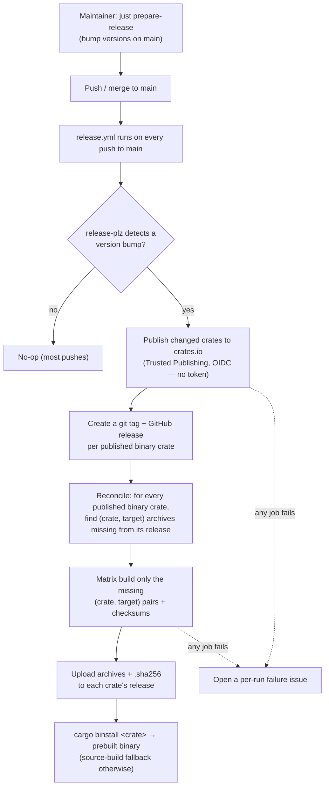

# Release automation

This chapter describes how releases work in this repository (tracking issue
[#297](https://github.com/folo-rs/folo/issues/297)). Releasing to crates.io and
shipping `cargo-binstall`-consumable prebuilt binaries is driven from CI on merge
to `main`; version bumping is the only manual step.

## Meta

* **Open this when**: implementing or debugging automated releases, the
  crates.io/OIDC publish flow, the prebuilt-binary matrix, the `cargo-binstall`
  asset-naming contract, or a publish that hit crates.io rate limits.
* **Cross-links**: [`git-workflow.md`](git-workflow.md) (version bumps happen off
  feature branches), [`build-and-tooling.md`](build-and-tooling.md) (`just`
  recipes), [`.github/workflows/design.md`](../.github/workflows/design.md) (the
  bench matrix this reuses), [`RELEASING.md`](../RELEASING.md) (the
  maintainer-facing procedure).

## The flow

The maintainer bumps versions on `main` (`just prepare-release`, which runs
`release-plz update`, or by hand) and pushes. Everything after that is automatic.



Version bumping stays manual so the human review gate on version numbers is
preserved; CI automates the *publish* and *binary* halves only.

### Preflights around `release-plz update`

`just prepare-release` wraps `release-plz update` in two guard rails, both of which
fail *before* any version or changelog is touched:

* **cargo-semver-checks canary** (`verify-semver-checks`, a pre-step). release-plz
  runs cargo-semver-checks to decide whether a bump must be *major*, but when the
  tool *fails to run* — classically an installed cargo-semver-checks too old for the
  toolchain's rustdoc JSON format ("unsupported rustdoc format v…") — release-plz
  silently treats that as "no breaking changes", turning a broken tool into an
  undetected breaking release. The canary runs cargo-semver-checks on one small
  package compared against its own `HEAD`, so the two sides are byte-identical and
  the *only* way the check can fail is the tool failing to run. A non-zero exit
  aborts the release with instructions to update the tool.
* **never-published warning** (`check-never-published`, a post-step). See
  [Manual publishing](#manual-publishing) below.

## What ships a binary (derived, never hardcoded)

The set of published binary crates is **derived**, so new tools are covered
automatically and hardcoding can never let one slip through. A package is a
publishable binary crate iff it is publishable **and** has a `bin` target. Today
that set is four Cargo subcommands:

| Crate                       | Binary                      | Notes                                              |
| --------------------------- | --------------------------- | -------------------------------------------------- |
| `cargo-bench-history`       | `cargo-bench-history`       | Slow to build from source (Azure SDK), so the one that benefits most from a prebuilt binary. |
| `cargo-bench-history-faker` | `cargo-bench-history-faker` | Unsupported test-support engine; published only so sibling repos can validate `cargo-bench-history` end to end (and fetch it via `cargo binstall`). No stable API or CLI. |
| `cargo-detect-package`      | `cargo-detect-package`      | Small, fast to build.                              |
| `cargo-freeze-deps`         | `cargo-freeze-deps`         | Small, fast to build.                              |

`cargo-bench-history-stress` has a binary but is `publish = false`, so the
derivation correctly excludes it.

The `mimalloc` global allocator is orthogonal to distribution and is applied to
every binary regardless of whether it is published (tracked separately in
[#304](https://github.com/folo-rs/folo/issues/304)).

## The `release.yml` workflow

A single workflow, triggered on `push: branches: [main]`, holds four jobs.
`release-plz release` is idempotent — on a push with no version change it is a
no-op — so the workflow runs on every push to `main` and only acts when a bump
landed. It also accepts a bare `workflow_dispatch` (no inputs) that re-runs the
same flow to auto-heal missing binaries, as described under
[Robust publishing](#robust-publishing).

Keeping publish and binaries in **one** workflow run is deliberate: a workflow
that creates a tag/release with the default `GITHUB_TOKEN` does not trigger
downstream `on: release` / `on: push: tags` workflows (GitHub suppresses these to
avoid recursion). Driving the binary jobs from within the same run sidesteps that
entirely, so the ambient `GITHUB_TOKEN` suffices and no PAT or GitHub App token is
needed.

```yaml
# Illustrative sketch — not a final workflow file.
name: Release
on:
  push:
    branches: [main]
  workflow_dispatch: {}   # bare manual re-trigger; reconciliation auto-heals missing binaries

concurrency:
  group: release-${{ github.ref }}
  cancel-in-progress: false   # never cancel a publish mid-flight

jobs:
  publish: ...
  plan-binaries: ...
  build-binaries: ...
  alert: ...
```

### `publish` — crates.io via Trusted Publishing

crates.io **Trusted Publishing (OIDC)** is the credential model: the job carries
`id-token: write` and no `CARGO_REGISTRY_TOKEN` exists anywhere. `release-plz`
performs the crates.io OIDC token exchange itself, so no long-lived crates.io
token is stored. This matches the repo's OIDC-first posture (the nightly
`bench-history` workflow already federates into Azure the same way). The GitHub
side (tags + releases) uses the ambient `secrets.GITHUB_TOKEN` with
`contents: write`.

```yaml
# Illustrative.
publish:
  if: github.repository == 'folo-rs/folo'   # forks can't federate OIDC
  runs-on: ubuntu-latest
  permissions:
    contents: write   # release-plz creates tags + GitHub releases
    id-token: write   # crates.io Trusted Publishing (OIDC)
  timeout-minutes: 180   # generous: covers up to 3 retry attempts (see below)
  steps:
    - uses: actions/checkout@v6
      with:
        fetch-depth: 0
        # persist-credentials stays at its default (true): release-plz pushes the
        # release tags via git, which uses the checkout-persisted token.
    - uses: ./.github/actions/setup-environment
    - name: Compose the CI release-plz config
      shell: pwsh
      run: just gh-compose-release-config "$env:RUNNER_TEMP/release-plz.ci.toml"
    - shell: pwsh
      run: just gh-release "$env:RUNNER_TEMP/release-plz.ci.toml"
      env:
        GIT_TOKEN: ${{ secrets.GITHUB_TOKEN }}   # forge API (tags + GitHub releases)
```

Each step is a thin `pwsh` call into a `just` recipe; the publishing logic — deriving
the binary crates, injecting `git_release_enable`, and the retry loop — lives in
[`justfiles/just_automation.just`](../justfiles/just_automation.just), which delegates in
turn to the [`scripts/release/ReleaseAutomation.psm1`](../scripts/release/ReleaseAutomation.psm1)
module, so it can be run and tested on a developer PC rather than only by pushing to `main`.
The module is covered by a Pester suite run via `just test-scripts` (a required CI check); the
suite exercises the real logic against fixture workspaces with `cargo metadata` and real file
I/O, mocking only the tools that would mutate crates.io / GitHub (`release-plz`, `gh`). The
binary jobs downstream do **not** consume any "what was published this run" output: a matrix
driven off that cannot heal a partial failure on a later re-run (release-plz skips the
already-published crate, so it vanishes from the output). Instead the binary jobs
**reconcile** against the actual published state, described next.


### `plan-binaries` — reconcile missing binary assets

Runs after `publish` on every workflow run (not gated on whether anything was
published this run), so a plain re-run or a bare `workflow_dispatch` heals binaries
without republishing.

It **auto-determines** the work by reconciling desired state against actual state,
with no hardcoded or human-supplied crate list. The `just gh-plan-release-binaries`
recipe:

1. Derives the publishable binary crates and their current manifest versions from
   `cargo metadata` (the filter below). Each crate's expected release tag is
   `{crate}-v{version}`.
2. For each such crate whose release exists, lists the release's assets (`gh release
   view`) and computes which of the expected per-target archives
   (`{crate}-v{version}-{target}.zip`) are absent.
3. Emits a matrix of exactly the missing `(crate, target)` pairs (as its `matrix` and
   `has_binaries` step outputs).

The binary-crate derivation is a single filter, reused here and by the
git-release-enable injection so the two can never disagree. In
`cargo metadata --format-version 1` the `publish` field is `null` (publishable to
any registry), `[]` (never publish), or a non-empty registry list, so a crate is a
release candidate when it is publishable (`publish` is `null` or a non-empty list)
**and** owns a `bin` target.

Against the current workspace this yields exactly `cargo-bench-history`,
`cargo-detect-package`, `cargo-freeze-deps`. On a normal push that just published,
every target archive is missing → the whole matrix builds. On an ordinary push
that changed nothing, all archives already exist → the matrix is empty and
`build-binaries` is skipped. On a re-run after a partial failure, only the still-
missing `(crate, target)` pairs are emitted — so retries always operate on the
correct, self-determined set.

### `build-binaries` — build, package, checksum, upload

Runs when the plan produced any missing pairs. The matrix is precisely those
reconciled `(crate, target)` pairs (`matrix.include`), each carrying its
`tag`/`version` so uploads target the actual release tag, never a reconstructed
guess.

**Standard environment.** These jobs use the shared
[`./.github/actions/setup-environment`](../.github/actions/setup-environment)
composite — the same one every other CI job uses — rather than a bespoke
toolchain setup. Its Rust cache (`shared-key: prerequisites`) is warm across the
repo, so the "extra" tooling it installs is mostly cached, and using the standard
environment keeps release builds identical to the validated CI build rather than
introducing a second, subtly-different build environment.

**Build + package + checksum + upload — `taiki-e/upload-rust-binary-action`.** It
builds the named binary for the target, produces the archive, writes a `.sha256`
sidecar, and uploads both to the release for the given tag. Archives are `.zip`
on **every** platform (`tar: none`, `zip: all`) — `.zip` is universally
extractable, and a single format keeps the `[package.metadata.binstall]` blocks
free of per-OS overrides.

```yaml
# Illustrative.
build-binaries:
  needs: [publish, plan-binaries]
  if: needs.plan-binaries.outputs.has_binaries == 'true'
  strategy:
    fail-fast: false   # one target's failure must not abandon the others' archives
    # The matrix is computed by plan-binaries: one entry per missing (crate, target)
    # pair, each carrying {name, tag, version, triple, os} (os from the target table below).
    matrix:
      include: ${{ fromJSON(needs.plan-binaries.outputs.matrix) }}
  runs-on: ${{ matrix.os }}
  permissions:
    contents: write   # upload assets to the release
  steps:
    - uses: actions/checkout@v6
      with:
        ref: refs/tags/${{ matrix.tag }}   # build the exact released code
    - uses: ./.github/actions/setup-environment
    - uses: taiki-e/upload-rust-binary-action@v1
      with:
        bin: ${{ matrix.name }}
        package: ${{ matrix.name }}
        target: ${{ matrix.triple }}
        archive: ${{ matrix.name }}-v${{ matrix.version }}-$target
        tar: none
        zip: all
        checksum: sha256
        ref: refs/tags/${{ matrix.tag }}
        locked: true
        token: ${{ secrets.GITHUB_TOKEN }}
```

#### Target matrix

Native runners, one per target, no cross-compilation — the same runner set as the
nightly `bench-history` matrix plus macOS. This table is the single `triple → runner`
source that `plan-binaries` joins each missing `(crate, target)` pair against to set
its `os`:

| Rust target                 | Runner             |
| --------------------------- | ------------------ |
| `x86_64-unknown-linux-gnu`  | `ubuntu-latest`    |
| `aarch64-unknown-linux-gnu` | `ubuntu-24.04-arm` |
| `x86_64-pc-windows-msvc`    | `windows-latest`   |
| `aarch64-pc-windows-msvc`   | `windows-11-arm`   |
| `aarch64-apple-darwin`      | `macos-latest`     |

GitHub-hosted runners expose `-latest` aliases only for x86_64 Linux/Windows and
for macOS (`macos-latest` is Apple Silicon / arm64). There is **no**
`ubuntu-latest-arm` or `windows-latest-arm` alias, so the ARM Linux/Windows images
must be pinned by version (`ubuntu-24.04-arm`, `windows-11-arm`) — hence the
apparent inconsistency with the x64 rows. Bump the pinned ARM images when newer
ones ship. `x86_64-apple-darwin` (Intel Mac) is intentionally not supported.

### `alert` — a per-run failure issue

If any of the above jobs fails, a final job opens a GitHub issue **unique to that
run** (title carries the run id), so every failed release is tracked
individually rather than folded into a rolling issue. It uses the `gh` CLI with
`issues: write` and the `ci-failure` label.

```yaml
# Illustrative.
alert:
  needs: [publish, plan-binaries, build-binaries]
  if: failure() && github.repository == 'folo-rs/folo'
  runs-on: ubuntu-latest
  permissions:
    issues: write
  steps:
    - name: Open failure issue for this run
      shell: pwsh
      env:
        GH_TOKEN: ${{ secrets.GITHUB_TOKEN }}
        GH_REPO: ${{ github.repository }}
        RUN_URL: ${{ github.server_url }}/${{ github.repository }}/actions/runs/${{ github.run_id }}
      run: |
        gh label create ci-failure --force *> $null
        gh issue create --label ci-failure `
          --title "Release workflow failed (run ${{ github.run_id }})" `
          --body "A release run failed: $env:RUN_URL"
```

## Robust publishing

crates.io enforces rate limits (strict for brand-new crates, burst-limited for new
versions), and Trusted-Publishing OIDC tokens are short-lived (~30 minutes). The
publish step is built to ride out both without bespoke complexity:

* **Bounded retry.** The `release-plz release` invocation is wrapped in a retry —
  up to **3 attempts, 15 minutes apart**. The `publish` job's `timeout-minutes`
  is set generously (≈180) so the surrounding timeout never cuts a retry short,
  and release-plz keeps its 45-minute `publish_timeout`.
* **Idempotency does the heavy lifting.** Each `release-plz release` run
  re-checks crates.io and publishes only versions not already there. So a retry
  after a rate-limit rejection (or a manual re-run of the whole workflow) resumes
  a partially-published release and finishes it, rather than erroring on the
  crates already up. Retries are therefore always safe.
* **Token expiry is handled by the same loop.** Each attempt performs its own
  OIDC token exchange, so a fresh token is minted per attempt; a publish that
  somehow overruns the ~30-minute token lifetime fails that attempt and the next
  retry proceeds with a new token. This is rare and needs no special handling
  beyond the retry.
* **Binaries after a partial failure — auto-reconciled, no manual crate list.**
  The binary jobs never depend on "what was published *this run*"; `plan-binaries`
  reconciles the current published state against uploaded assets (see
  [`plan-binaries`](#plan-binaries--reconcile-missing-binary-assets)). So if a
  crate published but its binaries did not upload (e.g. the run died before
  `build-binaries`), simply re-running the workflow — or a bare
  `workflow_dispatch` — recomputes the missing `(crate, target)` pairs across
  *all* affected crates and builds exactly those. The recovery set is always
  self-determined; there is no per-crate dispatch and no human-supplied tag list.
  `taiki-e` overwrites existing assets, so re-uploading is safe and reproduces
  identical checksummed archives.

(Because a GitHub Actions `uses:` step cannot be retried in place, the retry is
implemented as a PowerShell loop inside the `gh-release` recipe that re-runs the
release-plz invocation.)

## release-plz configuration

[`release-plz.toml`](../release-plz.toml) changes from today's config:

* `git_release_enable` stays **`false`** at the workspace level (pure-library and
  invisible `_impl` / `_macros` crates must not spawn releases — there are many of
  them and the noise is not wanted), and is turned on **per binary crate**.
* `git_tag_name = "{{ package }}-v{{ version }}"` is pinned explicitly. This is
  already the workspace default, but pinning it freezes the tag format that the
  binstall URLs depend on, so a future release-plz default change cannot silently
  break installs.
* `changelog_update = false`, `publish_timeout = "45m"`, `allow_dirty = true`, and
  every existing `version_group` pin are unchanged.

**Per-binary-crate git releases, injected dynamically.** Rather than committing
`git_release_enable = true` into each binary crate's `[[package]]` entry (which
must be remembered for every new tool, and drifts out of sync with the derived
set), the `publish` job injects it at CI time: the `gh-compose-release-config`
recipe derives the binary-crate set (the same filter as `plan-binaries`) and, for
each, sets `git_release_enable = true` in a CI-only copy of `release-plz.toml`
(merging into any existing `[[package]]` entry). The committed config stays free of
per-binary release flags, and the release-enabled set is *always* exactly the
derived binary-crate set — so a newly-added binary crate gets its release with no
config edit, and no library crate is ever released.

## The asset-naming contract

The workflow's archive filenames and each crate's `[package.metadata.binstall]`
block must agree exactly, or `cargo binstall` 404s and silently source-builds.
One convention governs both:

| Artifact          | Pattern                                | Example                                                         |
| ----------------- | -------------------------------------- | -------------------------------------------------------------- |
| Git tag / release | `{crate}-v{version}`                   | `cargo-bench-history-v0.1.0`                                    |
| Archive           | `{crate}-v{version}-{target}.zip`      | `cargo-bench-history-v0.1.0-aarch64-apple-darwin.zip`          |
| Checksum sidecar  | `{archive}.sha256`                     | `…-aarch64-apple-darwin.zip.sha256`                            |
| Binary in archive | at archive root, `{bin}` (`+ .exe`)    | `cargo-bench-history` / `cargo-bench-history.exe`              |

* The **tag** comes from release-plz (`git_tag_name` pinned above).
* The **archive base** is `taiki-e`'s `archive:` input,
  `{crate}-v{version}-$target` (the action expands `$target`) — the single source
  of truth for the filename; the binstall blocks mirror it.
* `.zip` on all platforms (`tar: none`, `zip: all`).

### `[package.metadata.binstall]` block

Each published binary crate's `Cargo.toml` carries an identical block. An explicit
`pkg-url` is required: cargo-binstall's auto-detected GitHub paths use
`…/download/v{version}/`, but release-plz tags are package-prefixed
(`{crate}-v{version}`), so auto-detection never finds the asset. A single `.zip`
format means no per-OS override:

```toml
[package.metadata.binstall]
pkg-url = "{ repo }/releases/download/{ name }-v{ version }/{ name }-v{ version }-{ target }.zip"
bin-dir = "{ bin }{ binary-ext }"
pkg-fmt = "zip"
```

`bin-dir` is `{ bin }{ binary-ext }` because `taiki-e` places the binary at the
archive root (`leading-dir` defaults to false); `{ binary-ext }` adds `.exe` on
Windows. The `.sha256` sidecar is picked up for verification automatically.

The convention table is the contract: any change to it must touch, together,
`taiki-e`'s `archive:` input, the `git_tag_name` pin, and every crate's binstall
block. A new binary crate copies the block above verbatim into its `Cargo.toml`
(the build/upload side is already handled by the derivation). CI enforces this:
`just validate-binstall` fails the build when a publishable binary crate is
missing the block or has let it drift from the contract, so a forgotten or stale
block is caught before release rather than by a user hitting a 404.

## Manual publishing

There is one manual publish path and no separate release recipe to maintain:
plain `cargo publish` (per crate, in dependency order). It is used only for
**emergencies** (CI publishing broken) and for the **bootstrap publish** of a
brand-new crate (below). For real releases the expectation is that a manual
bootstrap is immediately followed by a normal CI publish, so the automated path
stays the single source of truth for versions that ship binaries.

### First publish of a new crate

crates.io does not allow Trusted Publishing for a crate that has never been
published (its trusted publisher can only be configured on an existing crate). So
a brand-new crate's **first** version must be published manually with `cargo
publish` (a token login), after which its trusted publisher is configured on
crates.io and subsequent releases go through CI.

`just prepare-release` surfaces this proactively: after bumping versions it checks
each publishable crate against the crates.io sparse index and, for any that does
not yet exist, prints a warning like:

> Warning: `<crate>` has never been published. Its first release must be done
> manually (`cargo publish`); afterwards configure Trusted Publishing for it on
> crates.io and re-publish via the GitHub workflow.

`cargo-bench-history-faker` is newly added and has **not** yet been published, so
it needs exactly this one-time bootstrap: publish its current version manually
with `cargo publish -p cargo-bench-history-faker`, then configure its Trusted
Publisher on crates.io (owner `folo-rs`, repo `folo`, workflow `release.yml`) so
every subsequent release goes through CI like the rest of the family. The other
binary crates published today already exist on crates.io, so this affects only
the faker and any future new crates.

## Prerequisites (one-time)

For the automated flow to function:

* Each published binary crate has a crates.io **Trusted Publisher** configured:
  owner `folo-rs`, repo `folo`, workflow filename `release.yml`. One-time, per
  crate, admin-only. (Every other published crate likewise needs a trusted
  publisher so CI can publish it.)
* No `CARGO_REGISTRY_TOKEN` secret is referenced by `release.yml` — a stray token
  would undercut Trusted Publishing.

## README notes

Each binary crate's README states that `cargo binstall <crate>` installs a
prebuilt binary on supported targets, with a transparent source-build fallback
otherwise.
