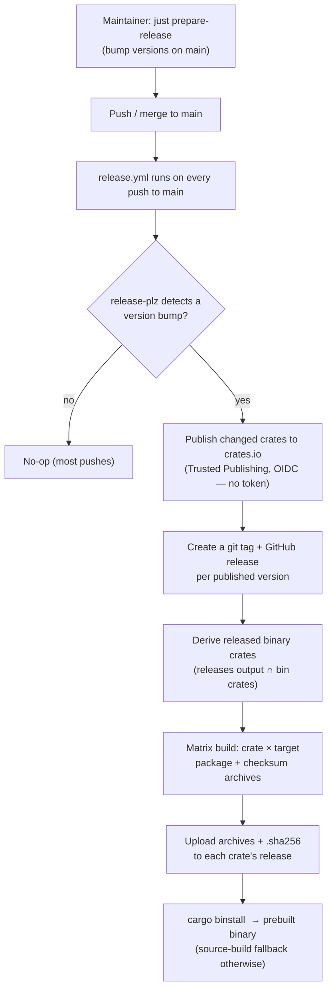

# Release automation design

Status: **design / not yet implemented**. This chapter is the plan for
[#297](https://github.com/folo-rs/folo/issues/297) — automating crates.io
publishing and shipping `cargo-binstall`-consumable prebuilt binaries from CI on
merge to `main`. It supersedes the manual, workstation-bound `just release` step
as the normal path and gives downstream users near-instant installs instead of a
from-source compile.

Once implemented, fold the workflow-mechanics parts of this document into
[`.github/workflows/AGENTS.md`](../.github/workflows/AGENTS.md) (the workflow
design-rationale file) and update [`RELEASING.md`](../RELEASING.md); this chapter
then becomes the "why" record for the release-automation architecture.

## Meta

* **Open this when**: designing, implementing, or debugging the automated
  crates.io publish flow, the GitHub release/prebuilt-binary matrix, or the
  `cargo-binstall` asset-naming contract.
* **Cross-links**: [`git-workflow.md`](git-workflow.md) (version bumps happen off
  feature branches), [`build-and-tooling.md`](build-and-tooling.md) (`just`
  recipes), [`.github/workflows/AGENTS.md`](../.github/workflows/AGENTS.md) (the
  nightly bench matrix this reuses), [`RELEASING.md`](../RELEASING.md) (the
  maintainer-facing procedure).

## Current state and why it changes

Releasing today is a manual two-step run from a maintainer's machine
([`RELEASING.md`](../RELEASING.md), [`justfiles/just_release.just`](../justfiles/just_release.just)):

1. `just prepare-release` → `release-plz update` bumps versions (and `=`-pins) on
   `main`; the maintainer reviews, commits `chore: prepare for release`, pushes.
2. `just release` → `release-plz release` publishes the changed crates to
   crates.io using a local crates.io token plus `gh auth token`.

Consequences we want to remove:

* Publishing is a property of "a maintainer ran a command with the right local
  credentials", not "a version bump landed on `main`".
* [`release-plz.toml`](../release-plz.toml) sets `git_release_enable = false`, so
  there are **no tags or GitHub releases** — hence no anchor for prebuilt-binary
  assets.
* No prebuilt binaries exist. Installing a published CLI means compiling from
  source; for `cargo-bench-history` that drags in the Azure SDK + `mimalloc`,
  which is minutes on a cold cache.

**Version bumping stays manual** (`just prepare-release` / hand edits). CI
automates only the *publish* half and the *binary* half — the "desired end
state" of the issue. This preserves the human review gate on version numbers
while removing the local-credentials publish step.

### What actually ships a binary today (derived, not one crate)

The issue assumed only `cargo-bench-history` has a binary. It does not — a
`cargo metadata` scan of the workspace shows **three** publishable binary
crates, all Cargo subcommands:

| Crate                  | Version today | Binary                 | Notes                                          |
| ---------------------- | ------------- | ---------------------- | ---------------------------------------------- |
| `cargo-bench-history`  | 0.0.2         | `cargo-bench-history`  | Slow source build (Azure SDK + `mimalloc`).    |
| `cargo-detect-package` | 1.0.22        | `cargo-detect-package` | Small, fast to build.                          |
| `cargo-freeze-deps`    | 0.1.2         | `cargo-freeze-deps`    | Small, fast to build.                          |

`cargo-bench-history-stress` and `mock_bench_engine` also have binaries but are
`publish = false`, so they are correctly excluded.

This is the whole reason the crate selection **must be derived, never
hardcoded**: hardcoding `cargo-bench-history` would silently miss the other two,
and every future tool would have to be remembered by hand. The derivation rule
(details in [Deriving the binary-crate set](#deriving-the-binary-crate-set)) is
"published **and** has a `bin` target". `cargo-bench-history` is merely the crate
that *most* benefits from a prebuilt binary; the machinery covers all three
uniformly at no extra cost.

## Desired end state



Concretely, after a version bump lands on `main`:

* CI publishes the changed crates to crates.io (what `just release` does today).
* CI creates a git tag + GitHub release per published version.
* For each published **binary** crate, CI builds a target matrix, packages each
  build as a checksummed archive, and uploads the archives to that release.
* Downstream consumers `cargo binstall <crate>` and get a prebuilt binary on
  supported targets, transparently falling back to a source build otherwise.

## Architecture: one workflow, three stages

The whole flow lives in a **single** new workflow, `release.yml`, as three jobs.
Keeping it in one workflow run is a deliberate decision — see
[the GITHUB_TOKEN trap](#why-one-workflow-the-github_token-trap).

```
release.yml  (on: push to main)
├── publish          (release-plz release; OIDC to crates.io; creates tags/releases)
│      └── outputs: releases (JSON), releases_created (bool)
├── plan-binaries    (needs: publish; derive released ∩ bin crates → matrix JSON)
│      └── outputs: matrix, has_binaries
└── build-binaries   (needs: plan-binaries; matrix = crate × target;
                      build + archive + checksum + upload to the release)
```

### Stage 1 — `publish`: crates.io via Trusted Publishing

Trigger the workflow on `push: branches: [main]`. `release-plz release` is
idempotent: on a push with no version change it is a no-op, so it can run on
every push to `main` and only acts when a bump landed.

**Credential model — recommend crates.io Trusted Publishing (OIDC).** The repo
already federates into Azure via GitHub OIDC (see the nightly `bench-history`
workflow), so OIDC is a known, trusted pattern here. `release-plz` supports
Trusted Publishing natively: give the job `id-token: write`, and **do not** set
`CARGO_REGISTRY_TOKEN` — `release-plz` performs the crates.io OIDC token exchange
itself (the same API the `rust-lang/crates-io-auth-action` uses). No long-lived
crates.io token is stored in repo secrets.

The GitHub side (tags + releases) uses the ambient `secrets.GITHUB_TOKEN` with
`contents: write`. Because binaries build in the **same** workflow run (Stage 3),
we do **not** need a PAT or GitHub App token (see the
[trap](#why-one-workflow-the-github_token-trap)).

```yaml
# Illustrative sketch — not final.
permissions:
  contents: write   # release-plz creates tags + GitHub releases
  id-token: write   # crates.io Trusted Publishing (OIDC); NO CARGO_REGISTRY_TOKEN

concurrency:
  group: release-${{ github.ref }}
  cancel-in-progress: false   # never cancel a publish mid-flight

jobs:
  publish:
    if: github.repository == 'folo-rs/folo'   # same-repo gate (forks can't federate)
    runs-on: ubuntu-latest
    outputs:
      releases: ${{ steps.release-plz.outputs.releases }}
      releases_created: ${{ steps.release-plz.outputs.releases_created }}
    steps:
      - uses: actions/checkout@v6
        with:
          fetch-depth: 0
          persist-credentials: false
      - uses: dtolnay/rust-toolchain@stable
      - id: release-plz
        uses: release-plz/action@v0
        with:
          command: release
        env:
          GITHUB_TOKEN: ${{ secrets.GITHUB_TOKEN }}
```

The `release-plz/action` exposes:

* `releases_created` — `"true"` when at least one crate was published this run.
* `releases` — a JSON array, one entry per published crate:
  `[{"package_name":"cargo-bench-history","version":"0.1.0","tag":"cargo-bench-history-v0.1.0","prs":[...]}]`.

Stages 2–3 consume `releases` to decide *what* binaries to build and *where* to
upload them, so they are exactly-scoped to this run's actual publishes.

**Caveat — first publish of a *new* crate.** crates.io refuses Trusted
Publishing for a crate that has never been published (chicken-and-egg: the
trusted publisher can only be configured on an existing crate). The three crates
above already exist on crates.io, so this does not affect the initial rollout.
For any *future* new crate, the first publish must be done manually with a token
(the retained `just release` fallback below), after which CI takes over. This is
a crates.io limitation, not a release-plz one; document it in `RELEASING.md`.

### Stage 2 — `plan-binaries`: derive the build matrix

Only runs when `needs.publish.outputs.releases_created == 'true'`. It intersects
"crates published this run" (`releases` output) with "publishable binary crates"
(a `cargo metadata` scan), emitting a matrix of `{name, tag, version}`.

#### Deriving the binary-crate set

A package is a **publishable binary crate** iff it is publishable **and** has at
least one `bin` target. In `cargo metadata --format-version 1`, the `publish`
field is:

* `null` → publishable to any registry (the common case),
* `[]` → never publish (`publish = false`),
* `["crates-io", ...]` → publish only to the listed registries.

So "publishable" is `publish == null or (publish | length > 0)`. The full jq
filter (verified against the current workspace — it yields exactly
`cargo-bench-history`, `cargo-detect-package`, `cargo-freeze-deps`):

```bash
cargo metadata --no-deps --format-version 1 \
  | jq -r '.packages[]
      | select(.publish == null or (.publish | length > 0))
      | select(any(.targets[]; (.kind | index("bin")) != null))
      | .name'
```

The plan step then keeps only those names that also appear in `releases`, and
carries each one's `tag` and `version` straight from the `releases` output (so
the upload target is the *actual* tag release-plz created, not a reconstructed
guess):

```bash
# Illustrative: emit matrix JSON of released binary crates.
released=$(jq -c '[.[].package_name]' <<<"$RELEASES")
bin_crates=$(cargo metadata --no-deps --format-version 1 \
  | jq -c '[.packages[]
      | select(.publish == null or (.publish | length > 0))
      | select(any(.targets[]; (.kind | index("bin")) != null))
      | .name]')
matrix=$(jq -cn --argjson r "$RELEASES" --argjson b "$bin_crates" \
  '[ $r[] | select(.package_name as $n | $b | index($n))
     | {name: .package_name, tag: .tag, version: .version} ]')
echo "matrix={\"crate\":$matrix}" >> "$GITHUB_OUTPUT"
echo "has_binaries=$([ "$(jq 'length' <<<"$matrix")" -gt 0 ] && echo true || echo false)" >> "$GITHUB_OUTPUT"
```

### Stage 3 — `build-binaries`: matrix build, package, upload

Runs when `needs.plan-binaries.outputs.has_binaries == 'true'`. The matrix is the
Cartesian product of the released binary crates × the target matrix.

**Target matrix — native runners, mirroring the nightly bench matrix.** Use the
same runner set as `bench-history.yml`, one native runner per target (no
cross-compilation), which keeps builds simple and the toolchain honest:

| Rust target                   | Runner             |
| ----------------------------- | ------------------ |
| `x86_64-unknown-linux-gnu`    | `ubuntu-latest`    |
| `aarch64-unknown-linux-gnu`   | `ubuntu-24.04-arm` |
| `x86_64-pc-windows-msvc`      | `windows-latest`   |
| `aarch64-pc-windows-msvc`     | `windows-11-arm`   |

`*-apple-darwin` is **deferred** until there is a macOS consumer (the same stance
the nightly bench matrix takes). Add both Apple targets to the table and a
`macos-latest` runner when that day comes; nothing else in the design changes.

**Build + package + checksum + upload — `taiki-e/upload-rust-binary-action`.**
It builds the named binary for the target, produces the archive
(`.tar.gz` on Unix, `.zip` on Windows), writes a `.sha256` sidecar, and uploads
both to the release for the given tag. Point it at the tag from the matrix via
its `ref` input, so it uploads to the release release-plz just created:

```yaml
# Illustrative sketch — not final.
build-binaries:
  needs: [publish, plan-binaries]
  if: needs.plan-binaries.outputs.has_binaries == 'true'
  strategy:
    fail-fast: false
    matrix:
      crate: ${{ fromJSON(needs.plan-binaries.outputs.matrix).crate }}
      target:
        - { triple: x86_64-unknown-linux-gnu,  os: ubuntu-latest }
        - { triple: aarch64-unknown-linux-gnu, os: ubuntu-24.04-arm }
        - { triple: x86_64-pc-windows-msvc,     os: windows-latest }
        - { triple: aarch64-pc-windows-msvc,    os: windows-11-arm }
  runs-on: ${{ matrix.target.os }}
  permissions:
    contents: write   # upload assets to the release
  steps:
    - uses: actions/checkout@v6
      with:
        ref: refs/tags/${{ matrix.crate.tag }}   # build the exact released code
    - uses: dtolnay/rust-toolchain@stable
    - uses: Swatinem/rust-cache@v2
    - uses: taiki-e/upload-rust-binary-action@v1
      with:
        bin: ${{ matrix.crate.name }}
        package: ${{ matrix.crate.name }}
        target: ${{ matrix.target.triple }}
        archive: ${{ matrix.crate.name }}-v${{ matrix.crate.version }}-$target
        checksum: sha256
        ref: refs/tags/${{ matrix.crate.tag }}
        locked: true
        token: ${{ secrets.GITHUB_TOKEN }}
```

Notes:

* **`fail-fast: false`** so one target's failure does not abandon the others'
  archives (matching the bench matrix rationale).
* **Toolchain/environment.** These jobs need only a Rust toolchain, not the full
  `setup-environment` composite (which installs `just`, `gungraun-runner`,
  Valgrind, azcopy, etc. — all irrelevant to a release build and pure overhead).
  Start with `dtolnay/rust-toolchain@stable` + `Swatinem/rust-cache`. Add the
  handful of Linux system packages only if a target's build turns out to need
  them (`cargo-bench-history` uses `rustls`, not OpenSSL, so it is expected to
  build with just the toolchain). **Riskiest target:** `aarch64-pc-windows-msvc`
  building `cargo-bench-history` (Azure SDK + `mimalloc`); verify the first real
  release produces a working binary on all four targets.
* **Stable, not MSRV.** The published *crate* must build on MSRV (enforced by
  `validation.yml`), but the prebuilt *binary* is best built on stable/`--locked`.

### Why one workflow: the GITHUB_TOKEN trap

A workflow that creates a tag/release using the default `GITHUB_TOKEN` does
**not** trigger other workflows listening on `on: release` / `on: push: tags`
(GitHub suppresses these to prevent recursive runs). The usual escape hatches are
a PAT or a GitHub App token so the release event fires — extra secrets and setup.

We sidestep it entirely: Stages 2–3 run in the **same** workflow run as Stage 1
via `needs:`, driven by the `releases` output rather than a release *event*. No
downstream trigger is needed, so the ambient `GITHUB_TOKEN` suffices and no PAT /
App token is required. (If binaries were ever split into a separate
`on: release` workflow, that token problem would return — don't, without reason.)

## The asset-naming contract (the lockstep crux)

The release workflow's archive filenames and each crate's
`[package.metadata.binstall]` block must agree **exactly**, or `cargo binstall`
404s and silently falls back to a source build. This is the single most
error-prone part of the design, so pin one convention and record it here.

### The one convention

| Artifact           | Pattern                                                            | Example                                                              |
| ------------------ | ----------------------------------------------------------------- | ------------------------------------------------------------------- |
| Git tag / release  | `{crate}-v{version}`                                               | `cargo-bench-history-v0.1.0`                                         |
| Archive (Linux)    | `{crate}-v{version}-{target}.tar.gz`                              | `cargo-bench-history-v0.1.0-x86_64-unknown-linux-gnu.tar.gz`         |
| Archive (Windows)  | `{crate}-v{version}-{target}.zip`                                 | `cargo-bench-history-v0.1.0-aarch64-pc-windows-msvc.zip`             |
| Checksum sidecar   | `{archive}.sha256`                                                 | `…-x86_64-unknown-linux-gnu.tar.gz.sha256`                           |
| Binary in archive  | at archive root, `{bin}` (`+ .exe` on Windows)                    | `cargo-bench-history` / `cargo-bench-history.exe`                    |

* The **tag** is produced by release-plz. The workspace default `git_tag_name`
  is already `{{ package }}-v{{ version }}`, which matches. **Pin it explicitly**
  in `release-plz.toml` (`git_tag_name = "{{ package }}-v{{ version }}"`) so a
  future release-plz default change cannot silently break the binstall URLs.
* The **archive base** comes from `taiki-e`'s `archive:` input, set to
  `${{ matrix.crate.name }}-v${{ matrix.crate.version }}-$target` (the `$target`
  placeholder is expanded by the action). This is the single source of truth for
  the filename; every binstall block below mirrors it.
* `taiki-e` defaults (`tar: unix`, `zip: windows`) give `.tar.gz` / `.zip`
  exactly as tabled.

### `[package.metadata.binstall]` block

Add an identical block (adjusting nothing but relying on `{ name }`) to each
published binary crate's `Cargo.toml`. `cargo binstall` reads this from the
crate's **published** manifest on crates.io, so it must live in the crate's own
`Cargo.toml`.

An explicit `pkg-url` is **mandatory** here: cargo-binstall's auto-detected
GitHub paths are `…/releases/download/v{version}/` and `…/releases/download/{version}/`,
but our release-plz tags are package-prefixed (`{crate}-v{version}`), so
auto-detection never finds the asset. The block encodes the package-prefixed
path.

```toml
[package.metadata.binstall]
pkg-url = "{ repo }/releases/download/{ name }-v{ version }/{ name }-v{ version }-{ target }.tar.gz"
bin-dir = "{ bin }{ binary-ext }"
pkg-fmt = "tgz"

# taiki-e ships Windows builds as .zip; override the URL suffix and format there.
[package.metadata.binstall.overrides.'cfg(target_os = "windows")']
pkg-url = "{ repo }/releases/download/{ name }-v{ version }/{ name }-v{ version }-{ target }.zip"
pkg-fmt = "zip"
```

Why these exact keys:

* The URL suffix is **hardcoded** (`.tar.gz` / `.zip`) rather than using
  `{ archive-suffix }`, because binstall's `tgz` suffix template renders `.tgz`,
  which would not match taiki-e's `.tar.gz` filenames. `pkg-fmt` (not the URL
  suffix) is what tells binstall how to extract, so the two are decoupled and
  both correct.
* `bin-dir = "{ bin }{ binary-ext }"` because `taiki-e` places the binary at the
  archive root (its `leading-dir` defaults to false) — `{ binary-ext }` adds
  `.exe` on Windows automatically.
* The `.sha256` sidecar is picked up automatically for verification; no key is
  needed for it.

**Keeping it in lockstep.** The convention table above is the contract. Any
change to it must touch, together: `taiki-e`'s `archive:` input in the workflow,
the `git_tag_name` pin in `release-plz.toml`, and every crate's binstall block.
When a *new* binary crate appears, its `Cargo.toml` gets a copy of this block
verbatim — the derivation handles the build/upload side automatically, but the
binstall block is per-crate metadata and must be added by hand (a good item for a
release checklist / a lint).

## release-plz.toml changes

* `git_release_enable = false` → **`true`**. This is what creates the tag +
  GitHub release that binstall anchors to.
* Add `git_tag_name = "{{ package }}-v{{ version }}"` (pin the contract).
* Keep `changelog_update = false`, `publish_timeout = "45m"`, `allow_dirty =
  true`, and all existing `version_group` pins unchanged.

**Decision — global vs. per-binary-crate `git_release_enable`.** Two options:

* **(A) Enable globally (recommended).** Every published version group gets a tag
  + release. Guarantees a released binary crate *always* has a release to upload
  to (no coupling between "which crates get releases" and "which crates the
  derivation builds binaries for" — a foot-gun avoided). Cost: pure-library and
  invisible `_impl` / `_macros` crates also get (empty-bodied) releases/tags,
  which is some noise. Invisible crates can be individually opted out with a
  per-package `git_release_enable = false` if the noise is unwanted.
* **(B) Enable only on the binary crates** via per-package `git_release_enable =
  true`. Limits tags/releases to crates that need a binstall anchor, but couples
  the release-plz config to the derived bin-crate set: publish a new binary crate
  without adding the line and the build job would have no release to upload to.

Recommend **(A)** for genericity and to remove the coupling; revisit if
release/tag noise for library crates becomes annoying.

## Fate of `just release`

**Keep it as a documented break-glass fallback**, not the normal path:

* It is exactly the tool needed for the **first manual publish of a new crate**
  (which Trusted Publishing cannot do), so it must not be deleted.
* It is the recovery path if CI publishing is broken.

`just prepare-release` remains the primary manual step (version bumps). Update
`RELEASING.md` so the normal flow is "prepare-release locally → push → CI
publishes + builds binaries", with `just release` demoted to a clearly-labelled
manual fallback.

## Docs to update (on implementation)

* **`RELEASING.md`** — rewrite the procedure around the automated flow; keep the
  `just release` fallback and the new-crate first-publish note.
* **Tool READMEs** — add a `cargo binstall <crate>` install line to
  `cargo-bench-history`, `cargo-detect-package`, and `cargo-freeze-deps`
  READMEs (source-build fallback noted).
* **`.github/workflows/AGENTS.md`** — add a `release.yml` section describing the
  three-stage job structure and its rationale (mirrors this chapter).
* **Root `AGENTS.md`** — this chapter is indexed there.

## One-time setup checklist (maintainer / repo admin)

* [ ] On crates.io, configure a **Trusted Publisher** for each of
  `cargo-bench-history`, `cargo-detect-package`, `cargo-freeze-deps`: owner
  `folo-rs`, repo `folo`, workflow filename `release.yml` (and a GitHub
  Environment name if one is used — see below). One-time, per crate, admin-only.
* [ ] (Optional, recommended) Create a protected `release` GitHub Environment
  with required reviewers and reference it from the `publish` job, for a manual
  gate on publishes; if used, set the same environment name in the crates.io
  trusted-publisher config.
* [ ] Confirm no `CARGO_REGISTRY_TOKEN` secret is referenced by `release.yml`
  (Trusted Publishing must not be undercut by a stray token).
* [ ] For any **future new** crate: publish version `0.x.0` once via `just
  release` (token path) before the crate can use Trusted Publishing.

## Rollout / phasing

1. **Publish automation only.** Add `release.yml` Stage 1 (crates.io via OIDC),
   set up the trusted publishers, flip `git_release_enable = true` + pin
   `git_tag_name`. Verify a real version bump publishes from CI and creates
   tags/releases. `just release` still available as fallback.
2. **Binaries for `cargo-bench-history`.** Add Stages 2–3 and the binstall block
   to `cargo-bench-history` only (validate end-to-end on the crate that most
   needs it). Confirm `cargo binstall cargo-bench-history` pulls a prebuilt
   binary on each of the four targets.
3. **Generalize.** Add binstall blocks to `cargo-detect-package` and
   `cargo-freeze-deps`. The derivation already builds them once the blocks land;
   confirm `cargo binstall` for each.
4. **Docs.** `RELEASING.md`, tool READMEs, `.github/workflows/AGENTS.md`.

## Acceptance-criteria mapping

| Issue acceptance criterion                                                    | Satisfied by                                                     |
| ----------------------------------------------------------------------------- | --------------------------------------------------------------- |
| Merging a version bump to `main` publishes changed crates from CI, no `just release` | Stage 1 (`release.yml` `publish` job, `release-plz release`).    |
| Each published binary crate gets a GitHub release with checksummed archives   | `git_release_enable = true` + Stage 3 (`taiki-e`, `checksum: sha256`). |
| `cargo binstall cargo-bench-history` installs a prebuilt binary (source fallback) | The naming contract + `[package.metadata.binstall]` blocks.      |
| `RELEASING.md` documents the automated flow                                   | Docs phase.                                                     |

## Open decisions (for maintainer sign-off)

1. **Credential model** — recommend Trusted Publishing (OIDC), no stored token.
   Alternative: a long-lived `CARGO_REGISTRY_TOKEN` secret (simpler mental model,
   but a stored secret and against the repo's OIDC-first grain).
2. **`git_release_enable` scope** — recommend global (option A); alternative is
   per-binary-crate (option B).
3. **Environment gate** — optional protected `release` environment with required
   reviewers on the `publish` job (extra human gate before any publish).
4. **`just release` fate** — recommend retain-as-fallback (needed for new-crate
   first publish anyway); alternative is retire entirely and hand-publish new
   crates ad hoc.
5. **Deferred targets** — `*-apple-darwin` deferred until a macOS consumer
   exists, per the issue and the bench-matrix precedent.
