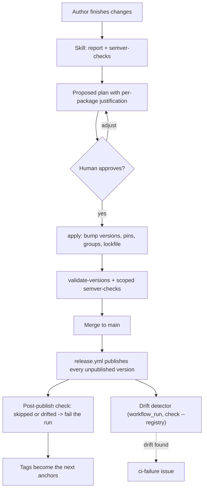

# Release versioning

This chapter describes how crate version numbers are decided and enforced. It covers the
half of the release process that happens *before* a merge to `main`;
[`release-automation.md`](release-automation.md) covers what happens after, and is largely
unchanged by this design.

## Meta

* **Open this when**: preparing a pull request that touches a published package; deciding
  what version a package should get; implementing or debugging the version gate, the
  `cargo-release-plan` tool, or the release-versioning skill; a pull request is blocked by
  the `validate-versions` check.
* **Cross-links**: [`release-automation.md`](release-automation.md) (the publish half),
  [`git-workflow.md`](git-workflow.md) (pull request mechanics),
  [`impl-crate-split.md`](impl-crate-split.md) (why version groups exist),
  [`build-and-tooling.md`](build-and-tooling.md) (`just` recipes and script conventions).

## The invariant

> Every commit on `main` is publishable as-is: for every publishable package, the release-
> relevant source either matches what was published under the package's declared version, or
> the declared version has not been published yet.

A pull request that changes a package's release-relevant source must therefore also bump that
package's version. The version decision moves from an occasional, batched, after-the-fact
activity into the pull request that causes it, while the author still remembers what changed
and why.

Two consequences follow directly:

* There is no "prepare a release" step. `release.yml` already publishes any version it finds
  on `main` that crates.io does not have, so a merge *is* a release.
* Version numbers stop being derived purely from tooling. `cargo-semver-checks` supplies a
  *floor* — never the answer. A judgement call may always raise a bump above that floor (an
  undetectable behavioural break, a meaningful feature addition, keeping a version group
  aligned), but may never lower it below.

Note the wording: **source**, not artifact bytes. That distinction is load-bearing and is
justified under [Release-relevant source](#release-relevant-source).

## Anchoring on release tags

The question "has this package changed since it was published?" needs a per-package reference
point in git. That reference point is the **release tag**.

`release-plz release` tags every successful publish as `{package}-v{version}` (pinned in
`release-plz.toml`, because the `cargo binstall` asset URLs depend on it). Every publishable
package in the workspace currently has a tag matching its manifest version, so the anchor is
already available with no new bookkeeping.

The anchor for a package is the tag naming **its current manifest version**. Comparing the
work tree against that tag answers the invariant question literally: *does the source still
match what we published under the version we currently claim to be?*

The tag is the anchor rather than "the commit where the `version = …` line last changed",
because the latter is a proxy that breaks in exactly the cases that matter most:

* **Concurrent pull requests.** Two branches cut from the same commit both bump `foo`
  0.6.1 → 0.6.2. Git merges two identical single-line edits without a conflict, so the second
  merge lands changed code under a version crates.io already has. The version-line proxy
  reports "recently bumped, all good"; the tag anchor reports drift, because the tree no
  longer matches the tagged 0.6.2.
* **A publish that never succeeded.** The line changed, but nothing was published. Only the
  tag knows the difference.
* **A reverted bump**, and the general ambiguity of attributing a line to a commit across
  merges.

The tag anchor is also immune to rebases, squash merges, force-pushes and merge-base
ambiguity, because it compares *trees*, not history. It needs no knowledge of the pull
request's base branch or merge ref — a recurring source of trouble elsewhere in this
repository's CI.

Tags are not a complete oracle for published state, and the design does not treat them as
one. See [Closing the publish/tag window](#closing-the-publishtag-window).

## Release-relevant source

A package changed if any **git-tracked file that Cargo would put in the `.crate`** changed
between the anchor and the work tree.

The tempting formulation — "did the published artifact differ?" — is unusable, because the
`.crate` contains generated content that is not a function of the source tree:

| Entry                  | Why it is out of scope                                                                                                                                                                                                       |
| ---------------------- | ---------------------------------------------------------------------------------------------------------------------------------------------------------------------------------------------------------------------------- |
| `Cargo.lock`           | Shipped by **every** crate, not just binaries. It is a fresh per-package resolve against the live crates.io index at publish time, so the same commit can package differently twice. Consumers ignore a dependency's lockfile. |
| `Cargo.toml`           | The normalized manifest, with all workspace inheritance resolved. Covered instead by the source manifest and the shared-input rules below.                                                                                    |
| `.cargo_vcs_info.json` | Records the commit being packaged, so it differs on every publish by construction.                                                                                                                                           |
| `Cargo.toml.orig`      | A verbatim copy of the source `Cargo.toml`, which is already in scope in its own right.                                                                                                                                      |

Taking artifact bytes literally would mark all forty-four packages dirty the moment any one
version bump rewrote `Cargo.lock`, and each round of bumps would rewrite it again — a gate
that can never be satisfied. Restricting to git-tracked source makes the question decidable,
offline, and reproducible.

### Opting files out

Files that ship today but need not — benchmarks, package-local `docs/`, book sources,
`AGENTS.md` — are removed from the artifact via `exclude` in the package's `Cargo.toml`, after
which edits to them no longer trigger a release. Nothing is special-cased in the tool, and a
reader of `Cargo.toml` can see exactly which files are release-relevant.

An `exclude` edit is itself a change to `Cargo.toml`, which is always release-relevant, so
adding exclusions requires a bump in the same change. This is why exclusions cannot be used to
side-step the migration — see [Migration](#migration).

Constraints on what may be excluded:

* **`README.md` must stay** — crates.io renders it.
* **`tests/` may be excludable, but verify first.** Several packages `include_str!` fixture
  files from `tests/fixtures/` into `src/`. Those call sites are inside `#[cfg(test)]`
  modules, and `cargo package`'s verification build does not compile test targets, so
  excluding them is probably safe — but this must be confirmed with a real
  `cargo package -p cbh_engines` before relying on it, because `tests/` churn is a
  significant driver of publish volume in the `cbh_*` family.

### Shared inputs

Some content outside the package directory is resolved into the published manifest:

* **`[workspace.package]` and `[workspace.dependencies]`** — in scope. A workspace dependency
  requirement change alters what every inheriting package builds against, with no file under
  that package's directory changing. Reported as a distinct category so a workspace-wide edit
  is visible as such and gets a deliberate decision, rather than silently marking forty
  packages dirty.
* **`[workspace.lints]`** — deliberately **out of scope**, despite being inlined into all
  forty-four published manifests (a thirty-line source manifest becomes a 260-line published
  one, almost entirely lint configuration). Cargo builds registry dependencies with
  `--cap-lints allow`, so a dependency's lint configuration cannot affect a consumer's build.
  Lint configuration governs how *we* compile the crate, and publishing the entire workspace
  for a lint tweak is not a trade worth making.

## Version groups

Some packages are one logical unit split across crates for cargo-technical reasons (see
[`impl-crate-split.md`](impl-crate-split.md)) and must always share a version: the `linked*`
family, `many_cpus`/`many_cpus_impl`, `nm`/`nm_impl`, `nm_otel`/`nm_otel_impl`, and the
`cargo-bench-history` family with its `cbh_*` crates and faker.

Group semantics:

* Every member declares the **same manifest version** at all times. Group consistency is
  defined on declared versions only — never on publish state, because `release-plz release`
  publishes and tags crate by crate and a group is routinely half-published for minutes at a
  time. Treating that as an error would turn an ordinary throttled release into a
  repository-wide red gate.
* Members that have never been published are exempt from the consistency check. They carry
  the group version but cannot have a tag yet, and a new group member must be able to merge
  before its bootstrap publish can happen.
* If any member must bump, **all** members bump — including unchanged ones. The set of
  packages the gate requires a bump for is therefore the closure of the drifted set under
  grouping. This is not theoretical: `nm_impl` currently has unpublished source changes while
  `nm` does not, so a bump of `nm_impl` obliges `nm` too.
* The group's new version is derived from `max(declared version, highest tagged version)`
  across all members, raised by the **highest** bump level any member requires. Anchoring the
  arithmetic on the declared version alone would, after a revert or a lost tag, compute a
  version that crates.io already holds.

Group membership moves out of `release-plz.toml` and into `[workspace.metadata.release-plan]`
in the root `Cargo.toml`. release-plz applies `version_group` only in its `update` and
`release-pr` commands, so once `release-plz update` is no longer run the keys are inert but
still look authoritative — which is precisely how two sources of truth start to diverge. They
are deleted as part of this work.

## Package status

Statuses are evaluated in the order below; the first match wins. `V` is the package's declared
version, `T` the set of tags for that package.

| # | Status            | Condition                                           | Verdict  |
| - | ----------------- | --------------------------------------------------- | -------- |
| 1 | `never-published` | `T` is empty                                        | warn     |
| 2 | `drifted`         | tag for `V` exists; release-relevant source differs  | **fail** |
| 3 | `clean`           | tag for `V` exists; source matches                  | pass     |
| 4 | `regressed`       | no tag for `V`; `V` ≤ highest version in `T`        | **fail** |
| 5 | `pending`         | no tag for `V`; `V` > highest version in `T`        | pass     |

Group consistency is a separate, group-level verdict, not a package status: a package can be
`drifted` *and* belong to an inconsistent group, and both are reported.

`pending` is the normal state of a package inside a pull request that has done its job: the
bump is applied, the publish has not happened yet. It is **not** a statement that the package
is finished — a pull request may legitimately add further changes on top of a version that is
already pending on `main`, and that requires no second bump, because the eventual publish will
include everything.

`regressed` catches a version that moved backwards or duplicates a published one.

`never-published` cannot be a failure: crates.io Trusted Publishing cannot perform a crate's
first publish, so a brand-new crate legitimately sits unpublished until a maintainer runs
`cargo publish` once. This subsumes today's `check-never-published` warning. A **renamed**
package looks identical to a new one and takes the same manual path.

Packages with `publish = false` are excluded entirely.

### Failing closed

Every verdict keys off the tag namespace, so an absent namespace — a shallow checkout, a
change in `actions/checkout` tag behaviour, a fork or a filtered clone — would silently
downgrade all forty-four packages to `never-published` and pass the gate green with zero
enforcement. The tool therefore errors out when it finds no tags matching the configured
pattern, distinguishing "tags not available" from "everything is new".

## Closing the publish/tag window

A tag proves a publish succeeded. It does not prove that an *absent* tag means an absent
publish, and that asymmetry is the design's sharpest edge:

**Scenario.** `release.yml` publishes `foo 0.6.2` to crates.io and then fails to push the tag —
a network fault, or a later crate in the run hard-failing. `foo` now reads `pending` forever.
Every subsequent pull request passes with no bump required, and `release-plz release` skips
0.6.2 because crates.io already has it. `foo` never ships again, silently.

The same window explains a race the pull request gate cannot close on its own: between `foo`
0.6.2 being published and its tag appearing, a pull request that changes `foo` without bumping
reads `pending` and passes.

The pull request gate stays offline and fast, and the reconciliation happens where the
information actually exists:

* **Post-publish verification in `release.yml`.** After `release-plz release`, re-run the check
  with the freshly written tags. Any package that is `drifted`, or whose declared version
  `release-plz` skipped because crates.io already had it, fails the run and files the usual
  per-run `ci-failure` issue. This is a few lines at the exact point where publish outcome and
  tree state are both known.
* **Periodic crates.io reconciliation.** A `main`-only mode of `check` consults the crates.io
  sparse index and flags any package whose declared version is published but untagged, or
  tagged but absent from the registry. `scripts/release/ReleaseAutomation.psm1` already has
  `Get-CrateIndexPath` and `Get-CratePublishStatus` for exactly this.

Yanked versions remain invisible to the offline gate — a yank leaves the tag in place, so the
package reads `clean`. This is an accepted limitation; the crates.io reconciliation is the place
to surface it if it ever matters.

## The tool: `cargo-release-plan`

A new Cargo subcommand in `packages/cargo-release-plan`, following the shape of
`cargo-detect-package` and `cargo-freeze-deps`: `src/main.rs` strips the injected
`release-plan` argv element and delegates to a library whose `run()` is called directly by
integration tests, `clap` derive parsing in `src/cli.rs`, an `ohno` error boundary in
`src/errors.rs`, `mimalloc` global allocator, and a `[package.metadata.binstall]` block.

The working name in discussion was `cargo-release-diff`; `plan` is the better fit because the
tool also decides status and applies bumps.

### Design property: offline and deterministic

In the gate path the tool uses only `git` and `cargo metadata --no-deps`. It never contacts
crates.io, never resolves a dependency graph and never runs a compiler. Consequently the pull
request gate finishes in seconds, cannot flake on network conditions, and is fully reproducible
from a fixture repository in tests.

Expensive or networked analysis — `cargo-semver-checks`, crates.io reconciliation — lives
outside this path where it can be scoped and scheduled independently.

### Computing the change set

For each package, and each of the two ends (anchor tag and work tree):

1. Locate the package's directory **at that end, by package name**, not by current path.
   Otherwise moving `packages/foo` to `packages/tools/foo` reports `clean` against a tag whose
   tree has no such directory.
2. Determine release relevance from that end's own `include`/`exclude` fields, read with
   `git show <tag>:<manifest>` for the anchor side. Gitignore-style matching is implemented
   with the `ignore` crate.

The change set is `git diff <tag>` restricted to those directories and filtered by relevance at
**either** end. Diffing against the work tree rather than a commit means the skill sees
uncommitted edits, which is the state it actually runs in. Untracked files are reported as a
separate advisory category and never counted as changes, since they have no counterpart at the
anchor.

Driving from `git diff` rather than from a single-sided file listing is what makes deletions
visible: a deleted example or fixture never appears in a listing of the current tree.

A non-gating `--verify-packaging` mode cross-checks the tool's relevance rules against
`cargo package --list --allow-dirty` at HEAD, so a divergence from Cargo's real behaviour is
caught by CI rather than by a missed release.

### `report`

```
cargo release-plan report --out-dir <dir> [--manifest-path <p>] [--verbose]
```

Writes `<dir>/report.json` plus one `<dir>/diffs/<package>.patch` per non-`clean` package.

```json
{
  "schema_version": 1,
  "head": "9f3c…",
  "groups": { "nm": { "members": ["nm", "nm_impl"], "consistent": true, "version": "0.1.43" } },
  "packages": [
    {
      "name": "nm_impl",
      "manifest_version": "0.1.43",
      "group": "nm",
      "status": "drifted",
      "anchor": { "tag": "nm_impl-v0.1.43", "commit": "1a2b…" },
      "highest_tagged_version": "0.1.43",
      "changed_files": [
        { "path": "src/hashing.rs", "change": "modified", "category": "package" },
        { "path": "Cargo.toml", "change": "modified", "category": "manifest" }
      ],
      "stat": { "files": 4, "insertions": 26, "deletions": 10 },
      "diff_path": "diffs/nm_impl.patch",
      "workspace_dependencies": [{ "name": "folo_utils", "req": "0.1.10", "exact_pin": false }],
      "dependents": ["nm"]
    }
  ]
}
```

`workspace_dependencies` and `dependents` are present because version decisions **cascade** and
must be taken in dependency order. `many_cpus` pins `many_cpus_impl = "=2.4.14"`, so bumping the
impl crate forces a manifest edit in the shell crate, which is itself a change requiring a bump.
Deciding each package independently in one pass is wrong; the graph makes the required ordering
explicit.

A `--from <rev> --to <rev>` mode overrides the per-package anchors with one explicit range, for
reporting on an arbitrary span. It is reporting only; the gate always uses anchors.

### `check`

```
cargo release-plan check [--manifest-path <p>] [--format text|github] [--registry]
```

Exits non-zero on any `drifted` or `regressed` package or inconsistent group, printing one
actionable line per offence: what changed, what the anchor was, which group members are dragged
along, and how to run the skill. `never-published` warns without affecting the exit code.
`--format github` adds workflow annotations. `--registry` enables the crates.io reconciliation
described above and is used only on `main`, never in the pull request gate.

### `apply`

```
cargo release-plan apply --plan <plan.json> [--dry-run]
```

Applies an approved plan: sets each package's `version`, rewrites every intra-workspace
dependency requirement that must follow — in particular the `=` pins in
`[workspace.dependencies]` — and expands group members. Manifests are edited structurally with
`toml_edit`, preserving comments and layout, exactly as `cargo-freeze-deps` does; the whole edit
set is computed before anything is written, so a failure never leaves manifests half-updated.
The workspace lockfile is refreshed afterwards, because `--locked` builds and the `check-frozen`
job would otherwise fail on stale path-dependency versions. The lockfile is not itself
release-relevant, so refreshing it cannot re-trigger the gate.

Owning this step rather than delegating to `cargo set-version` or `release-plz set-version` is
deliberate: the `=`-pin and version-group rules are workspace-specific, this is where the bugs
that motivated the redesign live, and the plan file becomes a reviewable, testable artifact.

### Testing

Unit tests cover status precedence, group verdicts, relevance matching and plan expansion.
Integration tests build real fixture repositories in `tempfile::tempdir()` and drive `run()`
directly, using the hermetic `run_git` helper pattern from `cargo-bench-history`'s test harness
(pinned identity, no signing, no autogc). Fixtures cover each status, group closure with a
never-published member, `=`-pin propagation, a deleted packaged file, a newly excluded file, a
moved package directory, an empty tag namespace, and a version collision.

## The skill

`.github/skills/release-versioning/SKILL.md` — the repository's first skill. It is invoked when
a pull request is ready to merge, or when the `validate-versions` check fails.

Mechanics live in `just` recipes, per the repository rule that logic worth testing must not live
in prose; the skill file carries the judgement.

1. **Preflight.** Run the `cargo-semver-checks` canary. A `cargo-semver-checks` that fails to
   *run* — classically one too old for the toolchain's rustdoc JSON format — must never be read
   as "no breaking changes". This is the same trap the current `verify-semver-checks` recipe
   guards against, and the guard survives the removal of `release-plz update`.
2. **Collect.** `just release-report <dir>` runs `cargo release-plan report` and then
   `cargo semver-checks --workspace --all-features`, capturing both.

   Semver checking is workspace-wide, not restricted to changed packages, and the reason is
   worth stating so nobody later "optimises" it away: a package's public API can break without
   any of its own files changing. If `bar` makes a breaking change and `foo` re-exports a `bar`
   type, `foo`'s API breaks too, and `foo`'s requirement on `bar` must move — which is itself a
   manifest change requiring a bump.
3. **Propose.** Walk the workspace dependency graph in topological order and, per package: take
   the `cargo-semver-checks` floor, read the package's diff, and decide a level. Expand version
   groups, propagate `=` pins, and re-check that the expansion did not create new work. Every
   crate here is `0.x` or `1.x`, so under Cargo's semantics a breaking change to a `0.x` crate
   is a *minor* bump.
4. **Present.** One table for the human: package, current version, proposed version, level, the
   floor `cargo-semver-checks` reported, and a one-line justification citing the actual change.
   Where the proposal exceeds the floor, the reason is stated explicitly — that is the entire
   point of the exercise. Diffs stay on disk and are cited by path rather than pasted, since a
   single package's drift can run to thousands of lines.
5. **Apply, on approval.** `cargo release-plan apply`, then re-run `check` and the scoped
   `cargo semver-checks` to confirm the result, and write the summary into the pull request
   description. The plan is not committed: the gate verifies manifest state, not intent, so a
   plan file in the repository would be inert churn.

## The GitHub checks

### `validate-versions`

A new job in `validation.yml`. Its inputs are git history and manifests, not Cargo packages, so
per the workflow conventions it runs **unconditionally** and is not gated on `delta`.
`cargo-delta`'s changed-package scoping must not be applied to it — the whole point is to catch
packages the current pull request did not touch.

```yaml
validate-versions:
  runs-on: ubuntu-latest
  outputs:
    pending: ${{ steps.check.outputs.pending }}
  steps:
    - uses: actions/checkout@v6
      with:
        fetch-depth: 0   # anchors are tags; the tag namespace and history must be present
    - uses: ./.github/actions/setup-environment
    - id: check
      run: just validate-versions
      shell: pwsh
```

The recipe is a thin wrapper over `cargo release-plan check --format github`, which also emits
the `pending` set for the next job. No PowerShell module is introduced: the classification logic
is the Rust tool's job and is tested there. The job joins `alert`'s `needs:` list.

### `semver-checks`

`cargo-semver-checks` is too expensive to run workspace-wide on every pull request — a full run
means rustdoc for both baseline and current across forty-four packages, and the `cbh_*` family is
slow to build. In CI it is therefore scoped to the `pending` set, minus group members that are
being dragged along with no API change of their own (the `_impl` crates are `doc(hidden)` and
have no consumer-visible surface). Group closure means this set is not always small, so the job
runs in parallel with the rest of validation rather than gating it.

It runs with `if: always()` on `needs: [validate-versions]`, so a failing version gate still
surfaces insufficient-bump findings in the same round trip rather than hiding them behind a
second push.

The tool checks that a bump *happened*; `cargo-semver-checks` checks that it was *big enough* —
it compares against the latest crates.io release by default and fails when the declared version
is an inadequate bump. Neither substitutes for the other. The canary preflight guards this job
as well.

### Drift detector

The detector runs on `workflow_run` completion of `release.yml`, not on `push: main`, for two
reasons. First, on a push the detector would race the publish and read every just-merged bump as
`pending`, structurally lagging one merge behind. Second, `validation.yml`'s concurrency group
collapses to `Validation-refs/heads/main` on push with `cancel-in-progress: true`, so
back-to-back merges cancel each other's run — and `alert` is gated on `failure()`, which does not
fire on `cancelled()`. The backstop would be silently disabled in exactly the rapid-merge window
where drift arises.

It therefore lives in its own workflow with its own concurrency group and
`cancel-in-progress: false`, runs `check --registry`, and files a `ci-failure` issue.



## Relationship to release-plz

`release-plz update` is dropped. It runs only from `just prepare-release` on a developer machine;
nothing in CI calls it. With it go `prepare-release` itself, the `version_group` keys in
`release-plz.toml`, and the framing of `verify-semver-checks` as a release preflight (the recipe
survives, repurposed as the skill's and the semver job's canary).

`release-plz release` is **kept**, with one addition: the post-publish verification step. It is
the publish half, it is idempotent, and nothing downstream of it reads release-plz state —
`plan-binaries` reconciles against `cargo metadata` and `gh release view`. The only contract this
design depends on is the pinned `git_tag_name = "{{ package }}-v{{ version }}"`, already frozen
because the `cargo binstall` asset URLs derive from it; the tag format is now load-bearing for two
independent reasons.

## Migration

The gate cannot be switched on against the current tree: 23 of 44 publishable packages already
differ from their published source, an artefact of version bumping having been batched and
occasional.

All 23 bump in a single reconciliation release, **with the `exclude` additions applied in the
same change**. Exclusions cannot be used to shrink that set first: `Cargo.toml.orig` ships
verbatim in the `.crate`, so adding `exclude` is itself a release-relevant change. Their value is
in reducing *future* publish volume — against today's tree they would have kept 8 of the 23
packages quiet, all of whose drift is benchmarks or package-local documentation.

1. Land the exclusions and the reconciliation bumps together; let `release.yml` publish.
2. Confirm `cargo release-plan check` is clean on `main`.
3. Make `validate-versions` a required check and enable the drift detector.

Steps 1–2 must complete before step 3, or every pull request is immediately red.

## Publish volume

Every merge that touches a published package now publishes it, and group closure multiplies that:
a one-line change in any `cbh_*` crate publishes all sixteen members of the `cargo-bench-history`
group. crates.io burst-limits new versions, which is why the change attribution rule is
deliberately narrow — the `exclude` policy exists as much to keep publish volume sane as to keep
the invariant honest. The existing three-attempt, fifteen-minute retry around
`release-plz release`, combined with its idempotency, absorbs the rate limit; a throttled run
resumes and finishes, and because group consistency is defined on declared versions the
intermediate half-published state does not redden the gate.

## Reuse outside this repository

The tool is an ordinary published Cargo subcommand from the start — binstall metadata, trusted
publisher, no folo-specific behaviour compiled in. Group definitions, exclusions and the tag
pattern all come from configuration, so another workspace adopts it by writing
`[workspace.metadata.release-plan]` and pointing a check at `cargo release-plan check`.

The skill and the `just` recipes stay local for now. The skill is the part most entangled with
local conventions, and skills are new to this repository; extracting it is worth doing only once
the shape has survived contact with real pull requests.

## Open decisions

* **Name.** `cargo-release-plan` versus the original `cargo-release-diff`.
* **Exclusion scope.** `benches/`, package-local `docs/`, `book/`, `doc/` and `AGENTS.md` are the
  clear candidates. `examples/` and `tests/` are judgement calls, and the `tests/` case needs the
  packaging experiment described above.
* **Comment-only manifest edits.** A comment-only change to a package `Cargo.toml` is
  release-relevant under this rule and forces a publish. Accepting that keeps the rule simple;
  the alternative is semantic manifest comparison, which is more machinery than the problem
  deserves.
* **Feature configuration for `cargo-semver-checks`.** `--all-features` is the safe default for
  coverage but can fail on mutually exclusive feature sets.
* **Branch protection.** Requiring up-to-date branches serialises merges; a merge queue is the
  better answer if pull request throughput becomes a problem. Either way, the post-publish
  verification is what actually guarantees correctness.
