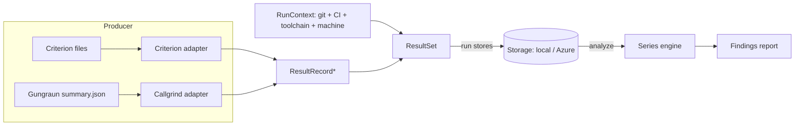

# cargo-bench-history — Design & Implementation Plan

Status: implemented. All of the numbered iterations are shipped — `run`,
`analyze` (rolling-baseline regression), `install`, the Azure Blob backend,
the Criterion adapter, the commit-centric storage model (v2), git-aware
`analyze`, and `backfill`. The remaining statistical findings (change-point and
drift, §9 #2–#3) are the one deferred follow-up. The resolved design decisions
are logged in [§13 Decisions & open items](#13-decisions--open-items); the
iteration mapping is in [§12 Implementation plan](#12-implementation-plan).

## 1. Purpose

A Cargo subcommand that maintains a **long-lived history** of benchmark results
and analyzes that history for trends that are invisible to snapshot/“previous
run” tools:

* slow incremental drift (“scenario X got 30 % slower over 12 months, 1 % at a
  time”);
* step changes attributable to a specific commit, visible only in hindsight once
  the noise averages out;
* regressions vs. a robust rolling baseline rather than a single noisy neighbour.

It stores every result over time (local path or Azure blob), runs in multiple
environments (dev PC, GitHub Actions, ADO), and partitions data only when the
results are not otherwise comparable.

Commands: `run`, `install`, `analyze`, `backfill` (plus a deferred `upload` —
§8.2).

## 2. How the benchmark systems work (and what they emit)

Understanding the producers is mandatory: comparability and parsing both depend
on it. Initial scope is what this workspace uses — **Criterion** (wall-clock) and
**Callgrind via Gungraun** (simulated instruction counts).

### 2.1 Criterion (wall-clock, hardware-dependent)

`cargo bench` with Criterion 0.8.2 writes, per measured case, under
`target/criterion/`:

* `…/<group>/<function>/<value>/new/benchmark.json` →
  `BenchmarkId { group_id, function_id?, value_str?, throughput? }` — the stable
  identity of the case.
* `…/new/estimates.json` → `Estimates { mean, median, median_abs_dev, slope?,
  std_dev }`, each `Estimate { confidence_interval { confidence_level,
  lower_bound, upper_bound }, point_estimate, standard_error }`. **Units are
  nanoseconds per iteration.**
* `…/new/sample.json` → `SavedSample { sampling_mode, iters[], times[] }` (raw).
* `…/new/tukey.json` (outlier fences).

Key facts:

* Results are **hardware-dependent and noisy** → must be partitioned by machine
  and compared with noise-aware statistics.
* Criterion records **no timestamp, no commit, no machine info, and no package**.
  Our tool supplies all run context, and the stored `BenchmarkId.package` is left
  `None` (the workspace's crate-prefixed group ids keep series distinct; see §3).
* The on-disk JSON is criterion-internal (not a stability-guaranteed API), but
  has been stable for many releases. `cargo-criterion` (a separate tool) emits a
  documented `--message-format json` stream; the workspace does not use it
  today. The adapter parses the on-disk files in isolation behind
  `bench/criterion.rs`, so a later swap to `cargo-criterion` would not touch the
  rest of the tool.

### 2.2 Callgrind via Gungraun (simulated, hardware-independent)

Gungraun 0.19.0 runs each scenario once under Valgrind/Callgrind and can emit a
**machine-readable summary** — this is the “special need” the `run` command
exists to satisfy:

* `--save-summary[=json|pretty-json]` (env `GUNGRAUN_SAVE_SUMMARY`) writes
  `summary.json` next to each scenario’s output under `target/gungraun/…`.
* `--output-format=json` streams one `BenchmarkSummary` per scenario to stdout
  (everything else goes to stderr; `… -- --output-format=json | jq -s`).
* Schema is **versioned** (`BenchmarkSummary.version`, currently `"6"`).
  `BenchmarkSummary { version, module_path ("file::group::bench"),
  function_name, id?, kind, profiles, benchmark_file, package_dir, project_root }`.
  `profiles[].data` carries the Callgrind metrics per `EventKind`: instructions
  (`Ir`), L1/LL/RAM hits, estimated cycles, branches (`Bc/Bcm/Bi/Bim`).

Key facts:

* Results are **deterministic and hardware-independent** (a CPU simulator), so
  they do **not** need a machine-key partition.
* They **are** toolchain/libc/arch sensitive (absolute counts shift with rustc
  inlining, glibc, target arch). So `target_triple` must still partition, and
  rustc/libc versions are recorded as metadata so a bump shows up as a step in
  the timeline rather than silently forking history.
* The default `cargo bench` output is human-readable text only → we must opt in
  to the JSON summary. Tiny but real: that is what `run` does (sets the env var /
  arg). We therefore **implement `run`, but it stays thin.**

### 2.3 Consequence for the data model

The two systems differ in units, noise, and hardware-dependence. Both, however,
reduce to the same shape: *a stable benchmark identity → a set of named numeric
metrics*. That shared shape is the foundation of the model in §3.

## 3. Core concepts & data model



* **BenchmarkId** — stable identity of a series, scoped by the workspace
  `package` where it is recoverable, so that equally named bench targets in
  different packages (for example `foo/benches/a.rs` and `bar/benches/a.rs`)
  never collide into one series. Callgrind: `package` (Gungraun `package_dir`
  basename) + `module_path` + `function_name` (+ `id`). Criterion: `package` is
  **`None`** — Criterion's on-disk files carry no package and `target/criterion/`
  is flat, so the package is unrecoverable; the series identity is `group_id` /
  `function_id` / `value_str`. This is safe here because the workspace
  crate-prefixes its Criterion group ids (`<crate>_<group>`), so collisions
  between equally named cases in different packages do not occur. Components are
  kept separate so reports can render the full `qualified()` form or a compact
  `short()` tail. Renaming a benchmark starts a new series (documented caveat;
  see §13).
* **Metric** — `{ name, unit, value: f64, kind }` where `kind ∈ {Wallclock,
  InstructionCount, CacheHits, EstimatedCycles, Branches, …}`. Criterion also
  carries the confidence interval and std-dev so analysis can be noise-aware.
* **ResultRecord** — one `BenchmarkId` + its metrics from a single run.
* **Timestamps** — every run carries three distinct times (§6): the **effective
  time** (defaults to the commit date for clean / wall-clock now for dirty,
  overridable with `--timestamp`), the **execution time** (when the benches ran),
  and the **ingest time** (wall clock when stored). The series is ordered by git
  topology (§8.4), not by effective time; the tool never assumes ingest time is the
  effective date.
* **RunContext** — metadata attached to every stored run (see §6).
* **ResultSet** — `{ schema_version, context, results: [ResultRecord] }`; the
  unit of storage (one immutable file per run).
* **ComparabilityKey** — the partition under which a series accumulates. Two
  records are comparable iff their keys match (§4).
* **MachineKey** — a stable hardware fingerprint for hardware-dependent systems
  (§5).

## 4. Comparability & storage partitioning

The central insight: **partition only by what makes results fundamentally
incomparable; record everything else as metadata so the analysis can see its
effect over time.**

ComparabilityKey =
`{ project, system, target_triple, machine_key? }`

* `project` — workspace identity (config `project.id`, default = repo/workspace
  dir name).
* `system` — `criterion` | `callgrind` (different units & semantics).
* `target_triple` — `x86_64-unknown-linux-gnu` etc. Even Callgrind counts are
  not comparable across architectures.
* `machine_key` — **only for hardware-dependent systems** (Criterion). Omitted
  (literal `synthetic`) for Callgrind.

Deliberately **metadata, not partition** (so a change is *visible* as a timeline
step, which is the whole point of the tool): rustc/cargo version, OS/libc,
commit, branch, CI provider. **Decided:** toolchain is recorded as metadata and
the timeline stays continuous; `analyze` annotates/segments by toolchain so a
bump shows up as a step rather than forking history.

### 4.1 Target triple & cross-OS (WSL) execution

`target_triple` describes **where the benchmark binary actually ran**, which is
not always where `cargo bench-history` itself runs. The common case: a Windows
developer drives Callgrind benches through WSL
(`wsl -e bash -lc 'just bench-cg'`) — the tool process is on Windows but the
measured binary is `x86_64-unknown-linux-gnu`. Recording the tool's *own* host
triple would mislabel the data and fork one logical series across two
partitions.

Resolution order (first match wins):

1. Explicit `--target-triple`.
2. **Engine-declared constraint.** The Callgrind engine only runs under
   Linux/Valgrind, so its adapter pins the OS component to `linux`
   unconditionally — this alone resolves the Windows→WSL Callgrind case with no
   user action.
3. **Host detection** for natively-run engines (Criterion). A WSL guest shares
   the host architecture (x86_64 host → x86_64 guest; ARM host → aarch64 guest),
   so only the OS component can differ across the WSL boundary — exactly what the
   engine constraint in (2) handles.

The tool's own host triple is additionally recorded as **metadata**
(`host_triple`), so any mismatch with the partition `target_triple` is auditable
rather than a silent series corruption.

**Golden rule (documented):** for the cleanest data, run `cargo bench-history` in
the same OS context as the benches (e.g. invoke the whole tool inside WSL); the
rules above are safety nets for when that is impractical.

### 4.2 On-disk / blob layout

The layout is an immutable, append-only-by-new-file, **commit-centric** model
(works identically on local FS and blob storage, no read-modify-write races in
concurrent CI). The path is `<discriminant set>/<commit_sha>/<run file>`:

```
<root>/v2/<project>/<engine>/<target_triple>/<machine_key|synthetic>/<commit_sha>/
    clean.json                       # ≤1 per commit — the canonical point
    dirty-<effective_unix>.json      # 0..N snapshots taken on top of this base commit
```

The segment **above** `<commit_sha>` is the **discriminant set** — the dimensions
that make two runs comparable (§4.3). The commit is a directory; **clean vs dirty
is filename semantics** within it. This layout is dictated by how `analyze` selects
data (§8.4): storage is **not** a pre-assembled timeline. A series is **pieced
together at query time** by resolving git history into an ordered set of commits and
then reading each commit's directory — so the storage key is indexed by *commit*,
and ordering comes from *git topology*, never from a timestamp baked into the key.

**Logical point identity (collisions).** Because the commit is a path segment, a
**clean** run is identified by `<discriminant set> + <commit>` and maps to the single
deterministic key `…/<commit>/clean.json`. Collision detection rides on the
**write-once** `put` contract: the store refuses to overwrite an existing object, so a
second clean `run`/`backfill` of the same commit fails atomically (non-zero exit,
nothing written) with no separate exists-check round-trip or TOCTOU window;
`--overwrite` switches to a replacing write (e.g. to clobber data from broken infra). A
**dirty** run is keyed by its effective time, `…/<commit>/dirty-<effective_unix>.json`,
so successive snapshots on the same base commit coexist (effective defaults to
wall-clock now, §6, spreading them in the order taken); a same-timestamp collision is
treated like any other write-once conflict (refused unless `--overwrite`).

Branch is **not** a path component: a commit SHA is globally unique, so the same
commit on two branches is one point. Branch selection happens at query time via git
topology (§8.4); branch is recorded only as run metadata (§6).

Each path segment (`<project>`, `<target_triple>`, `<machine_key>`, `<commit_sha>`)
is **sanitized** before the key is built: any character outside `[A-Za-z0-9._-]`
becomes `_`, and an otherwise-empty or all-dots segment becomes `_`. This keeps a
stray `/` (e.g. a `project.id` of `team/app`) from silently splitting the key into
the wrong number of segments — which `analyze` would then drop as unattributable —
by mangling the value rather than rejecting the run.

### 4.3 Discriminant set & query facets

The discriminant set `<project>/<engine>/<target_triple>/<machine_key|synthetic>`
is the comparability boundary; a series is only ever built **within** one set. The
**full target triple** is kept as one segment on purpose — `…-windows-msvc` and
`…-windows-gnu` are genuinely different binaries and must not merge. For selection,
`analyze` derives **OS** and **architecture** facets by parsing the triple, so the
user can pick sets without memorizing triples:

* `--list-discriminants` lists the distinct sets present (a cheap key `list` under
  `v2/<project>/`, parsed and de-duplicated; an index file can be added later if a
  store grows large) with their parsed engine / OS / arch / machine key.
* `--os`, `--architecture`, `--engine`, `--machine-key` **filter which sets** are
  analyzed. A filter that matches several sets (e.g. a Windows and a Linux nightly
  pool) yields **one report per set** — parallel data sets, analyzed individually.

## 5. Machine key (hardware fingerprint)

Goal: equal for pool-equivalent machines, different for genuinely different
hardware. **Never** keyed on hostname/serial (cloud pool nodes differ in name
but are equivalent).

Factors (hashed): the `many_cpus` maximum processor count and maximum
memory-region (NUMA node) count, plus a best-effort CPU brand string. These are
the stable, pool-equivalent attributes available without elevated privileges
across Windows/Linux/macOS; finer signals (RAM size, base frequency) were left
out of v1 because they add platform-specific probing for little discriminating
value in homogeneous CI pools. User override: `--machine-key` (CLI only — the
config file is committed and would be wrong for some checkouts), which wins over
the computed fingerprint.

* Reuse **`many_cpus`** (already in-workspace) for the processor and
  memory-region counts; a small per-platform `detect_cpu_brand` supplies the CPU
  brand (Windows/Linux/macOS impls, best-effort — `None` when unavailable).
* **Stability requirement (correctness):** the key is persisted and compared
  across machines and tool versions, so it uses a **fixed** hash — SHA-256 of a
  version-tagged canonical string (`mk1\nprocessors=…\nmemory_regions=…\n
  cpu_brand=…`), truncated to the first 16 hex characters — **not**
  `foldhash`/`DefaultHasher` (seeded / not stable). A golden unit test pins a
  fixed profile to its hex digest so an accidental change to the canonical form
  is caught.
* Computed only for **hardware-dependent** systems (Criterion). Callgrind
  partitions under `synthetic` and never reads the machine key.

## 6. Run context (environment detection)

Captured once per stored run and attached to the `ResultSet`:

* **Effective time** — for a **clean** run, defaults to the benchmarked commit's
  committer date; for a **dirty** run, defaults to **wall-clock now** (the base
  commit's date no longer identifies the code). Either default is overridable with
  `--timestamp <rfc3339>` (squash / rebase, reconstructing from logs, benches not
  tied to one commit). Effective time **no longer orders the series** — git topology
  does (§8.4). It serves three narrower roles: the dirty filename (`dirty-<unix>`),
  the sub-order of multiple runs *within one commit* (clean first, then dirty
  snapshots in the order taken), and the `--since` window filter.
* **Execution time** — wall clock when the benches actually ran (metadata), read
  from an injected `tick::Clock` (§10) so tests drive it deterministically.
* **Ingest time** — wall clock when the ResultSet was stored (metadata), also from
  the `tick::Clock`; **never** used as the effective date.
* **Git:** commit SHA + short SHA, branch, committer date, dirty flag (`git`).
  Branch is metadata only — query-time topology, not this field, decides series
  membership (§8.4). Parent lineage is **not** recorded: `analyze` resolves topology
  from a live repo (§8.4), so storage never needs to reconstruct the commit graph.
* **CI:** provider + run id + PR number, detected from env:
  * GitHub Actions: `GITHUB_ACTIONS`, `GITHUB_SHA`, `GITHUB_REF_NAME`,
    `GITHUB_RUN_ID`, `GITHUB_RUN_ATTEMPT`.
  * ADO: `TF_BUILD`, `BUILD_SOURCEVERSION`, `BUILD_SOURCEBRANCH`,
    `BUILD_BUILDID`, `SYSTEM_PULLREQUEST_PULLREQUESTID`.
  * else `Local`.
* **Toolchain/host:** rustc + cargo version, OS + libc hint, the resolved
  execution `target_triple` (§4.1) **and** the tool's own `host_triple` (these
  differ under WSL).
* **Provenance:** cargo-bench-history version + schema version + machine_key.

`jiff` parses `--timestamp` and formats stored times as RFC 3339 (UTC). Git and
env access go through a small PAL so the logic is unit-testable without a real
repo or CI.

## 7. Storage abstraction

```rust
trait Storage {
    async fn put(&self, key: &str, bytes: &[u8]) -> Result<(), StorageError>;
    async fn get(&self, key: &str) -> Result<Vec<u8>, StorageError>;
    async fn list(&self, prefix: &str) -> Result<Vec<String>, StorageError>;
}
```

Storage I/O is **async** (§10): `LocalStorage` over `tokio::fs`, `AzureBlobStorage`
over async HTTP. `async fn` in a trait is not `dyn`-compatible, so backend
selection is a `StorageFacade` **enum** (`Local` | `Azure`) with static dispatch —
no `async_trait` dependency, and `run`/`analyze` stay backend-agnostic by holding a
`StorageFacade`.

* **LocalStorage** (iteration 1): root from config; create dirs; write/read/walk
  via `tokio::fs` (iterative directory walk — no boxed async recursion).
* **AzureBlobStorage** (iteration 4): `azure_storage_blob` (+ `azure_identity`),
  behind an **optional `azure` Cargo feature** so default builds and Miri stay
  light and dependency-free; the feature compiles on Windows, Linux **and
  macOS**. Auth is resolved once in `from_config`, in priority order:
  1. **self-signed account SAS** (`account_key`) — the signing math lives in
     `storage::sas` (HMAC-SHA256 via the pure-Rust RustCrypto `hmac`/`sha2`
     crates) and is the path used for **Azurite** in CI and for SAS-based
     production access. The token is baked into the endpoint URL's query, so the
     client passes **no credential** and Azurite's plain-HTTP endpoint is
     accepted.
  2. **verbatim `sas_token`** — a pre-signed SAS supplied in config, used as-is.
  3. **Microsoft Entra ID** (`DeveloperToolsCredential`) — the secret-free
     production default (CI managed identity / workload-identity federation,
     local `az login`, env service principals); requires an **HTTPS** endpoint.

  The shipped azure-sdk-for-rust v1.0.0 removed connection-string parsing,
  `StorageSharedKeyCredential`, and `DefaultAzureCredential`, which is why the
  account-SAS path is self-signed rather than delegated to the SDK. Tested in
  regular CI against the **Azurite emulator** (not real cloud, not `#[ignore]`);
  the network tests **self-skip** when no emulator is reachable and are
  `#[cfg_attr(miri, ignore)]`. Account-key construction reads the wall clock for
  the SAS expiry, so those pure tests are Miri-ignored too — the signing math is
  still covered under Miri by `storage::sas`'s fixed-expiry golden vector.
* An in-memory `Storage` fake (in `#[cfg(test)]`) backs the Miri-safe
  orchestration tests; it mirrors the same key/prefix semantics as `LocalStorage`.

The blob/key model (flat keys, list-by-prefix, immutable objects) is the lowest
common denominator of a filesystem and a blob container, so both backends
implement the same trait with no special-casing upstream.

## 8. Commands

The commands (`run`, `install`, `analyze`; `upload` is deferred — §8.2) follow
the established pattern: `main.rs` strips the injected `bench-history` arg, `argh`
parses (here with **subcommands**), and dispatches to `lib::run`, which returns a
typed `Outcome`/`Error`.

### 8.1 `cargo bench-history run`

**Engines are detected from output, not configured.** `run` invokes the
workspace's benches once with `cargo bench` and harvests whichever engines
produced output. There is no `[engines]` configuration: the tool enables the
combined environment every supported engine needs and then inspects each output
tree to see which engines actually ran. This works because Criterion and Callgrind
can both be driven from a single `cargo bench` invocation, and off-Linux the
Callgrind (`_cg`) benches compile to `#[cfg(target_os = "linux")]` no-ops, so they
simply produce no output — no OS logic is needed in the tool.

`run`:

1. **Injects the combined bench environment via environment variables** (not
   appended args). Env is robust regardless of how the benches launch. Callgrind
   needs `GUNGRAUN_SAVE_SUMMARY=pretty-json`; Criterion needs nothing. The union of
   every supported engine's env (`injected_bench_env`, iterating `EngineSystem::ALL`)
   is set unconditionally — an engine that did not run merely ignores its variable.
   * **Target directory pinning:** the tool also injects `CARGO_TARGET_DIR` set
     to the *absolute* target root it will harvest, so the benches' output always
     lands where the harvest scans. An absolute root is essential because cargo
     runs each benchmark binary with its working directory set to the owning
     package's directory: a relative `target/` would be resolved there by an
     engine such as Criterion (which honors `CARGO_TARGET_DIR` as a path),
     scattering output under each package instead of the workspace root. Pinning
     an absolute root also overrides an ambient `CARGO_TARGET_DIR` (such as the
     one `cargo llvm-cov` sets) that would otherwise redirect output elsewhere.
2. Records the **run-start time**, then runs `cargo bench` (with the scope flags
   below). A non-zero exit aborts the run.
3. **Harvests every supported engine's output location**
   (`target/gungraun/**/summary.json` for Callgrind,
   `target/criterion/**/new/estimates.json` for Criterion), filtered to files with
   `mtime ≥ run-start` so stale cases from earlier runs are not re-ingested. Each
   tree is attributed to its engine; an engine whose tree produced no cases is
   silently skipped.
4. Builds a `ResultSet` per engine (with the resolved RunContext) and **stores it
   immediately** — `run` always persists; there is no separate publish step
   (`--no-store` produces results without writing, for dry runs). A **clean** point
   writes the deterministic key `…/<commit>/clean.json`; an existing one is refused
   by default (non-zero exit, via the write-once `put` contract, §4.2) unless
   `--overwrite`, which makes re-runs idempotent and safe to repeat. A **dirty**
   snapshot writes
   `…/<commit>/dirty-<effective_unix>.json` and coexists with prior snapshots (only a
   same-timestamp clash is a conflict). An engine that harvests **zero** cases stores
   nothing (an empty set carries no comparable data and would only inflate `analyze`'s
   run count); the summary reports the empty harvest, and other engines in the same
   run are unaffected.

To collect Callgrind data, run the tool on Linux (or in WSL), where Valgrind is
available; on other hosts only Criterion is harvested. This is automatic — the
Callgrind benches are absent from the build there, so the tool never attempts
Valgrind off-Linux.

**Scope & filtering.** Scope flags translate directly to `cargo bench` arguments:
`--workspace` (the default) benches the whole workspace; `--package`/`-p NAME`
(repeatable) restricts to specific packages (and omits `--workspace`); `--bench
NAME` (repeatable) restricts to named bench targets. Everything after a `--`
separator is forwarded **verbatim** to `cargo bench` after the scope flags.
Because harvest is scoped by `mtime ≥ run-start`, whatever subset actually ran is
exactly what gets ingested. Note that two non-overlapping partial runs at the same
commit (different `--package`/`--bench` subsets) do **not** merge: each stores its
own `clean.json` and the second collides with the first (§4.2) — gaps in coverage
are expected to come from *different commits* covering different subsets, not from
multiple partial runs at one commit. Other flags: `--timestamp <rfc3339>`
(override effective time for backfill, §6), `--target-triple <triple>` (override
the partition triple, §4.1), `--machine-key <key>` (override the hardware
fingerprint, §4.1), `--no-store`, `--overwrite` (replace an existing same-commit
point instead of refusing, §4.2), `--verbose` (print a step-by-step diagnostic
trail to stderr — the benchmark command and injected env, directories scanned,
files included/skipped-as-stale, and each stored key — to diagnose a run that
unexpectedly stored nothing). `--engine` is **not** a `run` flag — it is an
`analyze` facet over stored data (§8.4).

### 8.2 `cargo bench-history upload` — deferred (run vs upload)
`run` already does the only thing that *must* happen at execution time — inject
`GUNGRAUN_SAVE_SUMMARY` so Callgrind even writes a machine-readable summary — and
then stores the result. A standalone `upload` would merely re-harvest *existing*
`target/` output without re-running benches, and its value is narrow:
* **Callgrind:** near-useless on its own — without the run-time env injection
  there is no `summary.json` to harvest, so the benches had to run under our
  control anyway, which is exactly what `run` does.
* **Criterion:** plausible (estimates.json is always written, so output may
  pre-exist from a separate `cargo bench`), and the engine is now supported — so
  this is the most likely trigger for un-deferring `upload`.

So `upload` is **deferred**. The harvest → build → store logic already lives in
reusable pieces (`bench_output.rs` for the harvest, the store step in
`commands/run.rs`), shared by `run` and `backfill`; exposing it as an `upload`
subcommand is a thin addition if a concrete need appears. When added it is
platform-neutral (only reads files).

### 8.3 `cargo bench-history install`
Generate an example `.cargo/bench_history.toml` if absent; print its path and
next steps. Never overwrite an existing file (report and exit success). Honors
`--config <path>` to write somewhere other than the default location. Writing is
abstracted behind a `ConfigWriter` port (`TokioConfigWriter` in production, an
in-memory fake in tests) whose `write_new` creates parent directories and uses
`create_new` so an existing file is reported, never clobbered. The generated
template configures only the `[storage]` backend (engines are detected from
output, not configured — §8.1); it carries no machine-key setting (the key is a
run-time-only `--machine-key` flag, since a committed config would be wrong for
some checkouts) and the next-steps hint points at `backfill` for seeding an
existing repository's history.

### 8.4 `cargo bench-history analyze`

**Analyze pieces a series together at query time from git topology** — storage is
indexed by commit (§4.2), not pre-ordered. `analyze` therefore **requires a
resolvable git repository** (the current checkout by default, or `--repo <path>`);
with no repo it errors out rather than guessing an order. (Analyzing a foreign
project's stored data means checking out that project's repo and pointing `analyze`
at it.)

**Selecting the discriminant sets.** `--list-discriminants` prints the sets
present (§4.3). `--engine`, `--os`, `--architecture`, `--machine-key` filter them;
each matched set is analyzed independently and produces its own report (so a Windows
and a Linux nightly pool come out as two reports).

**Selecting the commits (the query model).** Two refs frame the analysis:
* `--branch <ref>` — the **target** whose history is analyzed (default: current
  `HEAD`).
* `--base <ref>` — the **integration branch** (default: the detected default branch
  — `origin/HEAD`, else `main`/`master`; `project.default_branch` config override).

`analyze` resolves the **first-parent** ancestry of the target and splits it at the
merge-base with the base:
* commits **in the base ancestry** (≤ merge-base) contribute **clean points only**;
* commits **unique to the target** (the private branch commits, > merge-base)
  contribute **clean *and* dirty** points (`--no-dirty` drops the dirty ones).

This single rule covers both use cases: an "official" view is just
`--branch <default>` (target == base ⇒ everything is base ⇒ clean-only); the
"how does my feature fit in" view is the default (clean default-branch baseline,
then the branch's own clean + dirty snapshots). Series are **ordered by git
topology**; multiple runs on one commit sub-order by effective time (§6). Branch
*metadata* on a run is never consulted — membership is purely topological, so a
dirty snapshot taken on a shared base commit (scratch work before committing) is
excluded from an official view until it is committed.

**Dirty-working-tree exception on the base tip.** There is one carve-out to the
clean-only base rule, for the common "first impressions" scenario where a user
runs `analyze` while sitting on the base branch with uncommitted changes (e.g. an
untracked `.cargo/bench_history.toml`, so every stored run landed as a
`dirty-*.json` on the base tip). When the **working tree is currently dirty** (the
`GitHistory::is_dirty` probe — `git status --porcelain` non-empty, untracked files
included, matching how a run decides clean-vs-dirty) **and** the target **tip**
commit is base-side, that tip's dirty snapshots are admitted (they are the user's
in-flight work, not stale leftovers). The exception is limited to the tip — earlier
base-side commits stay clean-only — and is gated by `allow_dirty`, so `--no-dirty`
overrides it. Whenever such a run is actually included, the report ends with a
**warning** that the data is ephemeral ("…included dirty runs … on top of the base
branch … Switch to a new branch to persist benchmark history of your changes.").
On a feature view the tip is already target-side, so the exception is a no-op there.

For each selected commit `analyze` reads its directory (`clean.json` and, when
admitted, `dirty-*.json`), builds per-`(BenchmarkId, metric)` series in topological
order, runs the finding algorithms (§9), and prints a report.

* `--since <date>` (RFC 3339 timestamp or bare `YYYY-MM-DD`, UTC midnight) drops
  runs whose effective time predates the cutoff, so the run count and every series
  share the window.
* `--metric`, `--format text|json|markdown`, `--fail-on-regression` (CI gating,
  opt-in; non-zero exit when a regression is found).
* `--verbose` prints a per-object diagnostic trail to stderr (the listing prefix,
  facet filters, resolved target/base/merge-base, and why each candidate is
  included or excluded). When facet-matching runs were stored but none entered the
  analysis (commonly because every run is a dirty snapshot on a base-side commit),
  the report itself carries a *hint* explaining the empty result even without
  `--verbose`, so a `0 runs` outcome is never mistaken for "no data". `--verbose`
  is accepted by every command.

### 8.5 `cargo bench-history backfill`

Reconstructs history by checking out each commit in a range and running
`cargo bench-history run` for it. Bootstraps an existing repo's timeline and is
also the convenient path for ad-hoc evaluation over a span of commits.

```
cargo bench-history backfill --from <commit> --to <commit> \
    [--workspace] [--package NAME] [--bench NAME] \
    [--overwrite] [--ignore-errors] [--verbose] [-- <passthrough>]
```

**Range & ancestry.** Commits are enumerated **oldest-first** along the
**first-parent** mainline of the current branch — `git rev-list --reverse
--first-parent <from>^..<to>` — so the timeline follows the linear branch
progression and does not fan out into commits merged in from side branches.
`--from`/`--to` are both inclusive. Before doing anything the tool verifies the
range is part of the current branch's history (`git merge-base --is-ancestor
<from> <to>` and `<to>` an ancestor of — or equal to — `HEAD`); otherwise it
errors out, because `analyze` only ever surfaces a point when its commit is in the
analyzed ref's topology (§8.4), so backfilling commits outside the current branch's
ancestry would write data that no ordinary analysis can reach.

**Per commit**, in order, the tool: checks out the commit, runs the benches with
`cargo bench` exactly as §8.1 (no `--timestamp` — each point's effective time is
its own committer date, §6), harvests every engine that produced output, and
stores the result. Backfilled runs are always on a **clean** tree, so each is
keyed by commit (§4.2) and collision-checked:

* By **default** an existing point for a commit is left untouched and that commit
  is **skipped** (reported, not an error). This makes backfill **resumable** — an
  interrupted run can simply be re-issued and it continues where it stopped.
* `--overwrite` regenerates and replaces existing points across the range (for
  re-running after a broken-infra batch produced bad data).

**Failure handling.** A *bench/build* failure for a commit (non-zero engine exit,
or a commit that does not build) **stops** backfill by default; `--ignore-errors`
records it in a skip list and continues to the next commit, printing a summary at
the end (done / skipped-empty / failed counts + the failed SHAs). *Infrastructure*
failures (storage unreachable, git errors) always abort regardless of
`--ignore-errors`, since continuing cannot produce correct data.

**Working-tree safety.** Backfill **refuses to start on a dirty tree** so it never
destroys uncommitted work. It operates inside a dedicated **git worktree** (`git
worktree add`) rather than mutating the primary checkout, which isolates it from
the user's working directory, removes the HEAD save/restore hazard, and leaves the
user exactly where they were even if the run is interrupted. Between commits the
worktree is reset clean (`git reset --hard` + `git clean -fd`, preserving the
ignored `target/` for incremental-build speed — the §8.1 `mtime ≥ run-start`
harvest already excludes stale artifacts). The benches that run are whatever exist
in each checked-out commit; benches absent at an old commit simply harvest
nothing.

`--config`, `--workspace`/`--package`/`--bench`, `--target-triple`,
`--machine-key` and `-- <passthrough>` behave as for `run`. To collect Callgrind
data, run backfill on Linux/WSL — the worktree path is reachable from WSL exactly
like the primary checkout.

## 9. Analysis algorithms

Series: per `(BenchmarkId, metric)`, ordered by git first-parent topology (§8.4)
with runs on one commit sub-ordered by effective time (§6), tagged with
toolchain/OS so the engine can segment. Findings (severity-ranked):

1. **Rolling-baseline regression/improvement** *(v1 first)* — baseline = median
   of last *N* comparable points; flag latest if it deviates beyond a
   noise-aware threshold. Callgrind: exact integers → threshold ≈ 0 (any real
   delta matters). Criterion: `k·MAD` and/or CI non-overlap to suppress noise.
2. **Change-point / step detection** — find level shifts in the series and
   attribute them to the boundary commit (e.g. cumulative-mean split / Pettitt /
   E-divisive-lite). This is the “degradation after commit XYZ, visible only in
   hindsight” case.
3. **Monotonic drift** — robust slope (Theil–Sen) significant and consistent in
   sign over a long window → “incrementally slower over 12 months”.

**Decided:** implement #1 (rolling-baseline regression) end-to-end for iteration
2 (simplest, immediately useful), with the series/finding abstraction designed so
#2 and #3 are additive. All math is pure/deterministic → unit-tested with a
named, Miri-safe case matrix (flat-never-flags, lone-outlier-flags, severity-tier
boundaries, window-limiting, deterministic tie-breaks), with no real-time delays
(per workspace conventions). The Criterion adapter records std-dev + CI bounds on
each `WallTime` metric so noise-aware thresholds (#1's `k·MAD` / CI non-overlap)
and the change-point/drift findings (#2/#3) can be layered on; those statistical
refinements are split into a dedicated follow-up iteration.

## 10. Crate architecture

`packages/cargo-bench-history/` — binary + library, `argh` subcommands, matching
`cargo-detect-package`/`cargo-freeze-deps`.

```
src/
  main.rs                 # #[tokio::main]; strip "bench-history" arg, parse, dispatch
  lib.rs                  # module wiring + the public re-exports
  cli.rs / types.rs       # argh subcommands + RunOptions/Outcome/Error
  dispatch.rs             # route a parsed Command to its command handler
  wiring.rs               # locate config + project id, build the StorageFacade
  config.rs               # load + generate .cargo/bench_history.toml (toml)
  config_writer.rs        # ConfigWriter port (tokio adapter + fake) for `install`
  model.rs                # ResultSet/Record/Metric/BenchmarkId/Context (serde)
  comparability.rs        # ComparabilityKey + commit-centric partition path
  context.rs              # RunContext (CI/git/toolchain + the three timestamps)
  process.rs              # ProcessRunner port (async) + tokio adapter + fake
  probe.rs                # environment probe port (git/rustc) + shell adapter + fake
  git.rs                  # pure parse of git output -> GitSnapshot
  git_history.rs          # read-only GitHistory port (rev-list/merge-base) + fake
  host.rs                 # rustc -vV pure parse -> toolchain/host triple
  machine.rs              # machine key (many_cpus + SHA-256 fingerprint)
  report.rs               # Reporter port (--verbose stderr trail) + fake
  text.rs                 # singular/plural rendering for user-facing counts
  bench/
    mod.rs                # combined engine env injection + per-engine harvest glob
    callgrind.rs          # Gungraun summary v6 serde + mapping
    criterion.rs          # Criterion estimates/benchmark JSON -> WallTime records
  bench_output.rs         # BenchOutputSource port: harvest target/ -> fresh cases
  storage/
    mod.rs                # Storage trait (async) + in-memory fake
    local.rs              # tokio::fs backend
    facade.rs             # StorageFacade enum (Local | Azure), static dispatch
    azure.rs              # AzureBlobStorage           [feature = "azure"]
    sas.rs                # self-signed account-SAS signer [feature = "azure"]
  analyze/
    mod.rs                # query orchestration (facet filter + topology query)
    discriminant.rs       # parse v2 keys; DiscriminantSet/Facets
    selection.rs          # split the target ancestry at the merge-base
    series.rs             # per-(BenchmarkId, metric) series in topology order
    findings.rs           # rolling-baseline regression/improvement detector
    report.rs             # text|json|markdown multi-set renderer
  commands/
    mod.rs run.rs install.rs backfill.rs   # the analyze handler is analyze/mod.rs
```

**Async ports & adapters (the testability boundary).** The app is **async by
default on the Tokio runtime** (`main` = `#[tokio::main]`, lib entry
`async fn run`). PURE logic stays SYNC — parse, map, comparability, series,
findings, format — and is the Miri-safe bulk of the code and tests. Async is
pushed only to the I/O edges, each a small trait ("port") with a real Tokio
adapter plus an in-lib `#[cfg(test)]` in-memory fake:

* `ProcessRunner` (async) — launch the benchmark command (`cargo bench`) with
  injected env; return exit status. Real = `tokio::process::Command`; fake records
  the invocation and can drop fixture `summary.json` files to simulate a bench run.
* `EnvProbe` (async, `probe.rs`) — discover the run-time git facts
  (commit/short/branch/committer-date/dirty) and toolchain facts; the real adapter
  shells `git` and `rustc` (PARSE pure in `git.rs`/`host.rs`), the fake returns
  canned facts.
* `GitHistory` (async, `git_history.rs`) — the read-only history query
  `analyze`/`backfill` need: resolve a ref, detect the default branch, compute a
  merge-base, walk first-parent ancestry. Real shells `git -C <repo>`; the fake
  serves a canned commit graph.
* `BenchOutputSource` (async, `bench_output.rs`) — harvest the fresh
  `summary.json`/`estimates.json` an engine wrote this run. Real walks the target
  tree with `tokio::fs`; the fake returns canned cases.
* `ConfigWriter` (async, `config_writer.rs`) — `install`'s create-if-absent file
  write. Real uses `tokio::fs` `create_new`; the fake records writes in memory.
* `Reporter` (`report.rs`) — the `--verbose` diagnostic-note sink; real writes to
  stderr, the fake records notes for assertions.
* `Storage` (async) — `StorageFacade` enum (§7); in-memory fake for tests.
* Env access is a plain `Fn(&str) -> Option<String>` (matches `detect_ci`).
* The clock is the **`tick` crate**, not a custom port: `tick::Clock`
  (`Clock::new_tokio()` in prod) is injected into orchestration; tests use
  `tick::ClockControl` (its `test-util` feature) for deterministic simulated time.
  `tick` is machine-centric (`SystemTime`); convert to `jiff::Timestamp` for
  stored/effective times.

Orchestration takes injected ports — `run_with(&ports, &clock, &opts)` — and the
public async entry wires the real adapters. **Miri strategy:** pure logic runs
under Miri directly; the in-memory async orchestration tests run WITHOUT a Tokio
runtime (`futures::executor::block_on` + always-`Ready` fakes + `ClockControl`),
so they stay Miri-safe. Tests that use a real Tokio runtime, real fs/process, or
Azurite are `#[cfg_attr(miri, ignore)]`.

Conventions to honour (from `docs/`): flat small files; mockable ports for
process / fs / storage / git / env / hardware; `#[serial]` on any test touching
the process CWD (see `cargo-detect-package/AGENTS.md`); no `parking_lot`; no
real-time sleeps (inject `tick::Clock`); proptest with bounded cases + Miri-safe
regression twins; zero warnings; alphabetical no-default-features deps.

Dependency sketch: `argh`, `serde`, `serde_json`, `toml`, `jiff` (timestamps +
`--since`), `tokio` (rt-multi-thread, macros, process, fs, io-util), `tick` (clock;
`tokio` feature in prod, `test-util` in dev), `many_cpus` and `sha2` (the machine
key), and `futures` (`executor`, dev-only) for the Miri-safe `block_on`. The
optional **`azure`** feature pulls in `azure_core`, `azure_identity`,
`azure_storage_blob`, `base64`, `hmac` (SAS signing pairs `hmac` with the always-on
`sha2`), and `futures` at runtime.

## 11. Cross-platform notes

* `analyze`, `install`, and the harvest/store half of `run` are platform-neutral
  (pure file/IO/compute) and first-class on **Windows, Linux and macOS**.
* Only the *bench execution* inside `run` is constrained: Callgrind needs
  Linux/Valgrind, so its benches are `#[cfg(target_os = "linux")]` and simply
  produce no output on Windows/macOS — to collect Callgrind data, run the tool on
  Linux (or in WSL). Criterion runs natively on all three OSes.
* Target-triple resolution is covered in §4.1; the golden rule is to run the tool
  in the same OS as the benches.
* Optionally add `just bench-history-*` recipes later; the tool is standalone.

## 12. Implementation plan

**All nine iterations below were delivered except #9 (statistical findings),
which is the one deferred follow-up.** They are kept here in their original
sequence as the historical roadmap and as a map from this design to the shipped
code.

Phase 0 (foundation, preceded the numbered iterations): crate skeleton +
`argh` subcommands + `config.rs` + `model.rs` (incl.
the three timestamps) + `Storage` trait + `comparability` (incl. target-triple
resolution, §4.1) + `RunContext` (git/CI + effective time). Small and
high-leverage; the iterations built on it.

The plan folds the original "upload" step into "run" (run always persists) and
adds macOS; mapped to the original request's numbering:

1. ✅ **`run` for Callgrind, end-to-end with local storage** (your 1 + 2) — adapter
   injects `GUNGRAUN_SAVE_SUMMARY`, invokes the benches, `mtime`-scoped
   harvest of `summary.json`, builds the ResultSet, and writes it via
   `LocalStorage` to the partition. `run` persists by itself; no separate
   `upload`. (Confirms the “special need” is just the summary flag — kept.)
2. ✅ **`analyze` (useful finding)** (your 3) — series engine + rolling-baseline
   regression over local Callgrind history; text report (+ `--fail-on`).
3. ✅ **`install`** (your 4) — generate `.cargo/bench_history.toml`, point the user
   to it.
4. ✅ **Azure blob** (your 5) — `azure` feature, `AzureBlobStorage`, self-signed
   account SAS (Azurite/CI + SAS production) / verbatim SAS / Entra ID;
   `run`/`analyze` become storage-agnostic; verify the feature builds and runs on
   Windows, Linux and macOS.
5. ✅ **Criterion** (your 6) — adapter parses `target/criterion/**/new/{benchmark,
   estimates}.json` into `WallTime` records (slope estimate when present, else the
   mean; std-dev + CI bounds recorded for noise-aware analysis), plus machine-key
   computation + partition (Windows/Linux/macOS CPU-brand detection). The stored
   `BenchmarkId.package` is `None` (Criterion files are package-agnostic; §3).
   Noise-aware thresholds and change-point/drift findings are split into a
   follow-up iteration.
6. ✅ **Storage model v2 + `run` idempotency** (§4.2, §4.3) — commit-centric layout
   (`…/<commit>/{clean.json | dirty-<unix>.json}`), schema `v1→v2`, a `Storage`
   `put_overwrite` write-replacing escape hatch, the clean write-once collision refusal
   (surfaced as `RunError::Duplicate`) + `--overwrite`, and the dirty effective=now
   keying. Re-targets `comparability` and `run`'s store step; small, in-process, heavily
   unit-tested before the git-heavy work builds on it.
7. ✅ **Git-aware `analyze`** (§8.4, §4.3) — the query model: a read-only git-history
   port (`rev-list --first-parent`, `merge-base`, default-branch detection) with a
   real adapter + in-memory fake; require-a-repo (else error); target/base ref split
   with clean-only base + clean/dirty private; topology ordering; `--branch` /
   `--base` / `--no-dirty`; discriminant facet selection + `--list-discriminants`
   (`--os` / `--architecture` / `--engine` / `--machine-key`). Largest reshape of an
   existing command; the series engine moves from timestamp order to topology order.
8. ✅ **`backfill`** (§8.5) — range enumeration + ancestry validation, per-commit
   checkout in a dedicated git worktree, clean-state guards, default skip-existing
   (resumable; backfill treats the it.6 write-once collision as a skip rather than
   an error), `--ignore-errors`, end-of-run summary.
   Builds on the idempotency (it.6) and the git port (it.7).
9. ⏳ **Statistical findings** *(deferred)* — noise-aware thresholds (`k·MAD` / CI
   non-overlap), change-point (Pettitt) and Theil–Sen drift, layered on the
   Criterion dispersion fields recorded in iteration 5 (§9 #1–#3).

**Deferred:** a standalone `upload` command (§8.2) — added only if a concrete
need arises, most likely alongside Criterion. Its harvest → build → store logic
already exists, shared between `run` and `backfill` (`bench_output.rs` plus the
store step in `commands/run.rs`).

Each iteration ships with tests and docs and leaves the tool runnable.

## 13. Decisions & open items

1. **Design-doc home** — *Decided:* committed to
   `packages/cargo-bench-history/DESIGN.md` (package dir created up front).
2. **Scaffold now?** — *Deferred:* design decisions resolved first; creating the
   Phase 0 crate skeleton is the next step when you’re ready.
3. **Storage granularity** — *Decided:* immutable one-file-per-run.
4. **Toolchain handling** — *Decided:* recorded as metadata; the timeline stays
   continuous and `analyze` annotates/segments by toolchain (a bump appears as a
   step, not a fork).
5. **`analyze` v1 finding** — *Decided:* rolling-baseline regression first;
   change-point and drift plug in afterward.
6. **Azure auth** — *Decided:* resolved in priority order — self-signed account
   SAS (`account_key`, the Azurite/CI and SAS-production path, HMAC-signed by
   `storage::sas`), verbatim `sas_token`, then Microsoft Entra ID
   (`DeveloperToolsCredential`, the secret-free production default). The account
   SAS is self-signed because azure-sdk-for-rust v1.0.0 dropped connection
   strings, `StorageSharedKeyCredential`, and `DefaultAzureCredential` (§7).
7. **Date/time dependency** — *Decided:* `jiff` for timestamps and `--since`
   parsing.
8. **`run` invocation** — *Decided (vNext):* `run`/`backfill` invoke the
   workspace's benches once with `cargo bench` (no per-engine config); the tool
   injects the union of every supported engine's environment (e.g.
   `GUNGRAUN_SAVE_SUMMARY` for Callgrind) plus `CARGO_TARGET_DIR`, then harvests
   each engine's output tree and keeps whichever engines produced cases. Harvest is
   scoped to the current run by `mtime ≥ run-start`. Off-Linux the Callgrind benches
   compile to no-ops, so only Criterion is harvested — no OS logic in the tool.
   *(Superseded: the earlier per-engine `command`/`os`/`extra_args` config and
   `WSLENV` bridging are gone — to collect Callgrind data, run the tool natively on
   Linux/WSL.)*
9. **Effective time vs ingest time** — *Decided:* every run records three times —
   effective, execution, and ingest (wall clock). Effective defaults to the commit
   committer date (clean) or wall-clock now (dirty), overridable with `--timestamp`.
   Effective time **does not order a series** (git topology does — decision 24); it
   only names the dirty file, sub-orders runs within one commit, and drives `--since`.
   The tool never assumes ingest time is the effective date.
10. **Filtering** — *Decided (vNext):* `run`/`backfill` expose first-class scope
    flags — `--workspace` (default), `--package`/`-p NAME`, `--bench NAME` — that
    translate directly to `cargo bench` arguments; everything after `--` is
    forwarded verbatim after them. The `mtime ≥ run-start` harvest captures exactly
    what ran. `--engine` is not a `run` flag — it is an `analyze` facet over stored
    data (decision 22). *(Superseded: the earlier filter-agnostic passthrough-only
    model with `--engine`-scoped engine selection.)*
11. **Target triple & WSL** — *Decided:* the partition triple is where the bench
    *ran*. Resolution: `--target-triple` > engine constraint (Callgrind pins
    OS=`linux`) > host detection. Callgrind data is collected by running the tool
    natively on Linux/WSL, so there is no Windows-trigger/Linux-exec boundary to
    reconcile; the tool's `host_triple` is stored as metadata to keep any mismatch
    auditable. Golden rule: run the tool in the same OS as the benches.
12. **macOS** — *Decided:* first-class for `install` / `analyze` / Criterion /
    Azure and the harvest-store half of `run`; only Callgrind execution is
    unavailable (no Valgrind), and its benches simply produce no output there.
13. **`run` vs `upload`** — *Decided:* `run` always persists (execute → ingest →
    store); the standalone `upload` command is **deferred** because its value is
    marginal for Callgrind and only becomes real with Criterion (iteration 5).
    The reusable `ingest` module makes adding it later trivial.
14. **Async runtime** — *Decided:* async by default on Tokio (`#[tokio::main]`,
    `async fn run`); I/O edges (process, fs, storage/HTTP) are async behind small
    ports with real adapters + in-memory fakes, while pure logic stays sync and
    Miri-safe (§10).
15. **Clock** — *Decided:* the `tick` crate (already a workspace dep) supplies the
    injected clock; `tick::ClockControl` drives deterministic simulated time in
    tests. No hand-rolled clock port; convert its `SystemTime` to `jiff::Timestamp`.
16. **WSL env propagation** — *Superseded (vNext):* the earlier `WSLENV` bridging
    is removed. `run`/`backfill` invoke `cargo bench` in-process, so to collect
    Callgrind data you run the tool natively on Linux/WSL and no env var has to
    cross a WSL boundary (decision 8).
17. **Cloud-storage testing** — *Decided:* Azure backend is exercised in regular CI
    against the **Azurite emulator** (not real cloud, not `#[ignore]`; only
    `#[cfg_attr(miri, ignore)]` for the network edge). The emulator runs directly
    on the runner host (started by the `start-azurite` composite action) in a
    Linux-only, package-gated `test-azure` job rather than as a service container,
    which cannot reliably bind Azurite to a reachable address. The network tests
    **self-skip** when no emulator is reachable so the multi-platform
    `--all-features` jobs stay green; `BENCH_HISTORY_REQUIRE_AZURITE=1` (set only
    in `test-azure`) turns an unreachable emulator into a hard failure so it can
    never silently skip. That job also collects coverage so the `azure.rs` network
    paths reach Codecov.
18. **Integration testing** — *Decided:* integration tests invoke the **library
    entry** (`Cli::from_args(argv).into_command()` → `run()`), matching the
    workspace pattern (no `assert_cmd`); a table-driven CLI-flag matrix runs over
    fixture "testdata projects" with prebuilt fake `target/` trees.
19. **Criterion `BenchmarkId.package`** — *Decided:* stored as `None`. Criterion's
    on-disk files carry no package and `target/criterion/` is a flat tree, so the
    owning package is unrecoverable from a harvest. This is safe because the
    workspace crate-prefixes its Criterion group ids (`<crate>_<group>`), keeping
    equally named cases in different packages distinct (§2.1/§3). The Callgrind
    adapter still records `package` from the Gungraun `package_dir` basename.
20. **Machine-key factors** — *Decided:* SHA-256 (first 16 hex chars) over a
    version-tagged canonical string of the `many_cpus` processor count,
    memory-region count, and a best-effort CPU brand string; truncated for a
    compact path segment, fixed (not seeded) for cross-machine stability, and
    pinned by a golden test. Finer signals (RAM size, base frequency) were left
    out of v1 for little gain in homogeneous CI pools; `--machine-key` / `machine.
    key` override the fingerprint (§5). Computed only for Criterion.
21. **Storage layout & point identity** — *Decided:* **commit-centric** v2 layout
    `v2/<project>/<engine>/<triple>/<machine|synthetic>/<commit>/{clean.json |
    dirty-<effective_unix>.json}` (§4.2). The commit is a path segment, so a clean
    point has the single deterministic key `…/<commit>/clean.json` and collision
    detection rides on the write-once `put` contract — refused (as
    `RunError::Duplicate`) unless `--overwrite`. Dirty
    snapshots are keyed by effective time (default wall-clock now) and coexist; only
    a same-timestamp clash is a conflict. Branch is **not** in the key (a SHA is
    globally unique); it is metadata only, and series membership is decided by
    query-time topology, not by it. Schema bumped `v1→v2` (pre-release, no migration).
22. **Analyze query model** — *Decided:* `analyze` **requires a resolvable git repo**
    (current checkout or `--repo`; errors out otherwise — no committer-date fallback,
    no stored parent lineage). It resolves the **first-parent** ancestry of a target
    ref (`--branch`, default `HEAD`) and splits it at the merge-base with a base ref
    (`--base`, default the detected default branch): base-ancestry commits contribute
    **clean only**, target-unique commits contribute **clean + dirty** (`--no-dirty`
    to drop dirty). Series are ordered by **git topology** (decision 24 supersedes the
    old effective-time ordering); runs within one commit sub-order by effective time.
    Discriminant sets are selected/listed via `--list-discriminants` + `--engine` /
    `--os` / `--architecture` / `--machine-key`, each matched set producing its own
    report (§4.3, §8.4). **Dirty-tree base-tip exception:** when the working tree is
    currently dirty (`git status --porcelain` non-empty) and the target tip is
    base-side, that tip's dirty snapshots are admitted (the "evaluating the tool" /
    "accidentally on the base branch" case), limited to the tip and gated by
    `allow_dirty` (`--no-dirty` overrides). Including such a run appends an
    ephemeral-data **warning** to the report. Rationale: these are the user's
    in-flight changes, so showing them (with a nudge to branch) beats a confusing
    `0 runs`; persisting them is still refused so committed history stays clean.
23. **`backfill`** — *Decided:* a dedicated command (not a `run` flag) that walks
    the **first-parent** mainline of the current branch oldest-first
    (`git rev-list --reverse --first-parent <from>^..<to>`, endpoints inclusive),
    validating the range is in the branch's ancestry before starting. Each commit
    is benchmarked exactly as `run` (no `--timestamp`; effective = its committer
    date) from inside a dedicated **git worktree** so the user's checkout is never
    disturbed and an interruption leaves them in place. Existing points are
    **skipped** by default (so backfill is resumable — it reuses the it.6 write-once
    collision and treats it as a skip rather than an error), `--overwrite` regenerates
    them; a build/bench failure stops by
    default and `--ignore-errors` skips and continues with an end-of-run summary,
    while infrastructure failures always abort. Benches are whatever each commit
    contains, run with `cargo bench` exactly as `run` (§8.5).
24. **Series ordering** — *Decided:* **git topology** (first-parent order of the
    resolved commit list), not effective timestamp. This removes the committer-date
    monotonicity hazard (rebases / amended dates no longer misorder) and is the
    reason `analyze` needs a live repo (decision 22). Effective time only sub-orders
    multiple runs sharing one commit and drives the `--since` window.
25. **No engine configuration (vNext)** — *Decided:* there is no `[engines]` config.
    `run`/`backfill` run the workspace's benches once with `cargo bench`, inject the
    combined environment every supported engine needs, and detect each engine from
    the output tree it wrote (decision 8). Scope is expressed with first-class
    `--workspace`/`--package`/`--bench` flags (decision 10). This supersedes the
    per-engine `command`/`os`/`extra_args` config, the `--engine`-on-`run` selector,
    and the `WSLENV` bridging. The bet is that a single `cargo bench` invocation with
    the union of engine env vars yields correct output for every supported engine —
    true for Criterion + Callgrind, where off-Linux the Callgrind benches are
    compiled-out no-ops.
