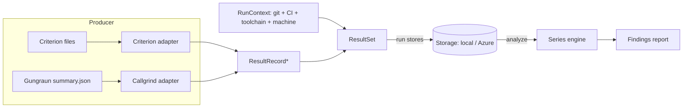

# cargo-bench-history — Design & Implementation Plan

Status: implemented. All of the numbered iterations are shipped — `run`,
`analyze` (engine-aware change-point + drift detection), `install`, the Azure Blob
backend, the Criterion adapter, the commit-centric storage model (v2), git-aware
`analyze`, and `backfill`. The resolved design decisions are logged in
[§13 Decisions & open items](#13-decisions--open-items); the iteration mapping is
in [§12 Implementation plan](#12-implementation-plan).

## 1. Purpose

A Cargo subcommand that maintains a **long-lived history** of benchmark results
and analyzes that history for trends that are invisible to snapshot/“previous
run” tools:

* slow incremental drift (“scenario X got 30 % slower over 12 months, 1 % at a
  time”);
* step changes attributable to a specific commit, visible only in hindsight once
  the noise averages out;
* regressions distinguished from measurement jitter by engine-aware statistics
  (a change-point or drift that clears the noise floor) rather than a single noisy
  neighbour.

It stores every result over time (local path or Azure blob), runs in multiple
environments (dev PC, GitHub Actions, ADO), and partitions data only when the
results are not otherwise comparable.

Commands: `run`, `install`, `analyze`, `backfill`, `list`, `prune`, `bless`,
`unbless`.

## 2. How the benchmark systems work (and what they emit)

Understanding the producers is mandatory: comparability and parsing both depend
on it. Scope is what this workspace uses — **Criterion** (wall-clock),
**Callgrind via Gungraun** (simulated instruction counts), and the two
workspace-local measurement crates **`alloc_tracker`** (heap allocations) and
**`all_the_time`** (processor time).

### 2.1 Criterion (wall-clock, hardware-dependent)

`cargo bench` with Criterion 0.8.2 writes, per measured case, under
`target/criterion/`:

* `…/<group>/<function>/<value>/new/benchmark.json` →
  `BenchmarkId { group_id, function_id?, value_str?, throughput? }` — the stable
  identity of the case.
* `…/new/estimates.json` → `Estimates { mean, median, median_abs_dev, slope?,
  std_dev }`, each `Estimate { confidence_interval { confidence_level,
  lower_bound, upper_bound }, point_estimate, standard_error }`. **Units are
  nanoseconds per iteration.**
* `…/new/sample.json` → `SavedSample { sampling_mode, iters[], times[] }` (raw).
* `…/new/tukey.json` (outlier fences).

Key facts:

* Results are **hardware-dependent and noisy** → must be partitioned by machine
  and compared with noise-aware statistics.
* Criterion records **no timestamp, no commit, no machine info, and no package**.
  Our tool supplies all run context, and the stored `BenchmarkId.package` is left
  `None` (the workspace's crate-prefixed group ids keep series distinct; see §3).
* The on-disk JSON is criterion-internal (not a stability-guaranteed API), but
  has been stable for many releases. `cargo-criterion` (a separate tool) emits a
  documented `--message-format json` stream; the workspace does not use it
  today. The adapter parses the on-disk files in isolation behind
  `bench/criterion.rs`, so a later swap to `cargo-criterion` would not touch the
  rest of the tool.

### 2.2 Callgrind via Gungraun (simulated, hardware-independent)

Gungraun 0.19.0 runs each scenario once under Valgrind/Callgrind and can emit a
**machine-readable summary** — this is the “special need” the `run` command
exists to satisfy:

* `--save-summary[=json|pretty-json]` (env `GUNGRAUN_SAVE_SUMMARY`) writes
  `summary.json` next to each scenario’s output under `target/gungraun/…`.
* `--output-format=json` streams one `BenchmarkSummary` per scenario to stdout
  (everything else goes to stderr; `… -- --output-format=json | jq -s`).
* Schema is **versioned** (`BenchmarkSummary.version`, currently `"6"`).
  `BenchmarkSummary { version, module_path ("file::group::bench"),
  function_name, id?, kind, profiles, benchmark_file, package_dir, project_root }`.
  `profiles[].data` carries the Callgrind metrics per `EventKind`: instructions
  (`Ir`), L1/LL/RAM hits, estimated cycles, branches (`Bc/Bcm/Bi/Bim`).

Key facts:

* Results are **deterministic and hardware-independent** (a CPU simulator), so
  they do **not** need a machine-key partition.
* They **are** toolchain/libc/arch sensitive (absolute counts shift with rustc
  inlining, glibc, target arch). So `target_triple` must still partition, and
  rustc/libc versions are recorded as metadata so a bump shows up as a step in
  the timeline rather than silently forking history.
* The default `cargo bench` output is human-readable text only → we must opt in
  to the JSON summary. Tiny but real: that is what `run` does (sets the env var /
  arg). We therefore **implement `run`, but it stays thin.**

### 2.3 `alloc_tracker` (heap allocations, hardware-independent)

The workspace-local `alloc_tracker` crate measures how much a benchmark allocates.
Its `Session` auto-emits, on drop, one flat JSON file per operation under
`target/alloc_tracker/<operation>.json`:

* `{ operation, total_iterations, total_bytes_allocated, total_allocations_count,
  mean_bytes_per_iteration, mean_allocations_per_iteration }` (all `u64`).
* The adapter (`bench/alloc_tracker.rs`) reads `operation` and the two `mean_*`
  fields, mapping them to an `AllocationBytes` (`allocated_bytes`) and an
  `AllocationCount` (`allocations`) metric. The `total_*` fields are ignored — the
  per-iteration means are comparable across runs with differing iteration counts.

Key facts:

* Allocation behaviour is a **deterministic property of the code**, independent of
  the hardware → partitions under `synthetic`, never reads a machine key, and (like
  Callgrind) trusts any sustained step below the noise floor a noisy engine demands.
* The output carries no dispersion (no CI, no standard deviation): an allocation
  count is exact.
* Like Criterion, the on-disk files carry no package, so `BenchmarkId.package` is
  `None` and the operation name alone identifies the series.

### 2.4 `all_the_time` (processor time, hardware-dependent)

The workspace-local `all_the_time` crate measures processor (CPU) time. Its
`Session` auto-emits, on drop, one flat JSON file per operation under
`target/all_the_time/<operation>.json`:

* `{ operation, total_iterations, total_processor_time_nanos,
  mean_processor_time_nanos, span_count, slope_processor_time_nanos,
  std_dev_processor_time_nanos, interval_low_processor_time_nanos,
  interval_high_processor_time_nanos, min_processor_time_nanos,
  max_processor_time_nanos }`. The `total_*`/`mean_*` counts are `u64`; the
  dispersion fields (slope, standard deviation, the bootstrap confidence
  interval bounds, and min/max) are `f64`.
* The adapter (`bench/all_the_time.rs`) reads `operation`, prefers the
  through-origin `slope_processor_time_nanos` as the per-iteration point estimate
  (falling back to `mean_processor_time_nanos`), and records the confidence
  interval and standard deviation on the metric — mapping it to a single
  `ProcessorTime` (`processor_time`, unit `ns`) metric.

Key facts:

* Processor time is **hardware-dependent and noisy** (like Criterion wall time) →
  partitions by machine key and is analysed with the noise-aware statistics.
* `all_the_time` reports a bootstrap confidence interval over its measured spans
  (mirroring Criterion), so the noise detector applies the CI-non-overlap gate to
  processor time the same way it does for wall time. Older output that records
  only a mean (no interval) still parses, in which case the detector falls back to
  the Mann-Kendall trend and the practical floor.
* `BenchmarkId.package` is `None`; the operation name identifies the series.

### 2.5 Consequence for the data model

The systems differ in units, noise, and hardware-dependence. All, however,
reduce to the same shape: *a stable benchmark identity → a set of named numeric
metrics*. That shared shape is the foundation of the model in §3.

## 3. Core concepts & data model



* **BenchmarkId** — stable identity of a series, scoped by the workspace
  `package` where it is recoverable, so that equally named bench targets in
  different packages (for example `foo/benches/a.rs` and `bar/benches/a.rs`)
  never collide into one series. Callgrind: `package` (Gungraun `package_dir`
  basename) + `module_path` + `function_name` (+ `id`). Criterion: `package` is
  **`None`** — Criterion's on-disk files carry no package and `target/criterion/`
  is flat, so the package is unrecoverable; the series identity is `group_id` /
  `function_id` / `value_str`. This is safe here because the workspace
  crate-prefixes its Criterion group ids (`<crate>_<group>`), so collisions
  between equally named cases in different packages do not occur. Components are
  kept separate so reports can render the full `qualified()` form or a compact
  `short()` tail. Renaming a benchmark starts a new series (documented caveat;
  see §13).
* **Metric** — `{ name, unit, value: f64, kind }` where `kind ∈ {WallTime,
  InstructionCount, CacheEvents, EstimatedCycles, Branches, AllocationBytes,
  AllocationCount, ProcessorTime, …}`. Noisy engines (Criterion, `all_the_time`)
  also carry the confidence interval and std-dev where available so analysis can be
  noise-aware.
* **ResultRecord** — one `BenchmarkId` + its metrics from a single run.
* **Timestamps** — every run carries two distinct times (§6): the **commit
  timestamp** (the benchmarked commit's committer date — for a dirty snapshot, the
  commit it is based on) and the **observation timestamp** (wall clock when the
  benches ran and were stored). The series is ordered by git topology (§8.3) using
  the commit timestamp only as a within-commit tiebreak; the observation timestamp is
  provenance only and never orders anything. There is no "effective timestamp"
  concept and no `--timestamp` override.
* **RunContext** — metadata attached to every stored run (see §6).
* **ResultSet** — `{ schema_version, context, results: [ResultRecord] }`; the
  unit of storage (one immutable file per run).
* **ComparabilityKey** — the partition under which a series accumulates. Two
  records are comparable iff their keys match (§4).
* **MachineKey** — a stable hardware fingerprint for hardware-dependent systems
  (§5).

## 4. Comparability & storage partitioning

The central insight: **partition only by what makes results fundamentally
incomparable; record everything else as metadata so the analysis can see its
effect over time.**

ComparabilityKey =
`{ project, system, target_triple, machine_key? }`

* `project` — workspace identity (config `project.id`, default = repo/workspace
  dir name).
* `system` — `criterion` | `callgrind` | `alloc_tracker` | `all_the_time`
  (different units & semantics).
* `target_triple` — `x86_64-unknown-linux-gnu` etc. Even hardware-independent
  counts (Callgrind, `alloc_tracker`) are not comparable across architectures.
* `machine_key` — **only for hardware-dependent systems** (Criterion,
  `all_the_time`). Omitted (literal `synthetic`) for Callgrind and `alloc_tracker`.

Deliberately **metadata, not partition** (so a change is *visible* as a timeline
step, which is the whole point of the tool): rustc/cargo version, OS/libc,
commit, branch, CI provider. **Decided:** toolchain is recorded as metadata and
the timeline stays continuous; `analyze` annotates/segments by toolchain so a
bump shows up as a step rather than forking history.

### 4.1 Target triple & cross-OS (WSL) execution

`target_triple` describes **where the benchmark binary actually ran**. It is
**always auto-detected** in the environment that executes the benchmark — there
is no manual override. A benchmark run under WSL is a Linux benchmark: the tool
process runs inside WSL, the measured binary is `x86_64-unknown-linux-gnu`, and
the detected triple is the Linux one. The recorded triple therefore reflects the
real execution environment with no special-casing.

Auto-detection (no override):

1. **Engine-declared constraint.** The Callgrind engine only runs under
   Linux/Valgrind, so its adapter pins the OS component to `linux`
   unconditionally. This is a property of the engine, not a workaround: Callgrind
   results are the same regardless of which host drove the simulation.
2. **Host detection** for natively-run engines (Criterion, `all_the_time`,
   `alloc_tracker`): the host triple reported by `rustc -vV`, which is the triple
   of the environment the tool (and therefore the benchmark) runs in.

The tool's own host triple is additionally recorded as **metadata**
(`host_triple`) for auditing.

**Golden rule:** run `cargo bench-history` in the same OS context as the benches
(e.g. invoke the whole tool inside WSL, not from the Windows side). Because the
triple is auto-detected where the tool runs, this is the only thing that keeps
each platform's data in its own series.

### 4.2 On-disk / blob layout

The layout is an immutable, append-only-by-new-file, **commit-centric** model
(works identically on local FS and blob storage, no read-modify-write races in
concurrent CI). The path is `<discriminant set>/<commit_sha>/<run file>`:

```
<root>/v2/<project>/<engine>/<target_triple>/<machine_key|synthetic>/<commit_sha>/
    clean.json                       # ≤1 per commit — the canonical point
    dirty-<observation_unix>.json    # 0..N snapshots taken on top of this base commit
```

The segment **above** `<commit_sha>` is the **discriminant set** — the dimensions
that make two runs comparable (§4.3). The commit is a directory; **clean vs dirty
is filename semantics** within it. This layout is dictated by how `analyze` selects
data (§8.3): storage is **not** a pre-assembled timeline. A series is **pieced
together at query time** by resolving git history into an ordered set of commits and
then reading each commit's directory — so the storage key is indexed by *commit*,
and ordering comes from *git topology*, never from a timestamp baked into the key.

**Logical point identity (collisions).** Because the commit is a path segment, a
**clean** run is identified by `<discriminant set> + <commit>` and maps to the single
deterministic key `…/<commit>/clean.json`. Collision detection rides on the
**write-once** `put` contract: the store refuses to overwrite an existing object, so a
second clean `run`/`backfill` of the same commit fails atomically (non-zero exit,
nothing written) with no separate exists-check round-trip or TOCTOU window;
`--overwrite` switches to a replacing write (e.g. to clobber data from broken infra). A
**dirty** run is keyed by its observation time,
`…/<commit>/dirty-<observation_unix>.json`, so successive snapshots on the same base
commit coexist (the observation time is wall-clock now, §6, spreading them in the
order taken); a same-timestamp collision is treated like any other write-once
conflict (refused unless `--overwrite`).

Branch is **not** a path component: a commit SHA is globally unique, so the same
commit on two branches is one point. Branch selection happens at query time via git
topology (§8.3); branch is recorded only as run metadata (§6).

Each path segment (`<project>`, `<target_triple>`, `<machine_key>`, `<commit_sha>`)
is **sanitized** before the key is built: any character outside `[A-Za-z0-9._-]`
becomes `_`, and an otherwise-empty or all-dots segment becomes `_`. This keeps a
stray `/` (e.g. a `project.id` of `team/app`) from silently splitting the key into
the wrong number of segments — which `analyze` would then drop as unattributable —
by mangling the value rather than rejecting the run.

### 4.3 Discriminant set & query facets

The discriminant set `<project>/<engine>/<target_triple>/<machine_key|synthetic>`
is the comparability boundary; a series is only ever built **within** one set. The
**full target triple** is kept as one segment on purpose — `…-windows-msvc` and
`…-windows-gnu` are genuinely different binaries and must not merge.

Three facets select which sets a query — `analyze`, `list`, `prune`, and the
blessing commands `bless` / `unbless` (which annotate *existing* stored sets) —
operate on: `--engine`, `--target-triple`, and `--machine-key`. (Earlier drafts
also exposed derived `--os` / `--architecture` facets; they were removed because
duplicating the target-triple dimension confused users. Filter on the triple
directly.)

* `list discriminants` lists the distinct sets present (a cheap key `list` under
  `v2/<project>/`, parsed and de-duplicated; an index file can be added later if
  a store grows large), with their parsed engine / target triple / machine key.
* Each facet is **repeatable** and accepts the literal `all`:
  * Omitting a facet **auto-detects the current machine**: `--target-triple`
    defaults to the host triple and `--machine-key` to the host fingerprint, so a
    bare `analyze` reports *this* machine's data. `--engine` has no machine-derived
    value, so its auto-detected default is *all engines*. (Exception: the
    `list discriminants` discovery catalog defaults to *every* stored partition, not
    the current machine — see §8.5.)
  * Repeating a facet unions its values (`--engine criterion --engine callgrind`).
  * `all` (e.g. `--machine-key all`) removes the filter for that dimension —
    the explicit way to widen past the current machine. It is rejected in
    create mode (see below).
* A facet that matches several sets (e.g. a Windows and a Linux nightly pool)
  yields **one report per set** — parallel data sets, analyzed individually.

**Hardware-independent sets and the machine-key facet.** Callgrind and
`alloc_tracker` partitions carry the literal `machine = synthetic` because their
results do not depend on the machine. A `synthetic` set therefore **always passes**
the `--machine-key` facet, regardless of its value: auto-detecting the host
fingerprint still includes every synthetic set alongside this machine's
hardware-dependent (`criterion`, `all_the_time`) sets, and excludes only *other*
machines' hardware-dependent data.

**Create vs. query.** `run` and `backfill` *record new benchmark data* into exactly
one machine's reality, so they auto-detect every facet and accept only
`--machine-key` as an override (for a stable CI-pool key). They do **not** accept
`--engine` selection (engines come from config / what ran), a `--target-triple`
override (always auto-detected, §4.1), or the `all` keyword. Every other command —
`analyze`, `list`, `prune`, `bless`, `unbless` — *queries existing stored data*
(the blessing commands write a sidecar **onto** an existing `clean.json`, so they
select among the sets already present at the commit), and uses the full query facet
model above: repeatable, `all`-aware, auto-detecting the current machine when
omitted.

## 5. Machine key (hardware fingerprint)

Goal: equal for pool-equivalent machines, different for genuinely different
hardware. **Never** keyed on hostname/serial (cloud pool nodes differ in name
but are equivalent).

Factors (hashed): the `many_cpus` maximum processor count and maximum
memory-region (NUMA node) count, plus a best-effort CPU brand string. These are
the stable, pool-equivalent attributes available without elevated privileges
across Windows/Linux/macOS; finer signals (RAM size, base frequency) were left
out of v1 because they add platform-specific probing for little discriminating
value in homogeneous CI pools. User override: `--machine-key` (CLI only — the
config file is committed and would be wrong for some checkouts), which wins over
the computed fingerprint.

* Reuse **`many_cpus`** (already in-workspace) for the processor and
  memory-region counts; a small per-platform `detect_cpu_brand` supplies the CPU
  brand (Windows/Linux/macOS impls, best-effort — `None` when unavailable).
* **Stability requirement (correctness):** the key is persisted and compared
  across machines and tool versions, so it uses a **fixed** hash — SHA-256 of a
  version-tagged canonical string (`mk1\nprocessors=…\nmemory_regions=…\n
  cpu_brand=…`), truncated to the first 16 hex characters — **not**
  `foldhash`/`DefaultHasher` (seeded / not stable). A golden unit test pins a
  fixed profile to its hex digest so an accidental change to the canonical form
  is caught.
* Computed only for **hardware-dependent** systems (Criterion, `all_the_time`).
  Callgrind and `alloc_tracker` partition under `synthetic` and never read the
  machine key.

## 6. Run context (environment detection)

Captured once per stored run and attached to the `ResultSet`:

* **Commit timestamp** — the benchmarked commit's committer date (for a **dirty**
  run, the committer date of the commit it is based on). This is the run's position
  on the timeline. It is **not** the primary series order — git topology is (§8.3) —
  but it is the within-commit tiebreak and the `--since`/`--until` window filter. The
  commit timestamp is never overridable from the CLI; the timeline is the git graph.
* **Observation timestamp** — wall clock when the benches ran and were stored,
  read from an injected `tick::Clock` (§10) so tests drive it deterministically.
  Provenance only; **never** used to order a series. It names the dirty filename
  (`dirty-<observation_unix>`) so concurrent dirty snapshots of one commit coexist.
* **Git:** commit SHA + short SHA, branch, committer date, dirty flag (`git`).
  Branch is metadata only — query-time topology, not this field, decides series
  membership (§8.3). Parent lineage is **not** recorded: `analyze` resolves topology
  from a live repo (§8.3), so storage never needs to reconstruct the commit graph.
* **CI:** provider + run id + PR number, detected from env:
  * GitHub Actions: `GITHUB_ACTIONS`, `GITHUB_SHA`, `GITHUB_REF_NAME`,
    `GITHUB_RUN_ID`, `GITHUB_RUN_ATTEMPT`.
  * ADO: `TF_BUILD`, `BUILD_SOURCEVERSION`, `BUILD_SOURCEBRANCH`,
    `BUILD_BUILDID`, `SYSTEM_PULLREQUEST_PULLREQUESTID`.
  * else `Local`.
* **Toolchain/host:** rustc + cargo version, OS + libc hint, the resolved
  execution `target_triple` (§4.1) **and** the tool's own `host_triple` (these
  differ under WSL).
* **Provenance:** cargo-bench-history version + schema version + machine_key.

`jiff` parses `--since`/`--until` and formats stored times as RFC 3339 (UTC). Git
and env access go through a small PAL so the logic is unit-testable without a real
repo or CI.

## 7. Storage abstraction

```rust
trait Storage {
    async fn put(&self, key: &str, bytes: &[u8]) -> Result<(), StorageError>;
    async fn put_overwrite(&self, key: &str, bytes: &[u8]) -> Result<(), StorageError>;
    async fn get(&self, key: &str) -> Result<Vec<u8>, StorageError>;
    async fn list(&self, prefix: &str) -> Result<Vec<String>, StorageError>;
    async fn delete(&self, key: &str) -> Result<(), StorageError>;
}
```

`put` is write-once (a re-`put` of an existing key is `StorageError::AlreadyExists`,
the basis of `run`'s clean-collision refusal — §8.1); `put_overwrite` replaces in
place (the `--overwrite` escape hatch). `delete` removes one object and returns
`StorageError::NotFound` when it is absent — used by `prune` (§8.6) to delete the
selected runs.

Storage I/O is **async** (§10): `LocalStorage` over `tokio::fs`, `AzureBlobStorage`
over async HTTP. `async fn` in a trait is not `dyn`-compatible, so backend
selection is a `StorageFacade` **enum** (`Local` | `Azure`) with static dispatch —
no `async_trait` dependency, and `run`/`analyze` stay backend-agnostic by holding a
`StorageFacade`.

* **LocalStorage** (iteration 1): root from config; create dirs; write/read/walk
  via `tokio::fs` (iterative directory walk — no boxed async recursion).
* **AzureBlobStorage** (iteration 4): `azure_storage_blob` (+ `azure_identity`),
  behind an **optional `azure` Cargo feature** so default builds and Miri stay
  light and dependency-free; the feature compiles on Windows, Linux **and
  macOS**. Auth is resolved once in `from_config`, in priority order:
  1. **self-signed account SAS** (`account_key`) — the signing math lives in
     `storage::sas` (HMAC-SHA256 via the pure-Rust RustCrypto `hmac`/`sha2`
     crates) and is the path used for **Azurite** in CI and for SAS-based
     production access. The token is baked into the endpoint URL's query, so the
     client passes **no credential** and Azurite's plain-HTTP endpoint is
     accepted.
  2. **verbatim `sas_token`** — a pre-signed SAS supplied in config, used as-is.
  3. **Microsoft Entra ID** (`DeveloperToolsCredential`) — the secret-free
     production default (CI managed identity / workload-identity federation,
     local `az login`, env service principals); requires an **HTTPS** endpoint.

  The shipped azure-sdk-for-rust v1.0.0 removed connection-string parsing,
  `StorageSharedKeyCredential`, and `DefaultAzureCredential`, which is why the
  account-SAS path is self-signed rather than delegated to the SDK. Tested in
  regular CI against the **Azurite emulator** (not real cloud, not `#[ignore]`);
  the network tests **self-skip** when no emulator is reachable and are
  `#[cfg_attr(miri, ignore)]`. Account-key construction reads the wall clock for
  the SAS expiry, so those pure tests are Miri-ignored too — the signing math is
  still covered under Miri by `storage::sas`'s fixed-expiry golden vector.
* An in-memory `Storage` fake (in `#[cfg(test)]`) backs the Miri-safe
  orchestration tests; it mirrors the same key/prefix semantics as `LocalStorage`.

The blob/key model (flat keys, list-by-prefix, immutable objects) is the lowest
common denominator of a filesystem and a blob container, so both backends
implement the same trait with no special-casing upstream.

## 8. Commands

The commands (`run`, `install`, `analyze`, `backfill`, `list`, `prune`, `bless`,
`unbless`) follow the established pattern: `main.rs` strips the injected
`bench-history` arg, **`clap`** parses (with subcommands), and dispatches to
`lib::run`, which returns a typed `Outcome`/`Error`.

**Argument groups.** Because the surface is wide, every option is filed under a
named `clap` help heading so `--help` reads as a small set of labelled groups
rather than one flat list:

* **Environment and execution** — `--config`, `--repo`, `--verbose`, `--dry-run`
  (on `prune`), and `--help`.
* **Output** — `--format` (text / json / markdown), on the reporting commands.
* **Benchmark scope** — `--workspace`, `--package`/`-p`, `--bench`, on the
  executing commands.
* **Discriminant selection** — `--engine`, `--target-triple`, `--machine-key`
  (§4.3): repeatable + `all` in query mode; only `--machine-key` in create mode.
* **Commit selection** — `--base`, `--context` (the ref the command runs in
  context of; defaults to `HEAD`), `--since`, `--until`. `--since` defaults to
  six months back uniformly; `--until` has no upper bound by default. These filter
  by each commit's committer date, not by when a run executed.
* **Data filtering** — `--no-dirty`.
* **Subjects** — bare positional words, never flags: `list <runs|discriminants|
  blessings>`, `bless <prefix…>`, `prune <commit…>`, `backfill <from> <to>`.

A bare `list` with no subject is an error that names the available subjects.

### 8.1 `cargo bench-history run`

**Engines are detected from output, not configured.** `run` invokes the
workspace's benches once with `cargo bench` and harvests whichever engines
produced output. There is no `[engines]` configuration: the tool enables the
combined environment every supported engine needs and then inspects each output
tree to see which engines actually ran. This works because all supported engines
can be driven from a single `cargo bench` invocation, and off-Linux the
Callgrind (`_cg`) benches compile to `#[cfg(target_os = "linux")]` no-ops, so they
simply produce no output — no OS logic is needed in the tool.

`run`:

1. **Injects the combined bench environment via environment variables** (not
   appended args). Env is robust regardless of how the benches launch. Callgrind
   needs `GUNGRAUN_SAVE_SUMMARY=pretty-json`; Criterion, `alloc_tracker` and
   `all_the_time` need nothing (they auto-emit JSON on drop). The union of
   every supported engine's env (`injected_bench_env`, iterating `EngineSystem::ALL`)
   is set unconditionally — an engine that did not run merely ignores its variable.
   * **Target directory pinning:** the tool also injects `CARGO_TARGET_DIR` set
     to the *absolute* target root it will harvest, so the benches' output always
     lands where the harvest scans. An absolute root is essential because cargo
     runs each benchmark binary with its working directory set to the owning
     package's directory: a relative `target/` would be resolved there by an
     engine such as Criterion (which honors `CARGO_TARGET_DIR` as a path),
     scattering output under each package instead of the workspace root. Pinning
     an absolute root also overrides an ambient `CARGO_TARGET_DIR` (such as the
     one `cargo llvm-cov` sets) that would otherwise redirect output elsewhere.
2. Records the **run-start time**, then runs `cargo bench` (with the scope flags
   below). A non-zero exit aborts the run.
3. **Harvests every supported engine's output location**
   (`target/gungraun/**/summary.json` for Callgrind,
   `target/criterion/**/new/estimates.json` for Criterion,
   `target/alloc_tracker/*.json` and `target/all_the_time/*.json` for the two
   workspace measurement crates), filtered to files with
   `mtime ≥ run-start` so stale cases from earlier runs are not re-ingested. Each
   tree is attributed to its engine; an engine whose tree produced no cases is
   silently skipped.
4. Builds a `ResultSet` per engine (with the resolved RunContext) and **stores it
   immediately** — `run` always persists; there is no separate publish step
   (`--no-store` produces results without writing, for dry runs). A **clean** point
   writes the deterministic key `…/<commit>/clean.json`; an existing one is refused
   by default (non-zero exit, via the write-once `put` contract, §4.2) unless
   `--overwrite`, which makes re-runs idempotent and safe to repeat. A **dirty**
   snapshot writes
   `…/<commit>/dirty-<observation_unix>.json` and coexists with prior snapshots (only a
   same-timestamp clash is a conflict). An engine that harvests **zero** cases stores
   nothing (an empty set carries no comparable data and would only inflate `analyze`'s
   run count); the summary reports the empty harvest, and other engines in the same
   run are unaffected.

To collect Callgrind data, run the tool on Linux (or in WSL), where Valgrind is
available; on other hosts only Criterion is harvested. This is automatic — the
Callgrind benches are absent from the build there, so the tool never attempts
Valgrind off-Linux.

**Scope & filtering.** Scope flags translate directly to `cargo bench` arguments:
`--workspace` (the default) benches the whole workspace; `--package`/`-p NAME`
(repeatable) restricts to specific packages (and omits `--workspace`); `--bench
NAME` (repeatable) restricts to named bench targets. Everything after a `--`
separator is forwarded **verbatim** to `cargo bench` after the scope flags.
Because harvest is scoped by `mtime ≥ run-start`, whatever subset actually ran is
exactly what gets ingested. Note that two non-overlapping partial runs at the same
commit (different `--package`/`--bench` subsets) do **not** merge: each stores its
own `clean.json` and the second collides with the first (§4.2) — gaps in coverage
are expected to come from *different commits* covering different subsets, not from
multiple partial runs at one commit. Other flags: `--machine-key <key>` (override
the hardware fingerprint, §4.1), `--no-store`, `--overwrite` (replace an existing
same-commit point instead of refusing, §4.2), `--verbose` (print a step-by-step
diagnostic trail to stderr — the benchmark command and injected env, directories
scanned, files included/skipped-as-stale, and each stored key — to diagnose a run
that unexpectedly stored nothing). The commit timestamp is always the benchmarked
commit's committer date (§6) — there is no `--timestamp` override. The target triple
is always auto-detected (§4.1) — there is no `--target-triple` override. `--engine`
is **not** a `run` flag — it is an `analyze` facet over stored data (§8.3).

### 8.2 `cargo bench-history install`
Generate an example `.cargo/bench_history.toml` if absent; print its path and
next steps. Never overwrite an existing file (report and exit success). Honors
`--config <path>` to write somewhere other than the default location. Writing is
abstracted behind a `ConfigWriter` port (`TokioConfigWriter` in production, an
in-memory fake in tests) whose `write_new` creates parent directories and uses
`create_new` so an existing file is reported, never clobbered. The generated
template configures only the `[storage]` backend (engines are detected from
output, not configured — §8.1); it carries no machine-key setting (the key is a
run-time-only `--machine-key` flag, since a committed config would be wrong for
some checkouts) and the next-steps hint points at `backfill` for seeding an
existing repository's history.

### 8.3 `cargo bench-history analyze`

**Analyze pieces a series together at query time from git topology** — storage is
indexed by commit (§4.2), not pre-ordered. `analyze` therefore **requires a
resolvable git repository** (the current checkout by default, or `--repo <path>`);
with no repo it errors out rather than guessing an order. (Analyzing a foreign
project's stored data means checking out that project's repo and pointing `analyze`
at it.)

**Selecting the discriminant sets.** `list discriminants` prints the sets
present (§4.3), unfiltered by default. When *analyzing*, `--engine`,
`--target-triple`, `--machine-key` filter the sets — each repeatable, each accepting
`all`, each defaulting to the current machine (engine to *all engines*) when omitted
(§4.3); every matched set is analyzed independently and produces its own report (so a
Windows and a Linux nightly pool come out as two reports).

**Selecting the commits (the query model).** Two refs frame the analysis:
* `--context <ref>` — the **target** whose history is analyzed (default: current
  `HEAD`). When it is not `HEAD`, the working-tree state is ignored.
* `--base <ref>` — the **integration branch** (default: the detected default branch
  — `origin/HEAD`, else `main`/`master`; `project.default_branch` config override).

`analyze` resolves the **first-parent** ancestry of the target and splits it at the
merge-base with the base:
* commits **in the base ancestry** (≤ merge-base) contribute **clean points only**;
* commits **unique to the target** (the private branch commits, > merge-base)
  contribute **clean *and* dirty** points (`--no-dirty` drops the dirty ones).

This single rule covers both use cases: an "official" view is just
`--context <default>` (target == base ⇒ everything is base ⇒ clean-only); the
"how does my feature fit in" view is the default (clean default-branch baseline,
then the branch's own clean + dirty snapshots). Series are **ordered by git
topology**; multiple runs on one commit sub-order by commit time (§6). Branch
*metadata* on a run is never consulted — membership is purely topological, so a
dirty snapshot taken on a shared base commit (scratch work before committing) is
excluded from an official view until it is committed.

**Dirty-working-tree exception on the base tip.** There is one carve-out to the
clean-only base rule, for the common "first impressions" scenario where a user
runs `analyze` while sitting on the base branch with uncommitted changes (e.g. an
untracked `.cargo/bench_history.toml`, so every stored run landed as a
`dirty-*.json` on the base tip). When the **working tree is currently dirty** (the
`GitHistory::is_dirty` probe — `git status --porcelain` non-empty, untracked files
included, matching how a run decides clean-vs-dirty) **and** the target **tip**
commit is base-side, that tip's dirty snapshots are admitted (they are the user's
in-flight work, not stale leftovers). The exception is limited to the tip — earlier
base-side commits stay clean-only — and is gated by `allow_dirty`, so `--no-dirty`
overrides it. Whenever such a run is actually included, the report ends with a
**warning** that the data is ephemeral ("…included dirty runs … on top of the base
branch … Switch to a new branch to persist benchmark history of your changes.").
On a feature view the tip is already target-side, so the exception is a no-op there.

For each selected commit `analyze` reads its directory (`clean.json` and, when
admitted, `dirty-*.json`), builds per-`(BenchmarkId, metric)` series in topological
order, runs the finding algorithms (§9), and prints a report.

* `--since <when>` drops commits whose committer date predates the cutoff, and
  `--until <when>` drops commits after an upper cutoff, so the run count and every
  series share the window. Both accept an RFC 3339 timestamp
  (`2024-01-01T00:00:00Z`), a bare `YYYY-MM-DD` date (UTC midnight), or a relative
  duration such as `6 months` or `30 days ago` (resolved against the wall clock).
  `--since` defaults to a **six-month** look-back uniformly across modes (so a
  scheduled trend watch does not silently widen as history accumulates, and an
  unbounded scan of ancient data is never the default); widen it with an explicit
  older `--since`. `--until` has no upper bound by default.
* `--mode auto|history|branch|tip` selects the analysis mode (§9.6); `auto` (the
  default) infers it from git topology and the recorded data set (never the on-disk
  working-tree state). `--include-improvements` opts a history-mode analysis into
  reporting sustained improvements (suppressed by default).
* `--include-inactive` opts a history-mode analysis into reporting **resolved**
  changes — a spike that has since recovered to its prior level (§9.7). These are
  suppressed by default (the current state already matches the baseline, so there is
  nothing to act on) but are useful for auditing history that self-corrected. The
  underlying points are always part of the data set and the chart regardless of this
  flag; it only controls whether the recovered finding is surfaced.
* `<prefix…>` positional subjects scope the analysis to benchmarks whose id starts
  with any given prefix (e.g. `analyze my_pkg/`), matched the same way `bless` matches
  (§8.7). Omitting them analyzes every benchmark. There is no `--metric` filter:
  metrics are an internal detail users are not expected to know; scope by benchmark
  prefix instead.
* `--format text|json|markdown`.
* **Findings never affect the exit code.** The process exits non-zero only when the
  analysis fails to *run* (no repo, storage error, …); a finding is advisory. The
  machine-readable signal lives in the `json` report (§9.6): `mode`, the boolean
  `notable` (any finding survived), each finding's `direction` and `flipped_at`, and
  the full per-finding `series`. Downstream automation (a scheduled regression watch
  posting to a chat, a PR comment bot) reads those rather than the exit status.
* `--verbose` prints a per-object diagnostic trail to stderr (the listing prefix,
  facet filters, resolved target/base/merge-base, and why each candidate is
  included or excluded). When facet-matching runs were stored but none entered the
  analysis (commonly because every run is a dirty snapshot on a base-side commit),
  the report itself carries a *hint* explaining the empty result even without
  `--verbose`, so a `0 runs` outcome is never mistaken for "no data". `--verbose`
  is accepted by every command.

### 8.4 `cargo bench-history backfill`

Reconstructs history by checking out each commit in a range and running
`cargo bench-history run` for it. Bootstraps an existing repo's timeline and is
also the convenient path for ad-hoc evaluation over a span of commits.

```
cargo bench-history backfill <from> <to> \
    [--workspace] [--package NAME] [--bench NAME] \
    [--overwrite] [--ignore-errors] [--verbose] [-- <passthrough>]
```

**Range & ancestry.** Commits are enumerated **oldest-first** along the
**first-parent** mainline of the current branch — `git rev-list --reverse
--first-parent <from>^..<to>` — so the timeline follows the linear branch
progression and does not fan out into commits merged in from side branches.
The `<from>` and `<to>` subjects (bare positional commits) are both inclusive. Before doing anything the tool verifies both endpoints resolve and that `<from>`
is a first-parent ancestor of `<to>`; the range is then derived purely from
`<to>`'s first-parent history, so backfilling does **not** depend on the current
checkout or branch (you can backfill any range whose endpoints form a first-parent
line, regardless of where `HEAD` sits).

**Per commit**, in order, the tool first consults storage to decide whether the
commit needs benchmarking at all, then (if it does) checks out the commit, runs the
benches with `cargo bench` exactly as §8.1 (no `--timestamp` override exists — each
point's commit timestamp is its own committer date, §6), harvests every engine that
produced output, and stores the result. Backfilled runs are always on a **clean**
tree, so each is keyed by commit (§4.2) and collision-checked:

* By **default** the commits that already have a stored result are listed once up
  front (a single `list` of the `v2/<project>/` prefix); a commit already present
  is **skipped before its benches run** (reported, not an error), so no benchmark
  execution is wasted on commits already covered. This makes backfill **resumable**
  and cheap to re-issue — an interrupted run simply continues where it stopped. The
  check is per-commit, not per-engine: a commit with results for only some engines
  is still skipped (use `--overwrite` to fill it).
* `--overwrite` regenerates and replaces existing points across the range (for
  re-running after a broken-infra batch produced bad data, or to re-benchmark every
  commit after adding a new bench).

**Failure handling.** A *bench/build* failure for a commit (non-zero engine exit,
or a commit that does not build) **stops** backfill by default; `--ignore-errors`
records it in a skip list and continues to the next commit, printing a summary at
the end (done / skipped-empty / failed counts + the failed SHAs). *Infrastructure*
failures (storage unreachable, git errors) always abort regardless of
`--ignore-errors`, since continuing cannot produce correct data.

**Working-tree safety.** Backfill operates inside a dedicated **git worktree** (`git
worktree add`) under the system temp dir rather than mutating the primary checkout,
which isolates it from the user's working directory, removes the HEAD save/restore
hazard, and leaves the
user exactly where they were even if the run is interrupted. The primary checkout's
state is therefore irrelevant — a dirty working tree neither blocks backfill nor
affects what is measured (each point benches a specific commit SHA, never the
working-tree state). Between commits the
worktree is reset clean (`git reset --hard` + `git clean -fd`, preserving the
ignored `target/` for incremental-build speed — the §8.1 `mtime ≥ run-start`
harvest already excludes stale artifacts). The benches that run are whatever exist
in each checked-out commit; benches absent at an old commit simply harvest
nothing.

`--config`, `--workspace`/`--package`/`--bench`, `--target-triple`,
`--machine-key` and `-- <passthrough>` behave as for `run`. To collect Callgrind
data, run backfill on Linux/WSL — the worktree path is reachable from WSL exactly
like the primary checkout.

### 8.5 `cargo bench-history list`

`list` previews the exact data set an `analyze` pass would consume, without running
the analysis — letting the user inspect and confirm the commit range and the
discriminant sets before committing to an `analyze`.

```
cargo bench-history list <runs|discriminants|blessings> [--all] \
    [--repo PATH] [--context REF] [--base REF] \
    [--engine NAME …] [--target-triple TRIPLE …] [--machine-key KEY …] \
    [--no-dirty] [--since DATE] [--until DATE] \
    [--format text|json|markdown] [--verbose] [--config PATH]
```

`list` requires a **subject** — `runs`, `discriminants`, or `blessings`; a bare
`list` is an error that names the three. For `runs` and `blessings`, `list`
**mirrors `analyze`'s data-set-selection parameters exactly**: every selection
flag `analyze` accepts (`--repo`/`--context`/`--base`/`--engine`/
`--target-triple`/`--machine-key`/`--no-dirty`/`--since`/`--until`)
selects the same data set here, resolved through the same shared selection
pipeline (§8.3). The two commands must stay in lockstep — a selection parameter
added to one is added to the other. `list` omits only the analysis-only flags
`--mode` / `--include-improvements` / `--include-inactive` (it never analyzes).

`list runs` reports — per discriminant set — the run, series, and per-commit
counts of the selected runs (each commit's clean/dirty split), ordered
oldest-first by git topology, so the user sees precisely which runs would feed the
analysis.

`list blessings` switches to a blessing audit (§8.7): the sidecars at the current
commit by default, or — with `--all` — the most recent blessing of every benchmark
across the analysis window.

`list discriminants` switches to a storage index: it lists the discriminant sets
present under `v2/<project>/` (engine / target triple / machine key) **without
requiring a repository** (§4.3). This is where the storage-set listing lives,
separate from the repository-driven data-set preview, so it ignores the timeline
and data-filtering groups. Because it is a **discovery catalog**, it is the one
query view that does *not* default omitted facets to the current machine — with no
facets it lists every stored partition (so a user can find triples and machine keys
they do not already know); a facet still narrows it. `--all` is meaningful only for
`list blessings`; passing it to `runs` or `discriminants` is a clear error rather
than a silently ignored flag.

### 8.6 `cargo bench-history prune`

`prune` **deletes a chosen portion of the stored data set** — for reclaiming
storage, discarding a bad run, or dropping the ephemeral uncommitted-tree snapshots
left behind by evaluation/experiment runs. It selects the data set with the **same
selection pipeline as `analyze`/`list`** (so the three stay in lockstep) and then
removes the selected objects rather than reporting on them.

```
cargo bench-history prune (--clean | --dirty | --all) [<commit> …] \
    [--dry-run] [--prune-base] \
    [--repo PATH] [--context REF] [--base REF] \
    [--engine NAME …] [--target-triple TRIPLE …] [--machine-key KEY …] \
    [--since DATE] [--until DATE] \
    [--format text|json|markdown] [--verbose] [--config PATH]
```

**Deletion scope is required.** The user must say which kinds of run to delete:
`--clean` removes clean runs and the blessing sidecars riding on them; `--dirty`
removes the dirty (uncommitted-tree) snapshots only — the "drop the ephemeral runs"
case; `--all` removes both (the same as `--clean --dirty`). Exactly one of these is
required — there is no default scope, so a bare `prune` is an error that names the
three. This explicit choice is the only "what to delete" knob; there is no separate
narrowing guard.

**Commit range (Design B).** `prune` walks the selected commits from `--context`
(default `HEAD`) back toward `--base` (default the project's default branch). It
deletes only the commits **strictly after** the merge-base of context and base —
i.e. the context branch's own commits — and **preserves** the shared base history.
The whole base branch's data set is deleted only when `--context` resolves to the
**same** commit as `--base` (pruning the base in its own context). The `<commit>`
subjects (repeatable, case-insensitive SHA-prefix) further restrict deletion to
specific commits within that range; `--since`/`--until` bound it by each commit's
committer date inclusively.

**Base-branch guard (`--prune-base`).** Because deleting the base branch's data set
wipes the mainline history every feature analysis compares against, that case
(context == base) is refused unless the user passes `--prune-base`. Without the
flag, `prune` stops with a warning naming the base branch ("Warning: this will
delete benchmark history of the `<name>` branch, which is the base branch. Confirm
with --prune-base if this is correct."). The guard depends solely on whether the
context resolves to the base commit — not on which `<commit>` subjects were given.

**Selection.** `prune` reuses `analyze`'s data-set-selection parameters through the
shared pipeline (so the commands stay in lockstep). The base-branch tip's dirty runs
are admitted **unconditionally** (the `DirtyTipPolicy::Always` parameter to the
shared `resolve_history` helper, versus `WhenWorkingTreeDirty` for `analyze`/`list`),
so a `prune --dirty` reclaims base-branch snapshots regardless of the current tree
state. `prune` is history-scoped (it does not take an analyze `--mode`).

**Blessings follow their clean run.** A blessing sidecar is removed only when the
clean run it annotates is itself removed in the same pass — it is never time-filtered
directly. So `--dirty` never touches blessings, and `--clean`/`--all` remove a
commit's blessings exactly when they remove that commit's `clean.json`.

`--dry-run` previews the removal — building the identical plan but skipping the
deletes. The JSON report carries `dry_run`, the per-commit run/blessing counts, and
the deleted object keys for transparency; text/markdown report counts only. Deletion
is per object via the `Storage::delete` trait method (§7).

### 8.7 `cargo bench-history bless` / `unbless`

A blessing manually **accepts an intentional performance change on the base branch**
so history analysis stops re-flagging it. Sometimes a regression is a deliberate
tradeoff (a feature is worth some instructions); without a way to record that
decision, every subsequent `analyze` would keep reporting the same accepted step
forever. Blessing **re-baselines** the series from the blessed commit forward (§9.7).

```
cargo bench-history bless (<prefix> [<prefix> …] | --all) \
    [--context REF] [--base REF] \
    [--engine NAME …] [--target-triple TRIPLE …] [--machine-key KEY …] \
    [--verbose] [--config PATH]

cargo bench-history unbless \
    [--context REF] [--base REF] \
    [--engine NAME …] [--target-triple TRIPLE …] [--machine-key KEY …] \
    [--verbose] [--config PATH]
```

**Per-benchmark, prefix-matched.** `bless` takes one or more benchmark-id prefixes
matched against the qualified identity (`<package>/<group>/<case>/<value>`), so
`bless all_the_time/read_cell` accepts one benchmark and `bless overhead/groups_`
accepts a family. Blessing is deliberately scoped: accepting the benchmark that
caused trouble must not silently accept every other benchmark that may be trending
badly unnoticed. At least one prefix is required **unless `--all` is given**, which
blesses every benchmark recorded at the context commit (the deliberate "accept the
whole commit" case); `--all` and explicit prefixes are mutually exclusive.

**Bless any commit, not just HEAD.** Both `bless` and `unbless` operate on a
`--context` ref (default `HEAD`), so a user can bless or unbless a commit other than
the one currently checked out. `--base` is the ref the context commit must sit on
(default the project's default branch).

**Base-branch-only, existing data point — hard errors otherwise.** A
blessing is recorded only when **(a)** the context commit is on the base branch
(`merge_base(context, base) == context`) and **(b)** a `clean.json` already exists at
the context commit in each selected set. There is **no `--force` escape hatch**: a
feature-branch blessing would silently vanish or duplicate once the branch is
squash-merged, and blessing a commit with no recorded data point is meaningless.
Each of these is refused with a clear message. A **dirty working tree is allowed** —
the blessing applies to the committed `clean.json` at the context commit, which local
edits do not change — but it emits a `Warning: uncommitted changes present …` so an
accidental edit is visible.

**Storage: append-only sidecar.** `bless` writes a `BlessingRecord` sidecar
`…/<commit>/bless-<issued_unix>.json` alongside the commit's `clean.json` in every
facet-selected discriminant set that has a result at the context commit. The record
carries the blessed commit, its committer time, the issue time, the prefix filters,
and the tool version. Sidecars are **immutable** (append-only), so narrowing a
blessing means `unbless` then re-bless the subset to keep. Overwriting a commit's
`clean.json` (a `run --overwrite`) deletes its stale blessing sidecars, since the
accepted data point is gone.

`unbless` deletes every blessing recorded **at the context commit** in the selected
sets; it does not touch blessings at other commits. Blessings issued at **later**
commits remain in effect, so the timeline may still be blessed past the context
commit — to fully un-bless a benchmark you must remove every blessing along its
timeline.

**`list blessings`** audits blessings (§8.5 extends `list`): with no extra flag it
lists the sidecars at the current commit (what `unbless` would remove); with `--all`
it rolls up the **most recent** blessing of every benchmark across the analysis
window (the same data-set selection `analyze` uses), so a reviewer can see which
benchmarks are currently re-baselined and since which commit.

## 9. Analysis algorithms

Series: per `(DiscriminantSet, BenchmarkId, metric)`, ordered by git first-parent
topology (§8.3) with runs on one commit sub-ordered by commit time (§6). The
goal is **high signal-to-noise**: report level shifts and trends that are real,
and stay silent on measurement jitter. The design is *engine-aware* because the
two engines have fundamentally different noise profiles, and a single detector
cannot serve both well:

- **Deterministic engines (Callgrind: instruction counts, estimated cycles, cache
  events, branches; `alloc_tracker`: allocated bytes and allocation counts).**
  Output is exact and reproducible; any persistent change is real signal. There is
  no measurement noise to suppress, so significance testing is neither needed nor
  appropriate (a perfect integer step over few points has a *high* nonparametric
  p-value — see below).
- **Noisy engines (Criterion: wall time; `all_the_time`: processor time).** Output
  is a noisy estimate carrying a reported standard deviation and bootstrap
  confidence interval. A change must clear both a statistical-significance bar *and*
  a practical-magnitude bar, and the family of tests across all series is corrected
  for multiple comparisons. When an engine reports no confidence interval (older
  mean-only output), the CI-non-overlap gate is skipped and the significance
  decision rests on the Mann-Whitney/Mann-Kendall tests alone.

`MetricKind::WallTime` and `MetricKind::ProcessorTime` are the noisy kinds
(`is_deterministic` returns `false` for them and `true` for every Callgrind and
`alloc_tracker` kind). All non-deterministic-output kinds are lower-is-better; only
the L1 cache-hit metric is higher-is-better (the LL/RAM tiers are miss-escalation
costs).

### 9.1 Findings

Two finding *methods*, each emitted per series and ranked together by descending
relative move:

1. **Change-point (step) detection** — the primary finding. A single most-likely
   level shift is located with the **Pettitt** nonparametric change-point test
   (rank-based, distribution-free). The series splits into a *before* regime and
   an *after* regime at the change index; the finding's `baseline` is the median
   of *before*, `latest` is the median of *after*, and the change is attributed to
   the commit at the start of the *after* regime — answering "what changed, and
   after which commit", visible only in hindsight over noisy data. **Persistence**
   is built in: both regimes must contain at least `min_regime` points (default
   2), so a single-commit blip cannot trip it (the regime medians absorb it).
2. **Monotonic drift** — a separate finding type for slow trends ("incrementally
   slower over 12 months"). The **Mann–Kendall** trend test establishes that a
   monotonic trend exists; the **Theil–Sen** robust slope estimates its
   magnitude; `baseline`/`latest` are the fitted line's endpoints. When both a
   change-point and a drift fire on one series, the **better-fitting model wins**:
   the step model and the line model are each scored by their residual against the
   series, and the drift is kept only when the line fits more tightly than the step
   (otherwise the change-point is kept, ties favouring it). This routes sharp steps
   to the change-point method and smooth ramps to drift, so the two methods never
   double-report one event.

### 9.2 Engine-aware gating

- **Deterministic series.** A change-point is reported when both regimes reach
  `min_regime` points and the regime medians differ at all (exact change → ~0
  noise floor; even a one-instruction step is real). No
  significance test and no FDR — they would wrongly drop genuine small exact
  steps. Confidence is reported as `1.0`. Drift requires a significant
  Mann–Kendall trend and clears the practical-magnitude floor.
- **Noisy series.** The Pettitt test only *locates* the most likely split — its
  analytic p-value `2·exp(−6K²/(n³+n²))` is too conservative on short series (an
  obvious ten-point step scores ≈ 0.07), so it is **not** used as a significance
  gate. A change-point is reported only when *all* of these hold: a **Mann–Whitney
  U** test of *before* vs *after* has p < `change_alpha` (default 0.05; the regimes
  are statistically distinguishable, not merely split); the regime **confidence
  intervals do not overlap** (using the stored CI bounds, when present); and a
  practical-magnitude floor `|relative delta| ≥ practical_relative` (default 0.03)
  so a statistically-real-but-tiny 0.5 % wobble stays silent. Confidence is
  `1 − p_MannWhitney`. Drift requires the Mann–Kendall significance, the same
  magnitude floor, **and** that the endpoint movement exceeds the per-measurement
  noise floor (twice the median CI half-width), so run-to-run jitter never reads as
  a trend.

### 9.3 Multiple-comparison discipline (FDR)

A repository has many benchmarks × metrics; testing each at α = 0.05 would yield a
flood of false positives. Every **noisy** candidate's p-value enters a single
**Benjamini–Hochberg** procedure at false-discovery rate `fdr_q` (default 0.10);
only BH-significant candidates survive. Deterministic candidates bypass BH (they
carry no measurement-noise false-positive risk and their exact steps would
otherwise be discarded by the procedure).

### 9.4 Ranking, polarity, and CI gating

Findings rank by descending `|relative delta|`, then by method, then a
deterministic identity tie-break (set, benchmark, metric). There is no severity
classification: a finding's magnitude is conveyed by its relative-change percent,
and which findings warrant action is left to human (or agent) judgement rather
than an automatic tier. Polarity is unchanged: every metric is lower-is-better
except `CacheEvents` (cache *hits* — higher is better). Findings are advisory and
never gate the exit code (§8.3, §9.6).

### 9.5 Statistical primitives

All math lives in a pure, deterministic, Miri-safe `analyze/stats.rs`:
`median`, `pettitt` (rank-based `U_t`, `K = max|U_t|`, `p ≈ 2·exp(−6K²/(n³+n²))`,
used only to locate the split), `mann_whitney_u_pvalue` (tie- and
continuity-corrected normal approximation), `mann_kendall` (`S`, tie-corrected
`Var(S)`, `Z`), `theil_sen_line` (median of pairwise slopes plus a median
intercept), `benjamini_hochberg` (keep-mask at rate `q`), and `normal_cdf`
(Abramowitz–Stegun erf). Each is unit-tested with named, value-asserting cases on
hand-computable inputs (no threshold-mutation guards), so the whole detector is
verifiable without real-time delays per workspace conventions.

### 9.6 Analysis modes

The same stored history answers two very different questions, so `analyze` runs in
one of three **modes**. `--mode auto` (the default) infers the mode from git
topology; `--mode history|branch|tip` forces it.

**Auto-detection.** The decision keys off the **recorded data set and git
topology**, never the on-disk working-tree state. The mode is **history** iff the
analyzed tip *is* the merge-base with the base (i.e. the base branch — `target ==
base`, nothing private) **and** no dirty run is recorded on top of that tip, and
**branch** otherwise: either there are commits past the merge-base (a real feature
branch), or a dirty run is recorded on the base tip and admitted by the §8.3
exception ("an unnamed feature branch"). Crucially, a dirty *working tree* alone
does not force branch mode — a dirty checkout that has only ever stored clean runs
carries no feature-branch data and stays history. `tip` is never auto-selected; it
is an explicit fast guard. This matches the two real scenarios:

* **Scheduled trend watch (history).** A nightly/weekly job looks back over the base
  branch's last months for regressions and slow trends, posting findings to an
  alert channel. Long-range techniques make sense here because the series is long.
* **Feature-branch evaluation (branch).** One-to-several runs sit on top of the base
  and we ask "did this branch change things, for better or worse, *as it stands
  now*", feeding the answer into a PR comment. Long-range trend analysis is
  meaningless on one or two points; only the latest state matters.

**Which techniques apply, and why:**

| Technique | history | branch | tip | Rationale |
|---|---|---|---|---|
| Change-point (Pettitt + engine gating, §9.1–9.3) | ✅ | — | — | Locates *where* in a long base history a level shifted; needs many points on both sides. |
| Monotonic drift (Mann–Kendall + Theil–Sen) | ✅ | — | — | Catches slow multi-month trends; meaningless on a handful of branch points. |
| Benjamini–Hochberg FDR (§9.3) | ✅ | — | — | Controls false positives across the many series a long history produces. |
| Latest-regime vs base (branch algorithm, below) | — | ✅ | — | Answers "did the branch's *current* state move vs the base", tolerating an early wobble. |
| Tip-vs-recent guard (below) | — | — | ✅ | Cheap "did the last commit make things worse" check. |
| Improvements reported | opt-in | ✅ | — | History: improvement over time is expected, so only regressions by default (`--include-improvements` opts in). Branch: both directions (you want to know either way). Tip: a guard, regressions only. |
| Resolved (inactive) findings reported | opt-in | — | — | History: a self-corrected spike or blessed step is re-baselined away by default (§9.7); `--include-inactive` surfaces it. Branch/tip judge only the latest state, so every finding is active. |

**Branch algorithm — latest state, not the journey.** A branch may improve and then
regress; we report the *latest* regime so "it ended up worse" is never masked by an
earlier gain. The series splits at the merge-base into a base side (clean points ≤
merge-base) and a branch side (the branch's own commits). Within the branch side,
**Pettitt locates the most recent regime boundary**: if a within-branch flip clears
the practical floor, only the after-segment is compared against the base and the
finding's `flipped_at` names the commit the latest regime began at (so a "got worse
late in the branch" finding points at the offending commit); with too few points or
no real flip, the whole branch side is compared. The base-vs-after comparison reuses
the engine-aware gate (§9.2): a deterministic engine flags any non-zero regime move;
a noisy engine still requires Mann–Whitney separation, CI non-overlap, and the
practical floor.

**Tip guard.** Tip mode compares only the *last* point against the recently
established level (a bounded window of preceding points) using the same engine gate,
and reports regressions only.

**JSON signal (downstream contract).** Because findings never gate the exit code
(§8.3), the `json` report is the machine-readable output:

```json
{
  "project": "myproj",
  "mode": "branch",          // resolved mode: history | branch | tip
  "notable": true,           // did any finding survive? the headline signal
  "runs": 7, "series": 3,
  "regressions": 1, "improvements": 0,
  "findings": [
    {
      "metric": "Ir", "kind": "InstructionCount",
      "method": "change_point", "direction": "regression",
      "baseline": 100.0, "latest": 130.0,
      "delta": 30.0, "relative_delta": 0.30, "confidence": 1.0,
      "flipped_at": "a1b2c3d",   // branch: where the latest regime began;
                                 // history+inactive: where the level recovered
      "active": true,            // false for a resolved/blessed finding (§9.7)
      "blessed_at": "9f8e7d6",   // history only: the blessing that re-baselined this series
      "blessed_effective": "2024-03-01T00:00:00Z",
      "series": [ { "commit": "…", "value": 100.0, "dirty": false }, … ]
    }
  ],
  "sets": [ … ]              // per-discriminant-set breakdown
}
```

A consumer keys off `notable` (post or stay silent), reads each finding's
`direction`/`relative_delta`/`flipped_at`/`active`, and can render the embedded
`series` as a chart. `blessed_at`/`blessed_effective` are present only when the
series was re-baselined by a blessing (§9.7); `active_from` (omitted when zero) marks
where the active window begins. JSON values keep full `f64` precision; only the
human-readable text and Markdown reports round to four significant figures.

**Text report layout.** The text report renders one paragraph per finding: a bold,
direction-colored headline leading with the relative-change percent and the
benchmark identifier + metric, a dimmed detail line (`direction via method ·
confidence · baseline → latest · @ commit`, plus `· flips at <commit>` in branch
mode), and — in **history mode only** — a small colored line chart of the series
over commits drawn with `rasciigraph` (regressions red, improvements green). The
chart is omitted for branch/tip mode and for non-text formats. Color (ANSI styling
and chart hue) is enabled only when stdout is a terminal and `NO_COLOR` is unset, so
piped output and tests stay plain.

### 9.7 Re-baselining: blessings, resolved spikes, and active/inactive segments

History mode draws a distinction between a change that is **still in effect** and one
that has **already been addressed**, so a long base-branch history does not keep
re-flagging events a reviewer has handled. Every history-mode finding therefore
carries an `active` flag and an `active_from` index into its `series`.

**Resolved spikes (self-corrected).** When a level rose and later returned to its
prior baseline, the *current* state matches the baseline — there is nothing to act on.
Such a finding is **inactive**: suppressed by default and surfaced only with
`--include-inactive` (§8.3). Its `flipped_at` names the commit at which the level
recovered (the detail line reads "recovers at <commit>" rather than "flips at"). The
recovered points always remain in the data set and on the chart; the flag only
governs whether the finding is reported. Detection runs after the active change-point
/ drift detectors decline (a symmetric up-then-down pulse yields equal before/after
regime medians, so the change-point detector is silent) and locates the sustained
plateau between the rise and the recovery.

**Blessings (manually accepted).** A blessing (§8.7) re-baselines a series from the
blessed commit forward. `apply_blessings` picks, per series, the **latest** blessing
whose prefix matches the benchmark, and sets `active_from` to the first point at or
after that commit; the detectors then run on the **active segment only**, so the
pre-blessing step is no longer re-flagged. Blessings are honoured **only in history
mode** — branch and tip judge the latest state against the base, which is treated as
fully blessed by construction, so they ignore blessings entirely. The pre-blessing
points still feed the chart and any long-range technique that needs context outside
the active window; they are *excluded from detection*, not discarded. A finding whose
series was re-baselined records `blessed_at` (the blessing's abbreviated commit) and
`blessed_effective` (its committer time) for provenance.

Blessings load only for commits inside the analysis window (the same topological
selection as the rest of `analyze`); a blessing on a commit outside the window is not
consulted. Because blessing requires a clean run at the blessed commit (§8.7), the
active segment always begins at a real recorded data point.

**Active period in the chart.** The history-mode chart greys the pre-active prefix
(the re-baselined-away or pre-recovery history) and draws the active window in the
finding's direction colour, so the "live" period a finding is really about is visually
separated from the inactive context that is kept only for continuity.

## 10. Crate architecture

`packages/cargo-bench-history/` — binary + library, `clap` (derive) subcommands.
The other workspace cargo tools (`cargo-detect-package`/`cargo-freeze-deps`) still
use `argh`; their migration to `clap` is tracked separately (GitHub issue #252).

```
src/
  main.rs                 # #[tokio::main]; strip "bench-history" arg, parse, dispatch
  lib.rs                  # module wiring + the public re-exports
  cli.rs / types.rs       # clap subcommands + grouped args + RunOptions/Outcome/Error
  dispatch.rs             # route a parsed Command to its command handler
  wiring.rs               # locate config + project id, build the StorageFacade
  config.rs               # load + generate .cargo/bench_history.toml (toml)
  config_writer.rs        # ConfigWriter port (tokio adapter + fake) for `install`
  model.rs                # ResultSet/Record/Metric/BenchmarkId/Context (serde)
  comparability.rs        # ComparabilityKey + commit-centric partition path
  bless.rs                # BlessingRecord data model + append-only sidecar
  context.rs              # RunContext (CI/git/toolchain + commit/observation times)
  process.rs              # ProcessRunner port (async) + tokio adapter + fake
  probe.rs                # environment probe port (git/rustc) + shell adapter + fake
  git.rs                  # pure parse of git output -> GitSnapshot
  git_history.rs          # read-only GitHistory port (rev-list/merge-base) + fake
  host.rs                 # rustc -vV pure parse -> toolchain/host triple
  machine.rs              # machine key (many_cpus + SHA-256 fingerprint)
  report.rs               # Reporter port (--verbose stderr trail) + fake
  text.rs                 # singular/plural rendering for user-facing counts
  bench/
    mod.rs                # combined engine env injection + per-engine harvest glob
    callgrind.rs          # Gungraun summary v6 serde + mapping
    criterion.rs          # Criterion estimates/benchmark JSON -> WallTime records
    alloc_tracker.rs      # alloc_tracker JSON -> Allocation{Bytes,Count} records
    all_the_time.rs       # all_the_time JSON -> ProcessorTime records
  bench_output.rs         # BenchOutputSource port: harvest target/ -> fresh cases
  storage/
    mod.rs                # Storage trait (async) + in-memory fake
    local.rs              # tokio::fs backend
    facade.rs             # StorageFacade enum (Local | Azure), static dispatch
    azure.rs              # AzureBlobStorage           [feature = "azure"]
    sas.rs                # self-signed account-SAS signer [feature = "azure"]
  analyze/
    mod.rs                # query orchestration (shared selection pipeline)
    discriminant.rs       # parse v2 keys; DiscriminantSet/Facets
    selection.rs          # split the target ancestry at the merge-base
    series.rs             # per-(BenchmarkId, metric) series in topology order
    stats.rs              # pure statistical primitives (Pettitt, Mann-Kendall, ...)
    findings.rs           # engine-aware change-point + drift detectors
    report.rs             # text|json|markdown multi-set renderer
    list.rs               # `list runs|discriminants|blessings` data-set preview
    prune.rs              # `prune` deletes selected runs (mirrors list selection)
    bless.rs              # `bless`/`unbless` + `list blessings` audit
  commands/
    mod.rs run.rs install.rs backfill.rs   # the analyze/list/prune/bless/unbless handlers are in analyze/
```

**Async ports & adapters (the testability boundary).** The app is **async by
default on the Tokio runtime** (`main` = `#[tokio::main]`, lib entry
`async fn run`). PURE logic stays SYNC — parse, map, comparability, series,
findings, format — and is the Miri-safe bulk of the code and tests. Async is
pushed only to the I/O edges, each a small trait ("port") with a real Tokio
adapter plus an in-lib `#[cfg(test)]` in-memory fake:

* `ProcessRunner` (async) — launch the benchmark command (`cargo bench`) with
  injected env; return exit status. Real = `tokio::process::Command`; fake records
  the invocation and can drop fixture `summary.json` files to simulate a bench run.
* `EnvProbe` (async, `probe.rs`) — discover the run-time git facts
  (commit/short/branch/committer-date/dirty) and toolchain facts; the real adapter
  shells `git` and `rustc` (PARSE pure in `git.rs`/`host.rs`), the fake returns
  canned facts.
* `GitHistory` (async, `git_history.rs`) — the read-only history query
  `analyze`/`backfill` need: resolve a ref, detect the default branch, compute a
  merge-base, walk first-parent ancestry. Real shells `git -C <repo>`; the fake
  serves a canned commit graph.
* `BenchOutputSource` (async, `bench_output.rs`) — harvest the fresh
  `summary.json`/`estimates.json` an engine wrote this run. Real walks the target
  tree with `tokio::fs`; the fake returns canned cases.
* `ConfigWriter` (async, `config_writer.rs`) — `install`'s create-if-absent file
  write. Real uses `tokio::fs` `create_new`; the fake records writes in memory.
* `Reporter` (`report.rs`) — the `--verbose` diagnostic-note sink; real writes to
  stderr, the fake records notes for assertions.
* `Storage` (async) — `StorageFacade` enum (§7); in-memory fake for tests.
* Env access is a plain `Fn(&str) -> Option<String>` (matches `detect_ci`).
* The clock is the **`tick` crate**, not a custom port: `tick::Clock`
  (`Clock::new_tokio()` in prod) is injected into orchestration; tests use
  `tick::ClockControl` (its `test-util` feature) for deterministic simulated time.
  `tick` is machine-centric (`SystemTime`); convert to `jiff::Timestamp` for
  stored commit/observation times.

Orchestration takes injected ports — `run_with(&ports, &clock, &opts)` — and the
public async entry wires the real adapters. **Miri strategy:** pure logic runs
under Miri directly; the in-memory async orchestration tests run WITHOUT a Tokio
runtime (`futures::executor::block_on` + always-`Ready` fakes + `ClockControl`),
so they stay Miri-safe. Tests that use a real Tokio runtime, real fs/process, or
Azurite are `#[cfg_attr(miri, ignore)]`.

Conventions to honour (from `docs/`): flat small files; mockable ports for
process / fs / storage / git / env / hardware; `#[serial]` on any test touching
the process CWD (see `cargo-detect-package/AGENTS.md`); no `parking_lot`; no
real-time sleeps (inject `tick::Clock`); proptest with bounded cases + Miri-safe
regression twins; zero warnings; alphabetical no-default-features deps.

Dependency sketch: `clap` (derive; `default` feature on per the workspace CLI
exception), `serde`, `serde_json`, `toml`, `jiff` (timestamps +
`--since`/`--until`), `tokio` (rt-multi-thread, macros, process, fs, io-util),
`tick` (clock; `tokio` feature in prod, `test-util` in dev), `many_cpus` and `sha2`
(the machine key), and `futures` (`executor`, dev-only) for the Miri-safe
`block_on`. The optional **`azure`** feature pulls in `azure_core`,
`azure_identity`, `azure_storage_blob`, `base64`, `hmac` (SAS signing pairs `hmac`
with the always-on `sha2`), and `futures` at runtime.

## 11. Cross-platform notes

* `analyze`, `install`, and the harvest/store half of `run` are platform-neutral
  (pure file/IO/compute) and first-class on **Windows, Linux and macOS**.
* Only the *bench execution* inside `run` is constrained: Callgrind needs
  Linux/Valgrind, so its benches are `#[cfg(target_os = "linux")]` and simply
  produce no output on Windows/macOS — to collect Callgrind data, run the tool on
  Linux (or in WSL). Criterion runs natively on all three OSes.
* Target-triple resolution is covered in §4.1; the golden rule is to run the tool
  in the same OS as the benches.
* Optionally add `just bench-history-*` recipes later; the tool is standalone.

## 12. Implementation plan

**All nine iterations below were delivered.** A later refinement (the three
analysis modes — §9.6, decision 28) layered the history/branch/tip split and the
advisory-findings contract on top of iteration 9. They are kept here in their
original sequence as the historical roadmap and as a map from this design to the
shipped code.

Phase 0 (foundation, preceded the numbered iterations): crate skeleton +
CLI subcommands + `config.rs` + `model.rs` (incl.
the timestamps) + `Storage` trait + `comparability` (incl. target-triple
resolution, §4.1) + `RunContext` (git/CI + commit/observation times). Small and
high-leverage; the iterations built on it.

The plan folds the original "upload" step into "run" (run always persists) and
adds macOS; mapped to the original request's numbering:

1. ✅ **`run` for Callgrind, end-to-end with local storage** (your 1 + 2) — adapter
   injects `GUNGRAUN_SAVE_SUMMARY`, invokes the benches, `mtime`-scoped
   harvest of `summary.json`, builds the ResultSet, and writes it via
   `LocalStorage` to the partition. `run` persists by itself; no separate
   `upload`. (Confirms the “special need” is just the summary flag — kept.)
2. ✅ **`analyze` (useful finding)** (your 3) — series engine + rolling-baseline
   regression over local Callgrind history; text report (+ `--fail-on`).
3. ✅ **`install`** (your 4) — generate `.cargo/bench_history.toml`, point the user
   to it.
4. ✅ **Azure blob** (your 5) — `azure` feature, `AzureBlobStorage`, self-signed
   account SAS (Azurite/CI + SAS production) / verbatim SAS / Entra ID;
   `run`/`analyze` become storage-agnostic; verify the feature builds and runs on
   Windows, Linux and macOS.
5. ✅ **Criterion** (your 6) — adapter parses `target/criterion/**/new/{benchmark,
   estimates}.json` into `WallTime` records (slope estimate when present, else the
   mean; std-dev + CI bounds recorded for noise-aware analysis), plus machine-key
   computation + partition (Windows/Linux/macOS CPU-brand detection). The stored
   `BenchmarkId.package` is `None` (Criterion files are package-agnostic; §3).
   Noise-aware thresholds and change-point/drift findings are split into a
   follow-up iteration.
6. ✅ **Storage model v2 + `run` idempotency** (§4.2, §4.3) — commit-centric layout
   (`…/<commit>/{clean.json | dirty-<unix>.json}`), schema `v1→v2`, a `Storage`
   `put_overwrite` write-replacing escape hatch, the clean write-once collision refusal
   (surfaced as `RunError::Duplicate`) + `--overwrite`, and the dirty effective=now
   keying. Re-targets `comparability` and `run`'s store step; small, in-process, heavily
   unit-tested before the git-heavy work builds on it.
7. ✅ **Git-aware `analyze`** (§8.3, §4.3) — the query model: a read-only git-history
   port (`rev-list --first-parent`, `merge-base`, default-branch detection) with a
   real adapter + in-memory fake; require-a-repo (else error); target/base ref split
   with clean-only base + clean/dirty private; topology ordering; `--context` /
   `--base` / `--no-dirty`; discriminant facet selection (`--engine` /
   `--target-triple` / `--machine-key`; the set index is listed via `list
   discriminants`). Largest reshape of an
   existing command; the series engine moves from timestamp order to topology order.
8. ✅ **`backfill`** (§8.4) — range enumeration + ancestry validation, per-commit
   checkout in a dedicated git worktree, clean-state guards, default skip-existing
   (resumable; backfill treats the it.6 write-once collision as a skip rather than
   an error), `--ignore-errors`, end-of-run summary.
   Builds on the idempotency (it.6) and the git port (it.7).
9. ✅ **Statistical findings** — engine-aware noise-resistant analysis (§9):
   nonparametric change-point (Pettitt) with built-in persistence + Mann–Whitney
   and CI-non-overlap gating for noisy engines; Mann–Kendall + Theil–Sen drift as
   a separate finding type; Benjamini–Hochberg FDR across noisy candidates;
   deterministic (Callgrind) series bypass significance/FDR so exact steps of any
   size are reported. Layered on the Criterion dispersion fields recorded in
   iteration 5.
10. ✅ **`prune`** (§8.6) — delete a chosen portion of the stored data set with the
    `analyze`/`list` selection pipeline. A **required** scope (`--clean`, `--dirty`,
    or `--all`) says what to delete; Design B walks the selected commits from
    `--context` back to the merge-base with `--base`, deleting only the context
    branch's own commits and preserving the shared base history. Deleting the base
    branch's own data set (context == base) requires the `--prune-base` guard.
    `<commit>`/`--since`/`--until` further narrow the range, and `--dry-run` previews.
    The earlier `clean` command (drop the ephemeral dirty runs) is folded in as
    `prune --dirty`.

**Deferred:**

* **`alloc_tracker` / `all_the_time` JSON as additional Criterion-side outputs** —
  these workspace tools already emit per-operation JSON into `target/<crate>/<op>.json`
  (allocations, wall time) alongside the Criterion wall-clock measurements. A future
  iteration can harvest those JSON files as **extra metrics on the same Criterion runs**
  (recorded side by side with `WallTime`, e.g. allocation counts / bytes), so a single
  `run` captures wall time *and* allocation behaviour for a benchmark and `analyze`
  can flag a regression in either. This is purely additive to the harvest + model
  (more `Metric` kinds on the existing Criterion `ResultRecord`s); the partition,
  series, and analysis machinery are unchanged.

Each iteration ships with tests and docs and leaves the tool runnable.

## 13. Decisions & open items

1. **Design-doc home** — *Decided:* committed to
   `packages/cargo-bench-history/DESIGN.md` (package dir created up front).
2. **Scaffold now?** — *Deferred:* design decisions resolved first; creating the
   Phase 0 crate skeleton is the next step when you’re ready.
3. **Storage granularity** — *Decided:* immutable one-file-per-run.
4. **Toolchain handling** — *Decided:* recorded as metadata; the timeline stays
   continuous and `analyze` annotates/segments by toolchain (a bump appears as a
   step, not a fork).
5. **`analyze` v1 finding** — *Decided:* rolling-baseline regression first;
   change-point and drift plug in afterward.
6. **Azure auth** — *Decided:* resolved in priority order — self-signed account
   SAS (`account_key`, the Azurite/CI and SAS-production path, HMAC-signed by
   `storage::sas`), verbatim `sas_token`, then Microsoft Entra ID
   (`DeveloperToolsCredential`, the secret-free production default). The account
   SAS is self-signed because azure-sdk-for-rust v1.0.0 dropped connection
   strings, `StorageSharedKeyCredential`, and `DefaultAzureCredential` (§7).
7. **Date/time dependency** — *Decided:* `jiff` for timestamps and `--since`
   parsing.
8. **`run` invocation** — *Decided:* `run`/`backfill` invoke the
   workspace's benches once with `cargo bench` (no per-engine config); the tool
   injects the union of every supported engine's environment (e.g.
   `GUNGRAUN_SAVE_SUMMARY` for Callgrind) plus `CARGO_TARGET_DIR`, then harvests
   each engine's output tree and keeps whichever engines produced cases. Harvest is
   scoped to the current run by `mtime ≥ run-start`. Off-Linux the Callgrind benches
   compile to no-ops, so only Criterion is harvested — no OS logic in the tool.
   *(Superseded: the earlier per-engine `command`/`os`/`extra_args` config and
   `WSLENV` bridging are gone — to collect Callgrind data, run the tool natively on
   Linux/WSL.)*
9. **Commit time vs observation time** — *Decided:* every run records two times —
   the **commit timestamp** (the benchmarked commit's committer date; for a dirty
   snapshot, the commit it is based on) and the **observation timestamp** (wall clock
   when the run executed and was stored). The commit timestamp is the run's timeline
   position and is never overridable from the CLI — the timeline is the git graph. It
   **does not order a series** (git topology does — decision 24); it only sub-orders
   runs within one commit and drives the `--since`/`--until` window. The observation
   timestamp is provenance only — it names the dirty file and is never used to order
   anything. *(Superseded: an earlier model recorded three times — effective,
   execution, ingest — with a `--timestamp` override of the effective time; the
   effective-time concept and `--timestamp` are gone.)*
10. **Filtering** — *Decided:* `run`/`backfill` expose first-class scope
    flags — `--workspace` (default), `--package`/`-p NAME`, `--bench NAME` — that
    translate directly to `cargo bench` arguments; everything after `--` is
    forwarded verbatim after them. The `mtime ≥ run-start` harvest captures exactly
    what ran. `--engine` is not a `run` flag — it is an `analyze` facet over stored
    data (decision 22). *(Superseded: the earlier filter-agnostic passthrough-only
    model with `--engine`-scoped engine selection.)*
11. **Target triple & WSL** — *Decided:* the partition triple is where the bench
    *ran*. Resolution: `--target-triple` > engine constraint (Callgrind pins
    OS=`linux`) > host detection. Callgrind data is collected by running the tool
    natively on Linux/WSL, so there is no Windows-trigger/Linux-exec boundary to
    reconcile; the tool's `host_triple` is stored as metadata to keep any mismatch
    auditable. Golden rule: run the tool in the same OS as the benches.
12. **macOS** — *Decided:* first-class for `install` / `analyze` / Criterion /
    Azure and the harvest-store half of `run`; only Callgrind execution is
    unavailable (no Valgrind), and its benches simply produce no output there.
13. **`run` vs `upload`** — *Decided:* `run` always persists (execute → harvest →
    store). A standalone `upload` (re-harvest existing `target/` output without
    re-running benches) was considered and **dropped** as irrelevant: for Callgrind it
    cannot work without `run`'s run-time env injection (no summary is written
    otherwise), and for Criterion the need never materialized.
14. **Async runtime** — *Decided:* async by default on Tokio (`#[tokio::main]`,
    `async fn run`); I/O edges (process, fs, storage/HTTP) are async behind small
    ports with real adapters + in-memory fakes, while pure logic stays sync and
    Miri-safe (§10).
15. **Clock** — *Decided:* the `tick` crate (already a workspace dep) supplies the
    injected clock; `tick::ClockControl` drives deterministic simulated time in
    tests. No hand-rolled clock port; convert its `SystemTime` to `jiff::Timestamp`.
16. **WSL env propagation** — *Superseded:* the earlier `WSLENV` bridging
    is removed. `run`/`backfill` invoke `cargo bench` in-process, so to collect
    Callgrind data you run the tool natively on Linux/WSL and no env var has to
    cross a WSL boundary (decision 8).
17. **Cloud-storage testing** — *Decided:* Azure backend is exercised in regular CI
    against the **Azurite emulator** (not real cloud, not `#[ignore]`; only
    `#[cfg_attr(miri, ignore)]` for the network edge). The emulator runs directly
    on the runner host (started by the `start-azurite` composite action) in a
    Linux-only, package-gated `test-azure` job rather than as a service container,
    which cannot reliably bind Azurite to a reachable address. The network tests
    **self-skip** when no emulator is reachable so the multi-platform
    `--all-features` jobs stay green; `BENCH_HISTORY_REQUIRE_AZURITE=1` (set only
    in `test-azure`) turns an unreachable emulator into a hard failure so it can
    never silently skip. That job also collects coverage so the `azure.rs` network
    paths reach Codecov.
18. **Integration testing** — *Decided:* integration tests invoke the **library
    entry** (`Cli::from_args(argv).into_command()` → `run()`), matching the
    workspace pattern (no `assert_cmd`); a table-driven CLI-flag matrix runs over
    fixture "testdata projects" with prebuilt fake `target/` trees.
19. **Criterion `BenchmarkId.package`** — *Decided:* stored as `None`. Criterion's
    on-disk files carry no package and `target/criterion/` is a flat tree, so the
    owning package is unrecoverable from a harvest. This is safe because the
    workspace crate-prefixes its Criterion group ids (`<crate>_<group>`), keeping
    equally named cases in different packages distinct (§2.1/§3). The Callgrind
    adapter still records `package` from the Gungraun `package_dir` basename.
20. **Machine-key factors** — *Decided:* SHA-256 (first 16 hex chars) over a
    version-tagged canonical string of the `many_cpus` processor count,
    memory-region count, and a best-effort CPU brand string; truncated for a
    compact path segment, fixed (not seeded) for cross-machine stability, and
    pinned by a golden test. Finer signals (RAM size, base frequency) were left
    out of v1 for little gain in homogeneous CI pools; `--machine-key` / `machine.
    key` override the fingerprint (§5). Computed only for Criterion.
21. **Storage layout & point identity** — *Decided:* **commit-centric** v2 layout
    `v2/<project>/<engine>/<triple>/<machine|synthetic>/<commit>/{clean.json |
    dirty-<observation_unix>.json}` (§4.2). The commit is a path segment, so a clean
    point has the single deterministic key `…/<commit>/clean.json` and collision
    detection rides on the write-once `put` contract — refused (as
    `RunError::Duplicate`) unless `--overwrite`. Dirty
    snapshots are keyed by observation time (wall-clock now) and coexist; only
    a same-timestamp clash is a conflict. Branch is **not** in the key (a SHA is
    globally unique); it is metadata only, and series membership is decided by
    query-time topology, not by it. Schema bumped `v1→v2` (pre-release, no migration).
22. **Analyze query model** — *Decided:* `analyze` **requires a resolvable git repo**
    (current checkout or `--repo`; errors out otherwise — no committer-date fallback,
    no stored parent lineage). It resolves the **first-parent** ancestry of a target
    ref (`--context`, default `HEAD`) and splits it at the merge-base with a base ref
    (`--base`, default the detected default branch): base-ancestry commits contribute
    **clean only**, target-unique commits contribute **clean + dirty** (`--no-dirty`
    to drop dirty). Series are ordered by **git topology** (decision 24 supersedes the
    old effective-time ordering); runs within one commit sub-order by commit time.
    Discriminant sets are selected via the repeatable facets `--engine` /
    `--target-triple` / `--machine-key`, each accepting the widening keyword `all`
    and auto-detecting the current machine when omitted (decision 29, §4.3); each
    matched set produces its own report (§4.3, §8.3); the set index is listed via the
    `list discriminants` subject. **Dirty-tree base-tip exception:** when the working
    tree is currently dirty (`git status --porcelain` non-empty) and the target tip is
    base-side, that tip's dirty snapshots are admitted (the "evaluating the tool" /
    "accidentally on the base branch" case), limited to the tip and gated by
    `allow_dirty` (`--no-dirty` overrides). Including such a run appends an
    ephemeral-data **warning** to the report. Rationale: these are the user's
    in-flight changes, so showing them (with a nudge to branch) beats a confusing
    `0 runs`; persisting them is still refused so committed history stays clean.
23. **`backfill`** — *Decided:* a dedicated command (not a `run` flag) that replays
    `run` across an inclusive first-parent commit range oldest-first
    (`<from>` … `<to>`). It requires both endpoints to resolve and `<from>` to be a
    first-parent ancestor of `<to>`, then derives the range purely from `<to>`'s
    first-parent history — it does **not** depend on the current checkout or branch,
    so any range whose endpoints form a first-parent line can be backfilled. Each
    commit is benchmarked exactly as `run` (no `--timestamp` override; the commit
    timestamp is its own committer date) from inside a dedicated **git worktree** so
    the user's checkout is never disturbed and an interruption leaves them in place.
    Existing points are **skipped before they are re-benchmarked** by default (the
    commits already stored are listed once up front, so backfill is resumable without
    re-running their benches; the it.6 write-once collision remains a post-bench safety
    net), `--overwrite` regenerates them; a build/bench failure stops by
    default and `--ignore-errors` skips and continues with an end-of-run summary,
    while infrastructure failures always abort. Benches are whatever each commit
    contains, run with `cargo bench` exactly as `run` (§8.4).
24. **Series ordering** — *Decided:* **git topology** (first-parent order of the
    resolved commit list), not commit timestamp. This removes the committer-date
    monotonicity hazard (rebases / amended dates no longer misorder) and is the
    reason `analyze` needs a live repo (decision 22). The commit timestamp only
    sub-orders multiple runs sharing one commit and drives the `--since`/`--until`
    window.
25. **No engine configuration** — *Decided:* there is no `[engines]` config.
    `run`/`backfill` run the workspace's benches once with `cargo bench`, inject the
    combined environment every supported engine needs, and detect each engine from
    the output tree it wrote (decision 8). Scope is expressed with first-class
    `--workspace`/`--package`/`--bench` flags (decision 10). This supersedes the
    per-engine `command`/`os`/`extra_args` config, the `--engine`-on-`run` selector,
    and the `WSLENV` bridging. The bet is that a single `cargo bench` invocation with
    the union of engine env vars yields correct output for every supported engine —
    true for Criterion + Callgrind, where off-Linux the Callgrind benches are
    compiled-out no-ops.
26. **`list` / `prune` mirror `analyze`'s selection** — *Decided:* `list` (preview
    the data set, no analysis — §8.5) and `prune` (delete a chosen portion of the
    data set — §8.6) reuse `analyze`'s exact data-set-selection pipeline,
    so a selection flag added to one is added to all three (lockstep). The
    analysis-only `--mode` / `--include-improvements` are not part of the selection
    lockstep (neither `list` nor `prune` analyzes); `prune` adds the deletion-shaping
    `--dirty`/`--clean`/`--all`/`<commit>` subjects/`--until` flags. The one
    intentional divergence is the base-branch tip's dirty exception (decision 22):
    `analyze`/`list` admit it only when the working tree is currently dirty, but
    `prune` admits it **unconditionally** (the shared `resolve_history` helper's
    `DirtyTipPolicy` parameter), so `prune --dirty` can reclaim ephemeral
    base-branch snapshots regardless of the current tree state. `prune` adds a
    write-once-safe `Storage::delete` (§7) and a `--dry-run` preview. (Refined: an
    earlier dedicated `clean` command — delete only the dirty runs — was folded into
    `prune` as the `--dirty` scope; deleting clean history is guarded by a mandatory
    narrowing requirement with an `--all` override.)
27. **Engine-aware analysis** — *Decided:* the detector is split by engine noise
     profile (§9). Deterministic Callgrind metrics use a Pettitt change-point with
     only a persistence requirement (both regimes ≥ `min_regime`) and a nonzero
     median difference — no significance test or FDR, because a perfect integer step
     over few points has a *high* nonparametric p-value and exact steps of any size
     are real signal. Noisy Criterion wall time uses Pettitt only to *locate* the
     split (its analytic p-value is too conservative to gate) and requires a
     significant Mann–Whitney rank test, confidence-interval non-overlap, and a
     practical-magnitude floor, and every noisy candidate passes through a single
     Benjamini–Hochberg FDR gate so a repository full of benchmarks does not flood
     the report with false positives. Monotonic drift (Mann–Kendall significance +
     Theil–Sen slope, kept over a change-point only when the line fits the series
     more tightly than a step) is a second finding type for slow trends. This
     replaces the single-latest-point rolling-baseline detector of iteration 2,
     which over-reported on measurement jitter (decision 5 superseded).
28. **Analysis modes & advisory findings** — *Decided:* `analyze` runs in one of
     three modes (§9.6), auto-detected from topology (`--mode auto`) or forced
     (`--mode history|branch|tip`). **history** (clean base checkout) applies the
     long-range change-point + drift + FDR techniques, defaults `--since` to a
     six-month look-back, and reports regressions only (improvement over time is
     expected; `--include-improvements` opts in). **branch** (feature branch or a
     dirty base checkout) judges the branch by its **latest regime** vs the base —
     Pettitt finds the most recent within-branch flip, only the after-segment is
     compared, and `flipped_at` names where it began — reporting both directions.
     **tip** is an explicit fast guard comparing the last commit against the recent
     level, regressions only. **Findings never affect the exit code** — they are
     advisory, so a regression is never a build-failing gate (the old
     `--fail-on-regression` flag is removed). Downstream automation reads the `json`
     report's `mode` / `notable` / per-finding `direction` / `flipped_at` / `series`
     instead. The two driving scenarios are a scheduled base-branch regression watch
     (history) and a per-PR feature-branch evaluation (branch).
29. **Blessings & re-baselining** — *Decided:* an intentional base-branch change can
     be **blessed** (§8.7) so history analysis stops re-flagging it. A blessing is an
     append-only sidecar (`…/<commit>/bless-<issued_unix>.json`) recorded per
     benchmark via prefix filters (or `--all` to accept every benchmark at the
     commit), base-branch-only with an existing
     `clean.json` at the commit (else hard errors; no `--force`; a dirty working tree
     is allowed but warns). Both `bless` and `unbless` operate on a `--context` ref
     (default `HEAD`), so any base-branch commit can be (un)blessed, not just the
     checked-out one. It
     re-baselines the series from the blessed commit forward — the detectors run on
     the active segment only, while pre-blessing points stay for charting/context
     (§9.7). `unbless` deletes blessings at the context commit (later blessings stay
     in effect); `run --overwrite` drops a commit's stale sidecars; `list blessings`
     (`--all` for the window roll-up) audits them. Blessings are honoured **only in
     history mode** (branch/tip treat the base as fully blessed). Separately, history
     mode marks a self-corrected spike as an **inactive** finding (`active=false`),
     suppressed unless `--include-inactive`. The findings JSON gains `active` /
     `active_from` / `blessed_at`.
30. **CLI library & grouped arguments** — *Decided:* the CLI is built with `clap`
     (derive), chosen over `argh` because `argh` cannot group flags under named
     headings and the command surface is wide enough that an ungrouped flat help
     list is hard to navigate. Flags are organised into functional groups via clap
     `help_heading`s — **Environment and execution** (`--config`/`--repo`/`--verbose`/
     `--dry-run`), **Output** (`--format`), **Benchmark scope** (`--workspace`/
     `--package`/`--bench`), **Discriminant selection** (`--engine`/`--target-triple`/
     `--machine-key`), **Commit selection** (`--context`/`--base`/`--since`/
     `--until`), and **Data filtering** (`--no-dirty`) — shared across commands via
     flattened arg structs so a given group looks identical everywhere it appears.
     Consequent CLI-shape changes: the `--os`/`--architecture` facets are dropped
     (operate on `--target-triple` directly — the triple fixes both, and the
     duplication confused users); the discriminant facets become **repeatable** and
     accept the widening keyword `all`, auto-detecting the current machine when
     omitted (decision 29-bis / §4.3); create-mode commands (`run`/`backfill`) no
     longer accept a `--target-triple` override (always auto-detected, §4.1) and gain
     `--repo`; `--branch` is renamed `--context` (it need not be a branch); `--until`
     is added to `analyze`/`list` for timeline symmetry with `--since`; **subjects**
     (commits for `prune`, prefixes for `bless`, and the `runs|discriminants|
     blessings` selector for `list`) are bare positional words, not flags; and a bare
     `list` is an error that names its three subjects. The other workspace cargo tools
     stay on `argh` for now (GitHub issue #252 tracks their migration).
