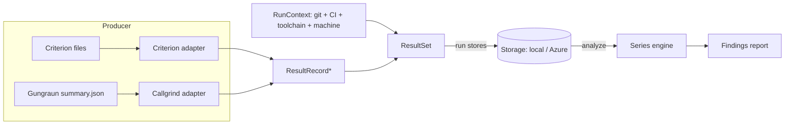

# cargo-bench-history — Design & Implementation Plan

Status: design approved; iteration 1 (`run` for Callgrind + local storage)
implemented. Items still marked **R** are non-blocking recommendations open to
revision during implementation. The resolved design decisions are logged in
[§13 Decisions & open items](#13-decisions--open-items).

## 1. Purpose

A Cargo subcommand that maintains a **long-lived history** of benchmark results
and analyzes that history for trends that are invisible to snapshot/“previous
run” tools:

* slow incremental drift (“scenario X got 30 % slower over 12 months, 1 % at a
  time”);
* step changes attributable to a specific commit, visible only in hindsight once
  the noise averages out;
* regressions vs. a robust rolling baseline rather than a single noisy neighbour.

It stores every result over time (local path or Azure blob), runs in multiple
environments (dev PC, GitHub Actions, ADO), and partitions data only when the
results are not otherwise comparable.

Commands: `run`, `install`, `analyze` (plus a deferred `upload` — §8.2).

## 2. How the benchmark systems work (and what they emit)

Understanding the producers is mandatory: comparability and parsing both depend
on it. Initial scope is what this workspace uses — **Criterion** (wall-clock) and
**Callgrind via Gungraun** (simulated instruction counts).

### 2.1 Criterion (wall-clock, hardware-dependent)

`cargo bench` with Criterion 0.8.2 writes, per measured case, under
`target/criterion/`:

* `…/<group>/<function>/<value>/new/benchmark.json` →
  `BenchmarkId { group_id, function_id?, value_str?, throughput? }` — the stable
  identity of the case.
* `…/new/estimates.json` → `Estimates { mean, median, median_abs_dev, slope?,
  std_dev }`, each `Estimate { confidence_interval { confidence_level,
  lower_bound, upper_bound }, point_estimate, standard_error }`. **Units are
  nanoseconds per iteration.**
* `…/new/sample.json` → `SavedSample { sampling_mode, iters[], times[] }` (raw).
* `…/new/tukey.json` (outlier fences).

Key facts:

* Results are **hardware-dependent and noisy** → must be partitioned by machine
  and compared with noise-aware statistics.
* Criterion records **no timestamp, no commit, no machine info**. Our tool
  supplies all run context.
* The on-disk JSON is criterion-internal (not a stability-guaranteed API), but
  has been stable for many releases. `cargo-criterion` (a separate tool) emits a
  documented `--message-format json` stream; the workspace does not use it
  today. **R:** v1 parses the on-disk files, isolated behind an adapter, so we
  can swap to `cargo-criterion` later without touching the rest of the tool.

### 2.2 Callgrind via Gungraun (simulated, hardware-independent)

Gungraun 0.19.0 runs each scenario once under Valgrind/Callgrind and can emit a
**machine-readable summary** — this is the “special need” the `run` command
exists to satisfy:

* `--save-summary[=json|pretty-json]` (env `GUNGRAUN_SAVE_SUMMARY`) writes
  `summary.json` next to each scenario’s output under `target/gungraun/…`.
* `--output-format=json` streams one `BenchmarkSummary` per scenario to stdout
  (everything else goes to stderr; `… -- --output-format=json | jq -s`).
* Schema is **versioned** (`BenchmarkSummary.version`, currently `"6"`).
  `BenchmarkSummary { version, module_path ("file::group::bench"),
  function_name, id?, kind, profiles, benchmark_file, package_dir, project_root }`.
  `profiles[].data` carries the Callgrind metrics per `EventKind`: instructions
  (`Ir`), L1/LL/RAM hits, estimated cycles, branches (`Bc/Bcm/Bi/Bim`).

Key facts:

* Results are **deterministic and hardware-independent** (a CPU simulator), so
  they do **not** need a machine-key partition.
* They **are** toolchain/libc/arch sensitive (absolute counts shift with rustc
  inlining, glibc, target arch). So `target_triple` must still partition, and
  rustc/libc versions are recorded as metadata so a bump shows up as a step in
  the timeline rather than silently forking history.
* The default `cargo bench` output is human-readable text only → we must opt in
  to the JSON summary. Tiny but real: that is what `run` does (sets the env var /
  arg). We therefore **implement `run`, but it stays thin.**

### 2.3 Consequence for the data model

The two systems differ in units, noise, and hardware-dependence. Both, however,
reduce to the same shape: *a stable benchmark identity → a set of named numeric
metrics*. That shared shape is the foundation of the model in §3.

## 3. Core concepts & data model



* **BenchmarkId** — stable identity of a series. Callgrind: `module_path`
  (+ `id`). Criterion: `group_id / function_id / value_str`. Renaming a
  benchmark starts a new series (documented caveat; see §13).
* **Metric** — `{ name, unit, value: f64, kind }` where `kind ∈ {Wallclock,
  InstructionCount, CacheHits, EstimatedCycles, Branches, …}`. Criterion also
  carries the confidence interval and std-dev so analysis can be noise-aware.
* **ResultRecord** — one `BenchmarkId` + its metrics from a single run.
* **Timestamps** — every run carries three distinct times (§6): the **effective
  time** (timeline position; defaults to the benchmarked commit's date,
  overridable with `--timestamp` for backfill), the **execution time** (when the
  benches ran), and the **ingest time** (wall clock when stored). Only effective
  time orders a series; the tool never assumes ingest time is the effective date.
* **RunContext** — metadata attached to every stored run (see §6).
* **ResultSet** — `{ schema_version, context, results: [ResultRecord] }`; the
  unit of storage (one immutable file per run).
* **ComparabilityKey** — the partition under which a series accumulates. Two
  records are comparable iff their keys match (§4).
* **MachineKey** — a stable hardware fingerprint for hardware-dependent systems
  (§5).

## 4. Comparability & storage partitioning

The central insight: **partition only by what makes results fundamentally
incomparable; record everything else as metadata so the analysis can see its
effect over time.**

ComparabilityKey =
`{ project, system, target_triple, machine_key? }`

* `project` — workspace identity (config `project.id`, default = repo/workspace
  dir name).
* `system` — `criterion` | `callgrind` (different units & semantics).
* `target_triple` — `x86_64-unknown-linux-gnu` etc. Even Callgrind counts are
  not comparable across architectures.
* `machine_key` — **only for hardware-dependent systems** (Criterion). Omitted
  (literal `synthetic`) for Callgrind.

Deliberately **metadata, not partition** (so a change is *visible* as a timeline
step, which is the whole point of the tool): rustc/cargo version, OS/libc,
commit, branch, CI provider. **Decided:** toolchain is recorded as metadata and
the timeline stays continuous; `analyze` annotates/segments by toolchain so a
bump shows up as a step rather than forking history.

### 4.1 Target triple & cross-OS (WSL) execution

`target_triple` describes **where the benchmark binary actually ran**, which is
not always where `cargo bench-history` itself runs. The common case: a Windows
developer drives Callgrind benches through WSL
(`wsl -e bash -lc 'just bench-cg'`) — the tool process is on Windows but the
measured binary is `x86_64-unknown-linux-gnu`. Recording the tool's *own* host
triple would mislabel the data and fork one logical series across two
partitions.

Resolution order (first match wins):

1. Explicit `--target-triple` (or per-engine config `target_triple`).
2. **Engine-declared constraint.** The Callgrind engine only runs under
   Linux/Valgrind, so its adapter pins the OS component to `linux`
   unconditionally — this alone resolves the Windows→WSL Callgrind case with no
   user action.
3. **Host detection** for natively-run engines (Criterion). A WSL guest shares
   the host architecture (x86_64 host → x86_64 guest; ARM host → aarch64 guest),
   so only the OS component can differ across the WSL boundary — exactly what the
   engine constraint in (2) handles.

The tool's own host triple is additionally recorded as **metadata**
(`host_triple`), so any mismatch with the partition `target_triple` is auditable
rather than a silent series corruption.

**Golden rule (documented):** for the cleanest data, run `cargo bench-history` in
the same OS context as the benches (e.g. invoke the whole tool inside WSL); the
rules above are safety nets for when that is impractical.

### 4.2 On-disk / blob layout

**R:** immutable, append-only-by-new-file model (works identically on local FS
and blob storage, no read-modify-write races in concurrent CI):

```
<root>/v1/<project>/<system>/<target_triple>/<machine_key|synthetic>/
    <effective_unix_ts>-<short_sha>-<run_uuid>.json   # one ResultSet per run
```

`analyze` lists a partition prefix and downloads every `*.json`; `run` writes one
new object (named by **effective** time, so backfilled points sort into their
historical position). No mutation, no locking.

## 5. Machine key (hardware fingerprint)

Goal: equal for pool-equivalent machines, different for genuinely different
hardware. **Never** keyed on hostname/serial (cloud pool nodes differ in name
but are equivalent).

Factors (hashed): CPU brand string, physical core count, logical processor
count, memory-region (NUMA) count, total RAM bucketed to a coarse boundary, CPU
base frequency bucket. User override: `machine.key = "my-key"` or `--machine-key`.

* Reuse **`many_cpus`** (already in-workspace) for processor/memory-region
  counts; a small hardware PAL supplies CPU brand + RAM
  (Windows/Linux/macOS impls + mock), mirroring the existing `pal/` pattern.
* **Stability requirement (correctness):** the key is persisted and compared
  across machines and tool versions, so it must use a **fixed** hash (e.g.
  SHA-256 of a canonical string), **not** `foldhash`/`DefaultHasher` (seeded /
  not stable).
* Not needed until the Criterion iteration (only Criterion results are
  hardware-dependent) → machine-key work is deferred to iteration 5.

## 6. Run context (environment detection)

Captured once per stored run and attached to the `ResultSet`:

* **Effective time** — the timeline position of this data point. Defaults to the
  benchmarked commit's committer date (so backfilling by checking out an old
  commit lands the point at its correct historical position), overridable with
  `--timestamp <rfc3339>` for when the commit date is wrong or absent (squash /
  rebase, reconstructing from logs, benches not tied to one commit). **This is
  the only time used to order a series.**
* **Execution time** — wall clock when the benches actually ran (metadata), read
  from an injected `tick::Clock` (§10) so tests drive it deterministically.
* **Ingest time** — wall clock when the ResultSet was stored (metadata), also from
  the `tick::Clock`; **never** used as the effective date.
* **Git:** commit SHA + short SHA, branch, committer date, dirty flag (`git`).
* **CI:** provider + run id + PR number, detected from env:
  * GitHub Actions: `GITHUB_ACTIONS`, `GITHUB_SHA`, `GITHUB_REF_NAME`,
    `GITHUB_RUN_ID`, `GITHUB_RUN_ATTEMPT`.
  * ADO: `TF_BUILD`, `BUILD_SOURCEVERSION`, `BUILD_SOURCEBRANCH`,
    `BUILD_BUILDID`, `SYSTEM_PULLREQUEST_PULLREQUESTID`.
  * else `Local`.
* **Toolchain/host:** rustc + cargo version, OS + libc hint, the resolved
  execution `target_triple` (§4.1) **and** the tool's own `host_triple` (these
  differ under WSL).
* **Provenance:** cargo-bench-history version + schema version + machine_key.

`jiff` parses `--timestamp` and formats stored times as RFC 3339 (UTC). Git and
env access go through a small PAL so the logic is unit-testable without a real
repo or CI.

## 7. Storage abstraction

```rust
trait Storage {
    async fn put(&self, key: &str, bytes: &[u8]) -> Result<(), StorageError>;
    async fn get(&self, key: &str) -> Result<Vec<u8>, StorageError>;
    async fn list(&self, prefix: &str) -> Result<Vec<String>, StorageError>;
}
```

Storage I/O is **async** (§10): `LocalStorage` over `tokio::fs`, `AzureBlobStorage`
over async HTTP. `async fn` in a trait is not `dyn`-compatible, so backend
selection is a `StorageFacade` **enum** (`Local` | `Azure`) with static dispatch —
no `async_trait` dependency, and `run`/`analyze` stay backend-agnostic by holding a
`StorageFacade`.

* **LocalStorage** (iteration 1): root from config; create dirs; write/read/walk
  via `tokio::fs` (iterative directory walk — no boxed async recursion).
* **AzureBlobStorage** (iteration 4): `azure_storage_blob` (+ `azure_identity`),
  behind an **optional `azure` Cargo feature** so default builds and Miri stay
  light and dependency-free; the feature compiles on Windows, Linux **and
  macOS**. Auth: **`DefaultAzureCredential` is the primary path** — one mechanism
  covers CI managed identity / workload-identity federation, local `az login`,
  and env-based service principals, with no secrets in config. Connection string
  / SAS remain optional alternatives behind a config discriminator. Tested in
  regular CI against the **Azurite emulator** (not real cloud, not `#[ignore]`) —
  network access means `#[cfg_attr(miri, ignore)]` only.
* An in-memory `Storage` fake (in `#[cfg(test)]`) backs the Miri-safe
  orchestration tests; it mirrors the same key/prefix semantics as `LocalStorage`.

The blob/key model (flat keys, list-by-prefix, immutable objects) is the lowest
common denominator of a filesystem and a blob container, so both backends
implement the same trait with no special-casing upstream.

## 8. Commands

The commands (`run`, `install`, `analyze`; `upload` is deferred — §8.2) follow
the established pattern: `main.rs` strips the injected `bench-history` arg, `argh`
parses (here with **subcommands**), and dispatches to `lib::run`, which returns a
typed `Outcome`/`Error`.

### 8.1 `cargo bench-history run`

**Engine detection is delegated to the user.** The tool cannot reliably tell
which engine a given bench uses (`cargo bench` runs all harnesses together; the
engine lives in each bench’s `main()`). So the user declares, per engine, the
command that launches that engine’s benches in this workspace. **An engine with
no configured command is simply not used here.**

```toml
[engines.callgrind]            # omit the section entirely => engine unused
command = "just bench-cg"      # or "cargo bench -p nm --bench nm_observe_cg"
                               # GUNGRAUN_SAVE_SUMMARY injected automatically (env)

[engines.criterion]
command = "cargo bench"        # estimates.json written automatically; no injection
# extra_args = ["--message-format=json"]   # optional escape hatch (e.g. cargo-criterion)
```

For each configured engine, `run`:

1. **Injects engine configuration via environment variables** (not appended
   args). Env is robust regardless of how the command launches the benches —
   direct, through `just`, or through WSL — whereas trailing `-- …` args are
   swallowed by wrappers like `just bench-cg` that build their own
   `cargo bench` invocation. Callgrind → `GUNGRAUN_SAVE_SUMMARY=pretty-json`;
   Criterion → nothing needed. An optional `extra_args` escape hatch covers
   engines/modes with no env knob (e.g. `cargo-criterion --message-format`).
   * **WSL propagation:** the tool cannot reliably detect whether a command
     crosses into WSL (it may be an opaque `just …` wrapper), so it does **not**
     try. Instead, for every env var it injects it **unconditionally appends that
     var's name to `WSLENV`** (with the `/u` up-flag, e.g.
     `GUNGRAUN_SAVE_SUMMARY/u`). This is inert when no WSL boundary is crossed and
     makes the injected env cross the boundary when one is. The golden rule (run
     the tool in the same OS as the benches) remains the guidance.
2. Records the **run-start time**, then runs the user command.
3. **Harvests by engine-specific output location** (`target/gungraun/**/summary.json`
   for Callgrind, `target/criterion/**/new/estimates.json` for Criterion),
   filtered to files with `mtime ≥ run-start` so stale cases from earlier runs
   are not re-ingested. The engine is known (it is the config section being
   processed), so harvest globbing never relies on bench-file names.
4. Builds the `ResultSet` (with the resolved RunContext) and **stores it
   immediately** — `run` always persists; there is no separate publish step
   (`--no-store` produces results without writing, for dry runs).

Callgrind’s command must run on Linux/WSL (Valgrind), exactly as today — but
that requirement lives entirely in the user-provided command, keeping the tool
platform-agnostic.

**Flags & filtering.** Everything after a `--` separator is forwarded **verbatim**
to each engine command, e.g.
`cargo bench-history run --engine callgrind -- -p nm --bench nm_observe_cg`. The
tool does **not** interpret these args and makes no assumption that any filter
syntax (`--workspace`, `-p`, a bench-binary name) is even supported — that is
between the user and their bench command (passthrough composes when the command
is a direct `cargo bench`; opaque wrappers like `just bench-cg` should bake their
own filters in). Because harvest is scoped by `mtime ≥ run-start`, whatever subset
actually ran is exactly what gets ingested — no filter-awareness needed in the
tool. Since passthrough is appended to *every* invoked engine command, use
`--engine <name>` to run a single engine at a time (also the fast path for
test/eval cycles). Other flags: `--timestamp <rfc3339>` (override effective time
for backfill, §6), `--target-triple <triple>` (override the partition triple,
§4.1), `--no-store`.

### 8.2 `cargo bench-history upload` — deferred (run vs upload)
`run` already does the only thing that *must* happen at execution time — inject
`GUNGRAUN_SAVE_SUMMARY` so Callgrind even writes a machine-readable summary — and
then stores the result. A standalone `upload` would merely re-harvest *existing*
`target/` output without re-running benches, and its value is narrow:
* **Callgrind:** near-useless on its own — without the run-time env injection
  there is no `summary.json` to harvest, so the benches had to run under our
  control anyway, which is exactly what `run` does.
* **Criterion:** plausible (estimates.json is always written, so output may
  pre-exist from a separate `cargo bench`), but that engine does not land until
  iteration 5.

So `upload` is **deferred**. The harvest → build → store logic lives in an
internal `ingest` module that `run` calls; exposing it later as an `upload`
subcommand is a thin addition if a concrete need appears (most likely alongside
Criterion). When added it is platform-neutral (only reads files).

### 8.3 `cargo bench-history install`
Generate an example `.cargo/bench_history.toml` if absent; print its path and
next steps. Never overwrite an existing file (report and exit success).

### 8.4 `cargo bench-history analyze`
Download a partition (default: current project/system/machine; flags to target
any stored set or time range), build per-benchmark/per-metric series ordered by
effective time (§6), run the finding algorithms (§9), print a report.
* `--since <date>`, `--system`, `--machine-key`, `--metric`, `--format
  text|json|markdown`, `--fail-on regression` (CI gating, opt-in).

## 9. Analysis algorithms

Series: per `(BenchmarkId, metric)`, ordered by effective time (§6), tagged with
toolchain/OS so the engine can segment. Findings (severity-ranked):

1. **Rolling-baseline regression/improvement** *(v1 first)* — baseline = median
   of last *N* comparable points; flag latest if it deviates beyond a
   noise-aware threshold. Callgrind: exact integers → threshold ≈ 0 (any real
   delta matters). Criterion: `k·MAD` and/or CI non-overlap to suppress noise.
2. **Change-point / step detection** — find level shifts in the series and
   attribute them to the boundary commit (e.g. cumulative-mean split / Pettitt /
   E-divisive-lite). This is the “degradation after commit XYZ, visible only in
   hindsight” case.
3. **Monotonic drift** — robust slope (Theil–Sen) significant and consistent in
   sign over a long window → “incrementally slower over 12 months”.

**Decided:** implement #1 (rolling-baseline regression) end-to-end for iteration
3 (simplest, immediately useful), with the series/finding abstraction designed so
#2 and #3 are additive. All math is pure/deterministic → unit-test with proptest
+ named regression cases, no real-time delays (Miri-friendly, per workspace
conventions).

## 10. Crate architecture

`packages/cargo-bench-history/` — binary + library, `argh` subcommands, matching
`cargo-detect-package`/`cargo-freeze-deps`.

```
src/
  main.rs                 # #[tokio::main]; strip "bench-history" arg, parse, dispatch
  lib.rs                  # pub async fn run(Command) -> Result<Outcome, Error>
  cli.rs / types.rs       # argh subcommands + RunInput/Outcome/Error
  config.rs               # load + generate .cargo/bench_history.toml (toml)
  model.rs                # ResultSet/Record/Metric/BenchmarkId/Context (serde)
  comparability.rs        # ComparabilityKey + partition path
  process.rs              # ProcessRunner port (async) + tokio adapter + fake   [it. 1]
  git.rs                  # Git port (async) + git-shell adapter + fake         [it. 1]
  host.rs                 # rustc -vV pure parse -> toolchain/host triple        [it. 1]
  context/                # env.rs (CI), git wiring  (+ ports/fakes)
  machine.rs              # machine key (many_cpus + hw PAL)   [it. 5]
  bench/
    mod.rs                # engine env injection + harvest glob per engine
    callgrind.rs          # Gungraun summary v6 serde + mapping   [it. 1]
    criterion.rs          # [it. 5]
  ingest.rs               # harvest target/ -> ResultSet -> store (shared) [it. 1]
  storage/
    mod.rs                # Storage trait (async) + StorageFacade enum + fake
    local.rs              # tokio::fs   [it. 1]
    azure.rs              # [it. 4, feature = "azure"]
  analyze/
    mod.rs  series.rs  findings.rs   # [it. 2+]
  commands/
    run.rs install.rs analyze.rs     # upload.rs added if/when undeferred
```

**Async ports & adapters (the testability boundary).** The app is **async by
default on the Tokio runtime** (`main` = `#[tokio::main]`, lib entry
`async fn run`). PURE logic stays SYNC — parse, map, comparability, series,
findings, format — and is the Miri-safe bulk of the code and tests. Async is
pushed only to the I/O edges, each a small trait ("port") with a real Tokio
adapter plus an in-lib `#[cfg(test)]` in-memory fake:

* `ProcessRunner` (async) — launch an engine command with injected env; return
  exit status. Real = `tokio::process::Command`; fake records the invocation and
  can drop fixture `summary.json` files to simulate a bench run.
* `Git` (async) — commit/short/branch/committer-date/dirty (shells `git` via
  `tokio::process`; PARSE pure). Fake returns canned `GitInfo`.
* `Storage` (async) — `StorageFacade` enum (§7); in-memory fake for tests.
* Env access is a plain `Fn(&str) -> Option<String>` (matches `detect_ci`).
* The clock is the **`tick` crate**, not a custom port: `tick::Clock`
  (`Clock::new_tokio()` in prod) is injected into orchestration; tests use
  `tick::ClockControl` (its `test-util` feature) for deterministic simulated time.
  `tick` is machine-centric (`SystemTime`); convert to `jiff::Timestamp` for
  stored/effective times.

Orchestration takes injected ports — `run_with(&ports, &clock, &opts)` — and the
public async entry wires the real adapters. **Miri strategy:** pure logic runs
under Miri directly; the in-memory async orchestration tests run WITHOUT a Tokio
runtime (`futures::executor::block_on` + always-`Ready` fakes + `ClockControl`),
so they stay Miri-safe. Tests that use a real Tokio runtime, real fs/process, or
Azurite are `#[cfg_attr(miri, ignore)]`.

Conventions to honour (from `docs/`): flat small files; mockable ports for
process / fs / storage / git / env / hardware; `#[serial]` on any test touching
the process CWD (see `cargo-detect-package/AGENTS.md`); no `parking_lot`; no
real-time sleeps (inject `tick::Clock`); proptest with bounded cases + Miri-safe
regression twins; zero warnings; alphabetical no-default-features deps.

Dependency sketch: `argh`, `serde`, `serde_json`, `toml`, `jiff` (timestamps +
`--since`), `tokio` (rt-multi-thread, macros, process, fs), `tick` (clock; `tokio`
feature in prod, `test-util` in dev), `futures` (dev-only, `executor` for the
Miri-safe `block_on`); a stable hash (`sha2`) and `many_cpus` for the machine key
[it. 5]; optional `azure` feature → `azure_storage_blob` + `azure_identity` [it. 4].

## 11. Cross-platform notes

* `analyze`, `install`, and the harvest/store half of `run` are platform-neutral
  (pure file/IO/compute) and first-class on **Windows, Linux and macOS**.
* Only the *bench execution* inside `run` is constrained, and only by the
  user-provided command: Callgrind needs Linux/Valgrind (so on Windows it is
  driven via WSL, exactly like `just bench-cg`; on macOS Valgrind is effectively
  unavailable, so the Callgrind engine is simply left unconfigured there).
  Criterion runs natively on all three OSes.
* WSL specifics (env propagation, target-triple resolution) are covered in §8.1
  and §4.1; the golden rule is to run the tool in the same OS as the benches.
* Optionally add `just bench-history-*` recipes later; the tool is standalone.

## 12. Implementation plan

Phase 0 (foundation, precedes the numbered iterations): crate skeleton +
`argh` subcommands (`run`/`install`/`analyze`) + `config.rs` + `model.rs` (incl.
the three timestamps) + `Storage` trait + `comparability` (incl. target-triple
resolution, §4.1) + `RunContext` (git/CI + effective time). Small and
high-leverage; the iterations build on it.

The revised plan folds your original "upload" step into "run" (run always
persists) and adds macOS; mapped to your original numbering:

1. **`run` for Callgrind, end-to-end with local storage** (your 1 + 2) — adapter
   injects `GUNGRAUN_SAVE_SUMMARY`, invokes the user command, `mtime`-scoped
   harvest of `summary.json`, builds the ResultSet, and writes it via
   `LocalStorage` to the partition. `run` persists by itself; no separate
   `upload`. (Confirms the “special need” is just the summary flag — kept.)
2. **`analyze` (useful finding)** (your 3) — series engine + rolling-baseline
   regression over local Callgrind history; text report (+ `--fail-on`).
3. **`install`** (your 4) — generate `.cargo/bench_history.toml`, point the user
   to it.
4. **Azure blob** (your 5) — `azure` feature, `AzureBlobStorage`,
   `DefaultAzureCredential`; `run`/`analyze` become storage-agnostic; verify the
   feature builds and runs on Windows, Linux and macOS.
5. **Criterion** (your 6) — adapter (estimates.json), machine-key computation +
   partition (Windows/Linux/macOS hardware PAL), noise-aware thresholds; add
   change-point/drift findings.

**Deferred:** a standalone `upload` command (§8.2) — added only if a concrete
need arises, most likely alongside Criterion; the `ingest` module it would reuse
already exists from iteration 1.

Each iteration ships with tests and docs and leaves the tool runnable.

## 13. Decisions & open items

1. **Design-doc home** — *Decided:* committed to
   `packages/cargo-bench-history/DESIGN.md` (package dir created up front).
2. **Scaffold now?** — *Deferred:* design decisions resolved first; creating the
   Phase 0 crate skeleton is the next step when you’re ready.
3. **Storage granularity** — *Decided:* immutable one-file-per-run.
4. **Toolchain handling** — *Decided:* recorded as metadata; the timeline stays
   continuous and `analyze` annotates/segments by toolchain (a bump appears as a
   step, not a fork).
5. **`analyze` v1 finding** — *Decided:* rolling-baseline regression first;
   change-point and drift plug in afterward.
6. **Azure auth** — *Decided:* `DefaultAzureCredential` is the primary path
   (managed identity / workload-identity / `az login` / env service principal,
   no secrets in config); connection string and SAS are optional alternatives.
7. **Date/time dependency** — *Decided:* `jiff` for timestamps and `--since`
   parsing.
8. **`run` invocation** — *Decided:* per-engine user-provided commands declared
   in config (an engine with no command is unused); the tool injects engine
   configuration via **environment variables** (e.g. `GUNGRAUN_SAVE_SUMMARY`),
   not appended args, propagating across WSL via `WSLENV`; harvest is scoped to
   the current run by `mtime ≥ run-start`. Optional `extra_args` escape hatch for
   engines lacking an env knob.
9. **Effective time vs ingest time** — *Decided:* every run records three times —
   effective (timeline position, default = commit committer date), execution, and
   ingest (wall clock). Only effective time orders a series; `--timestamp`
   overrides it for backfilling old commits. The tool never assumes ingest time
   is the effective date.
10. **Filtering** — *Decided:* `run` forwards everything after `--` verbatim to
    each engine command and stays filter-agnostic (no awareness of `--workspace`
    / `-p` / bench names); the `mtime ≥ run-start` harvest captures exactly what
    ran. `--engine <name>` scopes which engine(s) run (passthrough hits every
    engine command, so this is needed for heterogeneous setups and handy for fast
    test/eval cycles).
11. **Target triple & WSL** — *Decided:* the partition triple is where the bench
    *ran*. Resolution: `--target-triple` > per-engine config > engine constraint
    (Callgrind pins OS=`linux`) > host detection. Arch matches across the WSL
    boundary, so only the OS flips (handled by the Callgrind constraint); the
    tool's `host_triple` is stored as metadata to keep mismatches auditable.
    Golden rule: run the tool in the same OS as the benches.
12. **macOS** — *Decided:* first-class for `install` / `analyze` / Criterion /
    Azure and the harvest-store half of `run`; only Callgrind execution is
    unavailable (no Valgrind) and is simply left unconfigured there.
13. **`run` vs `upload`** — *Decided:* `run` always persists (execute → ingest →
    store); the standalone `upload` command is **deferred** because its value is
    marginal for Callgrind and only becomes real with Criterion (iteration 5).
    The reusable `ingest` module makes adding it later trivial.
14. **Async runtime** — *Decided:* async by default on Tokio (`#[tokio::main]`,
    `async fn run`); I/O edges (process, fs, storage/HTTP) are async behind small
    ports with real adapters + in-memory fakes, while pure logic stays sync and
    Miri-safe (§10).
15. **Clock** — *Decided:* the `tick` crate (already a workspace dep) supplies the
    injected clock; `tick::ClockControl` drives deterministic simulated time in
    tests. No hand-rolled clock port; convert its `SystemTime` to `jiff::Timestamp`.
16. **WSL env propagation** — *Decided:* drop magic WSL detection; for every
    injected engine env var, unconditionally append its name to `WSLENV` (with the
    `/u` up-flag). Inert outside WSL, correct across the boundary (§8.1).
17. **Cloud-storage testing** — *Decided:* Azure backend is exercised in regular CI
    against the **Azurite emulator** (not real cloud, not `#[ignore]`; only
    `#[cfg_attr(miri, ignore)]` for the network edge).
18. **Integration testing** — *Decided:* integration tests invoke the **library
    entry** (`Cli::from_args(argv).into_command()` → `run()`), matching the
    workspace pattern (no `assert_cmd`); a table-driven CLI-flag matrix runs over
    fixture "testdata projects" with prebuilt fake `target/` trees.
