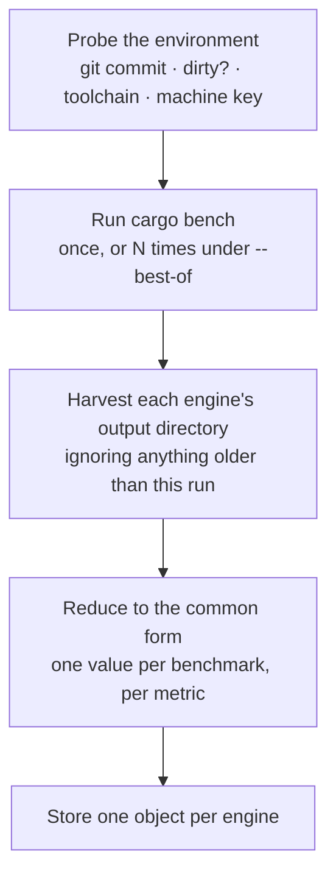
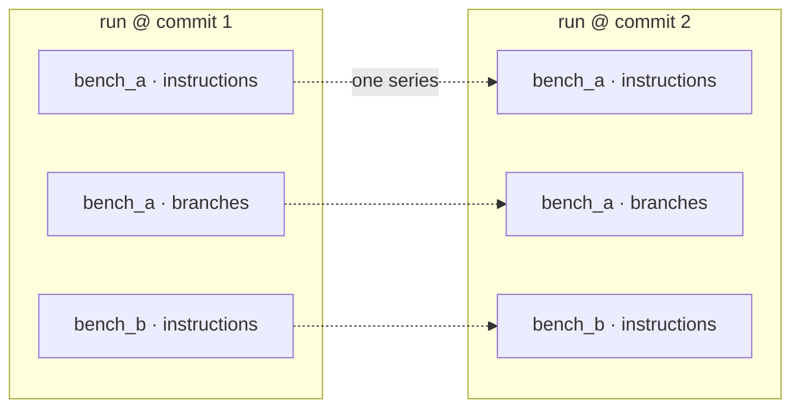
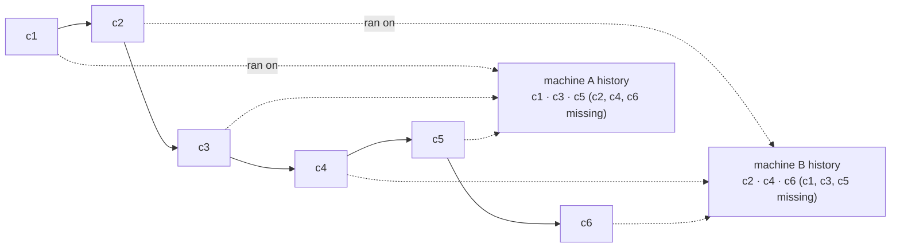

# Collection

Collection is how measurements become history. Two commands do it: `collect` measures the
commit you are on, and `backfill` reconstructs a range of commits you never measured.

This chapter is what each actually does, and — more usefully — what shapes the store ends up
with.

## Terms used here

{{#include generated/terms-collection.md}}

## What `collect` does

The tool does not run engines by name. It enables the environment all four need and harvests
whichever produced output, so a workspace with only Criterion benchmarks simply yields
Criterion data.

### The harvest is freshness-gated

Engines write into `target/`, and `target/` persists between runs. Without a check, a collection
would happily re-store last week's output for a benchmark that failed to run this time — and
that stale value would enter history as if it had been measured at the current commit.

So harvested files must be newer than the run that was supposed to produce them. A benchmark
that did not run this time contributes nothing, rather than contributing a lie.

The consequence is worth stating: **an engine that produced no output stores nothing, silently.**
There is no error, because "this workspace has no Callgrind benchmarks" and "the Callgrind
benchmarks all failed" look identical from here. Coverage can flag a missing engine only for a
benchmark **already present in history**: an earlier observation of a benchmark that is missing
now surfaces at analysis time either as a [ghost](reconstruction.md#ghost-elimination) — a
benchmark history remembers but the analyzed commit no longer measures, so it is dropped before
detection — or, where some observation survives but too few to judge, as an
[unjudged](coverage.md) series the census still counts and names a reason for. A benchmark that
was **never** recorded leaves no trace at all: collection has no object, no series, and no way to
tell "no benchmarks" from "a failed engine". Verifying that every expected engine ran is a
separate collection-time check, not something analysis coverage can guarantee.

## Collisions: what happens when a run already exists

Normal collection is **append-only**. Storing over an existing clean run is refused by default.

{{#include generated/collection-conflicts.md}}

*Why refuse by default:* history is only trustworthy if a recorded measurement stays put.
Silently replacing one would make a series depend on how many times someone re-ran a command.

## Dirty runs

A measurement taken with uncommitted changes is stored separately, under a key that includes
the observation time rather than replacing the commit's clean run.

That keeps three things true at once:

- the clean run at that commit is untouched;
- several dirty snapshots on the same commit coexist;
- the analysis can tell them apart and apply [its admission rules](selection.md#dirty-admission).

Only two dirty snapshots taken in the same second collide.

Dirty runs are what make the tool useful before you commit — you can measure a change in
progress — and they are also what makes uncommitted work on the base branch
[analyze as a branch](selection.md#mode-is-derived-not-chosen).

A dirty run is stored like any other, including to shared cloud storage. But it is only ever
read back to judge local, in-progress work: an official history analysis of a base branch never
admits one, so a dirty snapshot cannot leak into anyone else's baseline. See
[dirty admission](selection.md#dirty-admission).

## Target triples and machine keys

The **target triple** comes from the toolchain that compiled the benchmark.

The **machine key** is a short hash over the host's hardware identity. What goes into it is
chosen deliberately:

{{#include generated/collection-machine-key.md}}

The exclusions are the interesting part. Clock speeds are excluded because they vary with
thermal state and power policy on the same physical machine — including them would rotate the
key spontaneously and shatter the history. Hostname is excluded so a renamed machine keeps its
history.

Verbose collection logs include the resolved machine key and fingerprint components, which is
the fastest way to diagnose a pool that is rotating keys unexpectedly.

## What is stored per commit

Collection stores **runs**, not series. A run is one engine's whole output at one commit — every
benchmark it measured, and every metric of each — written as a single object. The **series** this
appendix keeps returning to do not exist in the store at all: they are cut *across* runs later, at
analysis time, one metric of one benchmark read against every commit (see
[Reconstruction](reconstruction.md)).

Read the boxes top to bottom and you have a run: everything one engine measured at one commit.
Read a row left to right and you have a series: one metric, across commits. So a single run
contributes one point to many series, and a single series draws one point from many runs. The
rest of this chapter is about the runs — how they land on commits, and what shape the store ends
up with.

## How runs land on commits

One partition's objects for a commit sit together under that commit. There is no requirement
that commits be measured in order, or that every commit be measured at all.

{{#include generated/collection-occupancy.svg}}

Read that picture carefully, because most collection problems are visible in it:

- **Gaps** are commits nobody measured. Ordinary and expected — but the detectors
  [cannot see how wide they are](reconstruction.md#gaps-are-holes-not-zeroes).
- **A row that starts late** is a machine that joined the pool later.
- **A row that stops** is a benchmark that was deleted, or a machine that left.
- **Two half-filled rows** are the signature of a rotating CI pool, and the usual cause of
  [comparison-base lag](reporting.md#comparison-base-lag).

## `backfill`

`backfill` measures a range of commits you never measured, by checking each one out in an
isolated worktree and running the suite there.

It differs from `collect` in ways that matter:

- It plans over a **first-parent range**, newest first, so the most useful history arrives
  first if you stop it early.
- It **skips commits already covered** in the partition it is about to write, so re-running it
  is cheap and safe.
- It probes the toolchain **inside the worktree**, so a commit that pinned a different compiler
  is measured with that compiler.
- It works in a detached worktree, so your working tree is untouched.

### Filling the gaps a runner pool leaves

A rotating CI pool hands each commit to whichever machine was free. The pool as a whole measures
every commit, but each individual machine key ends up with only the commits that happened to land
on it — a sparse, half-filled history:

This is the case backfill exists for, and the key point is that **another machine's data is not
coverage for yours**. Counts and timings are never compared across machine keys, so a
partition with holes stays a partition with holes until that machine fills them.

The fix is to run `backfill` on each machine over the shared range. Each fills its own
partition; each ends up with a history dense enough to judge.

## What can go wrong, and how it looks

| Symptom | Cause |
|---|---|
| A commit has some engines but not others | A collection was interrupted between engines. Re-collect with `--overwrite`. |
| A benchmark stops appearing | It was renamed or deleted; the old identity is now a [ghost](reconstruction.md#ghost-elimination). |
| A suite-wide step at one commit | Usually infrastructure or a changed `--best-of`, not code. See [Insights](insights.md). |
| Several machine keys where you expected one | The pool is rotating, or hardware changed; inspect verbose collection logs for the fingerprint components. |
| A run's commit shows as `unknown` in `list` and the report | Git reported no commit when the run was collected, so it was stored under an `unknown` commit. It can never match a real commit and is permanently a ghost. |

## What collection hands on

A store of immutable objects. Analysis reads it next, starting with
[Selection](selection.md) — which decides which of them are even eligible.
