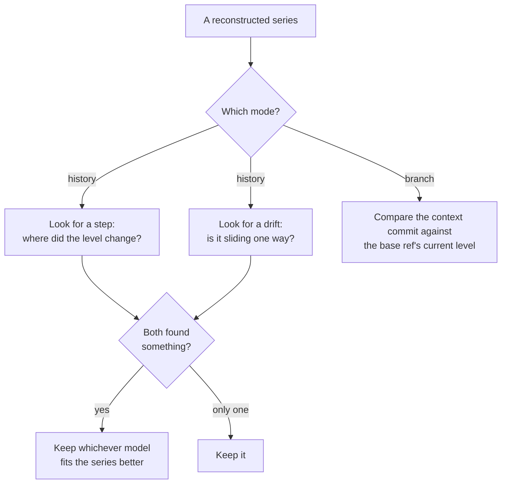

# Detection

Detection is the stage that asks one question of a reconstructed series: **did its level
move?** Everything before this chapter arranged the data. Everything after it decides
whether to believe the answer.

This chapter covers what the tool looks for, how it looks, and — just as important — what it
deliberately does not claim.

## Terms used here

{{#include generated/terms-detection.md}}

## What counts as a signal

A signal is a **level that moved**, established by a named statistical test and sized by an
estimator that a few odd measurements cannot throw off.

That definition is narrow on purpose, and three exclusions follow from it.

- **A signal is not a cause.** The tool reports that a level moved. Why it moved — a code
  change, a compiler upgrade, a noisy neighbor on the build machine — is your judgment,
  recorded with [`bless`](../commands/bless.md).
- **A signal is not one surprising measurement.** A level has to persist to be a level.
- **A signal is not yet a finding.** Everything this chapter produces is a *candidate*. The
  [noise gates](gates.md) and the [group-wide correction](coverage.md) still have to agree,
  and most candidates do not survive both.

## Two shapes, two detectors

Performance changes arrive in two shapes, and each needs a different instrument.

A **step** is the common case: something changed at one commit, and every commit after it
sits at a new level. A **drift** is the case that snapshot-to-snapshot comparison can never
catch — nothing changed much at any single commit, but a hundred commits later the benchmark
is measurably slower.

### Finding a step

The step detector works in three moves.

1. **Locate.** A split search scans every place the series could have changed level and picks
   the single most likely one.
2. **Test.** A rank comparison asks, two-sided, whether the before and after regimes
   differ. If they do not, there is no step. This is a significance test: it asks whether
   the sides differ, not how completely they separate.
3. **Size.** Each side's median becomes its level, and the difference between them is the
   move. Medians rather than averages, so one outlier cannot invent a step or hide one.

The change is attributed to **the first commit of the after-side** — the earliest commit that
already shows the new level.

> The split search reports a chance level of its own, and the tool deliberately ignores it.
> On series this short it is far too conservative and would reject steps the rank comparison
> establishes comfortably. The split search is used only to *locate* the boundary; the rank
> comparison decides whether to believe it.

Here is a series that steps, and the detector's own answer for it.

{{#include generated/detection-clean-step.svg}}

{{#include generated/detection-clean-step.md}}

A series can contain more than one visible step. The split search still chooses one boundary,
and later gates judge that single candidate.

{{#include generated/detection-multi-step.svg}}

{{#include generated/detection-multi-step.md}}

### Finding a drift

The drift detector also works in three moves, but every one of them differs.

1. **Test first.** A one-way-trend check counts how often the series rises against how often
   it falls, across every pair of points. A series wandering at random produces a balance; a
   drifting one does not.
2. **Fit.** An outlier-resistant slope is fitted from the middle of all the pairwise slopes,
   so a few odd measurements cannot tilt the line.
3. **Size.** The move is the *fitted line's* rise across the window — not the difference
   between the first and last measurements, which would be at the mercy of whatever those two
   points happened to do.

A drift is attributed to the whole window rather than to a commit, because that is what the
evidence supports: no single commit is responsible. So the finding names the **range** it
accumulated over — rendered `accumulated <oldest> → <newest>` — rather than a single commit.
Do not go looking at one commit's diff.

The range is always the whole analyzed window, even when the drift occupies only part of it: a
series that held flat, drifted for a stretch, then held flat again is still reported over its
full range, because the detector does not try to pin down where the slope began or ended.
[`examine`](../commands/examine.md) prints every point, which is where to see the shape within
the range and correlate it with commits yourself.

{{#include generated/detection-slow-ramp.svg}}

{{#include generated/detection-slow-ramp.md}}

### When both fire

A real step also registers as a weak trend, and a real drift can look like a step if you
split it down the middle. So both detectors run on every series in history mode, and when
both produce a candidate the tool keeps **whichever model leaves its points closer to it**.

A step fitted through a stepped series leaves almost nothing unexplained; a sloped line
through the same series leaves every point off by something. The comparison is made on
exactly that — how far a typical point sits from each fitted model — and the smaller one
wins. A tie goes to the step.

One event is therefore never reported twice, and the shape that gets reported is the one that
actually describes the series.

## What does not count

Two series that look like they moved and do not report. These matter more than the positive
cases: they are what the tool's usefulness rests on.

### A single elevated point

{{#include generated/detection-blip.svg}}

{{#include generated/detection-blip.md}}

A level has to persist. Both sides of a step must hold enough commits for their medians to
mean anything, so a spike near the end of a series has no after-side to speak of. This is the
first gate a step candidate meets, and the one that makes the tool usable at all — a build
machine having a bad minute is the single most common thing a benchmark series does.

### A series that is simply noisy

{{#include generated/detection-flat-noisy.svg}}

{{#include generated/detection-flat-noisy.md}}

Nothing changed here, and nothing is reported. Note what would happen without care: the split
search still nominates *some* split, because it always nominates its best candidate.
Everything downstream exists to reject it.

### A level that moved and came back

An excursion that has since returned to where it started is silent too, however large it was
while it lasted.

{{#include generated/detection-blip-returned.svg}}

{{#include generated/detection-blip-returned.md}}

That is a deliberate narrowing rather than a gap. By the time such a series is analyzed, its
current level already agrees with its baseline, so there is nothing to act on — and a report
that mixes "your code is slower now" with "your code was briefly slower some time ago" makes
the first harder to see.

The measurements are still there. [`examine`](../commands/examine.md) prints every recorded
point of a series, without judging any of them, which is where to look when you want to know
what a benchmark has been doing rather than what it is doing now.

## Branch mode asks a different question

History mode asks "did this series change at some point?". Branch mode asks something much
narrower: **is the analyzed context commit off the base ref's current level?**

That difference in question drives every difference in method.

| | History mode | Branch mode |
|---|---|---|
| Question | Did the level move, anywhere in the window? | Is the context commit off the base ref's current level? |
| Evidence | Every point in the series | The base ref's recent commits, plus the context run |
| Dirty snapshots | Never admitted | Only the context commit's newest snapshot is judged |
| Window | The whole analyzed history | A fixed number of recent base-ref commits |
| Test | Rank comparison, or trend check | Did the context run land inside the range a further measurement was expected in? |
| Reports | Regressions only, by default | Regressions and improvements |
| Blessings | Honored | Ignored |

The branch's own intermediate commits are discarded. Only the analyzed context commit is the
state being evaluated, so only that commit is judged.

The comparison is a **prediction interval**: from the base window's commits, the tool works
out the range a single further measurement was expected to land in, and asks whether the context run
landed outside it. That is a different question from "are these two groups different" —
there is only one context observation, not a group.

In the figures below, the shaded value band is that predicted range. The base window itself
is the recent base-ref first-parent commit sample for the same discriminant set, capped by the
branch comparison window. It is anchored at the base ref, not at the merge base.

{{#include generated/detection-branch-reported.svg}}

{{#include generated/detection-branch-reported.md}}

The same base window, with a tip that agrees with it:

{{#include generated/detection-branch-quiet.svg}}

{{#include generated/detection-branch-quiet.md}}

### When the base itself recently moved

A base window spanning a genuine level shift describes two levels, not one. Predicting from
both would produce a range so wide that nothing could fall outside it.

So branch mode first checks its own window for a shift, and on finding an unambiguous one,
discards everything before it and predicts from the newer regime alone.

{{#include generated/detection-branch-base-moved.svg}}

{{#include generated/detection-branch-base-moved.md}}

Accepting such a boundary is deliberately harder than reporting a finding. It is not a single
higher number — the split has to qualify as a **full change point in its own right**: located by
the split search, with each side long enough to meet the minimum regime length, significant under
the rank comparison, well separated, and clearing the same relative and absolute floors a
reported move must. Merely *reporting* a branch move asks for none of that extra structure, only
that the tip fall outside the interval.

The asymmetry looks backwards until you see why. Reporting a move makes a claim that a human then
checks. Accepting a boundary *throws evidence away*: the comparison sample shrinks, and its
scatter is re-estimated from what remains. A wrong boundary can collapse a noisy window's scatter
to almost nothing and make the next tip read as certain. A decision that discards data has to be
more certain than one that merely reports something.

### When one reading came from a disturbed runner

A base window is a sample of what the base ref measures, and a shared machine occasionally
contributes a reading that measures something else — another job on the same host, a thermal
event, a noisy neighbour. Such a reading is not a level and not a trend: it stands well clear of
its neighbours in one direction and is gone at the very next commit.

Averaging one in would be quietly expensive. It drags the window's center toward the tip and
inflates the window's apparent scatter several times over, and a wider predicted range is a range
almost nothing falls outside of. The window would still look like a window, and the comparison
would still run, but it would have lost most of its ability to see an ordinary move.

So branch mode leaves such a reading out of the comparison. A reading qualifies only when the
commits on either side of it agree with each other, it stands far clear of them, and it is the only
one in the window — a window offering a second is a benchmark that visits more than one level, and
how often it does so is exactly what the context run is being measured against.

{{#include generated/detection-branch-contended.svg}}

{{#include generated/detection-branch-contended.md}}

The reading is left out of the comparison only. It is still stored, still charted, and still
counted as one of the commits whose existence lets the window be judged at all — a window is
never made eligible by discarding.

History mode does not do this. Its arithmetic is built on medians and ranks, which a lone
reading barely moves, so it has nothing to gain and evidence to lose.

## Confidence, and what it is not

Every finding carries a confidence, and it is **one minus the chance level of whichever test
confirmed it**.

That makes it a statement about evidence strength — how poorly chance explains the pattern —
and it is easy to over-read.

{{#include generated/detection-confidence-high.svg}}

{{#include generated/detection-confidence-high.md}}

{{#include generated/detection-confidence-lower.svg}}

{{#include generated/detection-confidence-lower.md}}

Both are accepted findings. The lower number is still high; it comes from the minimum
regime length, where even a clean split has fewer ranks to compare.

Four things it is not:

- **Not the probability that the finding is correct.** It says chance is a poor explanation.
  It says nothing about whether the cause is your code or the machine.
- **Not a dial you tune.** Every reported finding has already cleared its test, so an emitted
  confidence is always high — and is displayed rounded, so a finding whose chance level is
  one in a million reads as 100%. It does not rank importance; the report ranks by *size of
  move* for exactly that reason.
- **Not adjusted for how much was tested.** The [group-wide correction](coverage.md) runs
  afterwards and does not feed back into this number.
- **Not comparable across modes.** History and branch confidences come from different tests
  answering different questions.

## Minimum evidence

Below these thresholds a series is not evaluated at all. It is counted as unjudged with a
stated reason rather than silently skipped — see
[Multiplicity and coverage](coverage.md).

{{#include generated/detection-minimums.md}}

The minimum exists because a handful of points cannot tell a real level shift from ordinary
scatter: with too few observations every test is dominated by chance, and any "finding" from
them would be noise dressed as signal. So the bar is a deliberate judgment — a floor chosen to
refuse data too sparse to trust — rather than a value the statistics derive on their own. Set it
too low and the report fills with accidents; the thresholds here are picked to keep that from
happening while still judging any series with a genuine history behind it.

## What detection hands on

A candidate: the series it came from, the method that found it, the direction and size of the
move, the commit it is attributed to, and the chance level of the confirming test.

None of them is a finding yet. Next: [Noise gates](gates.md).
