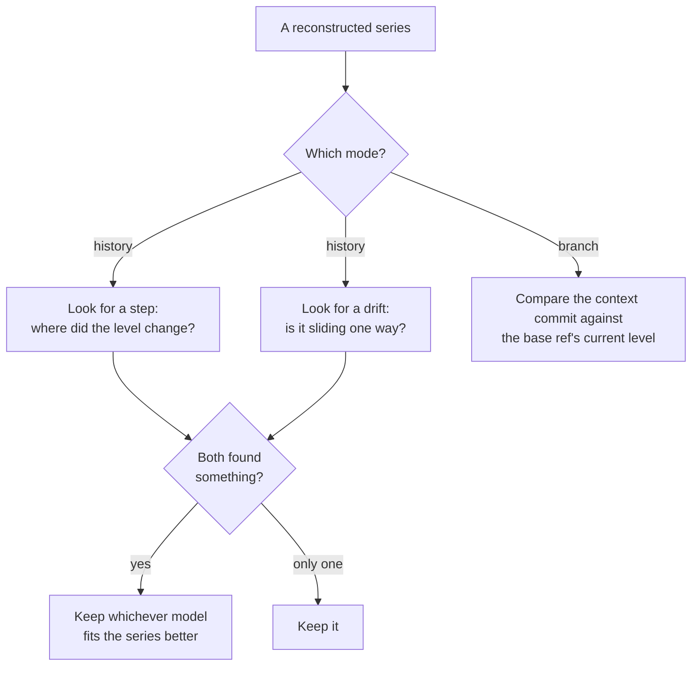
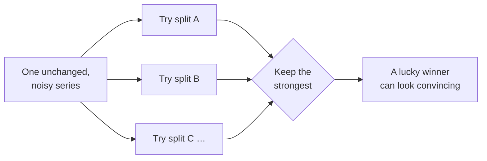
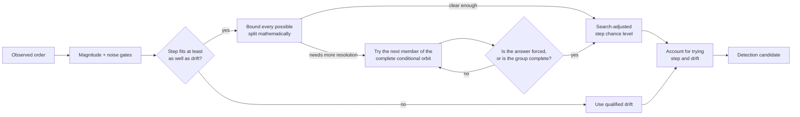
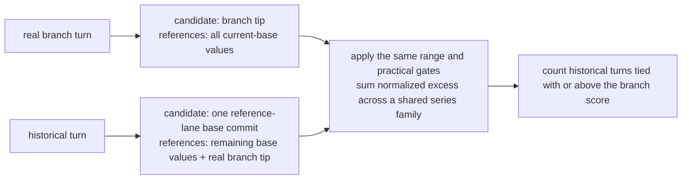

# Detection

Detection is the stage that asks one question of a reconstructed series: **did its level
move?** Everything before this chapter arranged the data. Everything after it decides
whether to believe the answer.

This chapter covers what the tool looks for, how it looks, and — just as important — what it
deliberately does not claim.

## Terms used here

{{#include generated/terms-detection.md}}

## What counts as a signal

A signal is a **level that moved**, established by a named statistical test and sized by an
estimator that a few odd measurements cannot throw off.

That definition is narrow on purpose, and three exclusions follow from it.

- **A signal is not a cause.** The tool reports that a level moved. Why it moved — a code
  change, a compiler upgrade, a noisy neighbor on the build machine — is your judgment,
  recorded with [`bless`](../commands/bless.md).
- **A signal is not one surprising measurement.** A level has to persist to be a level.
- **A signal is not yet a finding.** Everything this chapter produces is a *candidate*. The
  [noise gates](gates.md) and the [group-wide correction](coverage.md) still have to agree,
  and most candidates do not survive both.

## Two shapes, two detectors

Performance changes arrive in two shapes, and each needs a different instrument.

A **step** is the common case: something changed at one commit, and every commit after it
sits at a new level. A **drift** is the case that snapshot-to-snapshot comparison can never
catch — nothing changed much at any single commit, but a hundred commits later the benchmark
is measurably slower.

### Finding a step

The step detector works in three moves.

1. **Locate.** A split search scans every place the series could have changed level and picks
   the single most likely one.
2. **Test fairly.** A rank comparison asks, two-sided, whether the before and after regimes
   differ. The result is corrected for having chosen the strongest of many possible splits.
3. **Size.** Each side's median becomes its level, and the difference between them is the
   move. Medians rather than averages, so one outlier cannot invent a step or hide one.

The change is attributed to **the first commit of the after-side** — the earliest commit that
already shows the new level.

> The split search's own chance level is not used as evidence. It only locates the boundary.
> The rank comparison decides whether the regimes differ, and the correction below makes that
> comparison fair despite the search that chose its boundary.

Here is a series that steps, and the detector's own answer for it.

{{#include generated/detection-clean-step.svg}}

{{#include generated/detection-clean-step.md}}

A series can contain more than one visible step. The split search still chooses one boundary,
and later gates judge that single candidate.

{{#include generated/detection-multi-step.svg}}

{{#include generated/detection-multi-step.md}}

### Making the winning split a fair test

The step detector chooses a split **because it looked strongest**. Treating that winner as though
someone had named it before seeing the data would give it an unfair advantage: even an unchanged
noisy series offers many chances for one split to look persuasive by accident.

Detection corrects that advantage by asking how often chance could produce **a winner at least this
strong**. It has two conservative ways to answer. A mathematical bound over every possible split
can certify an especially clear step immediately. If only one exact split is possible, that
fixed comparison is already fair. Otherwise the detector constructs a bounded conditional orbit,
checks every member, and runs the entire split search again. Frequent equally strong rearranged
winners explain the apparent step; rare ones support it.

History tries both the step and drift shapes, then keeps whichever model fits the series better.
That gives chance another opportunity to offer a lucky answer, so each detector's chance level is
doubled before its significance gate. The correction applies whether only one detector raises a
candidate or both do; it accounts for giving either detector an opportunity to report, and does
not change which model wins the fit comparison.

Reusing the actual measurements preserves repeated values and quantization: an integer counter
with many ties is judged against rearranged histories with those same ties. The rearrangement group
is deterministic, includes the observed order, and is enumerated completely. When every distinct
ordering fits the work budget, all of them are used instead. The same series therefore produces the
same verdict on every platform without relying on a lucky random sample. Where direct rank counting
is practical it is exact; where it is not, observed and rearranged histories use the same
approximation, and their exact conditional comparison supplies the trustworthy chance level.

The calculation is deliberately bounded. Ordinary unchanged series can stop once the winners
already seen prove that the final answer cannot pass. Clear changes often need no rearrangements
because the mathematical bound settles the question. Ambiguous cases may require the complete
orbit, whose size has a fixed maximum rather than growing without limit with the number of
benchmarks. If that orbit cannot distinguish an isolated candidate from chance at the strict
group-wide threshold, the tool stays silent; it does not turn missing resolution into confidence.
The bound prevents runaway work; it does not promise that every difficult series is cheap.

This correction belongs inside Detection because it repairs how the history step detector searched
**within one series**. It is not the later [multiplicity control](coverage.md), which accounts for
testing many series. Branch mode does not use this chance-level machinery. It selects the latest
supported base regime under one shared false-boundary budget, then makes a factual observed-range
comparison. Its report-wide historical comparison supplies finite context rather than a
probability — see
[Limits](limits.md#branch-historical-comparison-is-finite-context-not-probability).

### Finding a drift

The drift detector also works in three moves, but every one of them differs.

1. **Test first.** A one-way-trend check counts how often the series rises against how often
   it falls, across every pair of points. A series wandering at random produces a balance; a
   drifting one does not.
2. **Fit.** An outlier-resistant slope is fitted from the middle of all the pairwise slopes,
   so a few odd measurements cannot tilt the line.
3. **Size.** The move is the *fitted line's* rise across the window — not the difference
   between the first and last measurements, which would be at the mercy of whatever those two
   points happened to do.

A drift is attributed to the whole window rather than to a commit, because that is what the
evidence supports: no single commit is responsible. So the finding names the **range** it
accumulated over — rendered `accumulated <oldest> → <newest>` — rather than a single commit.
Do not go looking at one commit's diff.

The range is always the whole analyzed window, even when the drift occupies only part of it: a
series that held flat, drifted for a stretch, then held flat again is still reported over its
full range, because the detector does not try to pin down where the slope began or ended.
[`examine`](../commands/examine.md) prints every point, which is where to see the shape within
the range and correlate it with commits yourself.

{{#include generated/detection-slow-ramp.svg}}

{{#include generated/detection-slow-ramp.md}}

### When both fire

A real step also registers as a weak trend, and a real drift can look like a step if you
split it down the middle. So both detectors run on every series in history mode, and when
both produce a candidate the tool keeps **whichever model leaves its points closer to it**.

A step fitted through a stepped series leaves almost nothing unexplained; a sloped line
through the same series leaves every point off by something. The comparison is made on
exactly that — how far a typical point sits from each fitted model — and the smaller one
wins. A tie goes to the step.

One event is therefore never reported twice, and the shape that gets reported is the one that
actually describes the series.

## What does not count

Two series that look like they moved and do not report. These matter more than the positive
cases: they are what the tool's usefulness rests on.

### A single elevated point

{{#include generated/detection-blip.svg}}

{{#include generated/detection-blip.md}}

A level has to persist. Both sides of a step must hold enough commits for their medians to
mean anything, so a spike near the end of a series has no after-side to speak of. This is the
first gate a step candidate meets, and the one that makes the tool usable at all — a build
machine having a bad minute is the single most common thing a benchmark series does.

### A series that is simply noisy

{{#include generated/detection-flat-noisy.svg}}

{{#include generated/detection-flat-noisy.md}}

Nothing changed here, and nothing is reported. Note what would happen without care: the split
search still nominates *some* split, because it always nominates its best candidate.
Everything downstream exists to reject it.

### A level that moved and came back

An excursion that has since returned to where it started is silent too, however large it was
while it lasted.

{{#include generated/detection-blip-returned.svg}}

{{#include generated/detection-blip-returned.md}}

That is a deliberate narrowing rather than a gap. By the time such a series is analyzed, its
current level already agrees with its baseline, so there is nothing to act on — and a report
that mixes "your code is slower now" with "your code was briefly slower some time ago" makes
the first harder to see.

The measurements are still there. [`examine`](../commands/examine.md) prints every recorded
point of a series, without judging any of them, which is where to look when you want to know
what a benchmark has been doing rather than what it is doing now.

## Branch mode asks a different question

History mode asks "did this series change at some point?". Branch mode asks something much
narrower: **is the analyzed context commit off the base ref's current level?**

That difference in question drives every difference in method.

| | History mode | Branch mode |
|---|---|---|
| Question | Did the level move, anywhere in the window? | Is the context commit off the base ref's current level? |
| Evidence | Every point in the series | The base ref's recent commits, plus the context run |
| Dirty snapshots | Never admitted | Only the context commit's newest snapshot is judged |
| Window | The whole analyzed history | A fixed number of recent base-ref commits |
| Test | Rank comparison, or trend check | Is the context run outside every observed value in the current base regime? |
| Reports | Regressions only | Regressions and improvements |
| Blessings | Start the active history segment | Set the earliest admissible base evidence |

The branch's own intermediate commits are discarded. Only the analyzed context commit is the
state being evaluated, so only that commit is judged.

The comparison uses the **observed range** of the base ref's selected current regime. The context
run is an excursion only when it lies strictly below the lowest observed value or strictly above
the highest. Equality with either edge is inside. That is a deliberately modest statement: there is
only one context observation, so the tool does not pretend it has a second sample or a probability
model for unseen values.

In the figures below, the shaded value band is that observed range. Its edges are the real cutoff,
and the reported magnitude is the excess beyond the nearest edge. Every verdict shown beneath a
figure is the real one. The base window is the recent base-ref first-parent commit sample for the
same discriminant set, capped at 128 commits and anchored at the base ref, not at the merge base.

{{#include generated/detection-branch-reported.svg}}

{{#include generated/detection-branch-reported.md}}

The same base window, with a tip that agrees with it:

{{#include generated/detection-branch-quiet.svg}}

{{#include generated/detection-branch-quiet.md}}

### When the base itself recently moved

A base window spanning a genuine level shift describes two regimes. Using both would allow older
operating conditions to hide a branch excursion from the current one.

With at least 20 base commits, branch mode alternates the observed base levels in chronological
order between a **selector lane** and a **reference lane**. Observation order keeps both lanes
useful even when the benchmark ran on only a sparse subset of first-parent commits. Only selectors
may locate boundaries. The reference lane is reserved for the report-wide historical comparison,
so a base commit cannot help choose the boundary it is later judged against.

The selector lane searches recursively for supported changes under one shared, selection-adjusted
error budget. Each accepted split must leave full regimes, clear the practical floors, and separate
the two populations almost completely. The current regime begins at the first selector observation
known to follow the boundary; an interleaved reference observation whose side is ambiguous is not
used. If a strongly separated recent group is still too short to establish a regime, the series is
reported as unjudged rather than compared with stale history.

A base regression that was later reverted needs a second look. The point where such a stretch ends
looks like no change at all beside the matching observations further back, so the search finishes
by re-examining whatever follows the newest boundary it accepted, against that stretch alone and
with the same search on both sides of an unsupported split. Without that step the reverted
observations would stay in the comparison range and hide a branch move of the same size.

{{#include generated/detection-branch-base-moved.svg}}

{{#include generated/detection-branch-base-moved.md}}

Histories with 10–19 base commits skip this selection and use the full observed range. They can
support the factual range comparison, but not a defensible decision to discard an older regime.

### Historical extremes remain evidence

A base window is a sample of what the base ref measures, and a shared machine occasionally
contributes a reading that measures something else — another job on the same host, a thermal
event, a noisy neighbour. Such a reading is not a level and not a trend: it stands well clear of
its neighbours in one direction and is gone at the very next commit.

Branch mode keeps it. Removing a historical extreme would make the range narrower and permit a
stronger claim by hiding contrary evidence. A context value inside the full observed current-regime
range cannot honestly be described as faster or slower than everything the base recently did.

{{#include generated/detection-branch-contended.svg}}

{{#include generated/detection-branch-contended.md}}

The quiet verdict under the figure is therefore intentional. The observed extreme costs
sensitivity, but the alternative would be an unsupported finding.

## Comparing the whole branch report with history

An excursion says what the recorded range proves about one series. It does not say how remarkable
the complete report is when many series are inspected. Branch mode answers that separately by
turning eligible base commits into historical branch-like turns:

Only stable series that share the same candidate base commits enter one rectangular family. Adding
the real branch value to each historical turn makes the two directions symmetric. The report can
then say, for example, "None of 10 comparable base commits showed as much out-of-range movement as
this branch." It does not call that count confidence or use it to erase factual excursions. If too
few comparable commits exist, the excursions remain and the report says the wider comparison could
not be formed.

## History chance levels, not a confidence score

A history finding does **not** carry a confidence or certainty number. Every reported finding has
already cleared its test, so any such number would read as near-certainty on all of them: a
finding whose chance level is one in a million and one that barely cleared would round to the
same reassuring figure. It would rank almost nothing, so the report omits it and ranks by *size
of move* instead.

The detector still uses chance levels as internal decision inputs; they are not retained as
finding fields or printed by `--verbose`. This chapter explains them so the verdict logic can be
understood, not to provide another number for ranking findings. A chance level is **how poorly
chance explains the pattern** — and it is easy to over-read. Four things it is not:

- **Not the probability that the finding is correct.** It says chance is a poor explanation.
  It says nothing about whether the cause is your code or the machine.
- **Not a dial you tune.** Every reported finding has already cleared its gate, so the ranking
  of importance is left to the *size of move*, not to how small a chance level came out.
- **Not the family-wide result.** A history change point has already been corrected for its
  internal split search. The [group-wide correction](coverage.md) runs afterwards to account for
  how many series were tested and does not feed back into this chance level.
- **Not a branch score.** Branch mode uses observed ranges and historical report turns rather than
  a per-series chance level.

## Minimum evidence

Below these thresholds a series is not evaluated at all. It is counted as unjudged with a
stated reason rather than silently skipped — see
[Multiplicity and coverage](coverage.md).

{{#include generated/detection-minimums.md}}

The minimum exists because a handful of points cannot tell a real level shift from ordinary
scatter: with too few observations every test is dominated by chance, and any "finding" from
them would be noise dressed as signal. So the bar is a deliberate judgment — a floor chosen to
refuse data too sparse to trust — rather than a value the statistics derive on their own. Set it
too low and the report fills with accidents; the thresholds here are picked to keep that from
happening while still judging any series with a genuine history behind it.

Clearing this floor puts a series in the judged family. In history mode that is not the
same as being able to report a lone step: a rank comparison on so few points has a floor,
and the group-wide correction's rank-1 bar shrinks as the family grows. See
[Multiplicity and coverage](coverage.md#the-detection-minimum-is-not-a-reporting-guarantee).

## What detection hands on

A history candidate carries the series, method, direction and size of the move, attribution, and
selection-adjusted chance level. A branch candidate carries the selected observed range and excess
beyond its nearest edge, with no manufactured chance level.

None of them is a finding yet. Next: [Noise gates](gates.md).
