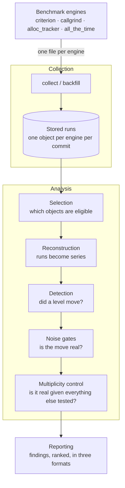

# Data pipeline

This appendix follows a single number all the way through the tool: from the moment a
benchmark engine writes it to a file, to the sentence in a report that says it moved.

The rest of this guide teaches the mental model. This part is the mechanism, in full, with
the numbers. It exists for two readers:

- **You have a finding that does not make sense**, and the concept chapters have not
  settled it. Chapter [Insights](insights.md) is the triage entry point; it links back into
  whichever stage you need.
- **You maintain this tool, or you have to trust it**, and you want to check that what it
  does matches what it claims. Every stage below states what it computes and against which
  threshold, so you can reproduce a verdict by hand.

## The stages

<!-- The stage names used here are the ones every chapter title repeats, so a reader who
     remembers this diagram can navigate the rest of the appendix without the sidebar. -->

Each stage preserves one thing, and naming those is the fastest way to understand the
shape of the whole:

| Stage | What it preserves |
|---|---|
| [Collection](collection.md) | Every stored run is a permanent, complete record of one engine's output at one commit. |
| [Selection](selection.md) | Only runs that are *comparable to each other* reach the analysis, decided without reading any of them. |
| [Reconstruction](reconstruction.md) | A series is ordered by git topology, never by when it was measured. |
| [Detection](detection.md) | A candidate names a level that moved. It never claims to know why. |
| [Noise gates](gates.md) | A reported move is larger than what the measurement itself manufactures. |
| [Multiplicity control](coverage.md) | A reported move is unlikely to be an accident of how many things were tested. |
| [Reporting](reporting.md) | What was *not* judged is disclosed as prominently as what was. |

## How to read this appendix

The chapters are ordered along the pipeline, and each one assumes only the ones before it.
Reading them in order builds the whole picture; stopping anywhere leaves you with a correct
partial one.

Two conventions run throughout.

**Terms are defined before they are used.** Every chapter that introduces a term opens with a
short table defining it in plain language, and the [Glossary](glossary.md) collects them all
with the textbook name alongside, for when you want to read further. Where a plain description
works as well as the technical name, this appendix uses the description.

**Generated evidence is computed, not invented.** The registered figures, computed examples,
configured values, and serialized excerpts that depend on executable behaviour are produced by
running the code this appendix describes, and regenerated whenever that code changes. If a
figure shows a gate declining a move by a hair, that is what the code actually did with that
data — not an illustration of what it would do. A test fails if those generated assets drift
from the code. Stable explanatory tables and prose stay ordinary Markdown.

This is also why the examples are small: they are meant to be checkable by hand, not realistic.

## Where this fits

| If you want | Read |
|---|---|
| To get the tool running | [Getting started](../getting-started.md) |
| To know what a command does | [Command reference](../commands/index.md) |
| The mental model, briefly | [Analysis](../concepts/analysis.md) |
| Why two results are or are not compared | [Comparability](../concepts/comparability.md) |
| To make your benchmarks less noisy | [Measurement stability](../concepts/stability.md) |
| The full mechanism, with numbers | this appendix |

