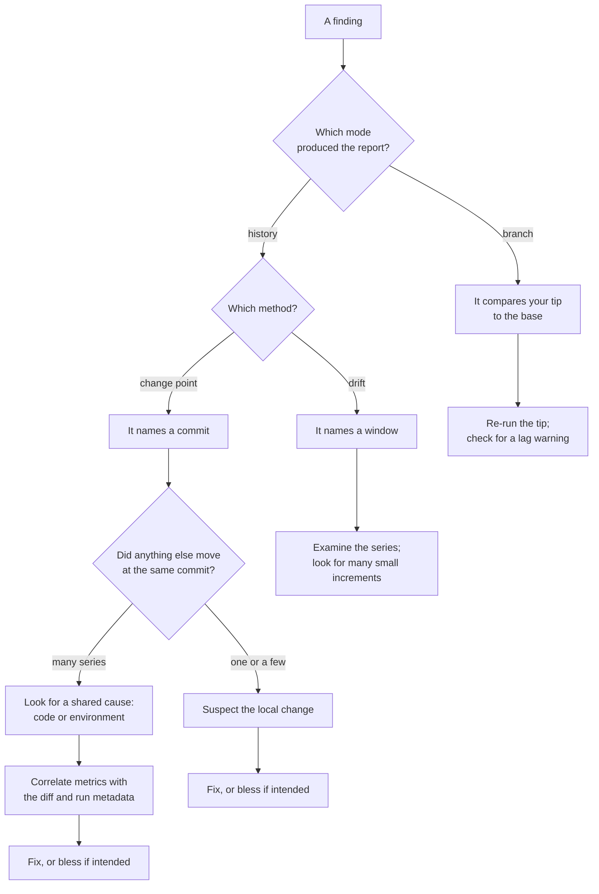

# Insights

Everything before this chapter explains what the tool does. This one is about what *you* do
with the result.

Two entry points, depending on which problem you have:

- **[I have a finding](#i-have-a-finding)** — something was reported and you need to act.
- **[I expected a finding and got none](#i-expected-a-finding-and-got-none)** — the checklist
  for tracking down where a real regression was dropped.

## I have a finding

Note that a branch finding is labelled `change point` in the report — the method names the shape
of the comparison, not the mode. The report's header tells you which mode ran.

### A change point

The finding names the **first commit that already shows the new level**. That is not
necessarily the commit that caused it — if collection is sparse, the cause is somewhere in the
gap before it.

1. **Look at the series.** `cargo bench-history examine --benchmark <qualified-id> --metric <name>`
   prints every stored point. Both values come from the finding. The chart in the report is a
   summary; this is the data.
2. **Check whether the attributed commit has a neighbour gap.** If the previous observation is
   twenty commits back, your suspect list is those twenty commits, not one.
3. **Check what else moved.** Many simultaneous steps suggest a shared cause, not a specific
   one. The cause may be shared code such as an allocator, runtime or dependency, or an
   environment change such as the toolchain, runner, or hardware. Correlate the affected metrics
   with the commit diff and run metadata before attributing it.
4. **Decide.** Fix it, or accept it with [`bless`](../commands/bless.md), which re-baselines
   the series so it stops being re-reported.

### A drift

A drift names a window, not a commit, because that is what the evidence supports: no single
commit is responsible.

The usual cause is genuinely incremental — a container that grew, an abstraction that gained a
layer per change, a loop that got one more thing to do each month. That is exactly the class
of regression that comparing against the previous release will never catch, which is why the
tool looks for it.

1. **Examine the series** and look at the shape. A true drift climbs steadily.
2. **If it climbs in visible steps instead**, the drift detector won on residuals but the real
   story is several small change points. Bisect: analyze with `--context` set to a commit
   partway through the window, and see where the level sat then.
3. **Check the window's length.** A drift over a long window with sparse observations may be
   two distant levels with nothing in between. The chart shows the gaps to scale.

### A branch finding

Branch mode judges **only your tip commit**, against the base's current level. Your branch's
intermediate commits are ignored — only the tip merges.

1. **Re-run the benchmark on the tip.** Branch findings rest on a small sample, often a single
   run. A second run costs little and settles most questions.
2. **Look for a comparison-base lag warning.** On a rotating CI pool, your runner's machine key
   may only have base data from several commits back. The comparison is still valid, but it is
   against an older base state than you might assume.
3. **Check whether the base itself recently moved.** If the base stepped a few commits ago and
   your branch merely matches the new level, that is worth knowing before you go looking
   through your own diff.

## Unreliable or inconsistent hardware

**Symptoms:**

- Many unrelated benchmarks step at the same commit without a corresponding shared-code change.
- A series oscillates between two levels rather than wandering around one.
- Findings appear and disappear between runs with no code changes.
- The report's coverage drops, or comparison-base lag warnings appear.

**Diagnosis:**

- `cargo bench-history list discriminants` shows how your history is partitioned. Several
  machine keys where you expected one means the pool is rotating.
**Remedies:**

- [`backfill`](../commands/backfill.md) on each machine so each key
  accumulates its own usable history.
- For a one-off infrastructure step you accept, `bless --all` re-baselines everything at once.

## Unreliable benchmarks

A noisy benchmark is not merely unpleasant — it is **actively harmful to detection**. The
[residual gate](gates.md) measures a candidate move against a multiple of the series' own typical
residual, so on a benchmark that scatters widely the move has to be several times that scatter
before anything is reported. Noise does not just add false alarms; it hides real regressions, and
it hides them at a threshold well above the scatter itself.

**How to recognise one:**

- The series oscillates between two levels instead of varying around one. Usually a code path
  that gets taken sometimes: a cache that sometimes hits, an allocation that sometimes
  triggers a resize.
- Occasional points far from the rest. Usually the operating system — a scheduler decision,
  a page fault, another process.
- Drift that tracks nothing in your code. Often a data structure that grows across iterations.

**Fixes, roughly in order of effect:**

1. **Measure instruction counts instead of wall time** where you can. Callgrind's counts are
   the least noisy thing available, at the cost of not measuring what the user experiences.
2. **Pin instruction layout.** An unrelated dependency bump can move a hot loop across a cache
   line boundary and produce a phantom regression with no source change. See [Measurement
   stability](../concepts/stability.md).
3. **Use `--best-of N`** to take the minimum of several runs. Note the caveat below.
4. **Remove the variable path** from the benchmark itself: pre-warm caches, pre-size buffers,
   fix the input.

> **`--best-of` is a protocol, not a flag.** The stored value depends on how many repetitions
> you ran, so changing `N` shifts every series at once and reads as a suite-wide step. Pick a
> value and keep it. If you must change it, expect a step and bless it.

### Multithreaded and OS-waiting benchmarks

These deserve their own mention because they are the worst case and the most commonly
attempted.

A benchmark that waits on another thread, a lock, the filesystem, or the network is measuring
the operating system's scheduling decisions at least as much as your code. The scatter is
large, and it is not symmetric — waits have a floor and a long tail.

The consequence follows from the [residual gate](gates.md): the band widens until only
enormous moves clear it. The benchmark still runs, still records, still looks like coverage in
the census — and detects almost nothing.

*What to do instead:* measure the single-threaded work directly, and test concurrency
behaviour with something other than a benchmark. If you must measure a concurrent path,
instruction counts degrade far more gracefully than wall time.

## I expected a finding and got none

Work down this list. Each step names the chapter that explains it.

1. **Was the series judged at all?** Read the report's coverage line, or the verbose
   per-series reasoning. An unjudged series is never a silent skip — the reason is stated.
   → [Multiplicity and coverage](coverage.md)
2. **Is it a ghost?** If the benchmark did not run at the analyzed commit, every one of its
   metrics was dropped before detection. This is the single most common cause of a surprising
   silence. → [Reconstruction](reconstruction.md)
3. **Is there enough history?** Both sides of a step need enough commits. A benchmark added
   recently cannot produce a change point yet. → [Detection](detection.md)
4. **Does the move clear both floors?** Relative *and* absolute. A large percentage of a tiny
   number does not qualify. → [Noise gates](gates.md)
5. **Is the series too noisy?** Compare the move against the series' own scatter on the chart.
   If it sits inside the band, that is your answer — and the benchmark, not the tool, is what
   needs work. → [Noise gates](gates.md)
6. **Is the judged family large?** Read the report's judged count. A marginal finding must clear
   a stricter bar for an analysis that judged many series than for one that judged few.
   → [Multiplicity and coverage](coverage.md)
7. **Was it an improvement in history mode?** Improvements are detected and corrected, but not
   displayed by default. → [Reporting](reporting.md)
8. **Was it blessed?** A blessing re-baselines the series, so moves before the blessed commit
   are no longer considered. → [Reconstruction](reconstruction.md)

If none of these explains it, the fastest way to see exactly which check declined the
candidate is to look at the series directly with
[`examine`](../commands/examine.md) and compare it against the gate order in
[Noise gates](gates.md).
