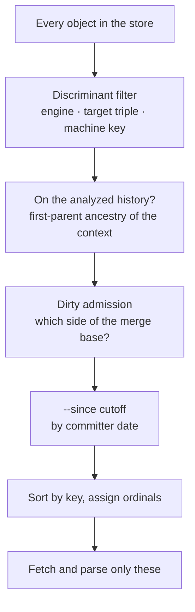
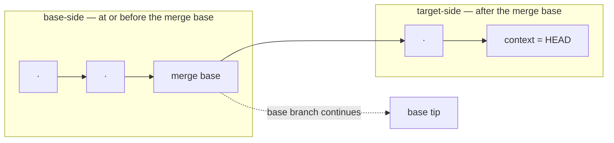

# Selection

Selection answers one question: **which stored runs are eligible for this analysis?**

It answers it entirely from **storage keys and git topology**. No excluded object is ever
fetched or read — which is what keeps analysis fast against a store holding years of history,
and why the stage exists as a stage at all.

## Terms used here

{{#include generated/terms-selection.md}}

## The funnel

{{#include generated/selection-funnel.svg}}

{{#include generated/selection-funnel.md}}

## Target, base, and the split

Two refs frame every analysis:

- the **context** (`--context`, default `HEAD`) whose history is analyzed, and
- the **base** (`--base`, default the detected default branch).

The tool walks the context's first-parent ancestry and splits it at the merge base with the
base. Everything at or before the merge base is **base-side**; everything after is
**target-side**.

If the base cannot be resolved, or shares no ancestor with the context, that is a **hard
error** — not a silent fallback. The usual cause is a shallow CI clone; fetch full history, or
pass an explicit `--base`.

## Mode is derived, not chosen

From the shape of the history it is handed, selection derives an **analysis mode**: the question
the rest of the pipeline will answer about the series. There are two, and later stages —
detection above all — branch on the one selection chose:

- **History mode** — does a level move somewhere in an official branch's own history?
- **Branch mode** — is a feature branch's tip off the base it would merge into?

There is no flag to force the choice. The tool reads two signals:

{{#include generated/selection-mode-table.md}}

The second signal is the surprising one. A run recorded from a **dirty working tree on top of
the base tip** selects branch mode, because that is what it is: work that is not in the base's
history yet, sitting on top of it. An unnamed feature branch.

Note it is the *admitted run* that decides this, not the state of your checkout. A dirty
checkout with no dirty run in the analysis still analyzes as history.

## Dirty admission

A dirty run is one measured with uncommitted changes. Where it is allowed depends on which
side of the merge base it sits:

| Side | Clean runs | Dirty runs |
|---|---|---|
| Base-side (at or before the merge base) | admitted | rejected |
| Target-side (after the merge base) | admitted | admitted |
| The base tip itself | admitted | admitted, but only while the tree is currently dirty |

{{#include generated/selection-dirty.svg}}

*Why base-side dirty runs are rejected:* the base is the reference the analysis compares
against. A measurement of somebody's uncommitted experiment is not a description of the base's
history, and letting it in would corrupt the baseline for everyone.

`--no-dirty` removes dirty runs from the target side as well, so no dirty run is admitted
anywhere — the base side already rejects them regardless.

## The window

`--since` drops whole runs older than a cutoff, judged by each commit's **committer date**.

The default is where the two modes diverge, and it is worth knowing which you are in:

- **History mode** applies a six-month look-back by default, so a scheduled trend watch does
  not silently widen as history accumulates.
- **Branch mode** applies **no default**. A branch is judged against its base's recent
  commits, and a time window could only starve that comparison of evidence.

The cutoff is deliberately one-sided. There is no `--until`, because `--context` already
anchors the newest edge of the timeline — a topology-first tool moves the tip by naming a
commit, not by naming a date.

> A `--since` shorter than your collection cadence will quietly turn a healthy store into a
> report full of unjudged series. The report's coverage line is where that shows up.

## Discriminant filters

Three discriminant filters restrict which discriminant sets participate: `--engine`,
`--target-triple`, and `--machine-key`. Each is repeatable and unioned.

Omitting one auto-detects from the host — except `--engine`, which defaults to all of them,
since a machine can produce output from several engines at once. The literal `all` disables a
filter entirely.

Because auto-detection means the same command can search different data on different machines,
every query prints a one-line **effective selection summary** to stderr, naming what was
actually searched and which parts were defaulted. It is not opt-in.

## Ordering is fixed before any parallelism

Runs that survive the preceding selection stages are sorted by storage key and assigned their
positions **before** any object is fetched. Loading is then parallel, but the result is not
affected by which worker finished first.

Two analyses of the same store therefore produce byte-identical reports. That is what makes a
report diffable and a regression in the tool itself detectable.

## What the other commands share

`analyze`, `list runs`, and `examine` run this same selection pipeline, so `list` genuinely
previews what `analyze` would consume. Three of the columns below name concepts that later
chapters introduce — [benchmark prefixes](../commands/bless.md), the
[ghost filter](reconstruction.md#ghost-elimination), and
[blessings](reconstruction.md#blessings) — so a linear reader is not expected to know them yet;
they are forward references. The divergences are real, though, and worth knowing:

| | Discriminant filters, window, dirty rules | Benchmark prefixes | Ghost filter | Blessings |
|---|---|---|---|---|
| `analyze` | yes | yes | yes | yes (history mode) |
| `examine` | yes | yes | no | no |
| `list runs` | yes | no | n/a | n/a |
| `prune` | its own rules | n/a | n/a | n/a |

`examine` deliberately skips the ghost filter and blessings: it is a drill-down onto raw
recorded data, and hiding points there would defeat its purpose. `prune` is a maintenance
command with its own selection rules — notably no default `--since` — because deleting data
by accident is much worse than analyzing too little.

## An off-chain merge base is a hard error

The merge base must lie on the context's first-parent line. If it resolves but sits off that
line — which happens when the base was merged *into* the branch rather than the branch being
rebased onto it — there is no point at which to split the branch from its base, and so no
baseline to compare against. That is as un-analyzable as a merge base that cannot be resolved at
all, so it stops the operation with an error rather than silently analyzing a topology it cannot
compare.

Rebase the branch onto its base, or analyze a `--context` whose first-parent history reaches the
merge base.

## What selection hands on

An ordered set of eligible objects, and the topology needed to place them. Next:
[Reconstruction](reconstruction.md).
