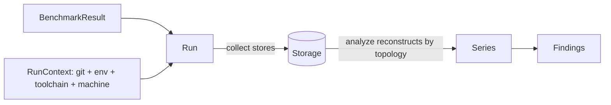

# Comparability and partitioning

The central tenet: **partition only by what makes results fundamentally incomparable; record
everything else as metadata so the analysis can see its effect over time.**

## Discriminant sets

Two results are comparable exactly when their **discriminant sets** match. A discriminant set
is `{ project, engine, target_triple, machine_key }`:

- **`project`** — workspace identity (configured, defaulting to the repository directory name).
- **`engine`** — different units and semantics never mix.
- **`target_triple`** — even simulated counts are not comparable across
  architectures.
- **`machine_key`** — always present: a fingerprint of the host the benchmark ran on. Every
  engine is partitioned by it, because every engine's numbers vary with the hardware in
  practice. See [machine-key](../commands/machine-key.md).

Deliberately **metadata, not partition** — so a change shows up as a timeline step, which is
the whole point of the tool — are the toolchain versions, OS/libc, commit, branch, and
environment provider. A rustc bump therefore appears as a step in the series rather than
silently forking history.

## Ordering the timeline

A series is built per `(discriminant set, benchmark identity, metric)` and ordered by git
**first-parent topology**, not by wall-clock time. Every run does carry a single wall-clock
observation timestamp, but it is provenance only and never orders anything — a benchmarked
commit's position on the timeline is its committer date, read from the git graph at analyze
time, so a rebase or amended date can never leave a stale timestamp behind.

## Benchmark identity

A benchmark identity is an ordered, non-empty list of string segments; each engine adapter
decides the segments, and reports render the full form with segments joined by `/`. Renaming a
benchmark starts a new series. Because identity is per discriminant set, the same benchmark can
exist under several triples or machine keys at once.
