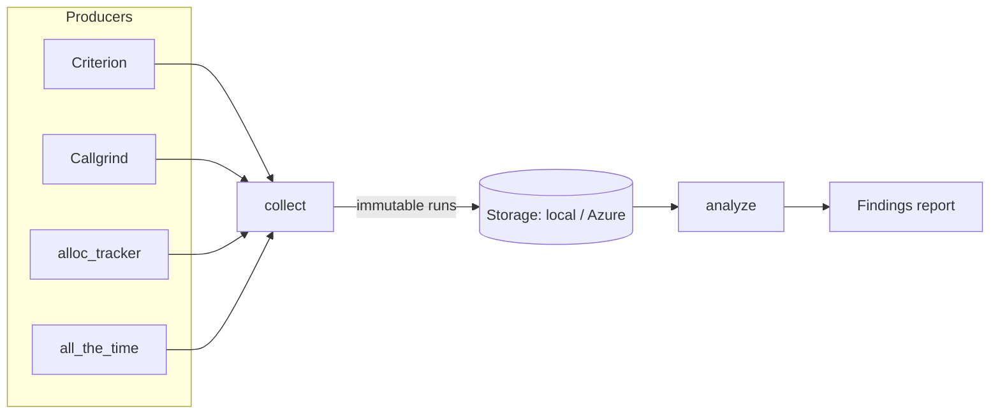

# Introduction

`cargo-bench-history` is a Cargo subcommand that maintains a long-lived history of
benchmark results and analyzes it for trends that snapshot-only tooling cannot see — for
example "benchmark X has been getting incrementally slower over the past 12 months" or
"scenario Y regressed after commit Z, visible only in hindsight against noisy data".

Most benchmark tooling only reports the current run, or at best compares against the
previous local run. `cargo-bench-history` instead stores **every** run as an immutable
record — on the local filesystem or in an Azure Blob container — and reconstructs
per-benchmark series in git first-parent commit order, so historical trends become
analyzable.

## Who this book is for

This book is the user-facing guide: how to install the tool, wire up storage, collect and
backfill history, and read the analysis. It complements — but does not replace — two other
sources:

- The [API documentation on docs.rs](https://docs.rs/cargo-bench-history/) for the library
  surface.
- The in-repository design document for the internal architecture and rationale.

## How it fits together

1. [Install](installation.md) the tool and, optionally, write a starter config with
   [`install`](commands/install.md).
2. [`backfill`](commands/backfill.md) seeds history by benching a range of past commits, so
   analysis has a trend to work with.
3. [`collect`](commands/collect.md) runs the workspace benchmarks for the current commit
   and adds the results to that history.
4. [`analyze`](commands/analyze.md) reconstructs per-benchmark series and reports
   regressions and drift.
5. [`examine`](commands/examine.md), [`list`](commands/list.md),
   [`prune`](commands/prune.md), and [`bless`](commands/bless.md) inspect, preview, tidy,
   and re-baseline the recorded history.
