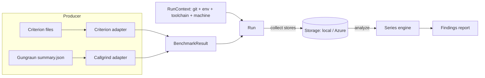

# cargo-bench-history — Design

A Cargo subcommand that maintains a **long-lived history** of benchmark results and
analyzes that history for trends that snapshot / "previous run" tools cannot see:

* slow incremental drift (a scenario that got 30 % slower over a year, 1 % at a time);
* step changes attributable to a specific commit, visible only in hindsight once the
  noise averages out;
* regressions distinguished from measurement jitter by engine-aware statistics rather
  than a single noisy neighbour.

It stores every result over time (local path or Azure blob), runs in multiple
environments (dev PC, GitHub Actions, ADO), and partitions data only where results are
not otherwise comparable. Its commands are `collect`, `install`, `analyze`, `examine`,
`backfill`, `list`, `prune`, `bless`, and `unbless`.

## 1. Benchmark engines and what they emit

Understanding the producers is mandatory: comparability and parsing both depend on it.
Four engines are supported, and they split along two axes that drive the whole data
model — **hardware-dependent vs. hardware-independent** (which decides partitioning), and
**whether each measurement carries a confidence interval** (which decides how dispersion is
gated). No engine is exempt from run-to-run noise.

* **Criterion** — wall-clock time. Hardware-dependent and noisy. Each measured case
  yields a stable identity (group / function / value) and a point estimate (the
  regression-line slope when Criterion sampled linearly, else the mean) with a standard
  deviation and bootstrap confidence interval. It records no timestamp, commit, machine,
  or package, so the tool supplies all run context.
* **Callgrind (via Gungraun)** — simulated instruction and branch-execution counts.
  Hardware-independent but not exact: a CPU simulator is low-noise, yet its counts still
  drift by a few percent run to run. Only the build-stable events are tracked — the
  instruction count (`Ir`) and the two branch-execution counts (`Bc`, `Bi`). Gungraun also
  emits cache-simulation counts (`L1hits`/`LLhits`/`RamHits`), the derived `EstimatedCycles`,
  and the branch-misprediction counts (`Bcm`/`Bim`), but those are **not** parsed or
  persisted: at microbenchmark magnitudes they track binary layout rather than the code under
  test, so they cannot be compared across builds (see §8). Its machine-readable summary is the
  one output that must be opted into with an environment variable — the narrow "special need"
  that justifies `collect` existing at all.
* **`alloc_tracker`** — heap allocations (bytes and counts). Hardware-independent but not
  deterministic: warmup and buffer-resize allocations are amortized over a Criterion-chosen
  iteration count, so the per-iteration figures jitter. It prefers a warmup-robust slope and
  records a bootstrap confidence interval over its measured spans when its output carries one.
* **`all_the_time`** — processor (CPU) time. Hardware-dependent and noisy, carrying a
  bootstrap confidence interval like Criterion.

The two workspace-local crates (`alloc_tracker`, `all_the_time`) each auto-emit one flat
JSON file per operation on drop, so they need no opt-in and the operation name alone
identifies the series.

Despite differing in units, noise, and hardware-dependence, all four reduce to the same
shape: *a stable benchmark identity → a set of named numeric metrics*. That shared shape
is the foundation of the model.

## 2. Core concepts and data model



* **Benchmark identity** — the stable identity of a series, an ordered non-empty list of
  string segments. Each engine adapter decides the segments, so the identity type carries
  no engine-specific assumptions about which component is the "group" or the "case".
  Callgrind includes the workspace package (so equally named bench targets in different
  packages do not collide); Criterion and the two measurement crates carry no package —
  Criterion is safe because the workspace crate-prefixes its group ids, and the
  measurement crates identify a series by operation name. Reports render the full form
  with segments joined by `/`. Renaming a benchmark starts a new series.
* **Metric** — a kind plus a value, with optional dispersion (standard deviation and a
  confidence interval) where the engine reports it. Each kind has exactly one unit and
  its own display name, so there is no separate unit or name field. The value is the
  point estimate; for noisy engines it is the regression slope where available, else the
  mean.
* **Run** — one immutable stored file: the run context plus the benchmark results
  produced by one engine in one execution.
* **Observation timestamp** — every run carries a single wall-clock timestamp: when the
  benches ran and were stored. It is **provenance only** and never orders anything. It
  names dirty snapshot files so concurrent snapshots of one commit coexist. The
  benchmarked commit's position on the timeline — and the basis for the `--since` /
  `--until` window — is its committer date, read from the git graph at analyze time and
  never copied onto the run, so a rebase or amended date can never leave a stale
  timestamp behind. There is deliberately no "effective timestamp" concept and no
  timestamp override.
* **Discriminant set** — the partition under which a series accumulates. Two results are
  comparable exactly when their discriminant sets match.
* **Machine key** — a stable hardware fingerprint used only by hardware-dependent
  engines.

## 3. Comparability and storage partitioning

The central tenet: **partition only by what makes results fundamentally incomparable;
record everything else as metadata so the analysis can see its effect over time.**

A discriminant set is `{ project, engine, target_triple, machine_key? }`:

* `project` — workspace identity (configured, defaulting to the repository directory
  name).
* `engine` — different units and semantics never mix.
* `target_triple` — even hardware-independent counts are not comparable across
  architectures (`…-windows-msvc` and `…-windows-gnu` are genuinely different binaries).
* `machine_key` — present only for hardware-dependent engines; a literal `synthetic`
  placeholder for the hardware-independent ones.

Deliberately **metadata, not partition** — so a change shows up as a timeline step, which
is the whole point of the tool — are the toolchain versions, OS/libc, commit, branch, and
environment provider. A rustc bump therefore appears as a step in the series rather than
silently forking history.

### 3.1 Target triple and cross-OS (WSL) execution

`target_triple` describes **where the benchmark binary actually ran**, and is always the
triple of the host the tool runs on. There is no override and no per-engine special case:
the tool and the benches it launches always run in the same environment, so the host's
triple is the execution triple. A run under WSL is a Linux benchmark — the tool process
runs inside WSL, the measured binary is the Linux target, and the detected triple is the
Linux one. The golden rule follows directly: run the tool in the same OS context as the
benches (invoke the whole tool inside WSL, not from the Windows side), because
auto-detection at the tool is the only thing keeping each platform's data in its own
series.

### 3.2 On-disk / blob layout

The layout is immutable and append-only-by-new-file, and works identically on a local
filesystem and a blob container (no read-modify-write races in concurrent CI). The key
shape is:

```
<root>/v1/<project>/objects/<engine>/<target_triple>/<machine|synthetic>/<commit>/
    clean.json                    # ≤1 per commit — the canonical point for a clean tree
    dirty-<observation_unix>.json # 0..N snapshots taken on top of this base commit
```

Data objects live under a per-project `objects/` subtree so project-level metadata (today
the cache-invalidation marker; perhaps an index later) can sit as a **sibling** without a
layout migration and a data listing can never pick it up.

The segment above the commit is the discriminant set; the commit is a directory, and
**clean vs. dirty is filename semantics** within it. This is dictated by how `analyze`
selects data: storage is not a pre-assembled timeline but is pieced together at query time
by resolving git history into an ordered set of commits and reading each commit's
directory. So the key is indexed by commit and ordering comes from git topology, never
from a timestamp baked into the key.

A clean run maps to the single deterministic key `…/<commit>/clean.json`, so collision
detection rides on the write-once storage contract: a second clean run of the same commit
fails atomically with nothing written, with no separate exists-check round-trip. A dirty
run is keyed by its observation second so successive snapshots coexist. Branch is not a
path component — a commit ID is globally unique, so the same commit on two branches is
one point, and branch selection happens at query time. Each path segment is sanitized so a
stray separator in a value cannot split the key into the wrong number of segments.

*Considered and not adopted:* hoisting the run *kind* into the key path (separate
`runs-clean` / `runs-dirty` / `blessings` prefixes) so a single-kind query could narrow to
one prefix. It is rejected because the cost it targets is already avoided — `analyze`
filters non-admitted candidates from the key alone before any body is fetched — and
because the commit-centric grouping co-locates a commit's clean run, dirty snapshots, and
blessing sidecars under one directory, which is exactly what lets `prune` drop a commit's
whole set and keeps a blessing adjacent to the run it baselines.

### 3.3 Discriminant sets and query facets

A series is only ever built within one discriminant set. Three facets select which sets a
query operates on: engine, target triple, and machine key. (Earlier drafts also exposed
derived OS / architecture facets; they were removed because duplicating the target-triple
dimension confused users — filter on the triple directly.)

Each facet is repeatable, unions its values, and accepts the literal `all` to widen past a
dimension. Omitting a facet **auto-detects the current machine**: the triple defaults to
the host triple and the machine key to the host fingerprint, so a bare query reports *this*
machine's data; engine has no machine-derived value, so it defaults to all engines. A
`synthetic` set always passes the machine-key facet regardless of its value, so
auto-detecting the host fingerprint still includes every hardware-independent set. A facet
that matches several sets yields one report per set — parallel data sets analyzed
individually.

The commands divide into **create** and **query** roles. `collect` and `backfill` record
new data into exactly one machine's reality, so they auto-detect every facet and accept
only a machine-key override (for a stable CI-pool key); they reject engine or triple
selection and the `all` keyword. Every other command queries existing data and uses the
full repeatable, `all`-aware, auto-detecting facet model.

## 4. Machine key

The goal is a fingerprint equal for pool-equivalent machines and different for genuinely
different hardware; it is **never** keyed on hostname or serial, since cloud pool nodes
differ in name but are equivalent. It hashes the stable, pool-equivalent attributes
available without elevated privileges across platforms — the processor and memory-region
counts (from the in-workspace `many_cpus`) and a best-effort CPU brand string. Finer
signals such as RAM size or base frequency were left out for little discriminating value
in homogeneous CI pools.

Because the key is persisted and compared across machines and tool versions, it uses a
**fixed** hash (not a seeded/default hasher) over a version-tagged canonical string,
truncated to a compact path segment, and a golden test pins a fixed profile to its digest
so an accidental change to the canonical form is caught. A command-line override wins over
the computed fingerprint (it is CLI-only — a committed config would carry a machine key
wrong for some checkouts). The key is computed only for hardware-dependent engines.

## 5. Run context

Captured once per stored run: the observation timestamp (above); the git commit, branch,
and dirty flag (branch is metadata only — query-time topology decides series membership,
and parent lineage and committer date are resolved from a live repo at analyze time rather
than stored); the environment provider, run id, and PR number detected from the
environment (with `Local` a first-class provider alongside the automated ones); the rustc
and cargo versions and the resolved execution triple; and provenance (tool version, schema
version, machine key). Git and environment access go through a small abstraction so the
logic is unit-testable without a real repo or CI.

## 6. Storage

Storage is modelled as a small async port with two backends. Its object model is the
lowest common denominator of a filesystem and a blob container — flat keys, list-by-prefix,
immutable objects — so both backends implement it with no special-casing upstream. Because
async trait methods are not object-safe, backend selection is a static-dispatch enum rather
than a boxed trait object, and the commands stay backend-agnostic by holding it.

The defining tenet is **write-once immutability**: writing an existing key fails, which is
the basis of the clean-collision refusal. A replacing write is a deliberate escape hatch
(the `--overwrite` path). Delete removes one object and is used only by `prune` and
`unbless`. Per-key immutability is what makes the read-through cache correct.

Stored bodies are **gzip-compressed** at the port boundary by a shared codec both backends
call, so every command hands and receives plain JSON and is unaffected. This is a breaking
format with no migration: a legacy plaintext object fails loudly on read because the gzip
magic never collides with JSON's first byte. The test fake stays plaintext (no test
inspects raw bytes, and it keeps the Miri-driven suite fast).

The two backends:

* **Local filesystem** — root selected at run time (below), created on demand, walked
  iteratively.
* **Azure Blob** — always compiled in, because the tool is installed without feature
  flags and a build-time gate would only hide a backend the user explicitly configured.
  Authentication is **Microsoft Entra ID (OAuth) only**, resolved once and always over
  HTTPS (bearer tokens require TLS); the legacy shared-key and verbatim-SAS modes were
  removed, and a leftover key/token field is now a loud config parse error. In a GitHub
  Actions job configured for federation the credential self-mints a fresh GitHub OIDC
  token on demand for each Entra exchange; otherwise it discovers a local `az login`
  session. Self-minting is load-bearing for multi-hour collection runs: a single federated
  sign-in caches one OIDC assertion that expires within minutes, so a long run's first
  token refresh would otherwise re-submit a dead assertion and be rejected. The chosen
  credential is wrapped in a caching decorator that serializes token acquisition, so a
  concurrent read burst shares one acquisition instead of racing the platform token-cache
  lock. Every per-object blob client shares **one** pooled HTTP transport, so a
  high-concurrency load keeps connections alive across objects instead of paying a fresh
  handshake per object (and exhausting ephemeral ports); the transport keeps automatic
  decompression off, since the storage layer inflates gzip itself.

The Azure backend is exercised in CI two complementary ways: against the **Azurite
emulator** (the default, fork-safe path — Azurite has no real Entra, so it runs in a
signature-free OAuth mode over HTTPS behind a throwaway certificate, with a faked token and
a cert-trusting transport injected through a test seam) and against a **real Storage
account** (which proves real Entra signature validation the emulator cannot, using a fresh
auto-deleted container per test). The network tests self-skip when their backend is not
configured, so a normal run stays green without one.

### 6.1 Selecting a backend

A local-storage path is machine-dependent, so it is never carried in the shared,
version-controlled config file. The config holds only an optional cloud backend (an
externally-tagged table of which at most one may be configured); local storage is chosen
at the command line or environment. A leftover local-storage table from an earlier scheme
is rejected at parse time rather than silently ignored, nudging the user to remove it.

Every storage-backed command takes a `--local` flag and resolves the backend in
precedence: an explicit `--local=<path>`; a bare `--local` meaning "the path in the
storage environment variable" (unset/empty is an error); otherwise the configured cloud
backend; otherwise a configuration error. `--local` thus always overrides a configured
cloud backend. `collect --no-store` is the one exception — it skips selection entirely.
The environment read is isolated behind a thin edge feeding a pure resolver, so the
decision logic is unit-testable without touching the process environment.

### 6.2 Read-through cache for the cloud backend

The read commands (`analyze` / `list` / `prune`) load the whole in-selection history before
reconstructing a series, and against the cloud backend that is one download per object — so
CI re-fetches everything even though almost all of it is identical to the previous run. An
optional on-disk **read-through cache** removes that waste: each run pays the network cost
only for objects it has never seen, and the cache survives between CI runs via the standard
Actions cache.

The cache mirrors fetched object **bodies**, keyed by storage key. It never caches the
**listing**: discovering the current key set is one cheap round-trip whose whole purpose is
to see what is new, so it always goes to the cloud and a freshly stored object is still
found (its body simply misses and falls through). Trusting a cached body forever is sound
because the model is **immutable per key**. Only delete and replacing-write break that, and
both are rare, deliberate administrative actions off the collection hot path.

Invalidation is a small **per-project marker** holding an opaque epoch token, kept as a
sibling of that project's object subtree. Before a load, the reader compares the project's
cloud marker against the epoch its mirror last recorded; on a mismatch it wipes **that
project's** mirrored objects and re-records the epoch. The wipe is deliberately coarse
(drop and re-download once) because mutations are rare, and only whether the token differs
matters — never its value or ordering — so clock skew between runners is harmless. The
marker is maintained by the cloud backend itself, so **every** writer, even a developer's
cache-less `prune`, invalidates other machines' caches: the local cache is a read-side
optimization, the marker a cloud-side correctness contract.

A cache only survives a CI run if that run never mutates an existing object. Collection is
therefore **append-only**: a same-commit re-run is a soft skip (the run still benchmarks
every engine, so a broken benchmark is still caught, but writes nothing) rather than an
overwrite. This keeps the production write path purely additive so it never bumps the
marker, and it makes stored measurements immutable — better history hygiene. Regenerating
data after a harness change stays a deliberate manual overwrite, which legitimately
invalidates caches.

A `--cache <dir>` flag (with an environment fallback) selects the directory on the read
commands. It is meaningful only with the cloud backend, so it **conflicts with `--local`**.
Its one scaling limit is the repository's Actions-cache quota; beyond it the cache degrades
to a partial restore — still correct, just less effective.

*Considered and not adopted:* caching the listing (would hide newly stored objects);
keeping collection on overwrite and detecting create-vs-replace at the backend (adds a
round-trip per write and leaves history mutable); building the cache into the Azure backend
to cache raw wire bytes (cheaper on a miss but not testable with in-memory fakes and
couples concerns — a storage decorator is fake-driven instead).

## 7. Commands

Every option is filed under a named help heading so `--help` reads as a small set of
labelled groups rather than one flat list, and the groups are shared across commands so a
given group looks identical everywhere it appears. The functional groups are environment
and execution, output, benchmark scope, feature selection, discriminant selection, commit
selection, and data filtering. Subjects are bare positional words, never flags: the
`runs|discriminants|blessings` selector for `list`, prefixes for `bless`, commits for
`prune`, and the range endpoints for `backfill`. A bare `list` with no subject is an error
that names the three.

### 7.1 `collect`

`collect` invokes the workspace's benches with `cargo bench` and harvests whichever
engines produced output — there is no engine configuration. It enables the combined
environment every supported engine needs (only Callgrind needs an opt-in variable; the
others auto-emit) and then inspects each output tree to see which engines actually ran.
Off-Linux the Callgrind benches compile to no-ops and simply produce nothing, so no OS
logic is needed in the tool.

The tool also pins an **absolute** target directory into the bench environment, because
cargo runs each benchmark binary with its working directory set to the owning package, so a
relative target path would be resolved there by an engine that honours it and scatter
output away from the workspace-rooted harvest. Harvest is scoped to files modified at or
after the run start, so stale cases from earlier runs are never re-ingested and whatever
subset actually ran is exactly what is stored.

`--best-of N` reruns the whole suite `N` times (default `1`) and stores, per metric, the
**minimum** observed value. Benchmark interference on a shared CI runner is one-sided — it
only ever makes a case *slower* — and the runs are spaced apart in wall-clock time (each
`cargo bench` takes many seconds), so a transient slowdown is unlikely to hit the same case
in every run; the minimum discards it. The winning sample is stored **wholesale** (its own
confidence interval travels with it), so a stored result may blend metrics selected from
different physical runs — accepted, since each metric is judged on its own timeline. Because
the runs must be reducible metric-by-metric, every run must measure the **same set of cases
and the same metrics per case**; any cross-run mismatch is a hard error that fails the whole
collection rather than being papered over. The stored run takes its observation time and
dirty-snapshot key from the **first** run's start (the git/toolchain/hardware context is
probed once, after the runs, and does not change between them), and any non-zero `cargo
bench` exit still aborts fail-fast. `N == 1` reproduces a plain single run. Two caveats
remain: a runner that is slow for the *entire* job is not corrected by the minimum, and
Callgrind's deterministic counts make min-of-N a (costly) no-op for that engine — but the
single `cargo bench` interface cannot select engines, so both are accepted.

`collect` always persists — there is no separate publish step (`--no-store` runs without
writing, for dry runs). A clean point writes the deterministic clean key, refused by
default if it exists (overwrite to replace, or skip-existing to treat it as a success and
write nothing — the append-only mode CI uses). A dirty snapshot coexists with prior
snapshots. An engine that harvests zero cases stores nothing, since an empty set carries no
comparable data.

Scope flags (`--workspace`, `--package`, `--exclude`, `--bench`) and cargo feature flags
translate directly to `cargo bench` arguments, and everything after `--` is forwarded
verbatim. Two non-overlapping partial runs at one commit do **not** merge — each would
write the same clean key and the second collides — so coverage gaps are expected to come
from *different commits* covering different subsets, not from multiple partial runs at one
commit.

Regardless of `--verbose`, `collect` prints a one-line **effective-partition** summary to
stderr naming the storage partition its results land in: the target triple (always the
toolchain host) and the machine key hardware-dependent engines use — marked as
auto-detected or as coming from `--machine-key`. This makes the otherwise-invisible
auto-detected partition self-describing on every run. `backfill` reuses the same `collect`
path and so emits the line per commit, each reflecting that commit's own probed toolchain.

### 7.2 `install`

Generates a fully commented example config if absent and points the user at it, never
clobbering an existing file. The template documents the optional cloud backend and notes
that local storage is selected at run time (flag or environment), not configured in the
committed file; it carries no engine or machine-key settings, and its next-steps hint
points at `backfill` for seeding an existing repository's history. The file write goes
through a port so the command is testable without touching the filesystem.

### 7.3 `analyze`

`analyze` **pieces a series together at query time from git topology**, so it requires a
resolvable git repository (the current checkout by default, or an explicit path); with no
repo it errors rather than guessing an order. Analyzing a foreign project's data means
checking out that project's repo and pointing `analyze` at it.

Two refs frame the analysis: a **target** (`--context`, default `HEAD`) whose history is
analyzed, and a **base** (`--base`, default the detected default branch). `analyze`
resolves the first-parent ancestry of the target and splits it at the merge-base with the
base: commits in the base ancestry contribute **clean points only**, while commits unique
to the target contribute **clean and dirty** points (a flag drops the dirty ones). This
single rule covers both use cases — an official view is `--context <default>` (everything
is base, so clean-only), and the "how does my feature fit in" view is the default (clean
base baseline plus the branch's own clean and dirty snapshots). Membership is purely
topological, so a dirty snapshot taken on a shared base commit is excluded from an official
view until it is committed.

Because that split is topological, the merge-base must be knowable. If the base ref cannot
be resolved (no `--base`, no configured or detected default branch), or it shares no common
ancestor with the target — typically a **shallow clone** whose fetched depth stops short of
the branch point, or a checkout that never fetched the base branch — `analyze` **errors**
and points at the fix (deepen the clone with `git fetch --unshallow` / `fetch-depth: 0`, or
pass an explicit `--base`) rather than silently treating the incomplete history as a
base-branch view. The tool has no requirement to support shallow or otherwise anomalous
history; an unknown topology is reported, not guessed around.

There is one carve-out to the clean-only base rule, for the common "first impressions"
case where a user runs `analyze` on the base branch with uncommitted changes (for instance
an untracked config file, so every stored run landed as a dirty snapshot on the base tip).
When the **working tree is currently dirty** and the target tip is base-side, that tip's
dirty snapshots are admitted — they are the user's in-flight work, not stale leftovers —
and the report ends with a warning that the data is ephemeral and suggests switching to a
branch to persist history. The exception is limited to the tip and a flag overrides it.

Series are ordered by git topology; runs on one commit sub-order clean-before-dirty, then
by storage key. The `--since` / `--until` window drops whole runs by each commit's
committer date (decided from topology before any out-of-window body is fetched); `--since`
defaults to a six-month look-back uniformly, so a scheduled trend watch does not silently
widen as history accumulates. Positional prefix subjects scope the analysis to benchmarks
whose id starts with a prefix; there is no metric filter, since metrics are an internal
detail users are not expected to know.

Output toggles select which renderings one analysis pass emits — text to stdout by default,
with file toggles that compose so a single pass can emit text, Markdown, and JSON at once;
requesting no output at all is an error. Beyond those three canonical renderings, `analyze`
offers one **derived** output — a condensed Markdown *summary* — for a downstream consumer
whose body has a hard size limit (the workflow posts it as a rolling GitHub issue, capped at
65,536 characters). The summary keeps only the most significant findings and drops the
per-facet grouping, so it is intentionally lossy; it is analyze-only because truncating a
ranked list is meaningless for the enumerating commands, and it never displaces the full
reports, which the workflow attaches alongside it. **Findings never affect the exit code**:
the process exits non-zero only when the analysis fails to *run*. A finding is advisory, and
the machine-readable signal lives in the JSON report. Downstream automation (a scheduled
regression watch, a PR comment bot) reads that rather than the exit status.

Regardless of `--verbose`, every query run (`analyze`, `list`, `prune`, `examine`) prints a
one-line **effective-selection** summary to stderr — the engine, target-triple, and
machine-key facets (each marked when auto-detected), the resolved base branch, and the
`--since` / `--until` window — so the user always sees what was actually searched, not just
what they typed. Two empty outcomes also explain themselves in the stdout report without
verbose diagnostics: when facet-matching runs were stored but none entered the analysis the
hint breaks down why, and when the effective (possibly auto-detected) partition holds no
runs at all the hint names that partition and suggests widening it. A zero-run outcome is
thus never mistaken for "no data", and an auto-detected partition that quietly missed is
never mistaken for an empty project.

### 7.4 `backfill`

`backfill` reconstructs history by checking out each commit in a range and running
`collect` for it — bootstrapping an existing repository's timeline, and also the convenient
path for ad-hoc evaluation over a span of commits. The range endpoints are inclusive
positional subjects. Commits are enumerated oldest-first along the first-parent mainline;
the tool first verifies both endpoints resolve and that the start is a first-parent
ancestor of the end, then derives the range purely from the end's history — so backfilling
does not depend on the current checkout or branch.

All work happens inside a dedicated **git worktree** under the temp directory rather than
in the primary checkout, so a dirty primary tree neither blocks backfill nor affects what
is measured (each point benchmarks a specific commit, never the working tree), and an
interruption leaves the user exactly where they were. Between commits the worktree is reset
clean while preserving the ignored build directory for incremental speed. By default,
commits that already have a stored result are listed once up front and **skipped before
their benches run**, making backfill resumable and cheap to re-issue; overwrite regenerates
them. A build or bench failure stops by default (or, with a flag, is recorded and skipped
with an end-of-run summary), while infrastructure failures always abort since continuing
cannot produce correct data. `--best-of N` carries through to each commit's `collect`, so a
backfill can apply the same min-of-N noise reduction (§7.1) uniformly across the range.

### 7.5 `list`

`list` **previews the exact data set an `analyze` pass would consume**, without running the
analysis, letting a user confirm the commit range and discriminant sets first. For the
`runs` and `blessings` subjects it **mirrors `analyze`'s data-set-selection parameters
exactly** through the same shared selection pipeline, and the two must stay in lockstep — a
selection parameter added to one is added to the other. It omits only the analysis-only
flags. `list runs` reports, per discriminant set, the run / series / per-commit counts of
the selected runs (each commit's clean/dirty split), oldest-first by topology.

`list discriminants` is a different view: a **discovery catalog** of the sets present in
storage, which requires **no repository** and so ignores the timeline and data-filtering
groups. Because it is a catalog, it is the one query view that does *not* default omitted
facets to the current machine — with no facets it lists every stored partition, so a user
can find triples and machine keys they do not already know. `list blessings` audits
blessings (below).

### 7.6 `prune`

`prune` **deletes a chosen portion of the stored data set** — to reclaim storage, discard a
bad run, or drop the ephemeral uncommitted-tree snapshots that evaluation runs leave
behind. It reuses `analyze`'s selection pipeline (keeping the three commands in lockstep)
and then removes the selected objects rather than reporting on them.

A deletion **scope is required** — clean runs (and the blessings riding on them), dirty
snapshots only, or both — so a bare `prune` is an error that names the three. Pruning never
touches base-branch history: it walks the selected commits from the context back to the
merge-base with the base and deletes only the context branch's own commits, preserving the
shared base. Deleting the base branch's own data set (context resolves onto the base) wipes
the mainline every feature analysis compares against, so it is refused unless a confirming
flag is passed. The one intentional divergence from `analyze` / `list` is that the base
tip's dirty snapshots are admitted **unconditionally**, so a dirty prune can reclaim
ephemeral base-branch snapshots regardless of the current tree state. A blessing is removed
only when the clean run it annotates is removed in the same pass, so blessings follow their
clean run and are never time-filtered directly. A dry-run builds the identical plan but
skips the deletes.

### 7.7 `bless` / `unbless`

A **blessing** manually accepts an intentional performance change on the base branch so
history analysis stops re-flagging it: sometimes a regression is a deliberate tradeoff, and
without a way to record that, every subsequent `analyze` would keep reporting the same
accepted step forever. Blessing re-baselines the series from the blessed commit forward.

`bless` takes one or more benchmark-id prefixes matched against the qualified identity, so
it is deliberately per-benchmark — accepting the benchmark that caused trouble must not
silently accept every other benchmark that may be trending badly unnoticed. An all-switch
(mutually exclusive with prefixes) accepts every benchmark recorded at the commit. Both
commands operate on a context ref (default `HEAD`), so any base-branch commit can be
(un)blessed, not just the checked-out one. A blessing is recorded only when the context
commit is **on the base branch** and a clean run already exists there; both are hard errors
otherwise, with no force escape hatch, because a feature-branch blessing would vanish or
duplicate once the branch is squash-merged and blessing a commit with no data point is
meaningless. A dirty working tree is allowed (the blessing targets the committed run) but
warns.

A blessing is an **append-only sidecar** alongside the commit's clean run, so narrowing one
means unbless-then-re-bless the subset to keep, and overwriting a commit's clean run drops
its stale sidecars. `unbless` deletes only the blessings recorded at the context commit;
blessings at later commits stay in effect, so the timeline may remain blessed past the
unblessed commit. `list blessings` audits them — the sidecars at the current commit by
default, or the most recent blessing of every benchmark across the analysis window.

### 7.8 `examine`

`examine` answers the question a finding raises: *which commits actually moved this
number?* Where `analyze` reports that a benchmark's metric shifted and draws a small chart,
`examine` **pivots that chart into its data points** — one row per recorded observation of a
single `(benchmark, metric)` series, in git first-parent order, each row pairing the value
with the short commit id and the start of the commit's title. A maintainer reads the values
down the column, spots where one jumps, and reads across to the title to correlate the move
with what that commit changed.

It is a **drill-down sibling of `list runs`**: both are read-only previews over `analyze`'s
exact data-set selection that never analyze, so `examine` reuses that selection pipeline
unchanged and stays in the same lockstep — a selection parameter added to `analyze` is added
to `list`, `prune`, and `examine` alike. Like `analyze` it requires a resolvable repository
(it needs first-parent topology to order the points and each commit's title to label them)
and repeats the pivot once **per matching discriminant set**, since the same series can exist
under several triples or machine keys.

Two required options name the series, and they are the one place a command names a
**metric**: `--benchmark <qualified-id>` selects exactly one benchmark identity and
`--metric <name>` one metric by its stable name. `analyze` deliberately exposes no metric
filter because a user is not expected to know the internal metric names — but `examine`'s
input is an `analyze` *finding*, which already prints both the benchmark identity and the
metric, so pasting them back in is natural rather than guesswork. An unknown metric name is
rejected up front against the known set. An unknown or unmatched benchmark id is not an error
— whether an id exists is data-dependent — but yields an empty pivot explained by one of two
hints: when no run enters the selection at all, the same "matched no runs" hint `analyze`
gives; when runs enter but none carry the named `(benchmark, metric)` pair, a distinct hint
pointing at the unmatched benchmark id or metric name.

`examine` runs **no detection and no re-baselining** — it has no findings, modes, or
blessings. It shows every selected point exactly as the chart would plot it (a commit
carrying both a clean run and dirty snapshots contributes a row each, ordered
clean-before-dirty and flagged, so a value's provenance is unambiguous), which is why the
analysis-only flags (improvements, inactive findings) are not part of its surface. The
three output renderings compose from one pass as everywhere else: the per-commit table on
stdout by default, the same table in Markdown, and a machine-readable JSON form that carries,
per discriminant set, the ordered points with full-precision values and each commit's full
title — the 50-character title truncation is a readability convenience of the text and
Markdown tables, not of the data.

## 8. Analysis

A series is built per `(discriminant set, benchmark identity, metric)`, ordered by git
first-parent topology. The goal is **high signal-to-noise**: report level shifts and trends
that are real and stay silent on measurement jitter. **No engine is deterministic** — even
Callgrind's simulated counts drift by a few percent run to run, and an `alloc_tracker`
figure amortizes first-touch and buffer-resize allocations over a Criterion-chosen iteration
count, so its per-iteration figure wobbles too. The detector therefore treats every metric as
noisy and never trusts a value as exact.

This surprises people, because re-running Callgrind on one *unchanged* machine often prints
the same count every time — the counter is deterministic for a fixed binary and fixed input.
What is not fixed is everything feeding it across the commits we compare: a different OS or
CPU-microcode patch level, a different compiler patch release, the compiler's own run-to-run
nondeterministic code-generation choices (inlining, ordering, layout) even at the same
version, and Criterion scheduling a different iteration count when background load differs
(which changes how first-touch and buffer-resize costs are amortized). Any one of these moves
the measured number without the code under test changing, so no metric is reproducible commit
to commit.

For the Callgrind engine this layout-sensitivity is decisive at microbenchmark scale, and it
is why only a subset of its events is persisted. The instruction count (`Ir`) and the two
branch-execution counts (`Bc`, `Bi`) are stable enough to compare across builds: they count
*what the code did*. The cache-simulation counts (`L1hits`/`LLhits`/`RamHits`), the derived
`EstimatedCycles` (a weighted sum of the cache tiers), and the branch-misprediction counts
(`Bcm`/`Bim`) instead reflect *where the code and data landed in memory* — which cache line,
which page, which branch-predictor slot — and so swing by tens of percent between two builds
of identical source. This was confirmed empirically: the same commit measured from two
different checkout paths kept `Ir` and `Bc` bit-for-bit identical while `RamHits`, `Bcm`, and
`EstimatedCycles` all moved. Those six events are therefore never parsed or persisted; a
stored `Run` written before this policy that still lists them is read leniently, dropping the
now-unknown metric kinds rather than failing.

Engines differ only in *how much* dispersion they expose, and the gating adapts per point
rather than per engine. Most points carry an explicit bootstrap confidence interval:
Criterion, `all_the_time`, and `alloc_tracker` all record one on every operation they emit.
Only single-figure engines (Callgrind, and any legacy mean-only file the adapter still
tolerates) report a point without an interval. An interval, when present, is read as an
additional veto that can only *suppress* a candidate the other gates would report (never
create one); the gates' *primary* noise check needs no interval at all: it is the series' own
residual scatter about its fitted model, which covers every engine uniformly.

Every persisted metric is lower-is-better, so a rise is always a regression and a fall an
improvement; there is no per-metric polarity for the analysis to key off.

### 8.1 Findings: change-points and drift

Two finding *methods* are emitted per series and ranked together by descending relative
move:

1. **Change-point (step)** — the primary finding. A single most-likely level shift is
   located with the **Pettitt** nonparametric change-point test, splitting the series into
   a before regime and an after regime; the change is attributed to the commit at the start
   of the after regime, answering "what changed, and after which commit". Persistence is
   built in — both regimes must contain a minimum number of points — so a single-commit
   blip cannot trip it.
2. **Monotonic drift** — a separate finding type for slow trends. A **Mann–Kendall** trend
   test establishes that a monotonic trend exists and a robust **Theil–Sen** slope
   estimates its magnitude.

When both fire on one series, the **better-fitting model wins**: the step and line models
are each scored by their residual, so sharp steps route to the change-point method and
smooth ramps to drift, and the two never double-report one event.

### 8.2 Noise-aware gating

The same gates run for every engine; only their inputs differ. Pettitt *locates* the split
(its analytic p-value is too conservative on short series to gate on), and a change-point is
reported only when all of these hold: a **Mann–Whitney** rank test finds the two regimes
statistically distinguishable; the move clears a **practical-magnitude floor**, so a
statistically-real but trivial wobble stays silent; the move stands above the series'
own **residual scatter** about the fitted step — the median-absolute-residual gate that is
the primary noise check for *every* engine, in place of trusting a value as exact; and the
two regimes are **well-separated populations**, not merely distinguishable ones. That last
gate is an *effect-size* check — the Mann–Whitney **probability of superiority**, the share
of after-vs-before pairs that move in the finding's direction — and it must clear a floor
(`min_regime_separation`, default 0.85). It is a deliberate complement to the two robust
gates above, which share a **50% breakdown point**: a *stationary but very noisy* series
whose value oscillates between two levels defeats them, because Pettitt aligns the split
with the dominant level on each side, leaving under half of each regime "off-level" so the
median residual collapses toward zero and the p-value shrinks with sample size regardless of
overlap. The probability of superiority does not drift with sample size, so it stays low
(the regimes overlap heavily) and vetoes the spurious step while leaving every genuine level
shift — where it sits near 1.0 — untouched. Where the points carry confidence intervals,
non-overlap of the regime intervals is an *additional* veto — it can only *suppress* a
candidate the other gates would report (declaring the move noise when the intervals overlap),
never manufacture a finding; where they do not, the residual and separation gates stand
alone. The same separation gate guards the branch-comparison detector, which likewise
contrasts two regimes; the resolved-spike detector needs no such gate — its
recover-to-baseline shape does not arise from a stationary oscillation in the first place.

Drift mirrors this: Mann–Kendall establishes the trend, Theil–Sen sizes it, and the total
movement must clear the practical floor and exceed the residual scatter about the fitted
line; the confidence-interval-width gate is applied additionally when intervals are present,
again only able to suppress a candidate and never to create one.

The **practical-magnitude floor** is a single hard threshold below which no finding surfaces,
regardless of engine, direction, or how confidently it was measured. A change too small to
warrant a human's attention is dropped even when the statistics are certain — this is what
keeps a low-noise engine like Callgrind from surfacing sub-threshold trivia.

### 8.3 Multiple-comparison discipline

A repository has many benchmarks × metrics; testing each independently would flood the
report with false positives. Because no engine is exempt from noise, **every** candidate's
p-value enters a single **Benjamini–Hochberg** false-discovery-rate procedure — there is no
bypass — and only survivors are reported.

All of this math lives in a pure, Miri-safe statistics crate (`cbh_stats`), unit-tested
with named, value-asserting cases on hand-computable inputs rather than threshold-mutation
guards, so the whole detector is verifiable without real-time delays.

### 8.4 Ranking

Findings rank by descending relative delta, then by method, then a deterministic identity
tie-break. There is **no severity classification** — a finding's magnitude is conveyed by
its relative-change percent, and which findings warrant action is left to human or agent
judgement rather than an automatic tier. Direction is uniform: every persisted metric is
lower-is-better, so a rise is a regression and a fall an improvement.

### 8.5 Analysis modes

The same stored history answers two very different questions, so `analyze` runs in one of
two **modes**, auto-detected from git topology and the recorded runs it admits. There is no
flag to force a mode; the topology alone decides. Working-tree state feeds in only through
the base-tip dirty exception (below), which admits a base-tip dirty run — and, by admitting
it, selects branch mode — only while the tree is currently dirty. Auto-detection relies on a
known merge-base: an undeterminable one is a hard error (see the base-resolution rule above),
never a silent fall-through to history.

* **history** — the base-branch view: auto-selected when the analyzed tip *is* the
  merge-base with the base and no dirty run is recorded on top of it. It applies the
  long-range change-point, drift, and false-discovery techniques, and reports regressions
  only by default (steady improvement on the base branch is expected; a flag opts into
  improvements).
* **branch** — auto-selected otherwise (commits past the merge-base, or a dirty run
  admitted on the base tip by the exception above). It judges the branch by its **latest
  regime** against the base — a branch may improve then regress, and we report where it
  *ended up* rather than mask a late regression behind an early gain — reporting both
  directions.

The two driving scenarios are a scheduled base-branch regression watch (history) and a
per-PR feature-branch evaluation (branch). Long-range trend analysis is meaningless on one
or two branch points, which is why the techniques differ by mode:

| Technique | history | branch |
|---|---|---|
| Change-point (Pettitt + engine gating) | ✅ | — |
| Monotonic drift (Mann–Kendall + Theil–Sen) | ✅ | — |
| Benjamini–Hochberg false-discovery filter | ✅ | — |
| Latest-regime vs. base | — | ✅ |
| Improvements reported | opt-in | ✅ |
| Resolved (inactive) findings reported | opt-in | — |

Modes apply to `analyze` only; `list`, `prune`, and `examine` reuse the same data-set
*selection* but never analyze, so the mode selection and improvement/inactive flags are
analyze-only and not part of the selection lockstep.

### 8.6 Re-baselining: blessings and resolved spikes

History mode distinguishes a change that is **still in effect** from one that has **already
been addressed**, so a long history does not keep re-flagging events a reviewer has handled.
Every history-mode finding therefore carries an active flag and an active-from boundary.

* **Resolved spikes** — when a level rose and later returned to its prior baseline, the
  current state matches the baseline and there is nothing to act on. Such a finding is
  **inactive**: suppressed by default and surfaced only on request, with its recovery
  commit named. The recovered points always remain in the data set and on the chart; the
  flag only governs whether the finding is reported.
* **Blessings** — a blessing (see `bless`) re-baselines a series from the blessed commit
  forward: the detectors run on the **active segment only**, so the pre-blessing step is no
  longer re-flagged, while the earlier points still feed the chart and any long-range
  technique that needs context. Blessings are honoured **only in history mode** — branch
  mode judges the latest state against the base, which is treated as fully blessed by
  construction. A re-baselined finding records the blessing's commit and time for
  provenance.

The history-mode chart greys the pre-active prefix and draws the active window in the
finding's direction colour, so the live period a finding is about is visually separated
from the inactive context kept only for continuity.

### 8.7 Report formats

The three report formats carry the **same data** and differ only in presentation; the text
layout is canonical. Each report names the **analyzed tip commit** — the commit whose line
of history the findings describe — annotated `+ uncommitted changes` when the working tree
was dirty, so a reader (or the auto-filed regression issue) can tie the report to an exact
commit. Text goes to stdout as one paragraph per finding — the benchmark id on its own
line as a chapter title, then a direction-coloured headline pairing the relative-change
percent with the metric and its confidence, a dimmed detail line, and (in history mode
only) a small line chart of the series — with colour enabled only
when stdout is a terminal and not disabled by environment. The text and Markdown reports
group findings under a per-set header, which also states the **facet-filter flags** that
reproduce exactly that partition, so a reader who spots a change can drill into it without
reconstructing the query by hand. Markdown is that data with
Markdown formatting (the id as a heading with the per-finding block nested beneath it, not
a table; charts as fenced code blocks without
ANSI). JSON is the machine-readable form: a flat, globally-ranked findings list where each
finding is **self-describing** (it inlines its discriminant set and benchmark segments), so
findings are never duplicated under the per-set breakdown, which carries only identity and
tallies. JSON keeps full precision and omits the per-commit series (a charting concern the
human reports draw from internally, not data a consumer reconstructs); the text and
Markdown values round to four significant figures. A consumer keys off a top-level
"notable" flag (post or stay silent) and reads each finding's direction, magnitude, and
attribution.

Separate from those three canonical formats, `analyze` can also render a condensed Markdown
**summary** — a single derived view for a size-limited consumer. It reuses the Markdown
finding blocks but keeps only the top findings by magnitude and drops the per-facet grouping,
so it is deliberately **not** "same data": it is a lossy excerpt that names how many of the
total it shows and leaves the full reports to be consulted separately. Because it drops the
grouping, each retained finding instead carries its set's facet-filter flags as a trailing
footer — reference material for a follow-up query rather than a headline — so the summary
stays investigable and blocks for the same benchmark in different sets remain distinguishable.
Because it exists to
fit a downstream cap rather than to present the analysis, it is offered only by `analyze`,
never by the enumerating commands, and the retained-count is a fixed policy of the renderer.

## 9. Architecture

The tool is a **shell** (the CLI binary and its library) plus a family of small, private-use
`cbh_*` **implementation crates** it depends on, following the workspace's impl-crate pattern
— each a private-use extraction treated as the impl crate directly, with no separate `_impl`
shell. Responsibilities are split roughly one per crate so each is independently and cheaply
mutation-tested. All **pure, I/O-free** logic — the stored data model, comparability and
partitioning, the statistics and analysis math and rendering, and the shared compression
codec — lives in leaf crates exercised by a fast, Miri-friendly, cheap-to-mutation-test
in-process suite, while everything that touches the outside world — storage, git, process,
filesystem, engine parsing, and the CLI — is factored into its own crate too, with the binary
shell wiring them together.

**Async ports and adapters.** The app is async by default on the Tokio runtime, but pure
logic stays synchronous — parse, map, comparability, series, findings, format — and is the
Miri-safe bulk of the code and tests. Async is pushed only to the I/O edges, each a small
port trait (`impl Future` return, no async-trait macro) with a real Tokio adapter and an
in-`#[cfg(test)]` in-memory fake: the process runner, the environment and git-history
probes, the benchmark-output harvester, the config writer for `install`, the diagnostics
reporter, and storage. The reporter carries three independent channels — verbose-gated
per-object **notes**, independent stage **timings**, and **always-on one-line summaries**
(the effective-selection and effective-partition lines above) — all written to stderr so
stdout stays a clean machine-readable stream of reports and JSON. Time comes from an
injected clock (the workspace `tick` crate), so
tests drive it deterministically and orchestration never reads the wall clock directly.
Orchestration takes the injected ports, and the public async entry wires the real adapters.

**Miri strategy.** Pure logic runs under Miri directly, and the in-memory async
orchestration tests run *without* a Tokio runtime (a synchronous block-on plus
always-ready fakes plus a frozen clock), so they stay Miri-safe. Tests that use a real
runtime, real filesystem or process, or the network emulator are Miri-ignored with a
reason.

**Compute parallelism.** `analyze`'s two expensive stages — loading and parsing the stored
objects, and running per-series detection — both fan out across cores, routed through an
**injected spawner** rather than ad-hoc threads so the work runs on the runtime's shared
pool in production and inline under Miri, and stays legible in a profiler. The object load
splits the storage-key-sorted survivors into one balanced chunk per worker; each worker
fetches, inflates, parses, and **folds** its chunk into its own series builder, dropping
each parsed run as it goes, and the driver merges the per-worker builders in a serial pass
whose global sort makes the result byte-identical to a single-threaded fold. Objects are
parsed into a lean projection carrying only the fields the fold reads (the commit a point
is labelled with comes from the storage key, not the payload). The parallel parse is only a
net win with a **scalable global allocator** — the JSON parser's many small allocations
otherwise contend on the system allocator's cross-thread lock and erase the speedup — so
the binary installs one. Folding in the worker parallelizes the fold for a wall-time and
CPU win but does not lower peak memory (every worker's finished builder is briefly resident
alongside the growing merged one), an accepted tradeoff; further memory reduction (bounded
merge-as-complete waves and id interning) is deliberately left unexploited in favour of that
win. The data-flow and parallelism
map lives in [`analyze.md`](analyze.md).

*Considered and not adopted for the fan-out:* a data-parallelism library whose transitive
dependency trips Miri's aliasing model (forcing an ugly conditional-compilation serial
fallback), and short-lived per-call worker threads (which litter the profiler and tie the
tool to OS-thread spawning instead of the host's runtime). The injected spawner is
Miri-clean and runtime-agnostic with no conditional compilation.

**Companion crates.** The fake benchmark engine the integration tests launch is a separate
non-published package, kept structurally out of the shipped tool so installing
`cargo-bench-history` only ever places the one real binary on a user's PATH. A separate
non-published **stress harness** drives the `analyze` scaling experiment: it replicates only
the storage *write* layout to seed a giant synthetic history, then reads it back through the
real public entry point, so it measures the production path while touching zero production
code (and needs no test-only feature on the shell crate).

## 10. Cross-platform notes

`analyze`, `install`, and the harvest-and-store half of `collect` are platform-neutral and
first-class on Windows, Linux, and macOS. Only the *bench execution* inside `collect` is
constrained: Callgrind needs Linux and Valgrind, so its benches compile out elsewhere and
simply produce no output — to collect Callgrind data, run the tool on Linux or in WSL.
Criterion and the two measurement crates run natively on all three. Target-triple
resolution is auto-detected where the tool runs, so the golden rule is to run the tool in
the same OS as the benches.
