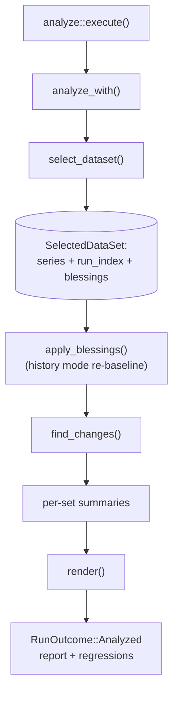
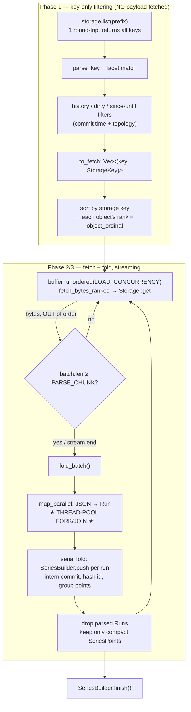
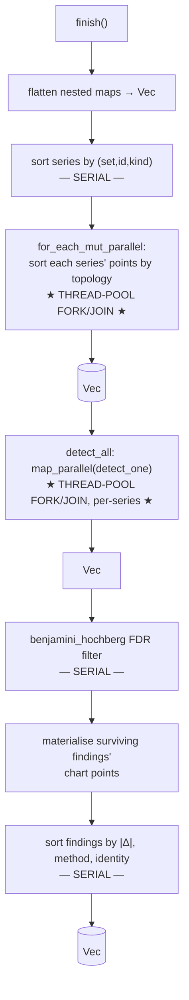
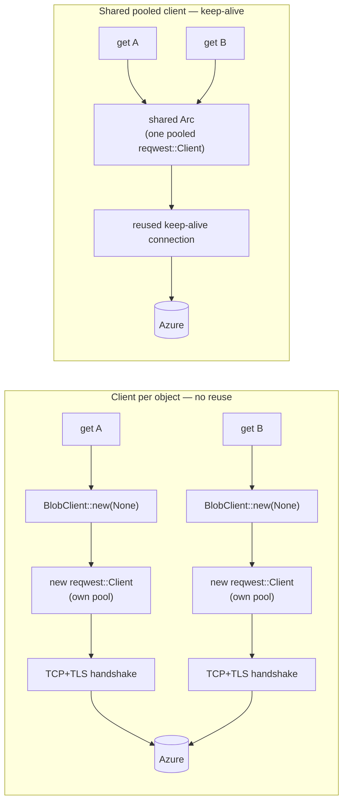

# `analyze` data-flow & parallelism reference

A mental model of the `analyze` pipeline: what loads where, in what order, what is
computed/sorted, and exactly where concurrency vs. parallelism happens. This is the
canonical reference for the load and detection path; keep it in sync with the logic
(see `AGENTS.md`, the `analyze` section). For the *statistical* design (detectors,
re-baselining semantics) see `DESIGN.md`; this document is about *flow and
performance*.

Code lives in two crates, referenced by symbol + file:

- **shell** `cargo-bench-history` — IO, git, storage, orchestration
  (`src/analyze/mod.rs`, `src/storage/`).
- **core** `cargo-bench-history-core` — pure compute leaves
  (`src/analyze/{series,stats,findings,parallel,report}.rs`).

---

## 1. Two kinds of "going wide" (read this first)

The single most important distinction:

| Mechanism | What it is | Where | Threads |
|---|---|---|---|
| **I/O concurrency** | `buffer_unordered(LOAD_CONCURRENCY)` multiplexes in-flight `Storage::get` futures on **one** `!Send` task | the fetch loop in `select_dataset` | cooperative on a single task — **not** OS-thread parallelism |
| **CPU parallelism** | `std::thread::scope` carves a slice into one chunk per worker and joins | `map_parallel` / `for_each_mut_parallel` (`analyze::parallel`) | real OS-thread fork/join |

"Fetching N at once" and "parsing across cores" are *different machines*. The fetch
is latency-hiding I/O on one logical task; the parse/sort/detect stages are the only
places that use multiple cores. The whole load future is `!Send` and reactor-free, so
it runs unchanged under the Miri-driven `futures::executor::block_on` tests; the
production binary runs it under `#[tokio::main]`.

---

## 2. Top-level flow (one `analyze` invocation)



The cost is overwhelmingly in **`select_dataset`** (the load) and secondarily in
**`find_changes`** (the detect). Everything else is bookkeeping.

Each analysis **mode** (`history`, `branch`, `tip`) is a *separate* `analyze`
invocation with its *own* `select_dataset` load — there is no shared dataset cache
across modes. The mode is auto-detected once per run from git topology
(`auto_mode`), unless `--mode` overrides it.

---

## 3. `select_dataset` — the load (where the wall-clock goes)



Key properties:

- **Phase 1 never fetches a payload.** History-membership, base-side dirty admission
  and the `--since`/`--until` window are all decided from the *key* and git topology
  (`window_excludes`), so an excluded object costs zero round-trips.
- **Ordinals are assigned up front** by sorting `to_fetch` by key, because
  `buffer_unordered` completes out of order; this makes the result independent of
  fetch arrival order. `object_ordinal` is the final point tie-break and stands in for
  the full storage key to keep points small.
- **Streaming memory.** Only one `PARSE_CHUNK`-sized batch of raw bytes + parsed
  `Run`s is resident at a time; each `Run` is dropped right after its points are
  extracted. On a large history this is the difference between hundreds of MB and tens
  of GB.
- **The fork/join is per batch.** `map_parallel` forks at each `PARSE_CHUNK` flush and
  joins before the serial fold — so parse-parallelism and fold-serial *alternate* once
  per batch. The serial fold (`SeriesBuilder::push`) is a sequential section between
  parallel bursts; it is an Amdahl ceiling on load speed (see §7).

### `SeriesBuilder::push` — what the fold does (`analyze::series`)

Per parsed `Run`: intern the short commit into an `Arc<str>` shared by every point on
that commit (`intern`); resolve the benchmark id's bucket in a `HashTable` with a
single `entry` probe — hashing `BenchmarkId` with the builder's one fixed hasher
instance and **cloning the id only on a true cache miss** (one id-clone per distinct
series, never per point); push a compact `SeriesPoint` (`topo_index`, `dirty`,
`object_ordinal: u32`, `commit: Arc<str>`, `value`, `interval_low/high`) into the
`(set, id, kind)` group. A large history materialises tens of millions of these,
hence the compactness and interning.

### Tuning constants (`analyze::mod`)

- `LOAD_CONCURRENCY` — how many `Storage::get` round-trips overlap. Hides per-object
  latency (critical on the remote backend); bounded so the backend is not hit with an
  unbounded burst.
- `PARSE_CHUNK` — how many fetched objects are parsed per parallel batch. Bounded so
  the load keeps its streaming memory profile, yet well above the core count so every
  worker stays busy and per-batch fork/join overhead is amortised.

---

## 4. `SeriesBuilder::finish()` + `find_changes()` — build & detect



### Inside one `detect_one` (`analyze::findings`) — per series, runs on a worker

The detection step has no cross-series state, so every series is evaluated
independently across the thread pool. The mode selects the detector:

- **History** (long-range trend): project point values once, then run a
  **change-point** detector *and* a **drift** detector and keep the better fit
  (`arbitrate`); optionally a recovered-spike pass when inactive findings are
  requested.
- **Branch**: compare the branch tip's level against its base across the merge-base.
- **Tip**: guard only the newest point.

These detectors call the **stats kernels**, per series:

| Kernel | File | Cost | Allocation |
|---|---|---|---|
| `median_in_place` | `analyze::stats` | `sort_unstable_by(f64::total_cmp)` then midpoint | **none** — sorts the caller's slice in place, no scratch buffer |
| `theil_sen_line` | `analyze::stats` | `O(n²)` pairwise slopes, two `median_in_place`s | sizes its slope/intercept buffers once up front (`pair_count`) |
| `benjamini_hochberg` | `analyze::stats` | one `sort_unstable_by` over the p-values | once, across all noisy candidates |

`median_in_place` is genuinely in-place: the unstable sort orders without the scratch
buffer a stable sort would allocate, and ties under `total_cmp` are bit-identical so
reordering them cannot change the median.

---

## 5. The full parallelism / serial map

| Stage | Concurrency type | Unit of work | Fork/join criterion |
|---|---|---|---|
| `storage.list` | single async request | the whole prefix | — |
| Phase-1 filtering | serial | per candidate key | — |
| **fetch** | **I/O-concurrent (one task)** | per object, bounded in flight | `buffer_unordered(LOAD_CONCURRENCY)` |
| **parse** | **CPU-parallel (thread pool)** | one chunk per worker, of a `PARSE_CHUNK` batch | fork at each flush, join before fold |
| fold (`push`) | **serial** | per `Run` | runs between parallel bursts |
| series sort | serial | the `Vec<Series>` | — |
| **point sort** | **CPU-parallel (thread pool)** | one chunk of series per worker | single fork/join over all series |
| **detect** | **CPU-parallel (thread pool)** | one chunk of series per worker | single fork/join over all series |
| BH filter + finding sort + render | serial | the candidate/finding list | — |

`map_parallel` / `for_each_mut_parallel` split the slice into **exactly one balanced
chunk per worker** (sizes differ by at most one), so a slice just above the worker
count still uses every worker rather than collapsing to fewer chunks. Both early-return
to a serial pass for a single worker or a slice no longer than the worker count, and
both preserve input order so results are identical to a sequential pass.

---

## 6. Where the bottlenecks live (to steer optimization)

- **Local-filesystem backend:** CPU-bound on **parse** (the only heavy parallel
  stage), gated by the **serial fold** between batches and by I/O arrival. When core
  utilisation is low, the ceiling is the serial fold + per-batch fork/join overhead +
  fetch arrival, not raw parse throughput. Levers: shrink the serial section (cheaper
  `push`), overlap the fold with the next batch's fetch, larger batches to amortise
  fork/join.
- **Azure backend:** network-bound on **connection setup**, not CPU and not fetch
  concurrency (see §7). The process spends almost all of its time waiting on TCP+TLS
  handshakes.
- **Data-structure hot spots:** `SeriesPoint` compactness, `Arc<str>` commit interning
  and single-probe `HashTable` id lookups (clone-on-miss) keep the
  tens-of-millions-of-points fold affordable. Preserve these; do not regress them.

---

## 7. Azure connection reuse (a known performance characteristic)

The Azure backend (`storage::azure::AzureBlobStorage`) builds a **fresh client per
object** and passes `None` options: `blob_client(key)` constructs a new
`BlobClient::new(url, credential, None)` (and `container_client()` a new
`BlobContainerClient` for `list`), called by `get`/`put`/`delete`/`list`.

With `None` client options, the Azure SDK pipeline takes `transport.unwrap_or_default()`
→ `Transport::default()` → `new_http_client(None)` → a **brand-new `reqwest::Client`**.
`reqwest` pools connections *inside each `Client`*, so a new client per object means a
fresh TCP+TLS handshake every time and **no HTTP keep-alive reuse**. Raising fetch
concurrency does not help (each object still pays full connection setup) and at high
concurrency exhausts ephemeral ports.



**The reuse lever:** build **one** pooled HTTP client in `AzureBlobStorage::from_config`
and inject it into every client via the transport seam, so all per-object operations
share a single `reqwest` connection pool. The relevant symbols are re-exported from
`azure_core::http` (`new_http_client`, `Transport`, `HttpClient`):

```rust
// struct field, built once:
http_client: Arc<dyn HttpClient>,         // = azure_core::http::new_http_client(None)

// per client:
let mut options = BlobClientOptions::default();
options.client_options.transport = Some(Transport::new(self.http_client.clone()));
BlobClient::new(url, self.credential.clone(), Some(options))
```

This enables keep-alive connection reuse (far fewer handshakes, lower per-object
latency, no port exhaustion) and lets fetch concurrency actually pay off on the remote
backend.
