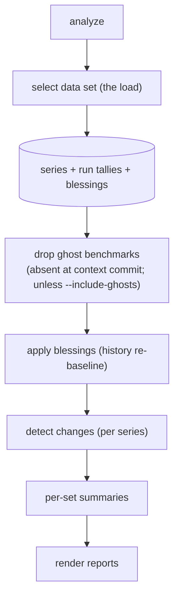
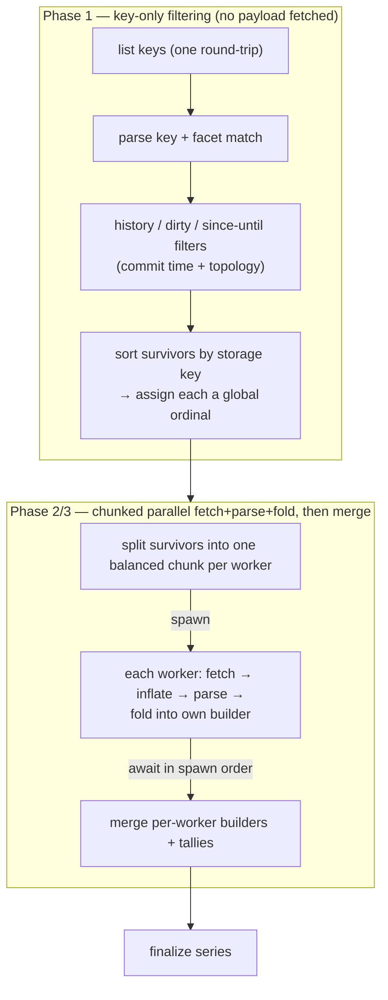
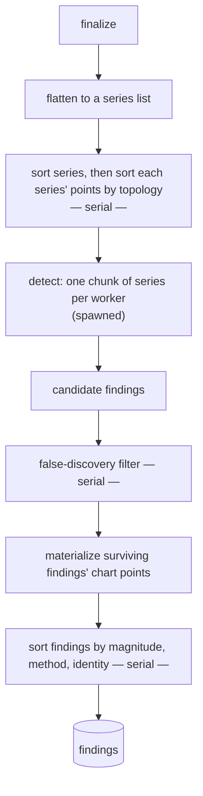
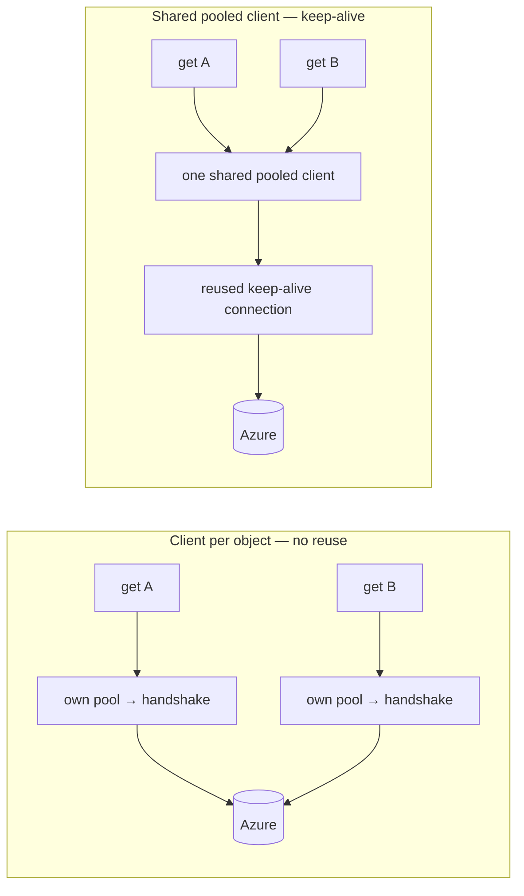

# `analyze` — data-flow and parallelism

A component design of the `analyze` pipeline: what loads where, in what order, and
exactly where I/O concurrency versus CPU parallelism happens. The statistical design
(detectors, gating, re-baselining) lives in [`DESIGN.md`](DESIGN.md); this document is
about **flow and performance**.

## Two kinds of "going wide"

The single most important distinction is between overlapping *waiting* and overlapping
*work*:

* **I/O concurrency** overlaps in-flight storage reads on one cooperative task. It hides
  per-object latency but adds no compute throughput, and is used only for the low-volume
  blessing-sidecar load.
* **CPU parallelism** fans real work across cores. The two expensive stages — loading and
  parsing the stored objects, and running per-series detection — each fan out this way.

Both fan-out stages route through an **injected spawner** rather than ad-hoc threads, so
the work runs on the runtime's shared blocking pool in production and inline on the calling
thread under Miri and in-memory tests. That single seam is what lets the whole load run
reactor-free and unchanged under Miri while still scaling on real hardware.

## Top-level flow

The cost is overwhelmingly in the **load** and secondarily in the **detect**; everything
else is bookkeeping. The **ghost filter** between the load and detect is a cheap
per-series pass: it drops every reconstructed series whose benchmark has no run at the
context commit (the analyzed tip), so a benchmark that no longer exists is not re-flagged.
It runs before blessings and detection so ghosts never enter the false-discovery
correction; `--include-ghosts` skips it. Each analysis mode (`history`, `branch`) is a
separate
invocation with its own load — there is no dataset cache across modes — and the mode is
auto-detected once per run from git topology.

The read-only `examine` command is a **lighter consumer of the same load**: it runs Phase 1
and Phase 2/3 through the identical `select_dataset` pipeline, then narrows to a single
`(benchmark, metric)` series and prints its points instead of running the detect stage — the
tabular pivot of a finding's chart, with no per-series statistics. See the `examine` command
in [`DESIGN.md`](DESIGN.md).

## The load

Design properties that make this both fast and deterministic:

* **Phase 1 never fetches a payload.** History membership, base-side dirty admission, and
  the `--since`/`--until` window are all decided from the *key* and git topology, so an
  excluded object costs zero round-trips.
* **Ordering is fixed before parallelism.** Survivors are sorted by storage key and each is
  assigned a global ordinal *before* chunking, so the result never depends on which worker
  finishes first. That ordinal is also each point's final tie-break, standing in for the
  full key to keep points small.
* **Parse and fold both run across cores; only the merge is serial.** The key-sorted
  survivors split into one balanced contiguous chunk per worker (sizes differing by at most
  one, so a slice just above the worker count still uses every worker). Each worker fetches,
  inflates, JSON-parses, and folds each object straight into its own series builder,
  dropping the parsed run immediately so no chunk's parsed runs are ever buffered. The
  driver then merges the per-worker builders in a serial pass. Because ordinals are global
  and the finalizing sort is global, the merge is associative and the result is
  byte-identical to a single-threaded fold in storage-key order.
* **The parsed element is lean.** Each object is parsed into a projection carrying only the
  fields the fold reads — per result the benchmark identity and each metric's kind, value,
  and confidence interval. The commit a point is labelled with comes from the storage key,
  not the payload, so the discarded run context (environment, toolchain, timestamps) and
  per-metric standard deviation are never materialized.

A large history materializes tens of millions of series points, so the fold keeps them
compact and interns each commit into one shared reference across all its points, cloning a
benchmark identity only on a true first-seen miss rather than per point. The worker count
derives from the host's available parallelism, capped at the survivor count so a small data
set never spawns idle workers.

**Memory is the accepted tradeoff, not a win.** Folding in the worker parallelizes the fold
for a wall-time and CPU gain but does not lower peak memory: at merge time every worker's
finished builder is briefly resident alongside the growing merged one, plus one allocator
arena per worker thread. Further memory reduction is possible — bounded merge-as-complete
waves and identity interning across workers — but is deliberately left unexploited in
favour of the wall-time and CPU win.

**The parallel parse needs a scalable global allocator.** The JSON parser makes many small
allocations; on the system allocator their cross-thread contention (acute on the Windows
process heap) serializes the workers and erases the parallel win — the naive parallel parse
measures *slower* than serial. The binary therefore installs a scalable allocator
(`mimalloc`) so per-thread heaps remove the contention; the stress harness installs the same
one for representative numbers. This dependency is load-bearing: do not remove the allocator
without re-measuring the parallel load.

## Build and detect

Detection has no cross-series state, so the series split into one balanced chunk per worker
— the same split-once, spawn, await-and-recombine pattern as the load — and the output is
identical to a sequential pass. A single available CPU (as Miri reports) yields a single
worker over the whole input. Per series the mode selects the detector: history runs both a
change-point and a drift detector and keeps the better fit (plus an optional recovered-spike
pass); branch compares the branch tip's level against its base.

The statistical kernels are chosen to keep the tens-of-millions-of-points path affordable —
an in-place unstable sort for the median (no scratch buffer, and ties are bit-identical so
reordering cannot change the result), pre-sized buffers for the pairwise Theil–Sen slope,
and a single sort for the false-discovery filter across all noisy candidates.

## The full parallelism / serial map

| Stage | Concurrency type | Unit of work |
|---|---|---|
| List keys | single async request | the whole prefix |
| Phase-1 filtering | serial | per candidate key |
| **Fetch + parse + fold (runs)** | **CPU-parallel (spawned)** | one chunk of survivors per worker |
| Merge per-worker builders | serial | per worker partial |
| Series sort + point sort | serial | the series list / per series |
| **Detect** | **CPU-parallel (spawned)** | one chunk of series per worker |
| Blessing-sidecar fetch | I/O-concurrent (one task) | per object, bounded in flight |
| False-discovery filter + finding sort + render | serial | the candidate / finding list |

## Where the bottlenecks live

* **Local-filesystem backend** — the load is **parse-bound**, and both parse and fold fan
  across cores, so the ceiling is the slowest chunk's parse+fold plus the serial merge
  throughput. Levers: a cheaper fold, a leaner parsed shape, and fewer/larger objects. This
  parallel parse only pays off with the scalable allocator above.
* **Azure backend** — **network-bound**. The run load drives at most one in-flight read per
  worker (each worker awaits its chunk's reads sequentially), which is well below the
  blessing-sidecar load's wider pipeline — so the win from the parallel design is on the
  CPU-bound parse+fold, not on remote I/O. With the shared connection pool (below) the
  per-object handshake is amortized across a keep-alive pool, leaving path bandwidth and,
  for small objects, a per-request round-trip rate as the two ceilings; fewer, larger blobs
  help more than more concurrency.

## Azure connection reuse

`reqwest` pools connections *inside each client*, but the SDK builds a fresh transport for
every per-object blob client by default — so naively addressing each blob would pay a fresh
TCP+TLS handshake with no keep-alive reuse, and raising fetch concurrency would only exhaust
ephemeral ports without helping.

The backend therefore builds **one** pooled HTTP client and injects it into every
per-object client through the transport seam, so all operations share a single connection
pool. Automatic decompression stays **off** on that transport: the storage layer stores gzip
and inflates it itself, so letting the transport auto-inflate would double-inflate the
bytes. This is validated end-to-end against both the Azurite emulator and a real Storage
account.

## Localizing a slowdown with `--verbose`

`analyze --verbose` emits a per-stage wall-clock breakdown to standard error on a channel
**deliberately independent** of the per-object note stream, so a mystery slowdown can be
pinned to a specific stage of the diagrams above without reading the code. The independence
matters at stress scale: the per-object notes emit one line per stored object, and tens of
thousands of them would both bury the timings and distort the very wall clock being
measured. A programmatic caller can therefore request the stage timings alone, without the
note flood — which is exactly how the stress harness surfaces the load breakdown while
keeping its own measurement clean.

## Seeing what was searched, always

A third reporter channel runs **regardless of `--verbose`**: a single **effective-selection**
line to standard error naming the facets actually queried — engine, target triple, and
machine key, each tagged when it was auto-detected rather than typed — plus the resolved base
branch and the `--since` / `--until` window. Auto-detection is convenient but invisible, and
this line makes it legible so a surprising result can be traced to *what* was searched before
suspecting the data. It is one line by construction, so it neither buries the verbose notes
nor perturbs the timing channel, and like both of them it stays on stderr to keep stdout a
clean stream of reports.

The line is most valuable when a query comes back empty. When the effective — possibly
auto-detected — partition holds no stored runs at all, the stdout report's hint names that
partition and suggests widening it (for instance `--target-triple all`), so an
auto-detected facet that quietly missed is distinguished from a genuinely empty project. The
enumerating commands (`list`, `prune`, `examine`) resolve their dataset through the same path
and so emit the same line.
