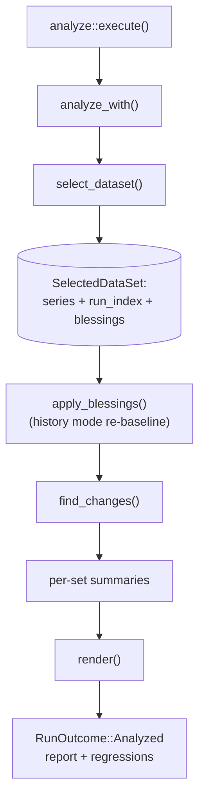
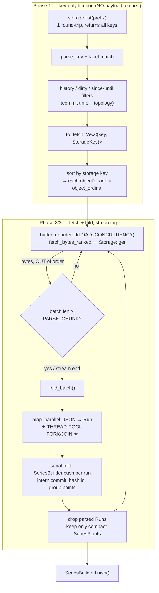
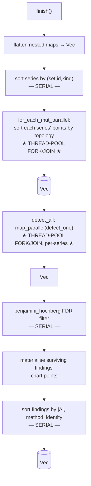
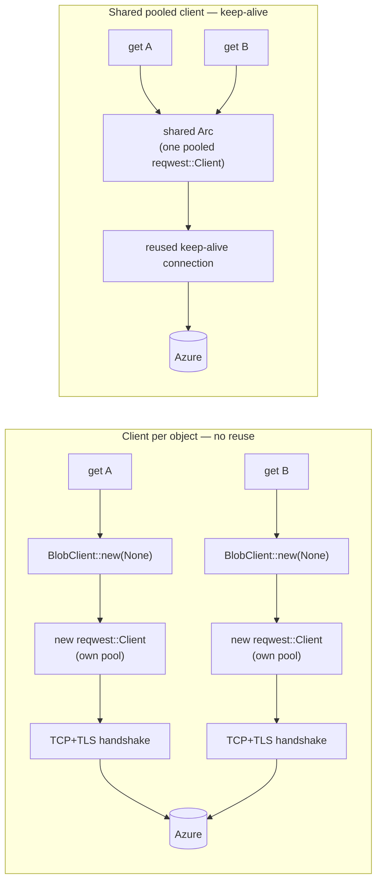

# `analyze` data-flow & parallelism reference

A mental model of the `analyze` pipeline: what loads where, in what order, what is
computed/sorted, and exactly where concurrency vs. parallelism happens. This is the
canonical reference for the load and detection path; keep it in sync with the logic
(see `AGENTS.md`, the `analyze` section). For the *statistical* design (detectors,
re-baselining semantics) see `DESIGN.md`; this document is about *flow and
performance*.

Code lives in two crates, referenced by symbol + file:

- **shell** `cargo-bench-history` — IO, git, storage, orchestration
  (`src/analyze/mod.rs`, `src/storage/`).
- **core** `cargo-bench-history-core` — pure compute leaves
  (`src/analyze/{series,stats,findings,parallel,report}.rs`).

---

## 1. Two kinds of "going wide" (read this first)

The single most important distinction:

| Mechanism | What it is | Where | Threads |
|---|---|---|---|
| **I/O concurrency** | `buffer_unordered(LOAD_CONCURRENCY)` multiplexes in-flight `Storage::get` futures on **one** `!Send` task | the fetch loop in `select_dataset` | cooperative on a single task — **not** OS-thread parallelism |
| **CPU parallelism** | `std::thread::scope` carves a slice into one chunk per worker and joins | `map_parallel` / `for_each_mut_parallel` (`analyze::parallel`) | real OS-thread fork/join |

"Fetching N at once" and "parsing across cores" are *different machines*. The fetch
is latency-hiding I/O on one logical task; the parse/sort/detect stages are the only
places that use multiple cores. The whole load future is `!Send` and reactor-free, so
it runs unchanged under the Miri-driven `futures::executor::block_on` tests; the
production binary runs it under `#[tokio::main]`.

---

## 2. Top-level flow (one `analyze` invocation)



The cost is overwhelmingly in **`select_dataset`** (the load) and secondarily in
**`find_changes`** (the detect). Everything else is bookkeeping.

Each analysis **mode** (`history`, `branch`, `tip`) is a *separate* `analyze`
invocation with its *own* `select_dataset` load — there is no shared dataset cache
across modes. The mode is auto-detected once per run from git topology
(`auto_mode`), unless `--mode` overrides it.

---

## 3. `select_dataset` — the load (where the wall-clock goes)



Key properties:

- **Phase 1 never fetches a payload.** History-membership, base-side dirty admission
  and the `--since`/`--until` window are all decided from the *key* and git topology
  (`window_excludes`), so an excluded object costs zero round-trips.
- **Ordinals are assigned up front** by sorting `to_fetch` by key, because
  `buffer_unordered` completes out of order; this makes the result independent of
  fetch arrival order. `object_ordinal` is the final point tie-break and stands in for
  the full storage key to keep points small.
- **Streaming memory.** Only one `PARSE_CHUNK`-sized batch of raw bytes + parsed
  `Run`s is resident at a time; each `Run` is dropped right after its points are
  extracted. On a large history this is the difference between hundreds of MB and tens
  of GB.
- **The fork/join is per batch.** `map_parallel` forks at each `PARSE_CHUNK` flush and
  joins before the serial fold — so parse-parallelism and fold-serial *alternate* once
  per batch. The serial fold (`SeriesBuilder::push`) is a sequential section between
  parallel bursts; it is an Amdahl ceiling on load speed (see §7).

### `SeriesBuilder::push` — what the fold does (`analyze::series`)

Per parsed `Run`: intern the short commit into an `Arc<str>` shared by every point on
that commit (`intern`); resolve the benchmark id's bucket in a `HashTable` with a
single `entry` probe — hashing `BenchmarkId` with the builder's one fixed hasher
instance and **cloning the id only on a true cache miss** (one id-clone per distinct
series, never per point); push a compact `SeriesPoint` (`topo_index`, `dirty`,
`object_ordinal: u32`, `commit: Arc<str>`, `value`, `interval_low/high`) into the
`(set, id, kind)` group. A large history materialises tens of millions of these,
hence the compactness and interning.

### Tuning constants (`analyze::mod`)

- `LOAD_CONCURRENCY` — how many `Storage::get` round-trips overlap. Hides per-object
  latency (critical on the remote backend); bounded so the backend is not hit with an
  unbounded burst.
- `PARSE_CHUNK` — how many fetched objects are parsed per parallel batch. Bounded so
  the load keeps its streaming memory profile, yet well above the core count so every
  worker stays busy and per-batch fork/join overhead is amortised.

---

## 4. `SeriesBuilder::finish()` + `find_changes()` — build & detect



### Inside one `detect_one` (`analyze::findings`) — per series, runs on a worker

The detection step has no cross-series state, so every series is evaluated
independently across the thread pool. The mode selects the detector:

- **History** (long-range trend): project point values once, then run a
  **change-point** detector *and* a **drift** detector and keep the better fit
  (`arbitrate`); optionally a recovered-spike pass when inactive findings are
  requested.
- **Branch**: compare the branch tip's level against its base across the merge-base.
- **Tip**: guard only the newest point.

These detectors call the **stats kernels**, per series:

| Kernel | File | Cost | Allocation |
|---|---|---|---|
| `median_in_place` | `analyze::stats` | `sort_unstable_by(f64::total_cmp)` then midpoint | **none** — sorts the caller's slice in place, no scratch buffer |
| `theil_sen_line` | `analyze::stats` | `O(n²)` pairwise slopes, two `median_in_place`s | sizes its slope/intercept buffers once up front (`pair_count`) |
| `benjamini_hochberg` | `analyze::stats` | one `sort_unstable_by` over the p-values | once, across all noisy candidates |

`median_in_place` is genuinely in-place: the unstable sort orders without the scratch
buffer a stable sort would allocate, and ties under `total_cmp` are bit-identical so
reordering them cannot change the median.

---

## 5. The full parallelism / serial map

| Stage | Concurrency type | Unit of work | Fork/join criterion |
|---|---|---|---|
| `storage.list` | single async request | the whole prefix | — |
| Phase-1 filtering | serial | per candidate key | — |
| **fetch** | **I/O-concurrent (one task)** | per object, bounded in flight | `buffer_unordered(LOAD_CONCURRENCY)` |
| **parse** | **CPU-parallel (thread pool)** | one chunk per worker, of a `PARSE_CHUNK` batch | fork at each flush, join before fold |
| fold (`push`) | **serial** | per `Run` | runs between parallel bursts |
| series sort | serial | the `Vec<Series>` | — |
| **point sort** | **CPU-parallel (thread pool)** | one chunk of series per worker | single fork/join over all series |
| **detect** | **CPU-parallel (thread pool)** | one chunk of series per worker | single fork/join over all series |
| BH filter + finding sort + render | serial | the candidate/finding list | — |

`map_parallel` / `for_each_mut_parallel` split the slice into **exactly one balanced
chunk per worker** (sizes differ by at most one), so a slice just above the worker
count still uses every worker rather than collapsing to fewer chunks. Both early-return
to a serial pass for a single worker or a slice no longer than the worker count, and
both preserve input order so results are identical to a sequential pass.

---

## 6. Where the bottlenecks live (to steer optimization)

- **Local-filesystem backend:** CPU-bound on **parse** (the only heavy parallel
  stage), gated by the **serial fold** between batches and by I/O arrival. When core
  utilisation is low, the ceiling is the serial fold + per-batch fork/join overhead +
  fetch arrival, not raw parse throughput. Levers: shrink the serial section (cheaper
  `push`), overlap the fold with the next batch's fetch, larger batches to amortise
  fork/join.
- **Azure backend:** network-bound on **per-request latency** (round-trips), not CPU and
  not fetch concurrency. With the shared connection pool (§7) the per-object TCP+TLS
  handshake is amortised across a keep-alive pool, so the dominant remaining cost is the
  request round-trip itself; fewer-larger blobs help more than more concurrency.
- **Data-structure hot spots:** `SeriesPoint` compactness, `Arc<str>` commit interning
  and single-probe `HashTable` id lookups (clone-on-miss) keep the
  tens-of-millions-of-points fold affordable. Preserve these; do not regress them.

---

## 7. Azure connection reuse

The Azure backend (`storage::azure::AzureBlobStorage`) needs a separate per-object
`BlobClient` (and a `BlobContainerClient` for `list`) to address each blob, but they
all share **one** pooled HTTP client so every `get`/`put`/`delete`/`list` reuses a
single `reqwest` connection pool.

The reuse matters because `reqwest` pools connections *inside each `Client`*. If each
per-object client built its own transport — which is what `BlobClient::new(url,
credential, None)` does (`None` options → `Transport::default()` →
`new_http_client(None)` → a brand-new `reqwest::Client`) — every object would pay a
fresh TCP+TLS handshake with **no HTTP keep-alive reuse**. Raising fetch concurrency
would not help (each object still pays full connection setup) and at high concurrency
would exhaust ephemeral ports.



**How it is wired:** `AzureBlobStorage::from_config` builds **one** pooled HTTP client
(stored as the `http_client: Arc<dyn HttpClient>` field) and `shared_client_options()`
injects it into every per-object client through the transport seam, so all operations
share a single connection pool. The relevant symbols are re-exported from
`azure_core::http` (`new_http_client`, `HttpClientOptions`, `Transport`, `HttpClient`,
`ClientOptions`):

```rust
// built once in from_config:
let http_client = new_http_client(Some(HttpClientOptions {
    // The storage layer stores gzip and inflates it itself in `get`, so the
    // transport must hand back raw compressed bytes. This mirrors the SDK's own
    // per-client default; turning auto-decompression on would double-inflate.
    automatic_decompression: false,
}));

// per client (via shared_client_options):
let options = BlobClientOptions {
    client_options: ClientOptions {
        transport: Some(Transport::new(Arc::clone(&self.http_client))),
        ..Default::default()
    },
    ..Default::default()
};
BlobClient::new(url, self.credential.clone(), Some(options))
```

`automatic_decompression` must stay **off**: the SDK's own per-client transport sets it
to `false` and the storage layer inflates gzip manually in `get` (`codec::decompress`).
A shared client built with `new_http_client(None)` would default it to `true`, so
`reqwest` would auto-inflate and the manual `codec::decompress` would then double-inflate
the bytes.

This shared pool gives keep-alive connection reuse (far fewer handshakes, lower
per-object latency, no port exhaustion) and lets fetch concurrency actually pay off on
the remote backend. Validated by the Azurite round-trip tests (`storage::azure`) and the
real-Azure end-to-end tests (`cbh_azure::*_in_real_azure`).

---

## 8. Localizing a slowdown with `--verbose` stage timings

`analyze --verbose` emits a per-stage wall-clock breakdown to standard error, on a
channel separate from the per-object notes, so a mystery slowdown can be pinned to a
specific stage of the diagrams above without reading the code. Each line reads
`[bench-history] timing: <stage> took <elapsed>`. The stages mirror this document:

| Stage label (substring)        | Diagram location                                  |
|--------------------------------|---------------------------------------------------|
| `select_dataset (full load …)` | §2 `select_dataset` — the whole load              |
| `candidate listing + facet …`  | §3 Phase 1 listing + facet filter                 |
| `storage.list(prefix) …`       | §3 the single `storage.list` round-trip alone     |
| `git topology resolution`      | §2/§3 `resolve_history` (commit order + times)    |
| `git.first_parent ancestry …`  | §3 the first-parent ancestry walk alone (scales with history) |
| `phase 1 — key-only …`         | §3 Phase 1 filtering loop (no fetches)            |
| `phase 2/3 — concurrent fetch …` | §3 Phase 2/3 fetch + parallel parse + serial fold |
| `series build finalization`    | §4 `SeriesBuilder::finish()` (+ parallel sort)    |
| `blessing sidecar load`        | §3 history-mode blessing fetch (history only)     |
| `re-baseline blessed series`   | §2 `apply_blessings`                              |
| `change detection (find_changes …)` | §4 `find_changes` (per-series detect + FDR)  |
| `report render`                | §2 `render`                                       |

The timing channel is *deliberately independent* of the per-object note stream. The
notes emit one line per stored object; at stress scale (tens of thousands of objects)
that flood would both bury the timings and distort the very wall clock being measured.
So a programmatic caller can request timings alone: `AnalyzeOptions.timing` turns on the
stage breakdown without the notes (the `--verbose` CLI flag turns on both). The stress
harness (`cargo-bench-history-stress --verbose`) uses exactly this to surface the load
breakdown while keeping its own measurement clean.

Implementation: `report::Reporter::timing(stage, elapsed)` is the sink;
`StderrReporter::with_timing(verbose, timing)` controls the two streams independently;
the stage boundaries are timed with `Instant` in `analyze_with` and `select_dataset`.
Keep the labels above in sync with the diagrams when stage boundaries move.

