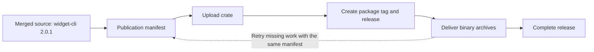

# Deliver the release that was requested

A merged version change is only the start of delivery. The crate upload might
succeed while a tag or one platform's binary archive fails. Publication must be
able to finish that release later, even if another PR has already merged.

That is why the publisher separates **what was requested** from **what completed**.

## One request survives every retry

A **publication manifest** records the merged source commit, destination and exact
package versions to deliver. It does not choose versions or contain mutable
completed flags. It is the stable request shared by the publishing phases.

For example, a run requests `widget-cli 2.0.1`. Its crate reaches crates.io, but a
binary build fails. While the prerequisite is repaired, `2.0.2` merges. Retrying
the original manifest still completes `2.0.1`; reading the current branch instead
would silently change the request.



Each phase observes the actual destination and skips work already complete.
Existing registry versions and tags are not rewritten to make a retry pass.
Changing the requested source or versions requires a new manifest.

## Outcomes explain partial completion

A **publication outcome** records what happened during one phase attempt. It is
kept separately from the manifest so a later attempt does not erase the original
request or earlier diagnostics.

The final report combines these outcomes with the current workflow job results.
An old successful artifact cannot hide a newly failed job, and an unreadable
destination is not treated as empty. This gives the operator a specific missing
step to repair rather than a misleading overall success.

## Tags fix the source of binary builds

The **publication source** is the merged commit that requested the release. A
package tag identifies the source used to build that package's binary archives.
It may name a later release-branch commit only when the package's version and
released content are unchanged there.

Tags use `{package}-v{version}` and are never moved. Binaries build from the commit
the actual tag resolves to, not whichever checkout happens to be current.

This matters when repairing an old release: rebuilding from today's branch could
put different code inside an archive still labelled `2.0.1`.

## Platform batches organize missing binary work

A **platform batch** lists the incomplete binary releases for one native target,
with their executable names and tag commits. It lets a runner reuse compatible
Cargo artifacts while building each package separately with its own default
feature selection.

For example, a release may already have its Windows archive but still lack Linux
assets. Reconciliation creates only the required remaining work. A target is
complete when both its ZIP and checksum are present; an incomplete pair is
replaced together so a new checksum cannot accidentally describe an old archive.

Package and executable names can differ:

```text
package:     widget-cli 2.0.1
executable:  widget
tag:         widget-cli-v2.0.1
ZIP member:  widget.exe on Windows
```

The [artifact reference](../reference/artifacts.md) describes the transported
manifest, batch and outcome fields. Consumers use tool-produced artifacts rather
than constructing them manually.

## A failed phase is not a rollback

Successful uploads remain valid when a later step fails. Cargo verifies package
archives and orders missing uploads; per-upload OIDC credentials avoid relying
on a stored publishing secret.

If another version reaches the release branch before an older request can create
its tag, that request may need an operator to create the exact missing tag at its
recorded source. Independent releases can continue, but the incomplete workflow
remains failed. [Recovery](../operations/recovery.md) explains how to finish the
original request without relabelling newer content.
