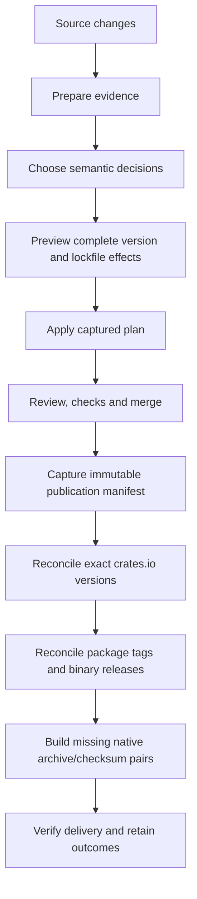

# Why cargo-release-plan?

A release decision is easier to review alongside the change that requires it.
`cargo-release-plan` makes that decision part of the pull request: assess the
content consumers receive, choose appropriate versions, and merge the complete
change. Publication then delivers those declared versions without making another
version decision.

This matters in workspaces. A change in an implementation package can require its
public library to move with it. A dependency update can change an installable
binary without touching its source. A successful crate upload can still leave a
release without its binary archives. One release model connects these cases
instead of treating version validation and publication as unrelated tasks.

The goals are:

- **Reviewable versions.** Explain the consumer-facing significance of a change,
  including dependent packages, rather than accepting an unexplained increment.
- **Reproducible assessment.** Use a fixed Git history boundary and explicit
  dependency resolution; do not let changing registry state choose versions.
- **Complete application.** Preview the full manifest and lockfile effects,
  then apply exactly the captured result.
- **Recoverable delivery.** Preserve publication intent and finish missing
  registry, tag and binary work without rewriting successful releases.
- **Portable adoption.** Use published tools, repository configuration, a
  copyable agent skill and reusable GitHub integration. No checkout of the Folo
  repository, repository-local release scripts or Just installation is needed.

## Who this fits

The supported publication path is a Cargo workspace releasing to crates.io and
GitHub. Libraries receive package tags; packages with an installable binary also
receive GitHub releases and native ZIP archives usable by
[`cargo-binstall`](https://github.com/cargo-bins/cargo-binstall).

Binary publication supports one executable per package, built with default
features on supported native targets. Alternative registries or forges,
cross-compilation, changelog generation and arbitrary release-policy hooks are
outside this process.

## Responsibilities

| Participant | Responsibility |
| --- | --- |
| Author or authoring agent | Understand consumer promises and judge breaking, compatible feature and patch changes. |
| `cargo-release-plan` | Collect release evidence, enforce version relationships, resolve and apply plans, and reconcile publication. |
| External compatibility checker | Detect the supported Rust API changes it understands; it is evidence, not a complete behavioral assessment. |
| `increment-versions` skill | Guide an agent through the tool's planning operations and explain its decisions. |
| Reviewer and merge policy | Approve the source and version changes together and require appropriate checks. |
| Cargo | Resolve dependencies when requested, construct and verify package archives, and order registry uploads. |
| GitHub Action and workflows | Install pinned tools, supply permissions, run jobs and transport evidence and outcomes. |

The published application is `cargo-release-plan`. Its implementation partition
is not a second release tool that consumers configure or invoke.

Completing a plan or running the skill grants neither merge authority nor
permission to publish. Publication starts from the reviewed, merged source under
the repository's release policy.

## From change to delivery

The chapters first explain the model, then walk through repository setup and
local/GitHub integration. The operations chapters cover ordinary releases,
verification and recovery. The reference distinguishes literal configuration and
decision formats from conceptual examples and opaque tool-generated evidence.

This book is published at
[folo-rs.github.io/folo/cargo-release-plan/](https://folo-rs.github.io/folo/cargo-release-plan/).
For an older pinned installation, use the
[matching documentation and skill revision](operations/upgrades.md), not an
assumption that the current website describes every older executable.
