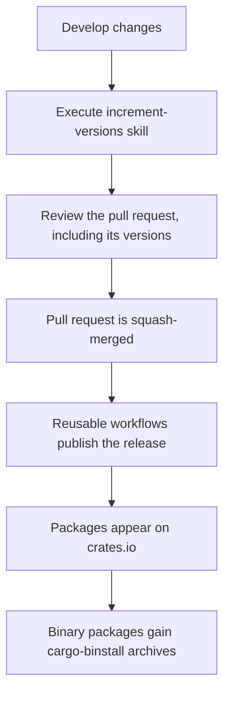

# Why cargo-release-plan?

The cargo-release-plan toolkit automates release preparation and publication for
Rust workspaces. It includes the `cargo-release-plan` command-line application,
the `cargo-release-plan-action` reusable GitHub workflows, and the
`increment-versions` agent skill. They are designed to be used together and are
documented together in this book.

The goals are:

- Every merged pull request immediately publishes its changed packages to crates.io.
- Fully automated version-number increments that obey Semantic Versioning.
- Reusable GitHub workflows for easy integration.
- No stored secrets required for publishing.
- Workspaces containing any number of library or binary packages.
- `cargo-binstall` support for fast installation of binary packages.
- Advanced workspace structures, including published packages with private APIs.

The skill prepares version changes as part of the pull request. Review approves
the code and versions together; merging starts publication without another
version-selection step. The normal workflow uses squash merges so the PR's final
content and versions enter release history together.

For version changes without publishing integration, use
[standalone planning](advanced/standalone.md). That scenario ends with the
version-increment PR being reviewed and merged; publishing is not part of it.

## Who this fits

The supported publication path is a Cargo workspace releasing to crates.io and
GitHub. Libraries receive package tags; packages with an installable binary also
receive GitHub releases and native ZIP archives usable by
[`cargo-binstall`](https://github.com/cargo-bins/cargo-binstall).

Binary publication supports one executable per package, built with default
features on supported native targets. Alternative registries or forges,
cross-compilation, changelog generation and arbitrary release-policy hooks are
outside this process.

## Responsibilities

| Participant | Responsibility |
| --- | --- |
| Author or authoring agent | Understand consumer promises and choose `breaking`, `nonbreaking` or `patch` semantic impacts. |
| `cargo-release-plan` | Collect release evidence, enforce version relationships, resolve and apply plans, and reconcile publication. |
| API compatibility checker (`cargo-semver-checks`) | Detect supported Rust API changes; its result is evidence, not a complete behavioral assessment. |
| `increment-versions` skill | Guide an agent through the tool's planning operations and explain its decisions. |
| Reviewer and merge policy | Approve the source and version changes together and require appropriate checks. |
| Cargo | Resolve dependencies when requested, construct and verify package archives, and order registry uploads. |
| GitHub Action and workflows | Install pinned tools, supply permissions, run jobs and transport evidence and outcomes. |

Completing a plan or running the skill grants neither merge authority nor
permission to publish. Publication starts from the reviewed, merged source under
the repository's release policy.

## From change to delivery

```mermaid
flowchart TD
    A["Develop changes"] --> B["Execute increment-versions skill"]
    B --> C["Review the pull request, including its versions"]
    C --> D["Pull request is squash-merged"]
    D --> E["Reusable workflows publish the release"]
    E --> F["Packages appear on crates.io"]
    F --> G["Binary packages gain cargo-binstall archives"]
```

The chapters first explain the model, then walk through repository setup and
local/GitHub integration. The operations chapters cover ordinary releases,
verification and recovery. The reference distinguishes literal configuration and
decision formats from conceptual examples and opaque tool-generated evidence.

This book is published at
[folo-rs.github.io/folo/cargo-release-plan/](https://folo-rs.github.io/folo/cargo-release-plan/).
For an older pinned installation, use the
[matching documentation and skill revision](operations/upgrades.md), not an
assumption that the current website describes every older executable.
