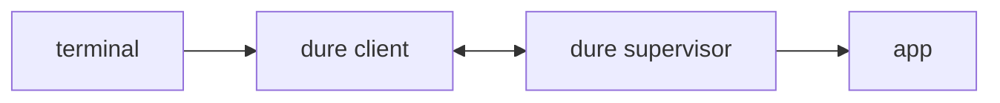

# dure design

`dure` keeps an interactive Windows console process running after the terminal
that started it goes away, and reattaches a later terminal to that same process.
It is a per-app supervisor, not a multiplexed server.

Closing a terminal window, dropping an SSH connection, and killing the
foreground process are one event to `dure`: the client is gone and the app keeps
running. SSH is the mainstream case, not a privileged one.

## Tenets

* **Survive losing the terminal, not logoff.** A closed window, a dropped SSH
  connection, or a killed client does not stop the app. A Windows logoff or
  reboot does.
* **One supervisor per app.** There is no shared daemon. Supervisors coordinate
  through per-user files on the machine.
* **Transparent once attached.** After attach, keyboard and console I/O are a
  direct funnel. No prefix key, no in-band detach, no `dure` UI inside the app.
* **Detach is losing the client.** Anything that kills the foreground `dure`
  process leaves the supervisor and app running.
* **Resume is not a replay.** Attach does not reconstruct prior screen contents.
  The new client sees an empty screen, then live bytes.
* **Latest client wins.** A new successful attach becomes the sole live console
  and disconnects any older client. That is how a wedged client is displaced.
  There is no separate `--force` flag.

## Roles

* **App** — the command given to `dure run`.
* **Supervisor** — a hidden `dure` process that owns the app and its console and
  outlives the terminal. The user never launches this role directly.
* **Client** — the foreground `dure` in the terminal (`run` or `resume`) that
  relays the user's console to the supervisor.

`dure run -- copilot.exe` starts a supervisor, starts the app under it, and
attaches this client. When the terminal goes away the client dies with it; the
supervisor and app do not.

## Commands

`dure run -- <command> [args...]` starts a new session in the current directory
and attaches immediately, even if another live session already exists for that
directory. Reconnect is `dure resume`, never an implicit side effect of `run`.
The command is executed directly, not through a shell. The child's working
directory and environment are those of the `dure run` process at start time and
do not update on a later resume. Relative command paths are resolved against
that launch directory, and a bare command name is looked up on the executable
search path, as a shell would.

A session must be able to outlive the process that launched it. Some launchers
confine their children to a Windows job object that forbids breakaway and kills
everything in it when the launcher exits; `cargo run` is one. Started from such
a launcher, `dure run` fails outright, naming that cause, rather than starting a
session that would die with the launcher. Ordinary shells, including the one an
SSH session provides, permit breakaway.

An app that exits before `dure run` has finished attaching still reports its
output and exit status. Only if the `dure run` process itself goes away first is
such a session discarded unreported.

`dure resume` attaches using auto-detect. `dure resume --id <id>` attaches to
that live session and skips auto-detect.

`dure list` prints live sessions: id, launch directory, command, whether a
client is currently attached, supervisor pid. A record is discarded only when
the same supervisor process is gone; reuse of its numeric process id by another
process does not keep the record live. Attached means the supervisor still has
a client connection; a hung client may still appear attached. Resume steals
anyway.

`dure kill --id <id>` abruptly terminates the supervisor process for that
session. The app and its ordinary descendants die with it. `--id` is required;
kill does not auto-detect. Kill targets the recorded supervisor process directly
instead of using the session connection, so it still works when that connection
is wedged. An attached client, if any, sees the relay end. Killing a missing or
already-dead id is a failure after stale-record cleanup.

## Auto-detect

Each session records the canonical absolute path of the directory from which
`dure run` was invoked (the launch directory). The app later changing its own
working directory does not change that record.

`dure resume` with no `--id`:

* If there is no live session, it fails.
* If exactly one live session has a launch directory equal to the current
  directory, it attaches to that session.
* Otherwise it prints the live session list and reads a session id from the
  terminal. Unreadable stdin, empty input, or a non-terminal stdin is a failure;
  the caller uses `--id` instead.

If several live sessions share the current directory, that is not a unique
match; the command lists and asks. It does not pick arbitrarily.

Path comparison uses a canonicalized absolute path. Case folding follows the
actual filesystem for that path rather than an operating-system-wide assumption.

## Session identity

A session has a small positive integer id, unique among live sessions for this
user on this machine, stable until that session ends. New sessions take the
smallest unused positive integer, so ids stay short in `list` output. An id may
be reused after the session that had it has ended.

Sessions do not have names. The launch directory is the grouping key for
auto-resume.

## Attach, detach, steal

The supervisor always accepts a new client, independently of whether a client is
currently attached and independently of whether that client's connection still
looks healthy.

When a new client completes attach, the previous client is disconnected and the
new client becomes the sole relay. Input already in flight from the displaced
client does not reach the app. The supervisor then applies the new client's
window size to the app console. Many TUIs redraw on resize. It does not restore
scrollback, and an app that does not redraw will show an empty or stale screen
until it paints on its own.

Concurrent attaches are ordered against each other, so the client that attaches
last is the one left holding the session.

A session is live while the same supervisor process is still running. A record
is dropped only when that process is gone. If the supervisor is running but
does not accept a connection within a bounded wait, resume fails and the
session stays listed; `dure kill --id` still reaches it.

While detached, the app's console stays open. Input is not closed (end of stdin
would terminate many apps). Output is drained and discarded so the app cannot
block on a full pipe.

An attached client that stops reading its connection is disconnected once it
falls far enough behind, rather than being allowed to stall the session. Since
`dure` keeps no screen contents, nothing recoverable is lost; a fresh `dure
resume` takes the session back.

Closing the terminal window detaches. It does not stop the app. Ctrl+C while
attached is delivered to the app, not to the client.

## Console I/O

The app is attached to a Windows console owned by the supervisor, not to
stdin/stdout redirected onto anonymous pipes.

A console is a terminal device: it has a width and height, it can deliver
keystrokes such as Ctrl+C as input, and it accepts the control sequences a TUI
uses to move the cursor, set colors, and repaint the screen. Anonymous pipes are
only byte streams. Programs detect the difference and, on pipes, disable the
TUI, skip color, or refuse to run. Interactive tools such as Copilot CLI need
the console case.

From the app's side this is a console. From the supervisor's side it is bytes
plus window size, which the attached client relays to the user's terminal.
The app's stdout and stderr are one console stream.

The terminal the user sits at already presents the app with a console: Windows
Terminal through the console host, an SSH session through a pseudoconsole.
`dure` adds one more around the app. For a VT TUI such as Copilot CLI, that
extra layer is not expected to remove features the same app already has in that
terminal without `dure`. What the terminal itself cannot provide (a real console
window, graphics protocols, console font and selection chrome) stays
unavailable.

`dure` writes diagnostics to stderr only while it is not attached. Before
attach, `run` and `resume` print the session id so the user can `kill` or
`resume --id` later. After attach, the funnel is exclusive. A displaced client
writes one diagnostic once its relay has ended and exits with a failure status.
When the app exits, an attached client receives the app's remaining output
before the exit status, then exits with that status.

Attaching (`run`, `resume`) requires a console. `list` and `kill` do not. The
resume id prompt additionally requires a terminal stdin; without one, `resume`
without `--id` fails.

A console is the Windows console-host API: handles, modes, and window size. A
terminal is the visible emulator (Windows Terminal, an SSH client) that renders
VT. `dure` attaches to a console and relays bytes to whatever terminal the user
is already sitting at.

## Lifetime

| Event | App | Supervisor | Client |
| --- | --- | --- | --- |
| Terminal closed, SSH dropped, or client killed | running | running | dead |
| App exits | dead | exits after cleanup | app status if attached |
| Logoff or reboot | dead | dead | dead |
| New attach | running | running | previous client disconnected |
| `dure kill` | dies with supervisor | abruptly terminated | relay ends if attached |
| Supervisor dies | dead | dead | relay ends / resume fails |

The supervisor owns the app and its ordinary descendants. If the supervisor
dies, they die with it. Supervisors do not orphan apps.

Sessions are a flat list. A `dure run` issued from inside an attached session
(for example the app is a shell) starts another ordinary session. Killing or
detaching one does not cascade to the other: the inner supervisor has already
broken away, which is the same rule as losing a terminal, applied twice.

A machine configured to log the user off when their interactive session ends
makes the product impossible; `dure` cannot outlive a logoff.

## Isolation

Sessions are per Windows user. Coordination files and the client-supervisor
connection are usable only by the creating user. Another user cannot list or
attach.

Command lines appear in `list` output. Secrets do not belong on the app argv.

## Distribution

Crate and binary name: `dure`, published to crates.io and installed with
`cargo binstall dure` under the same prebuilt-archive contract as the other
published binaries in this repository.

`dure` is a Windows tool. On other targets the binary is an empty stub with no
behavior.

## Screen contents

Attach does not replay prior output. The new client sees an empty screen, then
live bytes. The supervisor applies the attaching client's window size.

## Diagnostics

`--verbose` explains auto-detect: which sessions were considered, which paths
were compared, why a session was chosen or why the command fell through to the
list. Failures before attach go to stderr with a non-zero status.

Internal architecture is documented in the
[implementation guide](implementation.md).
