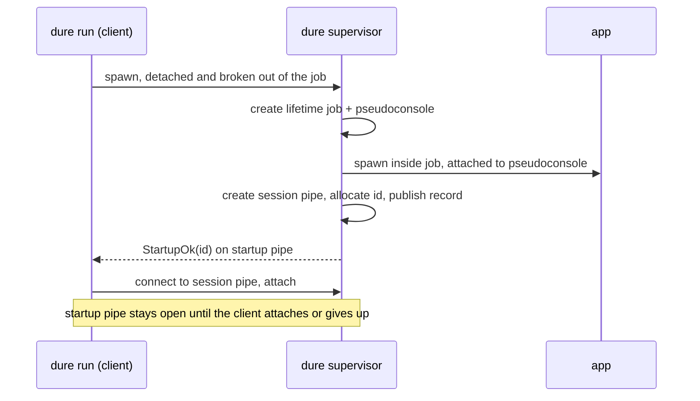
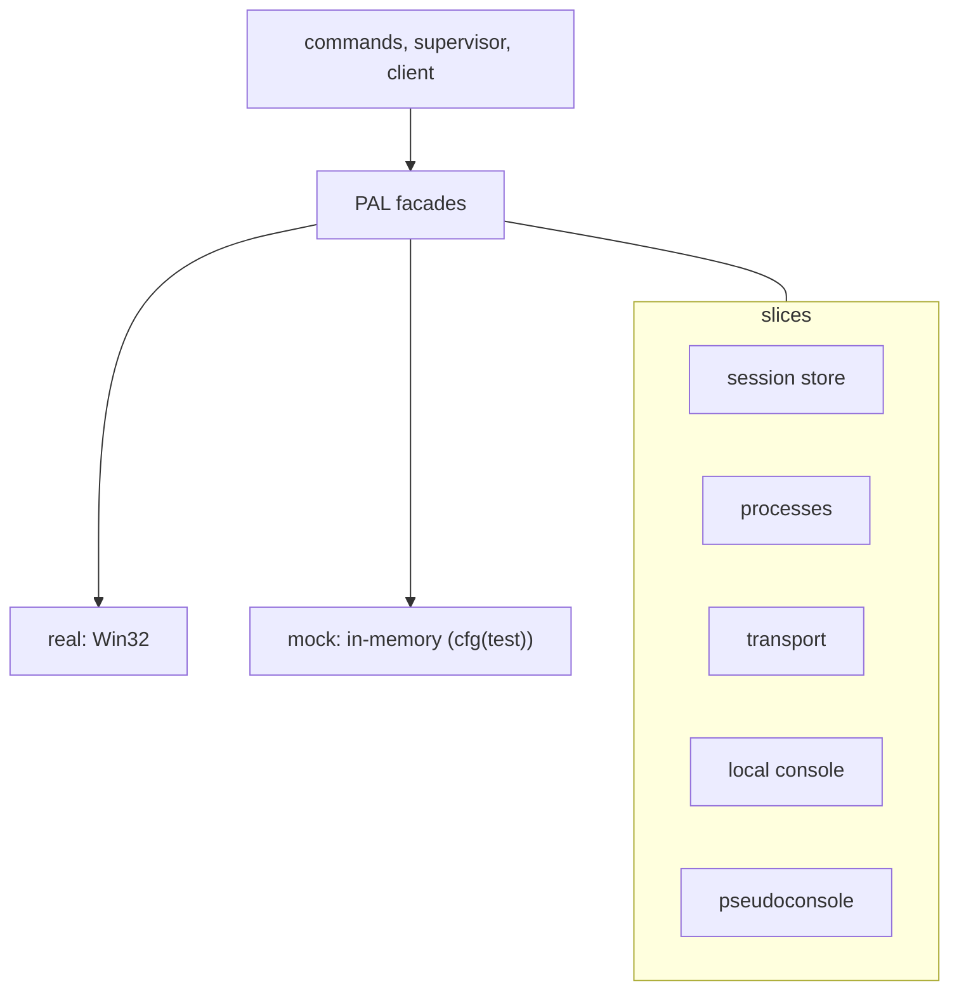
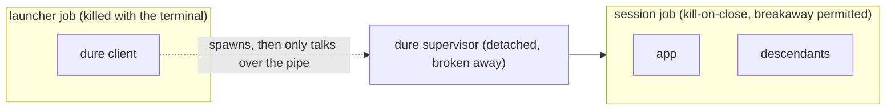
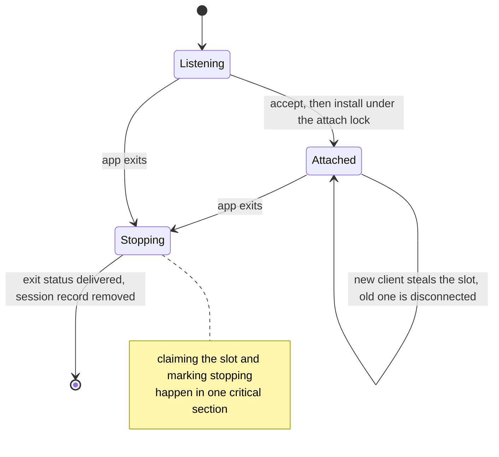

# dure implementation

The user-visible contract belongs in the package [design](design.md). This guide
follows the workspace rules for
[implementation documentation](../../../docs/implementation.md).

## Process split

The same binary implements both roles. `dure run` spawns `dure supervisor`, a
hidden subcommand, then the original process stays the client and attaches.
Windows has no `exec`.

`run` gives the supervisor a private one-shot startup channel. The supervisor
creates the lifetime job and pseudoconsole, starts the app, creates the session
pipe, then allocates the session id and atomically publishes the session record.
It reports the id only after the pipe is accepting connections. An initialization
failure closes the lifetime job, removes any provisional state, reports
`StartupErr` on the startup pipe, and exits. The initiating client treats every
non-`StartupOk` response as a failed start. A client never reports a successful start
for a session that cannot be resumed.

The startup channel stays open past that acknowledgement, as the supervisor's
signal that `dure run` still intends to attach. An app that exits immediately
would otherwise be torn down before the client finishes attaching, losing its
output and exit status to the race. So once the app has exited, the supervisor
holds the session open — listener included — until either a client has attached
or the initiator has dropped the channel.

## Platform gate

`dure` builds only for Windows. `lib.rs` carries a crate-level `#![cfg(windows)]`
and `main.rs` compiles elsewhere to a `main` that reports the unsupported
platform and exits with a failure status, so a non-Windows build produces a
binary that refuses to run rather than a crate full of per-item platform
attributes. Nothing under the PAL needs a non-Windows implementation, and no
module needs to reason about a platform it never runs on. The integration test
helper follows the same rule for the same reason.

Workspace-wide commands therefore still build and lint the workspace on any
platform without `dure` contributing dead abstractions to satisfy them. The
consequence is that `dure` contributes no tests off Windows, which is why the
workspace test and coverage recipes treat an empty test run as a pass.

## PAL slicing

Windows APIs sit behind a PAL so logic does not depend on a real console host,
named pipe, or job object. The PAL is the only place that talks to the operating
system. Logic consumes it through facades that select the real implementation, or
a mock implementation in test builds, matching the workspace
[PAL](../../../docs/pal.md) pattern.

The PAL is sliced by responsibility, at a grain that tests can drive, not as a
1:1 wrap of each Win32 call:

* **Session store** — create, read, list, and delete session records; allocate
  ids; provide the store root. The real implementation uses the per-user
  LocalAppData known folder, subdirectory `dure`. The root is supplied by the
  PAL so tests never touch the user's real store.
* **Processes** — spawn a console-detached supervisor with job breakaway;
  identify it by pid and process creation time; report whether a job object would
  end this process along with its launcher; create a job with a chosen
  breakaway policy; spawn the app attached to a pseudoconsole and assigned to
  that job at creation; terminate a verified process handle; wait for an exit
  status.
* **Transport** — listen, accept, connect, read and write console bytes and
  window-size messages, disconnect. Steal is "accept a new connection while an
  old one still exists."
* **Local console** — detect whether the client has a console, switch it to a raw
  relay, read input, write output, read window size.
* **Pseudoconsole** — create, resize, close, and the byte handles the supervisor
  relays. Whether a child *sees* a console is not mocked; that is an integration
  concern.

Bounded waits use `CONNECT_TIMEOUT` as a stuck-supervisor watchdog. Unit tests
inject timeout and disconnect through the mock transport instead of waiting on
real time.

## Output rendering

Everything the user reads before attach is assembled by pure functions that take
data and return text, so the wording and shape of the output are unit-testable
without a console:

* `list_fmt` builds the session table. It measures every cell, including the
  headings, and pads each column to the widest of them, so a heading always sits
  above the values it names however long a command line is. Widths count
  characters rather than bytes, because a byte count would over-pad any row
  holding a non-ASCII path. The final column is not padded, which keeps trailing
  blanks out of a line something else may compare. The current time arrives as an
  argument rather than being read here, which keeps the whole table a pure
  function of its inputs and the age column testable without a clock. Cells
  holding text a user chose are escaped: a control character in a command
  argument would otherwise be handed to the terminal, splitting one session over
  two rows or repainting the screen. Escaping is applied where the cell is built
  rather than where the row is printed, so a cell's measured width is the width
  that reaches the terminal.
* `path_display` renders a stored path for a human. The session store keeps
  canonical paths, which on Windows carry the extended-length `\\?\` prefix;
  that prefix is dropped for display, and the UNC form `\\?\UNC\server\share` is
  rendered back as `\\server\share`. Only display goes through this; comparison
  always uses the canonical form.
* `trace` is the `--verbose` channel. `Trace` is a `Copy` value threaded into
  every command and into the garbage collector rather than a global, so a test
  can construct a quiet one by `Default` and the compiler enforces that new code
  paths decide what they explain. The `trace!` macro takes `format_args!` and so
  assembles nothing when tracing is off. Notes go to stderr; they describe the
  inputs behind a decision, not just its result, per the workspace convention in
  `docs/standalone-binaries.md` at the repository root. The wording itself is not
  a behavioral contract, so the note-producing helpers carry `mutants::skip`.

### Session age

The wall clock is read in exactly two places, both of them for the age column:
once by the supervisor to stamp the record it publishes, and once per `list` or
resume prompt to age that stamp. Nothing else consults it. Session identity and
liveness deliberately do not: a process is alive or not regardless of what the
clock says, and a clock that jumps must not be able to resurrect or bury a
session.

`unix_now_ms` reports an unreadable or pre-epoch clock as the epoch rather than
as an error, and rendering clamps a stamp that is ahead of now to no elapsed
time. A user whose clock has moved sees a wrong age; nothing else misbehaves,
and no command fails over a display value.

The rendered age carries two units at most. The narrower a fixed column is, the
less it pushes the directory and command columns around, and a session list is
consulted to tell sessions apart rather than to measure them.

## Testing

Workspace testing rules in [docs/testing.md](../../../docs/testing.md) apply:
no real-time delays in unit tests, no hung tests, watchdogs on waits, and
production behavior that does not change under `cfg(test)` except by swapping
PAL implementations.

Logic above the PAL is unit-tested against mocks so it stays Miri-compatible.
Those tests cover command parsing, session discovery and garbage collection,
the supervisor steal loop, and the client attach handshake, including failure
paths that must not delete a live supervisor record.

### Integration tests

The real PAL is exercised on Windows by running `dure` as a child of a
test-owned pseudoconsole. A test runner has no interactive console of its own, so
the harness builds the console the client requires rather than assuming one.
The app under supervision is `dure-test-helper`, a separate unpublished package
so that a helper binary never ships inside the product crate; it reports whether
it has a console and can be told to print, wait, or exit with a chosen status.

That suite proves the app sees a console, `run` forwards exit status, session
records disappear when the app exits, a session whose client dies outright is
still resumable and still interactive afterwards, `run` refuses a launcher whose
job forbids breakaway, and `run` warns when an ancestor job it cannot leave would
end the session. Tests wait on process and pipe events inside the workspace
watchdog.

Assertions about console output ignore whitespace. A pseudoconsole wraps at the
window width and may break a line mid-word, so the exact spacing of relayed
output is a property of the console host rather than of `dure`.

Integration tests do not try to prove console-host cosmetics, nested
pseudoconsole rendering, or behavior when Windows logs the user off.

Non-Windows builds produce an empty binary, so there is nothing there to test.

## Detached supervisor

A terminal typically confines what it launches. Windows OpenSSH places the remote
shell in a job object that is killed on disconnect, and a console process dies
with the console it is attached to. The supervisor is created with job breakaway
and as a detached console process, so it is in neither boundary. It does not
inherit handles; it reconnects to the startup named pipe by name. Breakaway does
not create a new Windows logon session and does not survive logoff.

After breaking away, the supervisor creates a non-inheritable job object with
kill-on-close enabled. The app is created with both that job and the
pseudoconsole in the process-attribute list, so it is born inside the lifetime
boundary and attached to a console. Ordinary descendants inherit the job.

The supervisor holds a listener, a job, a pseudoconsole and a published record,
all of which outlive it if not released. Serving therefore treats teardown as
owed rather than conditional: the wait on the app is run for its result, the
result is set aside, and the listener, job, pseudoconsole and record are released
whatever it says. Only then is a failed wait reported, ahead of a failed delete,
because the wait is the cause and a record that outlives its session is only the
consequence. A wait that failed yields no exit status, so nothing is sent to the
attached client and the session does not linger waiting for one to arrive.

## Job breakaway

Breakaway is evaluated against the job a process is directly in, so the policy
matters in two places and the PAL takes it as an explicit `Breakaway` parameter
rather than a fixed choice.

The **session job permits breakaway**, so a nested `dure run` inside the app can
create an independent inner supervisor; other apps that deliberately request
breakaway receive the same Windows behavior.

The **launcher's job is not ours to choose**. A launcher that forbids breakaway
would kill the supervisor along with itself, and `CreateProcessW` refuses the
spawn outright, so `dure run` reports that as a startup failure. `cargo run` is
such a launcher, so `dure` is exercised as an installed binary, not through
cargo.

Because breakaway only leaves the *immediate* job, a permissive job nested inside
a restrictive one lets `CreateProcessW` succeed while the supervisor stays a
member of the outer job — durable in appearance only. Whether the supervisor
escaped is therefore confirmed rather than assumed, and confirmed by the
supervisor, because Windows reports a process's job membership only to that
process itself and offers no way to enumerate a chain of ancestor jobs.

What the supervisor asks is not whether it is in a job but whether the job it is
in would kill it: only `KILL_ON_JOB_CLOSE` ties its lifetime to the launcher.
Terminals and remote-session hosts routinely place every process in an ambient
job without that limit, and treating those as doomed would condemn nearly every
real session. Membership in a job that does not kill on close is therefore
durable. An unanswerable query counts as tied to the launcher, because a
needless warning costs a line of text while a missing one costs the session the
user believed was safe.

The answer is a warning, not a refusal. The supervisor cannot know why it was
launched that way, and a session that is merely non-durable still does
everything else the user asked for; a build or test harness that wraps `dure`
in a job wants exactly that. So `StartupOk` carries the durability, and the
client, which owns the user's console, prints the warning and continues. This
is also what lets the integration tests run: `cargo test` places its test
binaries in a kill-on-close job that forbids breakaway, so no session started
under cargo is ever durable.

The check inspects the immediate job, so a harmless job nested inside a killing
one still reads as durable. Detecting that would require walking the job chain,
which Windows does not expose. It is a narrow gap: the launchers that impose
kill-on-close do not nest a second job below it.

Diagnosing a denied breakaway needs care in the other direction too, because
Windows reports it as a plain access-denied failure from `CreateProcessW`. Only
that error code, and only while the job the caller is in withholds the breakaway
permission, is reported as denied breakaway; every other failure keeps its own
identity instead of being misattributed to a job policy. The resulting message
names the job as the cause and tells the user to launch `dure.exe` directly.

Tests would otherwise never see either path: a test that builds its own job to
host a child naturally gives it the permissive policy, which is more permissive
than any real launcher. The integration harness therefore builds job chains, and
the regression tests spawn `dure run` both inside a job that forbids breakaway
and inside a permissive job nested in one that forbids it.

## Accept loop and steal

The supervisor listens for a new client even while it is busy reading and
writing the current one. Steal does not depend on the old connection still being
healthy. Connect attempts time out. A supervisor whose recorded process identity
is still alive but never accepts stays listed; resume fails and `kill --id`
still targets it.

`dure kill --id` opens the recorded pid, verifies the process creation time and
running state, and terminates that process handle, then waits for the process to
signal before reporting success. It never needs the session connection.

An attach is one serialized transaction: acknowledgement, ownership transfer, and
displacement of the previous client happen under a single lock, so concurrent
attaches cannot acknowledge in one order and install in another. The size the
attaching client asks for is applied to the pseudoconsole only once that client
owns the slot, because the app answers a size change with a redraw and that
redraw belongs to the client that asked. The relay checks
ownership and applies each message under the client-slot lock, so a client
displaced while its receive was in flight cannot reach the pseudoconsole
afterwards. Pseudoconsole input lands in the console host's buffer, which the
host drains independently of the app, so that hold is bounded.

Session teardown closes the pseudoconsole and joins the output pump before
queueing the app's exit status, which is what orders the app's final output
ahead of it. Nothing is torn down until the initiator has attached or given up,
so a session whose app exits immediately still reports.

Teardown then claims the client slot under the attach lock, marking the session
as stopping in the same critical section. An attach is therefore either complete
before the claim, in which case it owns the slot and is handed the exit status,
or it observes the stop and is refused before it acknowledges. Without that
ordering a client could install itself between the stop and the claim, and would
lose the supervisor without ever being told the app exited.

### Opening output

The app starts before its first client attaches, so the output pump has to hold
what it produces in that window rather than discard it (design.md, "Screen
contents"). The pump decides under the client-slot lock: with a client it hands
the bytes over, without one it appends them to the held buffer. Taking that
decision under the slot lock is what stops an attach from slipping between
"nobody is attached" and the append, which would strand the bytes behind a
buffer nobody will read again. Attach takes the buffer, permanently — a second
attach finds nothing, which is what makes later attaches start on an empty
screen.

What is held is bounded by the same measure as a live client's backlog, keeping
the earliest bytes, because an arriving client is served better by the app's
first screen than by the tail of a burst it has no context for.

That bound is several frames' worth, so the hold is relayed as a run of `Output`
messages rather than one. A receiver rejects an oversized frame instead of
reassembling it, so a single message would fail the very attach it exists to
open, and it would fail precisely when the app had the most to say. Chunk size
is one byte below the frame cap, because a frame's length prefix counts the
message kind byte as well as the data.

### Displacement

A displaced client is told why its screen went quiet before its connection is
dropped, so the notice is queued rather than written on the accept path. A
displaced client that is alive but has stopped draining leaves its writer
blocked on that notice until its own process exits and closes the pipe. That
thread is accepted: `Outbox::finish` deliberately does not disconnect, because
disconnecting would be the very thing that discards the notice, and a user who
does not know their session was taken has a worse problem than a supervisor
holding one idle thread.

## Transport

A per-session named pipe carries a framed protocol containing console bytes,
window-size changes, attach and displacement outcomes, and app exit status.
Pipe names contain a random nonce. First-instance creation prevents a
pre-existing pipe from silently impersonating the supervisor; the pipe rejects
remote clients and its access control list permits only the creating user.

The client-supervisor named pipe uses overlapped I/O. The handles supplied to
[`CreatePseudoConsole`] are restricted to synchronous I/O, so each
pseudoconsole channel is serviced by its own blocking thread and buffer.
Process lifetime stays a waitable handle rather than an I/O completion source.

Pipe handles are shared owners. An operation takes a reference out of the pipe
table before releasing the table lock, so tearing a connection or listener down
concurrently cannot invalidate a handle that is still in use, nor let Windows
reuse the handle value for an unrelated object. Teardown cancels the I/O
outstanding on the handle, which is what unblocks a waiting reader, and the
handle is closed once the last operation releases it. The pseudoconsole PAL owns
its host pipe handles the same way, for the same reason.

Because these are stack-allocated overlapped structures paired with an event
handle that is closed on return, no path may abandon an operation the kernel
still owns. Cancellation is a request, not a completion, so a caller giving up
on an operation asks for cancellation and then blocks until the operation
reports back before reclaiming either object. Shared handle ownership is what
makes that wait bounded: the pipe outlives the operation issued on it, so the
cancellation always completes.

Every supervisor-side write to a client is queued and delivered by a thread that
owns that connection. A pipe write blocks while the peer is not draining, so
writing directly would let one wedged client hold whichever supervisor path made
the write: the output pump, the steal that is trying to replace it, or the exit
teardown. Queueing confines the block to the owning thread, and FIFO delivery is
also what orders `Attached` ahead of the app's output and `AppExited` behind it.

A client that falls further behind than `MAX_CLIENT_BACKLOG_BYTES` is
disconnected rather than buffered without bound. `dure` keeps no screen buffer,
so output that cannot be delivered has no later value, and the user recovers the
session with a fresh `dure resume`.

Connecting is a deadline, not an attempt. A pipe instance the wait reported can
be taken by another client before this one opens it, and the supervisor posts a
fresh instance as soon as it accepts, so a busy instance is retried for as long
as the caller's timeout allows. Only an expired deadline is a timeout.

[`CreatePseudoConsole`]: https://learn.microsoft.com/windows/console/createpseudoconsole

## Session store

Per-session files under the PAL store root (by default the LocalAppData known
folder, subdirectory `dure`) record id, supervisor pid, supervisor process
creation time, pipe name, launch directory, command, and session start time.
Liveness and termination open the pid once and verify the process creation time
on that handle, then confirm that it is still running. A missing, exited, or
mismatched process makes the record stale; failure to inspect the process is an
error and does not delete the record. A connect or pipe failure is not evidence
of process death. Id allocation is filesystem-coordinated so two concurrent
`run` invocations cannot take the same id.

One file holds either a claim or a published session, and either way it names
the process it belongs to. The claim is what a supervisor takes before it has
everything a record needs; naming its owner is what lets a claim left behind by
a supervisor that died mid-initialization be reaped instead of occupying the id
forever. A claim is reported as absent to everything except that reaping.

Ids are reused, so every delete is conditional on the file still naming the
process the caller means to remove; the store offers no unconditional delete to
reach for by mistake. Without that condition, a stale read could reap the
session that took the id in the meantime. Two windows remain and are accepted
rather than designed around, because closing either needs a store-wide lock and
the harm is a duplicated id rather than a lost session. A claim written by a
supervisor killed between creating the file and writing its owner names nobody
and is not reaped; that window is a single unbuffered write wide. The ownership
check and the removal are also separate filesystem operations, so a record
deleted and re-claimed between them is removed on the strength of the old
content.

## Pseudoconsole

The app is attached with `CreatePseudoConsole` and
`PROC_THREAD_ATTRIBUTE_PSEUDOCONSOLE`. From the app's side this is a console;
from the supervisor's side it is a pair of pipes plus resize. Raw anonymous
pipes as the child's stdin/stdout are not an alternative: a TUI would not see a
console.

The app is spawned with explicitly invalid standard handles. `CreateProcessW`
otherwise passes the supervisor's own standard handle values on to the child,
and the pseudoconsole attribute does not displace values that arrive that way,
so the child would come up on pipes rather than on a console.

The terminal the user sits at already presents a console: Windows Terminal
through the console host, an SSH session through a pseudoconsole. `dure` adds a
second one around the app. For a VT TUI such as Copilot CLI, that extra layer is
not expected to remove features the same app already has in that terminal
without `dure`. HWND-based console features and terminal graphics protocols
remain unavailable, as they already are in those terminals. Occasional resize or
line-wrap glitches are in the same class as any terminal plus a pseudoconsole.

The client disables its own Ctrl+C handler and forwards the key, and switches its
console to a raw relay. The restore is armed before the first of those changes
rather than after the last, so a change that fails halfway still leaves a cooked
console behind, and restoration attempts every step even when one of them fails.
Console close on the client does not propagate a kill into the supervisor's
pseudoconsole.

Teardown closes the lifetime job before the pseudoconsole. Descendants of the
app stay attached to the pseudoconsole until the job ends them, and closing a
pseudoconsole waits for its attached clients, so the other order can stall on a
grandchild that outlived the app.

### Console modes

Terminal pass-through (`design.md`, "Terminal pass-through") is not a feature
built on top of the relay; it is what the relay does once the client's console
is put in the right mode and the size is carried as its own message. The modes
`enter_raw_relay` sets are the whole mechanism:

On input, `ENABLE_ECHO_INPUT`, `ENABLE_LINE_INPUT`, and `ENABLE_PROCESSED_INPUT`
are cleared so keystrokes reach the app as they are typed instead of being
echoed locally, buffered until a newline, or turned into a Ctrl+C signal for the
client. `ENABLE_VIRTUAL_TERMINAL_INPUT` is set so the console encodes keys that
are not characters — arrows, function keys, modifier chords — as the VT
sequences an app already knows how to read, which is why no per-key mapping
exists anywhere in this crate. `ENABLE_WINDOW_INPUT` is set so window changes
arrive as `WINDOW_BUFFER_SIZE_EVENT` records rather than being dropped.

On output, `ENABLE_VIRTUAL_TERMINAL_PROCESSING`, `ENABLE_PROCESSED_OUTPUT`, and
`ENABLE_WRAP_AT_EOL_OUTPUT` are set so the local console host renders the
sequences the app wrote through its pseudoconsole. Nothing in the relay inspects
that stream, so cursor addressing, colors, the alternate screen buffer, scroll
regions, and title sequences all work by not being touched.

Bits other than these are preserved from the console's own mode and restored
along with them.

### Window size

Size travels on the same connection as bytes but as its own message, because it
is console state rather than console content: `Message::Attach` carries the
size the client starts with, and `Message::Resize` carries each later change.
Both end at `Pseudoconsole::resize`, which is what makes the app observe a
console resize rather than receive bytes describing one.

The attach size is applied only once the connection owns the client slot. The
app redraws in response to a size change, and that redraw belongs to the client
that asked for the size, so applying it earlier would paint the previous client's
screen. Until the first attach the pseudoconsole runs at `DEFAULT_PTY_SIZE`,
which exists only so the app has some geometry during the window between spawn
and attach.

Reading resizes is the one place the client cannot simply read bytes. Window
changes are console *input records*, not VT input, so a `ReadFile` on stdin
neither reports them nor returns while one is queued ahead of it. `read_input`
therefore inspects the record queue before every read: it reports a leading
`WINDOW_BUFFER_SIZE_EVENT` as `ConsoleInput::Resize`, waits for the handle to
signal when nothing is pending, inspects again because a resize can arrive
during the wait, and only reaches `ReadFile` when the queue starts with a key.

The same inspection drops leading records that are neither a resize nor a key —
focus, menu, and mouse events — which would otherwise sit at the head of the
queue and keep `ReadFile` from ever returning. Discarding them is what excludes
mouse reporting from pass-through.

A resize failure is ignored on both paths. It means the pseudoconsole is already
gone, which `wait_app` and the output pump observe on their own and act on by
ending the relay; treating it as an error here would only report the same fact
twice, and earlier than the paths that can act on it.

### Console encoding

A pseudoconsole produces and consumes UTF-8. A console, in contrast, applies a
code page to the bytes crossing `WriteFile` and `ReadFile`, and both console
code pages default to the machine's OEM one — 437 on a US-English install. The
relay hands the client's console raw pseudoconsole bytes, so under an OEM code
page every multi-byte UTF-8 sequence is decoded as several unrelated glyphs:
a TUI's frame comes out as unreadable text, and because each sequence expands to
more cells than it should, the line wraps early and the right edge of the screen
breaks up. ASCII survives because it is identical in both, which is why plain
text looks fine while everything else does not.

`enter_raw_relay` therefore sets both code pages to `CP_UTF8` alongside the
console modes, and `leave_raw_relay` restores the saved values with the saved
modes. Code pages are per-console and outlive the process that changed them, so
leaving them converted would change how a shell sharing that console behaves
after the session. The input direction needs the same treatment: without it a
non-ASCII keystroke is encoded under the OEM code page and reaches the app as
something else.

`relayed_output_keeps_non_ascii_text_intact` covers this end to end: the helper
prints box-drawing characters through the supervisor's pseudoconsole, and the
test asserts they arrive intact in the outer pseudoconsole's screen, which they
do not if either code page is left at its default.

## Crates and concurrency

CLI and errors follow the other binaries: `clap`, `ohno` with `app-err`,
`mimalloc`. Windows APIs come from the workspace `windows` crate. There is no
Tokio and no PTY wrapper crate. The process is synchronous: dedicated blocking
threads service the pseudoconsole channels, while other threads accept and relay
client connections and wait for process exit. Session records on disk use a
serde format already in the workspace.
